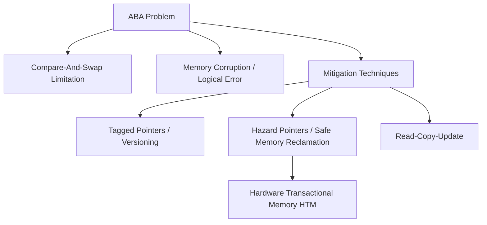

+++
title = "ABA 문제 (동기화 이슈)"
date = "2026-03-14"
weight = 568
+++

> **💡 Insight**
> - 핵심 개념: 다중 스레드 환경에서 CAS(Compare-And-Swap) 연산 수행 시, 값이 동일함만을 확인하여 중간에 변경되었다 복구된 상태를 감지하지 못하는 동시성 결함.
> - 기술적 파급력: 락 프리(Lock-Free) 자료구조(특히 스택이나 큐)에서 노드 재사용 시 메모리 손상 및 논리적 오류를 유발함.
> - 해결 패러다임: 값과 함께 변경 횟수를 추적하는 태그드 포인터(Tagged Pointer)나 해저드 포인터(Hazard Pointer)를 통해 포인터의 생명주기를 엄격히 관리.

## Ⅰ. ABA 문제의 본질 및 동시성(Concurrency) 위협
ABA 문제는 동시 프로그래밍(Concurrent Programming)에서 스레드(Thread) 간 공유 데이터 변경 시 발생하는 논리적 오류입니다. 특히 잠금 없는(Lock-Free) 알고리즘에서 널리 사용되는 CAS(Compare-And-Swap) 원자적 연산(Atomic Operation)의 구조적 한계에서 기인합니다. 스레드 T1이 메모리 위치의 값을 A로 읽은 후 작업을 수행하는 동안, 스레드 T2가 해당 값을 B로 변경했다가 다시 A로 되돌려 놓았을 때, T1은 값이 변경되지 않았다고 잘못 판단하여 작업을 진행하게 됩니다. 이는 메모리 관리 측면에서 해제된 메모리의 재할당(Reallocation)과 결합될 때 치명적인 세그멘테이션 결함(Segmentation Fault)이나 데이터 무결성 훼손으로 이어집니다.

📢 섹션 요약 비유: 친구가 지갑에 1만원을 확인하고 잠시 한눈을 판 사이, 다른 사람이 그 1만원을 빼가고 다른 1만원짜리 지폐를 넣어둔 상황입니다. 친구는 "내 돈이 그대로 있네"라고 착각하지만, 지폐의 일련번호(메모리 객체)는 이미 바뀐 상태입니다.

## Ⅱ. ABA 문제 발생 시나리오 및 구조 (CAS 메커니즘)
락 프리 스택(Lock-Free Stack)을 예로 들면, `Pop` 연산 시 `head` 노드를 읽고 다음 노드를 `next`로 저장한 후 CAS 연산을 시도합니다. 이 과정에서 다른 스레드들의 개입으로 ABA 문제가 발생합니다.

```text
[초기 상태 Stack: A -> B -> C]

1. Thread 1 (T1): Pop 준비
   - current_head = A
   - next_node = B
   - (T1 일시 중단됨)

2. Thread 2 (T2): Pop(A), Pop(B), Push(A) 수행
   - Pop(A) 수행: Stack = [B -> C], 노드 A는 메모리 풀로 반환
   - Pop(B) 수행: Stack = [C], 노드 B는 메모리 풀로 반환
   - Push(A) 수행: 노드 A를 재사용하여 새로운 값을 넣음
   - Stack = [A -> C] (A의 next는 C를 가리킴)

3. Thread 1 (T1): 재개 및 CAS 시도
   - CAS(&head, current_head(A), next_node(B))
   - 현재 head가 A이므로 CAS 성공!
   - head를 B로 설정함.
   
[결과 상태 Stack: head -> B (이미 삭제된 노드)] -> 메모리 오염!
```
위 다이어그램에서 보듯, T1은 `head`가 A라는 사실만 검증했기 때문에, A의 논리적 의미(다음 노드가 B가 아님)가 변경되었음을 인식하지 못하고 잘못된 메모리 주소 B를 새로운 `head`로 설정하는 치명적인 오류를 범하게 됩니다.

📢 섹션 요약 비유: 컨베이어 벨트에서 'A상자(안에 B상자가 들었음)'를 확인하고 잠시 돌아선 사이, 누군가 A상자를 빼고 껍데기만 같은 새 A상자(안에 C상자가 들었음)를 올려놓았습니다. 돌아온 작업자는 겉모습(A)만 보고 원래 계획대로 B상자를 꺼내려다 허공을 젓게 됩니다.

## Ⅲ. ABA 문제를 해결하기 위한 기술요소 (Countermeasures)
ABA 문제를 원천적으로 차단하기 위해서는 값 자체의 일관성뿐만 아니라 객체의 '버전(Version)' 또는 '수명 주기(Lifecycle)'를 검증해야 합니다.

1. **태그드 포인터 (Tagged Pointers):**
   메모리 포인터와 함께 변경 횟수(카운터)를 함께 저장하여 64비트(또는 128비트) CAS 연산을 수행합니다. 포인터 주소가 A로 같더라도 카운터가 `A(Tag:1)`에서 `A(Tag:3)`으로 변했기 때문에 CAS가 실패하게 유도합니다.
2. **해저드 포인터 (Hazard Pointers):**
   스레드가 특정 동적 할당 메모리에 접근하고 있음을 다른 스레드들에게 알리는 공유 포인터 목록입니다. 어떤 스레드라도 특정 노드를 해저드 포인터로 지정해 두면, 다른 스레드는 해당 노드를 논리적으로는 삭제하더라도 물리적 메모리 해제(Deallocation)는 지연시킵니다.
3. **RCU (Read-Copy-Update):**
   리눅스 커널(Linux Kernel) 등에서 널리 쓰이는 기법으로, 다중 독자(Reader)가 존재하는 상황에서 데이터를 직접 수정하지 않고 복사본을 만들어 수정한 뒤, 독자가 없는 안전한 시점(Grace Period)에 포인터를 원자적으로 교체합니다.

📢 섹션 요약 비유: 태그드 포인터는 지폐에 매번 도장을 찍어 "이전과 같은 지폐지만 도장 개수가 다르네?"라고 구별하는 것이고, 해저드 포인터는 "내가 이 물건을 보고 있으니 절대 버리지 마!"라고 이름표를 붙여두는 것과 같습니다.

## Ⅳ. 고성능 컴퓨팅(HPC) 및 OS 커널에서의 응용 사례
ABA 문제에 대한 대응은 현대 운영체제(OS, Operating System)와 고성능 데이터베이스(Database) 엔진에서 필수적입니다.
- **메모리 할당자 (Memory Allocator):** `tcmalloc`이나 `jemalloc`과 같은 병렬 메모리 할당자는 스레드 로컬 캐시(Thread-Local Cache)를 사용하여 동시 접근을 줄이지만, 전역 메모리 풀(Global Memory Pool)에서 노드를 반환하거나 가져올 때 태그가 포함된 CAS를 사용하여 ABA 문제를 방지합니다.
- **Java의 AtomicStampedReference:** Java의 `java.util.concurrent.atomic` 패키지는 참조형 변수에 대한 ABA 문제 해결을 위해 객체 참조와 정수형 스탬프(Stamp)를 쌍으로 묶어 원자적으로 갱신하는 클래스를 제공합니다.

📢 섹션 요약 비유: 대형 물류 센터(OS 커널)에서 물품 관리 대장(메모리 할당자)을 여러 명이 동시에 수정할 때, 단순히 물건 이름만 적지 않고 '입고/출고 타임스탬프'를 반드시 함께 기록하여 재고 착오를 막는 시스템입니다.

## Ⅴ. 한계점 및 미래 발전 방향
태그드 포인터는 64비트 아키텍처에서 포인터 크기가 커지면서 더블 워드 CAS(Double-Word CAS, `cmpxchg16b`) 연산을 요구하며, 이는 하드웨어 오버헤드(Hardware Overhead)를 발생시킵니다. 또한 해저드 포인터는 메모리 회수 지연으로 인한 메모리 사용량 증가라는 단점이 존재합니다.
향후에는 하드웨어 트랜잭셔널 메모리(HTM, Hardware Transactional Memory)를 활용하여 소프트웨어적인 락 프리 알고리즘의 복잡성을 하드웨어 차원에서 원자적인 트랜잭션 단위로 묶어 처리함으로써, ABA 문제 자체를 근본적으로 회피하는 아키텍처 연구가 활발히 진행되고 있습니다.

📢 섹션 요약 비유: 현재는 도장을 찍거나 이름표를 붙이는 등 수작업(소프트웨어)으로 헷갈림을 방지하고 있다면, 미래에는 아예 눈 깜짝할 사이에 모든 작업을 한 번에 처리해주는 마법의 상자(HTM 하드웨어)를 도입해 헷갈릴 틈조차 주지 않는 방향으로 발전하고 있습니다.

---

### **지식 그래프 (Knowledge Graph)**


### **어린이 비유 (Child Analogy)**
놀이터 그네(메모리)에 철수(값 A)가 앉아 있었어요. 영희(스레드 1)가 철수가 있는 걸 보고 잠시 물을 마시러 갔죠. 그 사이 철수가 내리고 민수(값 B)가 탔다가 내린 후, 다시 철수가 그네에 앉았어요. 물을 마시고 돌아온 영희는 "어, 철수가 계속 그네에 있었네!"라고 생각했지만, 사실은 그동안 많은 일이 있었던 거예요. 만약 철수가 그네를 양보하기로 한 횟수(버전)를 세지 않으면 영희는 상황을 완전히 오해하게 되는 것이 바로 ABA 문제랍니다.