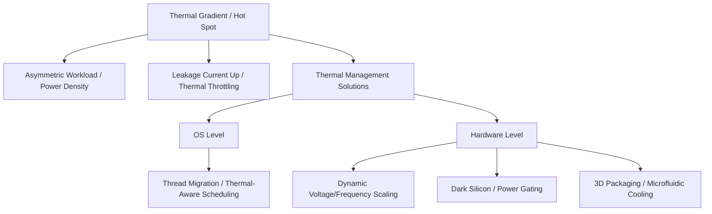

+++
title = "멀티코어 칩 온도 불균형 (Thermal Gradient)"
weight = 569
+++

> **💡 Insight**
> - 핵심 개념: 다중 코어 프로세서(Multi-core Processor) 내에서 워크로드 분포에 따라 칩 표면의 온도가 불균일하게 상승하여 발생하는 열 구배(Gradient) 현상.
> - 기술적 파급력: 국부적인 열점(Hot Spot) 발생으로 누설 전류(Leakage Current)가 증가하고 소자 수명이 단축되며, 스로틀링(Thermal Throttling)으로 인한 시스템 성능 저하 유발.
> - 해결 패러다임: 동적 전압/주파수 스케일링(DVFS), 스레드 마이그레이션(Thread Migration), 진보된 방열 패키징(Advanced Thermal Packaging)을 통한 열 분산 제어.

## Ⅰ. 멀티코어 칩 온도 불균형(Thermal Gradient)의 개요
현대 프로세서 설계에서 무어의 법칙(Moore's Law) 한계와 함께 대두된 가장 큰 물리적 장벽은 전력 밀도(Power Density)와 열 방출(Thermal Dissipation)입니다. 멀티코어 칩 온도 불균형은 단일 실리콘 다이(Die) 위에 집적된 여러 코어(Core) 중 특정 코어에만 연산이 집중될 때, 해당 영역의 온도가 급격히 상승하여 주변 코어와의 온도 차이가 커지는 현상을 의미합니다. 이 열 구배(Thermal Gradient)는 반도체 소재인 실리콘의 특성상 온도가 높을수록 누설 전류(Leakage Current)가 기하급수적으로 증가하게 만들어, 악순환적인 열 폭주(Thermal Runaway)를 초래할 위험을 내포하고 있습니다.

📢 섹션 요약 비유: 넓은 프라이팬(칩)에 계란 여러 개(코어)를 굽는데, 가스레인지 불꽃이 한쪽으로만 치우쳐서 한쪽 계란은 새까맣게 타고 반대쪽은 전혀 익지 않는 상황입니다. 프라이팬 전체의 온도가 제각각이 되는 것이죠.

## Ⅱ. 핫스팟(Hot Spot) 발생 원리 및 칩 레벨 온도 분포 (ASCII 다이어그램)
멀티코어 프로세서는 비대칭 워크로드(Asymmetric Workload) 환경에서 특정 스레드만 100% 점유율을 가질 때 심각한 열 불균형을 겪습니다. 특히 부동소수점 연산 유닛(FPU)이나 벡터 연산 유닛(AVX)이 집중 배치된 영역은 순간적으로 막대한 전력을 소모합니다.

```text
[Multi-core Die Thermal Map]
+---------------------------------------------------+
|  Core 0 (Idle)     |  Core 1 (Heavy Load)         |
|  Temp: 45°C        |  Temp: 95°C (HOT SPOT!)      |
|  [Leakage: Low]    |  [Leakage: VERY HIGH]        |
|--------------------+------------------------------|
|  Core 2 (Light)    |  Core 3 (Moderate)           |
|  Temp: 55°C        |  Temp: 70°C                  |
|  [Leakage: Normal] |  [Leakage: High]             |
+---------------------------------------------------+
                  || (Thermal Diffusion)
                  \/
    Heat Spreader & Heatsink (Slow to dissipate)
```
위 다이어그램처럼 Core 1에 과도한 부하가 집중되면, 인접한 코어와의 온도 차이(Gradient)로 인해 물리적인 기계적 스트레스(Thermal Stress)가 실리콘 구조에 가해집니다. 열은 천천히 확산되므로 국소적인 핫스팟이 칩 전체의 클럭 속도를 낮추는 동적 열 관리(DTM, Dynamic Thermal Management) 트리거를 발생시킵니다.

📢 섹션 요약 비유: 아파트(멀티코어 칩)에서 한 집(Core 1)만 한겨울에 보일러를 최고로 틀어놓아 그 집 바닥이 녹아내릴 지경인데, 옆집(Core 0)은 보일러를 꺼서 얼음장인 상태입니다. 건물 전체의 난방 관리가 엉망이 된 구조입니다.

## Ⅲ. 열 불균형 완화를 위한 기술요소 및 스케줄링 기법
온도 불균형을 해소하기 위해 컴퓨터 아키텍처와 운영체제(OS, Operating System) 레벨에서 긴밀한 협력이 이루어집니다.

1. **DVFS (Dynamic Voltage and Frequency Scaling):**
   온도가 임계치(Threshold)에 도달한 코어의 전압(Voltage)과 클럭 주파수(Frequency)를 강제로 낮춰 발열량을 즉각적으로 억제하는 기술입니다.
2. **열 인지 스케줄링 (Thermal-Aware Scheduling / Thread Migration):**
   OS의 스케줄러(Scheduler)가 칩 내장 온도 센서(Thermal Diode)의 데이터를 읽고, 뜨거워진 코어에서 실행 중인 스레드를 차가운 코어(Idle Core)로 이주(Migration)시킵니다. 이를 통해 발열을 칩 전체 면적으로 고르게 분산(Wear-leveling)시킵니다.
3. **다크 실리콘 (Dark Silicon) 활용:**
   칩 전체를 동시에 최대 성능으로 가동할 수 없는 전력/열 한계인 TDP(Thermal Design Power) 제약 하에서, 연산에 불필요한 영역의 전원을 완전히 차단(Power Gating)하여 열 헤드룸(Thermal Headroom)을 확보합니다.

📢 섹션 요약 비유: 과열된 자동차 엔진(핫스팟)을 식히기 위해 잠시 속도를 줄이거나(DVFS), 힘든 일을 하는 직원을 쉬게 하고 노는 직원과 교대(스레드 마이그레이션)시켜 사무실 전체의 피로도를 관리하는 전략입니다.

## Ⅳ. 현대 시스템 아키텍처에서의 열 분산 최적화 사례
최신 스마트폰의 모바일 AP(Application Processor)나 고성능 데이터센터의 서버 칩에서는 물리적 패키징 기술도 진화했습니다.
- **ARM big.LITTLE / Intel Thread Director:** 고성능 코어(P-Core)가 열 한계에 도달하면 무거운 작업을 고효율 코어(E-Core)로 넘겨 칩 전체의 열 구배를 완화합니다.
- **3D 칩 패키징과 TSV (Through-Silicon Via):** 여러 층의 실리콘을 쌓는 3D 적층 구조에서는 열 갇힘(Thermal Trapping) 현상이 극심하므로, 칩 사이에 액체 냉각 채널(Microchannel Liquid Cooling)을 삽입하거나 고전도율의 열 인터페이스 물질(TIM, Thermal Interface Material)을 적용하여 수직적 열 구배를 해소하려는 연구가 칩렛(Chiplet) 설계와 함께 적용되고 있습니다.

📢 섹션 요약 비유: 고층 빌딩(3D 적층 칩)의 가운데 층이 너무 더워지는 것을 막기 위해 층 사이에 쿨링 파이프를 설치하고, 힘든 작업은 환기가 잘 되는 층(E-Core)으로 분산시켜 빌딩 전체의 온도를 균일하게 맞추는 것과 같습니다.

## Ⅴ. 한계점 및 미래 발전 방향
스레드 마이그레이션 방식은 코어 간 L1/L2 캐시를 비우고 다시 채워야 하는 캐시 콜드 미스(Cache Cold Miss) 오버헤드를 유발하여 성능 저하를 초래합니다. 또한 DVFS는 성능 스로틀링(Throttling)을 동반하므로 근본적인 해결책이 아닙니다.
미래에는 실리콘 자체의 열 전도성을 대체할 다이아몬드 기반 기판이나 그래핀(Graphene) 방열판 연구, 그리고 머신러닝(Machine Learning) 알고리즘을 활용하여 작업을 실행하기 전에 미리 발열을 예측하고 선제적으로 스레드를 분산시키는 선제적 열 관리(Proactive Thermal Management)가 표준으로 자리 잡을 것입니다.

📢 섹션 요약 비유: 지금은 직원이 지치고 땀을 뻘뻘 흘릴 때(온도 상승 후) 교대해주느라 작업이 잠시 중단되지만, 미래에는 AI가 직원의 체력을 미리 예측해 땀을 흘리기도 전에 완벽한 타이밍에 교대(예측형 열 관리)를 지시하여 작업 속도 저하를 없애는 방향으로 발전합니다.

---

### **지식 그래프 (Knowledge Graph)**


### **어린이 비유 (Child Analogy)**
큰 운동장(칩)에 여러 명의 친구들(코어)이 있어요. 한 친구에게만 계속 100m 전력 질주를 시키면 그 친구는 땀띠가 나고 쓰러질 듯이 뜨거워지겠죠? 반면 다른 친구들은 가만히 서 있어서 춥다고 할 거예요. 이렇게 운동장 한쪽만 비정상적으로 뜨거워지는 걸 '온도 불균형(Thermal Gradient)'이라고 해요. 이를 해결하려면 달리는 친구를 잠시 쉬게 하고 가만히 있던 친구와 바통 터치(스레드 마이그레이션)를 해주어 모두가 골고루 땀을 흘리게 만들어야 한답니다.
