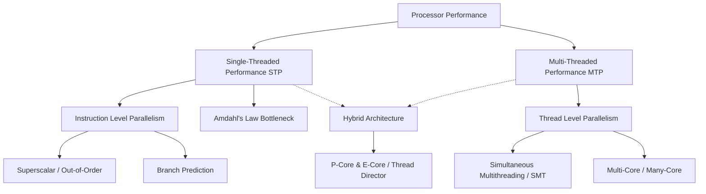

+++
title = "단일 스레드 성능 (STP) vs 다중 스레드 성능 (MTP)"
date = "2026-03-14"
weight = 570
+++

> **💡 Insight**
> - 핵심 개념: 프로세서의 처리 능력을 평가하는 두 축으로, 단일 작업의 처리 속도(STP)와 여러 작업을 동시에 처리하는 능력(MTP)의 상충 및 보완 관계.
> - 기술적 파급력: 암달의 법칙(Amdahl's Law)에 따라 병렬화 불가능한 순차적 코드가 전체 시스템 성능의 병목(Bottleneck)을 결정함.
> - 해결 패러다임: 클럭 주파수 향상과 IPC(명령어 처리 횟수) 개선(STP)과 더불어, 비대칭 멀티코어(big.LITTLE) 아키텍처를 통한 효율적인 코어 분배(MTP)의 조화.

## Ⅰ. 단일/다중 스레드 성능(STP vs MTP)의 개념과 트레이드오프
단일 스레드 성능(STP, Single-Threaded Performance)은 하나의 코어가 한 번의 클럭 사이클 동안 얼마나 빠르게 일련의 명령어 스트림(Instruction Stream)을 처리할 수 있는지를 나타내는 지표입니다. 반면, 다중 스레드 성능(MTP, Multi-Threaded Performance)은 여러 코어가 협력하여 병렬적으로 워크로드를 얼마나 많이, 그리고 효율적으로 처리할 수 있는지를 측정하는 시스템 전체의 처리량(Throughput) 지표입니다.
현대 컴퓨터 아키텍처에서는 전력 장벽(Power Wall)과 발열 한계로 인해 무한정 클럭 속도(Clock Speed)를 올려 STP를 높이는 것이 불가능해졌습니다. 이에 따라 코어 개수를 늘려 MTP를 향상시키는 멀티코어 패러다임이 주류가 되었지만, 암달의 법칙(Amdahl's Law)에 의해 병렬화할 수 없는 순차적(Sequential) 코드의 존재로 인해 여전히 강력한 STP는 필수불가결한 요소로 남아있습니다.

📢 섹션 요약 비유: STP는 한 명의 요리사가 엄청난 속도로 야채를 써는 '개인기'라면, MTP는 평범한 요리사 10명이 각자 다른 재료를 동시에 손질해 요리를 완성하는 '팀워크'입니다.

## Ⅱ. 프로세서 아키텍처별 자원 할당 및 동작 구조 (ASCII 다이어그램)
프로세서는 제한된 면적(Die Area)과 전력(Power Budget) 내에서 STP와 MTP에 자원을 분배해야 합니다.

```text
[Architecture A: High STP Focus (e.g., Traditional Core)]
+---------------------------------------------------+
| Large Core (High Clock, Huge L1/L2 Cache)         |
| [Branch Predictor] [Out-of-Order Engine (Wide)]   |
| [ALU 1] [ALU 2] [ALU 3] [ALU 4] [FPU 1] [FPU 2]   |
| * Focus: Completing ONE task as fast as possible. |
+---------------------------------------------------+

[Architecture B: High MTP Focus (e.g., Many-Core / GPU)]
+----------------+----------------+-----------------+
| Small Core 1   | Small Core 2   | Small Core 3    |
| [ALU 1] [FPU]  | [ALU 1] [FPU]  | [ALU 1] [FPU]   |
+----------------+----------------+-----------------+
| Small Core 4   | Small Core 5   | Small Core 6    |
| [ALU 1] [FPU]  | [ALU 1] [FPU]  | [ALU 1] [FPU]   |
| * Focus: High throughput for parallel tasks.      |
+----------------+----------------+-----------------+
```
High STP 구조는 깊은 파이프라인(Deep Pipeline), 고도의 비순차 실행(Out-of-Order Execution), 강력한 분기 예측기(Branch Predictor) 등 명령어 수준 병렬성(ILP, Instruction Level Parallelism)을 극대화합니다. 반면 High MTP 구조는 코어당 복잡도를 낮추고 스레드 수준 병렬성(TLP, Thread Level Parallelism)을 높이기 위해 단순 코어를 집적합니다.

📢 섹션 요약 비유: 10톤의 짐을 옮길 때, 엄청나게 크고 빠른 10톤 트럭 한 대(STP 중심 설계)를 쓸 것인가, 아니면 느리지만 1톤 트럭 10대(MTP 중심 설계)를 동시에 보낼 것인가의 구조적 차이입니다.

## Ⅲ. 성능 최적화를 위한 핵심 기술요소 (ILP vs TLP)
1. **STP 향상 기술 (ILP 강화):**
   - **슈퍼스칼라 (Superscalar):** 단일 클럭 사이클에 여러 명령어를 동시에 디스패치(Dispatch)하여 처리(IPC 증가).
   - **분기 예측 (Branch Prediction) 및 투기적 실행 (Speculative Execution):** 제어 흐름의 병목을 막아 파이프라인 플러시(Flush) 패널티 최소화.
2. **MTP 향상 기술 (TLP 강화):**
   - **동시 멀티스레딩 (SMT, Simultaneous Multithreading / Hyper-Threading):** 하나의 물리적 코어를 두 개의 논리적 스레드로 나누어 코어 내부 유닛의 활용률(Utilization)을 극대화.
   - **비균일 메모리 접근 (NUMA, Non-Uniform Memory Access) 최적화:** 다중 소켓(Multi-Socket) 환경에서 스레드가 자신이 속한 노드의 로컬 메모리에 우선 접근하도록 스케줄링하여 대역폭 한계 극복.

📢 섹션 요약 비유: STP 기술은 한 명의 달인 요리사가 양손잡이에 예지력까지 갖춰서 다음 주문을 미리 예측해 요리하는 것이고, MTP 기술은 주방 공간(물리 코어) 하나에 두 명의 요리사(SMT)를 밀어 넣어 화구(ALU)가 쉬는 시간이 없도록 빈틈없이 일하게 만드는 것입니다.

## Ⅳ. 하이브리드 코어 적용 및 소프트웨어 최적화 사례
최근에는 STP와 MTP의 장점을 모두 취하기 위해 하이브리드 아키텍처(Hybrid Architecture)가 대세가 되었습니다.
- **ARM big.LITTLE 및 Intel Alder Lake (P-Core & E-Core):**
  높은 STP가 필요한 게임, UI 렌더링, 순차적 무거운 스크립트는 P-Core(Performance Core)에 할당하고, 높은 MTP 효율이 필요한 배경 서비스, 비디오 인코딩 등 멀티스레드 친화적 작업은 E-Core(Efficient Core)에 배분합니다. OS의 스레드 디렉터(Thread Director)가 이를 동적으로 조율합니다.
- **소프트웨어의 한계 극복:** 데이터베이스(DB) 서버나 웹 서버(NGINX)는 MTP 극대화를 위해 비동기 I/O(Asynchronous I/O) 및 이벤트 드리븐(Event-driven) 아키텍처를 채택하여 수만 개의 스레드를 효율적으로 처리합니다.

📢 섹션 요약 비유: 육상 릴레이 경기에서 폭발적인 스피드가 필요한 단거리 구간(순차 작업)에는 우사인 볼트(P-Core/STP)를 배치하고, 지치지 않고 오랫동안 짐을 나눠 들어야 하는 구간(병렬 작업)에는 마라톤 선수 여러 명(E-Core/MTP)을 배치하는 하이브리드 전략입니다.

## Ⅴ. 한계점 및 미래 발전 방향
STP 향상은 이미 실리콘 물리학의 한계에 봉착하여 전력 소모 대비 IPC 증가율이 미미한 수익 체감(Diminishing Returns) 구간에 진입했습니다. MTP 역시 캐시 일관성(Cache Coherence) 유지 오버헤드와 메모리 병목 현상(Memory Wall)으로 인해 코어를 무한정 늘린다고 성능이 선형적으로 오르지 않습니다.
미래에는 범용 코어의 STP/MTP 한계를 극복하기 위해, 특정 작업(AI 추론, 비디오 처리, 암호화)만을 극도로 빠른 STP와 MTP로 처리할 수 있는 NPU(Neural Processing Unit), DPU(Data Processing Unit) 등 도메인 특화 가속기(Domain-Specific Accelerators)가 범용 코어를 보조하는 이기종 컴퓨팅(Heterogeneous Computing)으로 완전히 진화할 것입니다.

📢 섹션 요약 비유: 이제 요리사(범용 코어) 개개인의 실력을 올리거나 머릿수를 늘리는 것에는 한계가 왔습니다. 앞으로는 양파 썰기 기계, 고기 굽기 전용 기계 등 특수 목적 로봇(가속기)들을 도입해 요리사가 기계들을 지휘하도록 주방 시스템이 진화하는 것과 같습니다.

---

### **지식 그래프 (Knowledge Graph)**


### **어린이 비유 (Child Analogy)**
STP(단일 스레드 성능)는 한 명의 '슈퍼 히어로'가 얼마나 빨리 악당 기지를 부술 수 있는지를 나타내요. 방패도 막고 주먹도 빠르게 휘두르죠! 반면 MTP(다중 스레드 성능)는 '평범한 병사들' 100명이 동시에 여러 방향에서 기지를 얼마나 빨리 포위하고 부수는지를 나타내요. 문을 부술 때는 슈퍼 히어로 한 명(STP)이 필요하지만, 넓은 마당의 쓰레기를 치울 때는 여러 명의 병사(MTP)가 함께 치우는 게 훨씬 빠르답니다. 컴퓨터는 이 둘을 상황에 맞게 섞어서(하이브리드) 사용해요!