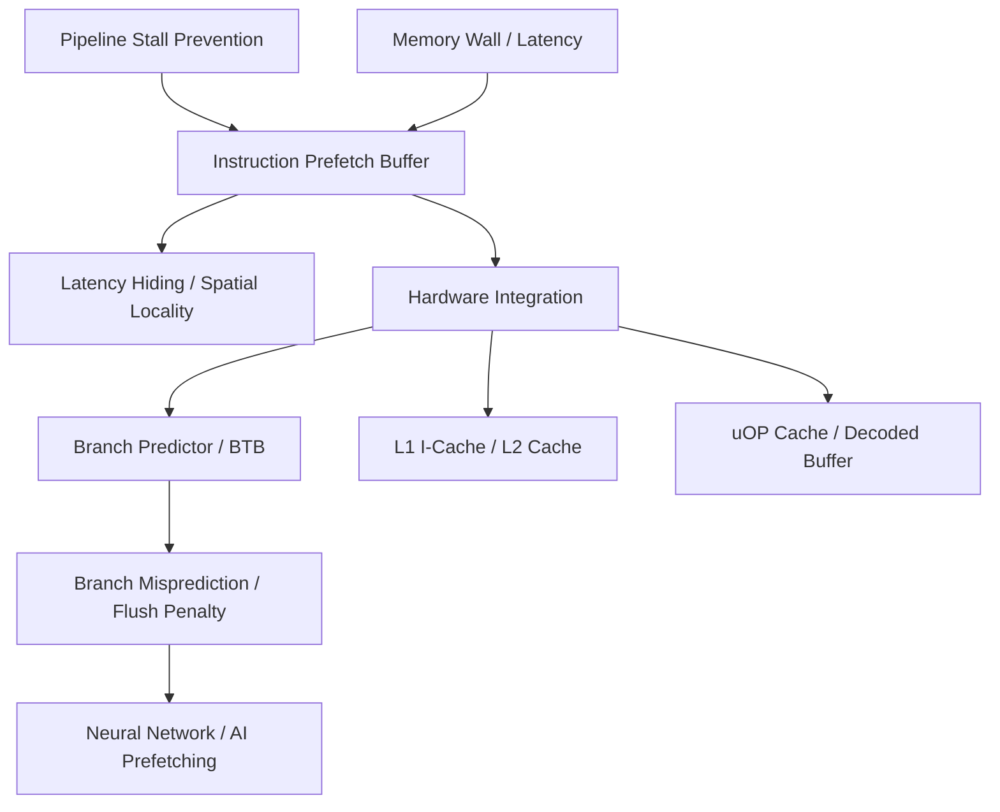

+++
title = "명령어 프리패치 버퍼"
weight = 571
+++

> **💡 Insight**
> - 핵심 개념: CPU가 실행할 다음 명령어들을 메모리나 캐시에서 미리 가져와(Prefetch) 파이프라인(Pipeline)의 지연을 막는 고속 임시 저장소.
> - 기술적 파급력: 폰 노이만 병목(Von Neumann Bottleneck)과 명령어 캐시 미스(Instruction Cache Miss) 패널티를 획기적으로 줄여 명령어 수준 병렬성(ILP)을 극대화함.
> - 해결 패러다임: 순차적 코드 접근의 지역성(Spatial Locality)을 활용하여, 페치(Fetch) 단계가 메모리 지연 시간 동안 대기하는 멈춤 현상(Pipeline Stall)을 방지.

## Ⅰ. 명령어 프리패치 버퍼(Instruction Prefetch Buffer)의 개요
프로세서 파이프라인의 첫 번째 단계는 명령어 페치(Instruction Fetch)입니다. CPU의 연산 속도와 메인 메모리(Main Memory)의 접근 속도 사이의 격차가 심화되면서, 명령어를 제때 공급받지 못한 코어가 유휴 상태(Idle)로 낭비되는 메모리 월(Memory Wall) 현상이 발생합니다. 명령어 프리패치 버퍼는 프로세서가 현재 명령어를 디코딩(Decode)하고 실행(Execute)하는 동안, 향후 실행될 가능성이 높은 후속 명령어들을 메모리나 L1 명령어 캐시(L1 I-Cache)에서 백그라운드로 미리 읽어와 보관하는 하드웨어 큐(Queue) 구조입니다. 이를 통해 파이프라인은 메모리 지연 없이 지속적으로 명령어를 공급받게 됩니다.

📢 섹션 요약 비유: 컨베이어 벨트 작업자가 다음 부품이 창고에서 올 때까지 멍하니 기다리는 것을 막기 위해, 작업자 바로 옆 작은 선반(버퍼)에 보조 작업자가 부품을 미리미리 쌓아두는 시스템입니다.

## Ⅱ. 프리패치 메커니즘과 버퍼의 내부 동작 구조 (ASCII 다이어그램)
명령어 스트림은 일반적으로 순차적으로 실행되는 공간적 지역성(Spatial Locality)을 갖습니다. 프리패치 버퍼는 현재 프로그램 카운터(PC, Program Counter)를 기준으로 N번째 다음 명령어 블록을 선제적으로 요청합니다.

```text
[CPU Pipeline Front-End]
                 +--------------------------------+
[Main Memory]    |    Instruction Cache (L1-I)    |
      |          +---------------+----------------+
      | (Cache Miss)             | (Hit/Prefetch)
      V                          V
[Hardware Prefetcher] ---> [Prefetch Buffer] (e.g., 32 Bytes)
      |                          |
      | (Pre-loads               | (Feeds instantly)
      |  PC + 4, 8, 12...)       V
      +------------------> [Instruction Fetch Unit]
                                 |
                           [Decode Unit]
                                 |
                           [Execution Unit]
```
프리패처 하드웨어는 PC가 진행됨에 따라 다음 캐시 라인(Cache Line)을 미리 I-Cache나 프리패치 버퍼로 가져옵니다. 페치 유닛(Fetch Unit)은 메모리까지 갈 필요 없이 버퍼에서 직접 명령어를 팝(Pop)하여 디코드 유닛으로 전달하므로, 메모리 접근 칩 레이턴시(Latency)가 사실상 '0'으로 숨겨집니다(Latency Hiding).

📢 섹션 요약 비유: 책을 읽을 때(실행) 시선은 현재 단어를 보고 있지만, 뇌(프리패처)는 이미 다음 줄의 단어들을 흐릿하게 미리 파악해서 버퍼 영역에 담아두어 자연스럽고 빠르게 읽어 내려갈 수 있게 하는 원리입니다.

## Ⅲ. 성능 최적화를 위한 핵심 기술요소 및 분기 예측과의 결합
프리패치 버퍼가 제대로 작동하기 위해서는 흐름 제어(Control Flow) 명령어에 대한 대응이 필수적입니다.
1. **순차적 프리패칭 (Sequential Prefetching):**
   가장 기본적인 형태로, 현재 읽고 있는 메모리 블록 다음의 $N$개 블록을 순차적으로 버퍼에 채우는 Next-Line Prefetch 기법입니다.
2. **분기 예측기(Branch Predictor) 연동:**
   `if-else` 구문이나 반복문(Loop)과 같은 분기 명령어(Branch Instruction)를 만나면 순차적 프리패칭은 무용지물이 됩니다. 따라서 현대 아키텍처는 분기 예측기와 결합하여, 분기 타겟 버퍼(BTB, Branch Target Buffer)에서 예측한 다음 대상 주소(Target Address)의 명령어들을 버퍼로 프리패치합니다.
3. **오염 방지 (Pollution Control):**
   잘못 예측된 프리패치(Mispredicted Prefetch)는 메모리 대역폭만 낭비하고 유용한 캐시 데이터를 쫓아내는 캐시 오염(Cache Pollution)을 유발합니다. 버퍼는 캐시와 별도의 공간을 유지하여 이러한 오염을 방지하는 역할도 겸합니다.

📢 섹션 요약 비유: 내비게이션(분기 예측기)이 "다음 교차로에서 좌회전할 확률이 높다"고 알려주면, 조수석 친구(프리패처)가 직진 길 대신 좌회전 길의 지도(명령어)를 미리 책상(버퍼)에 꺼내 준비해두는 찰떡궁합의 모습입니다.

## Ⅳ. 고성능 아키텍처 및 x86/ARM 설계의 실제 적용
명령어 프리패치 버퍼는 거의 모든 현대 마이크로프로세서 프론트엔드(Front-End) 설계의 핵심입니다.
- **x86 아키텍처 (Intel / AMD):** CISC 명령어의 특성상 명령어 길이가 가변적이어서 디코딩이 어렵습니다. 따라서 프리패치 버퍼가 대량의 바이트 스트림을 미리 당겨와 명령어 길이 디코더(Instruction Length Decoder)가 병목 없이 명령어를 분리할 수 있도록 돕습니다. 인텔의 루프 스트림 디텍터(LSD)도 버퍼의 확장된 개념입니다.
- **Micro-op 캐시 연동:** 최근 설계에서는 단순히 원본 명령어를 버퍼링하는 것을 넘어, 디코딩된 마이크로 오퍼레이션(uOP) 자체를 uOP 캐시(또는 디코디드 명령어 버퍼)에 저장하여 프리패치함으로써 페치와 디코드 단계를 아예 건너뛰는 방식으로 진화했습니다.

📢 섹션 요약 비유: 옛날에는 외국어 책을 원문으로 한 페이지씩 미리 가져왔다면(일반 버퍼), 최근에는 아예 번역가(디코더)가 미리 번역해둔 한국어 쪽지(uOP 버퍼)를 준비해 두어 읽는 속도를 폭발적으로 높인 것입니다.

## Ⅴ. 한계점 및 미래 발전 방향
프리패치 버퍼의 크기를 무작정 키우면 하드웨어 면적과 전력 소모가 증가하고, 잘못된 예측 시 버퍼를 플러시(Flush)하는 비용(Branch Misprediction Penalty)이 커집니다. 또한 객체 지향 프로그래밍(OOP)이나 간접 분기(Indirect Branch)가 잦은 최신 소프트웨어에서는 명령어 주소가 예측 불가능하게 점프하여 기존 프리패처의 효율이 떨어집니다.
미래의 프리패치 버퍼 시스템은 신경망(Neural Network) 기반의 패턴 인식 모델인 퍼셉트론 분기 예측기(Perceptron Branch Predictor)와 결합되어, 복잡한 제어 흐름 구조에서도 정확도 높은 명령어 블록을 버퍼에 적중시키는 딥러닝 기반 프리패칭(Deep-Learning based Prefetching)으로 발전하고 있습니다.

📢 섹션 요약 비유: 예전에는 조수석 친구가 감으로 지도를 꺼내놨다면(순차/간단 예측), 앞으로는 AI 비서가 내 과거 운전 습관과 도로 상황 빅데이터를 초정밀 분석하여 다음에 내가 어딜 갈지 100%에 가깝게 맞춰 맞춤형 지도를 딱 대령하는 시대로 넘어갑니다.

---

### **지식 그래프 (Knowledge Graph)**


### **어린이 비유 (Child Analogy)**
우리가 레고(명령어)를 조립해서 로봇을 만들고 있어요. 상자(메모리)에서 다음 설명서에 맞는 레고 블록을 하나씩 찾아오면 조립이 너무 느려지겠죠? 그래서 '명령어 프리패치 버퍼'라는 똑똑한 동생이 옆에 앉아서, 내가 설명서를 보고 조립하는 동안 "형이 다음엔 이 빨간 블록과 파란 블록이 필요하겠지?" 하고 미리미리 상자에서 꺼내 내 손 닿는 곳(버퍼)에 올려놔 주는 거예요. 덕분에 나는 멈추지 않고 엄청난 속도로 로봇을 완성할 수 있답니다!
