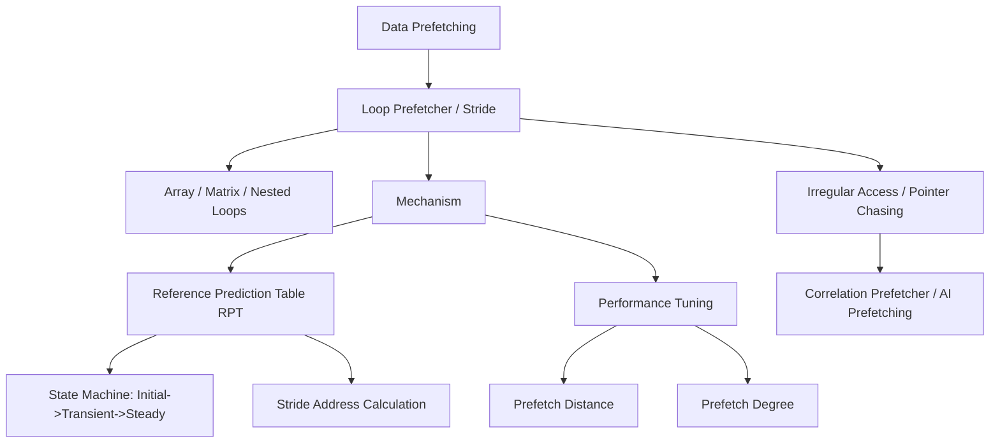

+++
title = "루프 프리패처"
weight = 572
+++

> **💡 Insight**
> - 핵심 개념: 프로그램 실행 시간의 대부분을 차지하는 반복문(Loop) 구조에서 발생하는 데이터 접근 패턴을 감지하여, 데이터를 캐시로 선제적으로 가져오는 하드웨어 최적화 기법.
> - 기술적 파급력: 배열(Array)이나 벡터(Vector) 순회 시 발생하는 스트라이드(Stride, 간격) 규칙성을 학습하여 캐시 미스(Cache Miss)를 거의 0으로 감소시킴.
> - 해결 패러다임: 반복문 내 동일한 명령어 PC(Program Counter)에서 규칙적으로 변하는 메모리 주소 오프셋을 트래킹하는 레퍼런스 예측 테이블(RPT) 도입.

## Ⅰ. 루프 프리패처(Loop Prefetcher)의 등장 배경 및 역할
컴퓨터 프로그램은 "시간의 90%를 10%의 코드에서 보낸다"는 90/10 법칙에 따라 동작하며, 이 10%의 핵심 코드는 대부분 `for`나 `while` 같은 루프(Loop) 구조입니다. 루프 내에서 대규모 배열이나 행렬을 순회할 때, 데이터 캐시에 해당 값이 없으면 파이프라인이 멈추는 메모리 스톨(Memory Stall)이 발생합니다. 단순 순차적 프리패처는 주소가 일정하게 건너뛰는 패턴(예: 다차원 행렬 접근)을 파악하지 못해 비효율적입니다. 루프 프리패처는 이러한 특수 반복 구조 내의 데이터 참조 패턴의 보폭(Stride)을 하드웨어 레벨에서 학습하고, 다음 번 루프 반복(Iteration) 시 요청될 데이터를 미리 캐시에 적재(Prefetch)하는 특화된 하드웨어 유닛입니다.

📢 섹션 요약 비유: 우편배달부가 한 동네에서 "1번 집, 3번 집, 5번 집" 순서로 두 칸씩 건너뛰며 배달하는 규칙을 알아채고, 우체국(메모리)에서 미리 다음 배달할 "7번 집, 9번 집" 우편물을 자전거(캐시)에 실어두는 지능적인 배달 보조 시스템입니다.

## Ⅱ. 참조 예측 테이블(RPT)과 동작 구조 (ASCII 다이어그램)
루프 프리패처는 스트라이드 프리패처(Stride Prefetcher)의 핵심 원리를 차용합니다. 이를 위해 프로세서는 명령어 주소(PC)별로 데이터 접근 이력을 추적하는 참조 예측 테이블(RPT, Reference Prediction Table)을 운용합니다.

```text
[Reference Prediction Table (RPT)]
+-------+-------------------+--------+-----------+
| PC    | Last Address (LA) | Stride | State     |
| (Inst)| (Data Target)     | (Diff) | (FSM)     |
+-------+-------------------+--------+-----------+
| 0x100 | 0x8000            | +0x04  | Steady    | -> Trigger Prefetch!
| 0x108 | 0x9040            | +0x20  | Transient |
| 0x1A4 | 0x7000            | +0x00  | Initial   |
+-------+-------------------+--------+-----------+

[Loop Execution Timeline]
Iter 1: PC 0x100 Load from 0x8000 (Miss) -> RPT 기록 (LA=0x8000)
Iter 2: PC 0x100 Load from 0x8004 (Miss) -> RPT 계산 (Stride = +4), State 변경
Iter 3: PC 0x100 Load from 0x8008 (Hit!) -> Steady 상태 진입.
        Prefetcher 발동: 다음 주소 0x800C, 0x8010을 미리 L1/L2 캐시로 로드!
Iter 4: PC 0x100 Load from 0x800C (Hit!) -> 메모리 지연 숨김 성공.
```
RPT는 특정 로드/스토어(Load/Store) 명령어가 실행될 때마다 이전 접근 주소와 현재 주소의 차이(Stride)를 계산합니다. 이 간격이 반복적으로 동일하게 나타나면 상태 머신(FSM)이 '안정(Steady)' 상태로 전환되며, `현재 주소 + (Stride * 예측 거리)` 위치의 데이터를 캐시로 선제 요청합니다.

📢 섹션 요약 비유: 바리스타(RPT)가 매일 오는 단골손님(PC 0x100)이 어제는 설탕 1스푼, 오늘은 설탕 2스푼, 내일은 설탕 3스푼(일정한 스트라이드)을 넣을 것이라는 패턴을 파악한 후, 모레 손님이 도착하기도 전에 미리 설탕 4스푼을 탄 커피(미리 로드된 데이터)를 준비해 두는 마법입니다.

## Ⅲ. 성능 최적화를 위한 핵심 기술요소 (Degree & Distance)
루프 프리패처가 효과적으로 동작하기 위해서는 메모리 지연 시간(Latency)과 루프 본문(Body)의 실행 시간을 정밀하게 튜닝해야 합니다.
1. **프리패치 거리 (Prefetch Distance):**
   데이터를 얼마나 앞서서(Ahead) 가져올지 결정합니다. 메모리가 너무 느리거나 루프 실행이 매우 짧다면 한 루프 앞선 데이터가 아니라, $N$번째 뒤의 루프 데이터를 프리패치해야 데이터 도착 시점과 CPU 소비 시점이 일치(Timely)하게 됩니다.
2. **프리패치 차수 (Prefetch Degree):**
   한 번의 프리패치 트리거에 몇 개의 캐시 라인(블록)을 동시에 가져올지를 나타냅니다. 대역폭이 충분하다면 차수를 늘려 다량의 데이터를 가져오지만, 오버 시 캐시 오염(Pollution)이 발생합니다.
3. **루프 버퍼 연동 (Loop Stream Detector):**
   명령어 프리패치 관점에서 루프 본문 전체를 별도의 소형 버퍼에 고정시켜, 루프가 도는 동안 메모리나 L1 명령어 캐시 자체를 아예 끄고(Power Down) 버퍼 안에서만 전력을 아끼며 도는 기술과 결합하여 데이터와 명령어 양쪽의 효율을 극대화합니다.

📢 섹션 요약 비유: 공 던지기 연습을 할 때, 친구가 공을 내 손에 너무 일찍 주면 떨어뜨리고(캐시 오염), 너무 늦게 주면 내가 기다려야(스톨) 합니다. 내 스윙 속도와 친구의 던지는 속도를 완벽히 계산해서(프리패치 거리/차수 조절), 내 손이 뻗는 정확한 타이밍에 허공에서 공이 착착 꽂히게 만드는 기술입니다.

## Ⅳ. 과학 연산 및 GPU 아키텍처에서의 응용 사례
- **HPC 및 행렬 연산 최적화:** AI 딥러닝(Deep Learning)의 행렬 곱셈(Matrix Multiplication)이나 기상 예측 물리 엔진(CFD) 등의 과학 연산은 전형적인 2중, 3중 중첩 루프(Nested Loop)로 구성됩니다. 루프 프리패처는 행과 열(Row-Major / Column-Major) 탐색 시 발생하는 복잡한 스트라이드 패턴을 다중 RPT 항목을 통해 모두 학습하여 DRAM 대역폭의 한계까지 캐시 적중률을 끌어올립니다.
- **컴파일러 최적화(Software Prefetching)의 보완:** 개발자나 GCC/LLVM 컴파일러가 소스코드에 삽입하는 `__builtin_prefetch`와 같은 소프트웨어 프리패치를 보완합니다. 하드웨어 루프 프리패처는 실행 시간(Run-time)에 동적으로 주소를 계산하므로 컴파일러가 예측할 수 없는 동적 할당 배열에서도 강력한 힘을 발휘합니다.

📢 섹션 요약 비유: 인공지능이 거대한 엑셀 표(행렬)를 가로세로로 미친 듯이 스캔할 때, 하드웨어 루프 프리패처라는 자동 돋보기가 엑셀의 읽기 패턴을 눈치채고 마우스 휠을 굴리기도 전에 화면 밖의 데이터들을 미리 스크린 메모리에 잔뜩 로딩해두는 역할을 합니다.

## Ⅴ. 한계점 및 미래 발전 방향
포인터 체이싱(Pointer Chasing, 예: 연결 리스트나 트리 순회)이나 불규칙한 그래프(Graph) 구조 순회 시에는 주소 간격(Stride)이 존재하지 않아 RPT 기반의 루프 프리패처는 무력해집니다. 이를 해소하기 위해 최근 학계와 인텔/AMD의 R&D 부서에서는 공간 패턴(Spatial Pattern) 프리패처나 연관 규칙을 학습하는 코릴레이션(Correlation) 프리패처를 도입하고 있습니다.
더 나아가, 주소 간의 복잡한 의존성 자체를 신경망으로 추론하는 인공지능 기반 메모리 컨트롤러(AI-driven Prefetcher)가 기존의 패턴 매칭을 대체하는 방향으로 연구가 진행 중입니다.

📢 섹션 요약 비유: 현재의 루프 프리패처는 기찻길처럼 일정한 간격(배열)이 있는 곳에서만 완벽하게 다음 역을 맞춥니다. 하지만 숲속에 불규칙하게 흩어진 보물 상자(연결 리스트)를 찾는 루프에서는 길을 잃습니다. 미래에는 AI 탐지견이 도입되어 아무리 복잡하게 얽힌 지도 없는 길이라도 냄새(패턴)를 맡고 보물 위치를 미리 찾아낼 것입니다.

---

### **지식 그래프 (Knowledge Graph)**


### **어린이 비유 (Child Analogy)**
우리가 노트에 '구구단 2단'을 차례대로 적고 있다고 상상해봐요. 2, 4, 6... 이렇게 쓰고 있으면, 옆에서 구경하던 똑똑한 친구(루프 프리패처)가 "아! 2씩 커지는 규칙(스트라이드)이구나!" 하고 눈치를 챕니다. 그래서 내가 8을 쓸 차례가 되기도 전에 친구가 지우개와 연필을 들고 다음 칸에 희미하게 '10, 12, 14'를 미리 적어놔 주는 거예요(프리패치). 그럼 우리는 생각할 필요도 없이 그냥 덧칠만 하면 되니까 숙제를 엄청나게 빨리 끝낼 수 있게 되는 원리랍니다.
