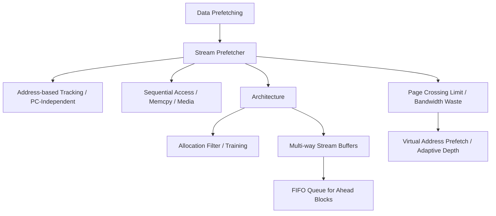

+++
title = "스트림 프리패처"
weight = 573
+++

> **💡 Insight**
> - 핵심 개념: 특정 명령어(PC)에 구애받지 않고, 메모리 주소 공간상에서 연속적이거나 일정 간격으로 발생하는 대규모 데이터의 흐름(Stream) 패턴 자체를 감지하여 데이터를 미리 로드하는 하드웨어 장치.
> - 기술적 파급력: 멀티미디어 처리, 파일 I/O, 대용량 복사(Memcpy) 등에서 연속적인 메모리 블록 접근 지연을 숨겨, 메모리 대역폭(Bandwidth) 활용도를 극한으로 끌어올림.
> - 해결 패러다임: PC(Program Counter)가 아닌 순수하게 모니터링된 메모리 물리 주소(Physical Address)의 접근 궤적(Spatial Track)을 기반으로 여러 개의 스트림 버퍼(Stream Buffer)를 할당하여 프리패치 수행.

## Ⅰ. 스트림 프리패처(Stream Prefetcher)의 탄생 배경
루프 프리패처(Stride/Loop Prefetcher)는 명령어의 프로그램 카운터(PC)를 기준으로 패턴을 학습합니다. 그러나 최신 객체지향 프로그램이나 복잡한 운영체제(OS) 커널 내부에서는 여러 명령어가 섞여서 동일한 데이터 배열을 순차적으로 읽는 경우가 많아, PC 기준의 테이블(RPT) 방식은 연속적인 데이터의 거시적 흐름을 놓치는 한계(Aliasing/Capacity 문제)를 보였습니다.
이러한 한계를 극복하기 위해 등장한 스트림 프리패처는 "누가(어떤 명령어 PC가) 접근했느냐"를 따지지 않고, "어디(메모리 주소 공간)를 연속으로 찔러보고 있느냐"에 집중합니다. 메모리 접근 주소가 A, A+1, A+2(캐시 블록 단위)로 순차적으로 관측되면 이를 하나의 거대한 '스트림(Stream, 물줄기)'으로 간주하고, 하드웨어 스트림 버퍼(Stream Buffer)를 할당하여 A+3, A+4 블록을 선제적으로 빨아들이는 공격적인 프리패칭 기법입니다.

📢 섹션 요약 비유: 도둑(명령어)들의 몽타주(PC)를 외워서 범행을 예측하는 것이 루프 프리패처라면, 스트림 프리패처는 도둑 얼굴은 보지 않고 땅에 찍힌 발자국이 일직선으로(메모리 주소) 은행을 향하고 있다는 사실만 보고, 미리 은행 문 앞에 함정을 파두는 공간 추적 방식입니다.

## Ⅱ. 스트림 버퍼 메커니즘 및 내부 아키텍처 (ASCII 다이어그램)
스트림 프리패처의 핵심 하드웨어 구조는 다수의 스트림 방향을 동시에 추적할 수 있는 병렬 스트림 버퍼(Stream Buffers)들로 구성됩니다. 노먼 주피(Norman Jouppi)가 제안한 다중 방식(Multi-way Stream Buffer)이 대표적입니다.

```text
[L1 Data Cache Miss] -> Miss Address: 0x1000

[Stream Allocation & Training Filter]
 1. 0x1000 접근 (Miss) -> 필터에 기록 (Pending)
 2. 0x1040 (0x1000 + LineSize) 접근 -> "스트림 발생 감지!"
 
[Multi-Way Stream Buffers]
        +---+---+---+---+
Buffer0 |   |   |   |   | (Tracking e.g., 0x2000... Idle)
        +---+---+---+---+
          (Allocated for new Stream!)
        +---+---+---+---+
Buffer1 |0x1080 |0x10C0 |0x1100 |0x1140 | --> Prefetching Ahead!
        +---+---+---+---+
Buffer2 |   |   |   |   | (Tracking e.g., 0x5000... Active)
        +---+---+---+---+

[Next CPU Request: 0x1080]
 -> L1 Cache Miss? YES.
 -> Check Stream Buffers... HIT in Buffer1!
 -> 데이터를 버퍼에서 L1으로 즉시 전송 & Buffer1은 0x1180을 새로 당겨옴.
```
데이터 캐시에서 미스(Miss)가 발생하면 먼저 스트림 버퍼들을 검색합니다. 버퍼 안에 데이터가 있다면(Buffer Hit) 이는 1사이클 만에 캐시로 공급되고, 해당 버퍼의 큐가 한 칸 앞으로 당겨지며 뒷부분은 새로운 주소의 데이터를 메모리 컨트롤러에 요청하여 스트림을 계속 연장시킵니다.

📢 섹션 요약 비유: 마치 뷔페 식당의 여러 개의 초밥 레일(스트림 버퍼)과 같습니다. 손님이 연어초밥(0x1000)을 먹고 연달아 연어(0x1040)를 찾으면, 주방장은 아예 '연어 전용 레일'을 하나 배정해서 손님이 요청하기도 전에 계속 연어초밥(0x1080, 0x10C0)을 올려 레일을 꽉 채워놓는 시스템입니다.

## Ⅲ. 성능 최적화를 위한 핵심 기술요소
스트림 프리패처는 메모리 대역폭을 극도로 많이 소모하므로 공격성과 정확성의 밸런스가 핵심입니다.
1. **훈련 필터 (Training Filter / Allocation Filter):**
   단발적인 캐시 미스로 무작정 버퍼를 할당하면(Thrashing) 쓸데없는 메모리 요청만 폭증합니다. 따라서 주소 X와 X+1이 연속으로 캐시 미스를 유발할 때만 스트림으로 확정 짓고 버퍼를 할당하는 필터링 메커니즘이 필수적입니다.
2. **다중 스트림 추적 (Multi-way Tracking):**
   보통 현대 CPU는 8개에서 16개 이상의 독립된 스트림 버퍼를 유지합니다. 이는 `A[i] = B[i] + C[i]`와 같이 3개의 배열을 동시에 스캔하는 데이터 레벨 병렬성(Data-Level Parallelism) 환경에서 각 배열을 독립적인 스트림으로 추적하기 위함입니다.
3. **가변 프리패치 깊이 (Adaptive Prefetch Depth):**
   스트림의 정확도가 높고 메모리 버스가 널널할 때는 미리 당겨오는 큐의 길이(Distance)를 대폭 늘리고, 정확도가 떨어지거나 메모리 병목이 생길 때는 길이를 축소하는 동적 스로틀링(Dynamic Throttling) 기술이 적용됩니다.

📢 섹션 요약 비유: 수돗물을 틀 때, 처음 한 방울만 떨어졌다고 바로 양동이를 대지 않고(필터링), 두세 방울 연속으로 떨어지는 걸 확인한 뒤에야 물줄기가 시작됐다고 판단해 큰 양동이를 대는(버퍼 할당) 똑똑한 물받이 센서입니다.

## Ⅳ. 고해상도 비디오 처리 및 현대 서버 아키텍처 사례
- **미디어 스트리밍 및 그래픽 (GPU/VPU):** 4K/8K 비디오 디코딩이나 이미지 렌더링은 메모리에서 대규모 픽셀 데이터를 연속적으로 순차 스캔하는 극단적인 스트림 워크로드입니다. 스트림 프리패처는 이러한 환경에서 메모리 병목을 제거하여 프레임 드랍(Frame Drop)을 막아내는 핵심 엔진입니다.
- **Intel의 다중 프리패처 결합 (L2 Spatial Prefetcher):** 인텔 코어 아키텍처는 L1 캐시에는 PC 기반의 단순 스트라이드 프리패처를, L2 캐시에는 주소 공간 기반의 강력한 공간/스트림 프리패처(Spatial Prefetcher)를 복합적으로 배치합니다. 스트림 프리패처가 큰 물줄기(페이지 단위 데이터 블록)를 L2에 미리 퍼다 놓으면, L1 프리패처가 그 안에서 정교하게 데이터를 코어로 떠먹여 주는 이중 계층 방식을 사용합니다.

📢 섹션 요약 비유: 넷플릭스 영화를 볼 때 동영상 플레이어의 '회색 로딩 바(버퍼링)'가 바로 소프트웨어적인 스트림 프리패치입니다. 하드웨어 스트림 프리패처는 이 과정을 CPU 칩 안에서 나노초(ns) 단위로 수행하며 픽셀 데이터를 끊임없이 공급하는 역할을 합니다.

## Ⅴ. 한계점 및 미래 발전 방향
스트림 프리패처는 '물리 주소(Physical Address)'를 기반으로 추적하는 경우가 많아, 가상 메모리 페이징(Paging) 경계인 4KB 페이지(Page)를 넘어서는 순간 추적이 끊어지는 페이지 교차(Page Crossing) 문제를 겪습니다. 이를 해결하기 위해 최근에는 TLB(Translation Lookaside Buffer)와 긴밀히 연동하여 가상 주소 기반 스트리밍을 지원하거나 휴즈 페이지(Huge Pages, 2MB/1GB)를 활용합니다.
미래에는 시스템 버스에 물려 있는 CXL(Compute Express Link) 기반 확장 메모리와 같이 레이턴시가 매우 높은 원격 메모리(Remote Memory) 풀에서 대규모 데이터 덩어리를 로컬 캐시로 미리 펌핑해오는 초거대 분산 스트림 프리패처로 진화할 것입니다.

📢 섹션 요약 비유: 물줄기가 시원하게 흐르다가 '페이지 경계'라는 벽을 만나면 뚝 끊기던 문제가 있었습니다. 앞으로는 담벼락을 뚫어버리는 대형 파이프(휴즈 페이지)나, 아예 다른 동네 저수지(CXL 원격 메모리)에서부터 막힘없이 물을 끌어오는 광역 스트림 시스템으로 발전할 것입니다.

---

### **지식 그래프 (Knowledge Graph)**


### **어린이 비유 (Child Analogy)**
도미노 놀이를 상상해 보세요! 도미노 블록들이 주르륵 쓰러지기 시작했습니다. 스트림 프리패처는 넘어지는 도미노의 방향을 쓱 쳐다보고는, 눈보다 빠른 속도로 넘어져 가는 앞쪽 빈자리에 미리 다음 도미노 블록들을 쭉쭉 깔아놓는 마법의 손가락이에요. 누가(어떤 명령어) 도미노를 밀었는지는 관심 없어요. 오직 도미노가 무너져가는 '방향과 흐름(스트림)'만 보고 미리 앞길을 완성해 놓기 때문에 도미노 쇼가 중간에 끊기지 않고 멋지게 이어질 수 있는 거랍니다!
