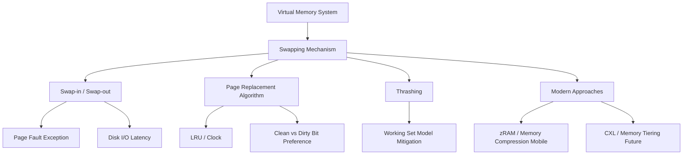

+++
title = "스와핑 (Swapping) 메커니즘"
date = "2026-03-14"
weight = 574
+++

> **💡 Insight**
> - 핵심 개념: 물리적 메인 메모리(RAM)의 용량 한계를 극복하기 위해, 현재 사용되지 않는 프로세스나 페이지를 보조 기억 장치(HDD/SSD)의 스왑 영역(Swap Space)으로 밀어내고(Swap-out), 필요한 데이터를 다시 메모리로 불러오는(Swap-in) 메모리 관리 기법.
> - 기술적 파급력: 시스템이 실제 장착된 RAM보다 훨씬 큰 가상 메모리(Virtual Memory)를 사용할 수 있게 하여 멀티태스킹(Multitasking) 성능을 극대화함.
> - 해결 패러다임: 운영체제(OS)의 스와퍼(Swapper) 또는 페이지 교체 알고리즘(LRU 등)을 통해 메모리 최적화를 동적으로 수행하나, 과도한 발생 시 시스템 마비(Thrashing)를 유발하므로 정교한 임계치(Threshold) 관리가 필요.

## Ⅰ. 스와핑(Swapping) 메커니즘의 개요와 필요성
운영체제는 다수의 프로세스를 동시에 실행(Multiprogramming)하기 위해 각 프로세스에 독립적인 가상 주소 공간을 부여합니다. 그러나 시스템에 장착된 물리적 메모리(Physical RAM)의 크기는 항상 제한적입니다. 메모리가 가득 찬 상태에서 새로운 프로세스가 실행되거나 기존 프로세스가 더 많은 메모리를 요구할 때, 시스템이 멈추는 것을 방지하기 위한 최후의 보루가 바로 '스와핑(Swapping)' 메커니즘입니다.
스와핑은 상대적으로 덜 중요한, 즉 당장 CPU가 접근하지 않는 데이터 블록을 하드 디스크나 SSD에 마련된 특별한 파티션인 스왑 영역(Swap Area) 또는 페이징 파일(Paging File)로 일시적으로 쫓아내어(Swap-out) 물리 메모리에 빈 공간(Free Frame)을 확보합니다. 이후 쫓겨난 데이터가 다시 필요해지면, 다른 데이터를 밀어내고 원본을 다시 메모리로 복귀(Swap-in)시킵니다.

📢 섹션 요약 비유: 좁은 책상(RAM)에서 여러 권의 책을 펴놓고 공부하다가 책상이 꽉 차면, 당장 안 보는 책을 바닥(하드 디스크/스왑 영역)에 내려놓고(Swap-out) 새 책을 올립니다. 그러다 바닥에 둔 책이 필요하면 다시 책상 위 책 하나를 내리고 주워 올리는(Swap-in) 과정과 똑같습니다.

## Ⅱ. 스와핑 동작 구조와 페이징(Paging) 시스템 연동 (ASCII 다이어그램)
과거의 스와핑은 프로세스 전체를 통째로 디스크로 옮기는 방식이었으나, 현대 운영체제는 가상 메모리의 페이징(Paging) 시스템과 결합하여 고정된 크기(일반적으로 4KB)의 '페이지(Page)' 단위로 정교하게 스와핑(정확히는 Page-out / Page-in)을 수행합니다.

```text
[CPU / Process A] -> Request Virtual Address
         |
    [Page Table] 
    Entry 1: Valid bit=1, Physical Frame 0x10
    Entry 2: Valid bit=0, (Present bit=0) -> PAGE FAULT! (트랩 발생)
         |
[OS Memory Manager / Page Fault Handler]
  1. 메모리에 남은 빈 프레임이 있는가? -> NO (메모리 풀(Full) 상태)
  2. 희생양 페이지(Victim Page) 선정 (e.g., Process B의 오랫동안 안 쓴 페이지)
         |
  3. Swap-out: [Physical RAM Frame 0x50] --- Write ---> [SSD Swap Area]
         |      (이제 Frame 0x50은 빈 공간이 됨)
  4. Swap-in:  [SSD Swap Area] --- Read 원본 ---> [Physical RAM Frame 0x50]
         |
  5. Page Table 업데이트 (Entry 2 Valid=1, 가리키는 프레임=0x50)
  6. 중단된 명령어 재수행
```
이 과정은 디스크 I/O가 개입되므로 RAM 접근 속도(나노초 단위)에 비해 수백만 배 느린(밀리초 단위) 엄청난 지연 시간(Latency Penalty)을 동반합니다. 따라서 OS의 메모리 관리자(MMU 연동)는 스와핑이 최대한 발생하지 않도록 지연 로딩(Demand Paging) 기법을 병행합니다.

📢 섹션 요약 비유: 도서관 사서(OS)가 대출 장부(페이지 테이블)를 봅니다. 손님이 찾는 책이 책꽂이(RAM)에 없고 지하 창고(스왑 영역)에 있다면(페이지 폴트), 사서는 책꽂이에서 가장 안 보는 책을 골라 지하에 던져버리고(Swap-out), 손님이 찾는 책을 낑낑대며 들고 올라옵니다(Swap-in). 이 과정 동안 손님(CPU)은 한참을 기다려야 합니다.

## Ⅲ. 스와핑 최적화를 위한 핵심 기술요소 (교체 알고리즘)
어떤 페이지를 디스크로 내보낼 것인가(Victim Selection)가 시스템 성능의 명운을 가릅니다.
1. **페이지 교체 알고리즘 (Page Replacement Algorithm):**
   - **LRU (Least Recently Used):** 가장 오랫동안 참조되지 않은 페이지를 스왑 아웃합니다. (시간적 지역성 활용)
   - **Clock Algorithm (Second Chance):** LRU의 높은 오버헤드를 하드웨어의 참조 비트(Reference Bit)를 순회하며 근사치로 구현한 실용적인 방식입니다.
2. **더티 비트 (Dirty Bit / Modified Bit):**
   메모리에 올라온 후 내용이 변경된(Dirty) 페이지는 스왑 아웃 시 반드시 디스크에 변경된 내용을 기록(Write)해야 합니다. 반면 읽기 전용(Read-only)이거나 변경되지 않은(Clean) 페이지는 디스크에 덮어쓸 필요 없이 그냥 메모리에서 지워버리기만 하면 되므로 I/O 비용이 절반으로 줍니다. OS는 Clean 페이지를 우선적인 희생양으로 선호합니다.
3. **워킹 셋 모델 (Working Set Model):**
   스레싱(Thrashing, 시스템이 연산은 안 하고 스왑 인/아웃만 반복하며 다운되는 현상)을 방지하기 위해, 프로세스가 일정 시간 동안 집중적으로 참조하는 페이지들의 집합(Working Set)은 절대로 스왑 아웃시키지 않고 메모리에 보장해 주는 스케줄링 기법입니다.

📢 섹션 요약 비유: 책상 위 책을 바닥에 내릴 때, 누군가 낙서를 한 책(Dirty Page)은 지우개로 지우거나 복사본을 만들어두는 추가 작업(디스크 쓰기)이 필요합니다. 그래서 사서는 낙서가 없는 깨끗한 책(Clean Page)을 우선적으로 바닥에 던지는 꼼수를 발휘하여 일거리를 줄입니다.

## Ⅳ. 주요 운영체제의 스와핑 메커니즘 차이
- **Linux (스와피니스, Swappiness):** 리눅스 커널은 `vm.swappiness`라는 파라미터(0~100)를 제공합니다. 값이 0에 가까우면 어떻게든 RAM 안에서 해결하려 노력하고, 100에 가까우면 적극적으로 디스크 스왑을 활용하여 RAM 공간을 파일 시스템 캐시용으로 널널하게 비워둡니다. (서버 용도에 따라 튜닝 필수)
- **Windows (Pagefile.sys):** 윈도우는 C 드라이브 루트에 보이지 않는 `pagefile.sys`를 만들어 동적 또는 정적으로 스왑 공간을 관리합니다.
- **모바일 OS (zRAM / 스왑 압축):** 안드로이드(Android)나 iOS는 배터리와 수명이 중요한 낸드 플래시(eMMC/UFS) 마모 방지를 위해 전통적인 디스크 스와핑을 피합니다. 대신 RAM의 일부분을 가상의 압축 파티션(zRAM)으로 떼어내어, 잘 안 쓰는 메모리를 압축(Compression)해서 RAM 내부에 쑤셔 넣는 **RAM 압축(Memory Compression)** 스와핑 메커니즘을 사용합니다.

📢 섹션 요약 비유: 좁은 방을 쓸 때, 리눅스/윈도우는 안 쓰는 물건을 무조건 베란다 창고(디스크)로 빼내는 방식이라면, 스마트폰은 베란다가 좁고 쉽게 망가지니 아예 방 안쪽에 진공 압축팩(zRAM)을 놔두고 물건을 찌그러뜨려서 쑤셔 넣는 방식을 씁니다.

## Ⅴ. 한계점 및 미래 발전 방향
스토리지가 HDD에서 SSD, 그리고 NVMe로 진화하면서 스와핑 속도가 비약적으로 상승했지만, 여전히 나노초 단위의 DRAM 속도를 따라갈 수는 없으며 잦은 스와핑은 SSD의 쓰기 수명(TBW)을 갉아먹는 치명적인 단점이 있습니다.
미래에는 시스템 버스에 물려 메모리처럼 동작하는 인텔 옵테인(Optane)과 같은 SCM(Storage Class Memory)이나 PCIe CXL 기반의 메모리 확장 기술이 대중화되어, RAM과 디스크 사이의 모호한 계층을 없애고 스와핑 자체가 하드웨어 레이어에서 지연 없이 수행되는 투명한 메모리 티어링(Memory Tiering)으로 진화할 것입니다.

📢 섹션 요약 비유: 지금은 책상(RAM)에서 바닥(SSD)으로 책을 내리고 올리는 과정이 피곤한 육체노동(I/O 지연)이지만, 미래에는 책상 옆에 끝없이 확장되는 마법의 서랍(CXL 메모리)이 달려서, 스와핑이라는 개념 자체가 사라지고 그냥 책상을 무한히 넓게 쓰는 것처럼 느끼게 될 것입니다.

---

### **지식 그래프 (Knowledge Graph)**


### **어린이 비유 (Child Analogy)**
우리가 10가지 장난감을 가지고 놀고 싶은데, 내 작은 놀이 매트(RAM) 위에는 장난감을 딱 3개만 올려놓을 수 있어요. 새로운 로봇을 꺼내고 싶으면, 지금 당장 안 가지고 노는 곰인형을 장난감 상자(하드 디스크/스왑 영역)에 집어넣어야(Swap-out) 빈 공간이 생겨요. 나중에 다시 곰인형이 필요해지면 매트 위의 다른 장난감을 상자에 넣고 곰인형을 다시 꺼내오는(Swap-in) 방식이에요. 이렇게 장난감 상자를 왔다 갔다 하는 규칙을 '스와핑'이라고 한답니다. 매트가 좁아도 세상 모든 장난감을 다 가지고 놀 수 있게 해주는 마법의 규칙이죠!