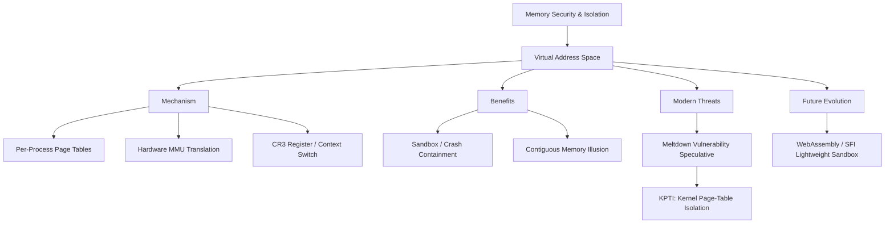

+++
title = "가상 주소 공간 분리"
date = "2026-03-14"
weight = 575
+++

> **💡 Insight**
> - 핵심 개념: 운영체제(OS)가 각 프로세스마다 독립적이고 환상적인(Illusion) 메모리 주소 체계를 부여하여, 프로세스 간 메모리 침범을 원천적으로 차단하는 하드웨어-소프트웨어 협력 보안 구조.
> - 기술적 파급력: 하나의 프로그램이 크래시(Crash)되거나 악성 코드에 감염되더라도, 다른 프로그램이나 OS 커널의 물리적 메모리를 훼손할 수 없는 샌드박스(Sandbox) 환경을 보장함.
> - 해결 패러다임: MMU(Memory Management Unit)와 페이지 테이블(Page Table)을 통해 프로세스의 논리 주소(Virtual Address)를 겹치지 않는 물리 주소(Physical Address)로 동적 변환하여 격리(Isolation) 달성.

## Ⅰ. 가상 주소 공간 분리(Virtual Address Space Isolation)의 존재 이유
초기 컴퓨터 시스템에서는 모든 프로그램이 하나의 거대한 물리적 메모리 주소(Physical Address)를 공유했습니다. 이는 프로그램 A의 포인터 오류가 프로그램 B의 데이터나 운영체제(OS)의 핵심 영역을 덮어써 시스템 전체를 블루스크린(Kernel Panic)으로 몰아넣는 치명적인 취약점이었습니다.
이를 근본적으로 해결하기 위해 도입된 '가상 주소 공간 분리'는 컴퓨터 아키텍처 역사상 가장 위대한 추상화(Abstraction) 중 하나입니다. OS는 하드웨어인 MMU(메모리 관리 장치)의 지원을 받아, 실행 중인 모든 프로세스(Process)에게 "너 혼자 0번지부터 4GB(또는 수백 TB)의 광활한 메모리를 통째로 쓰고 있다"는 환상을 심어줍니다. A프로세스의 가상 주소 0x1000과 B프로세스의 가상 주소 0x1000은 이름만 같을 뿐, MMU의 변환 마법을 통해 하드웨어의 RAM에서는 완전히 다른 위치인 물리 주소 0x5000과 0x9000에 각각 안전하게 배치(격리)됩니다.

📢 섹션 요약 비유: 여러 회사가 하나의 대형 물류 창고(물리 메모리)를 쓰지만, 창고 관리인(MMU)이 각 회사에 "당신들 전용의 가상 창고 지도(가상 주소)"를 따로 줍니다. A회사와 B회사 모두 지도의 1번 칸을 열지만, 관리인이 몰래 실제 창고의 완전 다른 구역을 연결해주기 때문에 서로의 물건을 훔쳐보거나 부술 수 없는 완벽한 분리벽이 생깁니다.

## Ⅱ. MMU와 페이지 테이블을 통한 격리 매커니즘 (ASCII 다이어그램)
주소 공간 분리의 핵심은 각 프로세스마다 독자적인 '페이지 테이블(Page Table)'을 소유한다는 점입니다. 컨텍스트 스위칭(Context Switching)이 일어날 때마다 CPU 내부의 레지스터(CR3 등)가 새로운 프로세스의 페이지 테이블 주소로 교체되어 세계관 자체가 바뀝니다.

```text
[Process A World (Virtual)]               [Physical RAM World]
 VA: 0x0040 (Code) ----> [Process A's] ----> PA: 0x1000
 VA: 0x0080 (Data) ----> [Page Table ] ----> PA: 0x2000
 
                                 || (Hardware MMU Translation Barrier)
                                 
[Process B World (Virtual)]               [Physical RAM World]
 VA: 0x0040 (Code) ----> [Process B's] ----> PA: 0x5000
 VA: 0x0080 (Data) ----> [Page Table ] ----> PA: 0x6000

* 만약 Process A가 악의적으로 0x6000 물리 주소를 읽으려 한다면?
 -> A는 오직 자신의 가상 주소 세계 안에서만 주소를 던질 수 있음.
 -> A의 페이지 테이블에는 물리 주소 0x6000으로 연결되는 매핑 자체가 없음!
 -> 불법 접근 시도(존재하지 않는 가상 주소)는 MMU가 즉시 차단하고 OS에 
    'Segmentation Fault' 인터럽트를 날려 Process A를 사살(Kill)함.
```
이 구조 덕분에, 프로세스는 자신의 가상 주소 공간을 벗어나는 포인터 연산을 하더라도 물리 메모리에 도달하기 전 MMU라는 검문소에서 페이지 폴트(Page Fault / Access Violation)로 100% 차단당합니다.

📢 섹션 요약 비유: 해커(A프로세스)가 옆 방(B프로세스)의 금고 번호(물리 주소)를 알아냈다고 해도 소용없습니다. 해커는 오직 자신의 '가상 지도'에 있는 방 번호만 부를 수 있는데, 그 지도에는 옆 방으로 통하는 문 자체가 그려져 있지 않아 아예 접근을 시도할 수조차 없는 구조입니다.

## Ⅲ. 격리를 강화하고 유지하는 커널과 하드웨어 기술
1. **커널 모드 / 유저 모드 권한 분리:**
   가상 주소 공간의 상단(보통 상위 1GB 또는 절반)은 OS 커널 코드가 상주합니다. 페이지 테이블의 각 항목에는 권한 비트(Privilege Ring Bit)가 있어, 유저 모드 프로그램이 커널 가상 주소 영역을 읽거나 쓰려고 하면 즉시 권한 예외(Protection Fault)를 발생시킵니다.
2. **ASID (Address Space ID) in TLB:**
   프로세스가 바뀔 때마다 캐시인 TLB(Translation Lookaside Buffer)를 모두 비우면(Flush) 성능 저하가 극심합니다. 이를 막기 위해 TLB 항목에 프로세스 고유 번호(ASID)를 꼬리표로 붙여, A프로세스가 B프로세스의 주소 변환 캐시를 도용하는 것을 방지하면서 격리와 성능을 동시에 잡습니다.
3. **공유 메모리 (Shared Memory, IPC):**
   때로는 프로세스 간 대화가 필요합니다. 이 경우 OS의 특별 허가를 받아(예: `shmget`, `mmap`), A와 B의 페이지 테이블 특정 가상 주소가 동일한 물리 주소 프레임을 가리키도록 예외적인 통로(Hole)를 뚫어줍니다.

📢 섹션 요약 비유: 각자의 독방에 갇힌 죄수(프로세스)들 사이에 대화가 필요하면, 벽을 부수는 것이 아니라 교도관(OS)의 승인을 받아 잠시 투명한 유리창(공유 메모리)을 만들어 서로 쪽지(데이터)만 보여주게 하는 엄격한 통제 시스템입니다.

## Ⅳ. 현대 시스템 아키텍처 적용 (보안 위협과 KPTI)
가벽처럼 튼튼해 보였던 가상 주소 공간 분리도 마이크로아키텍처의 부작용에 의해 위협받았습니다. 대표적인 사건이 멜트다운(Meltdown) 취약점입니다.
- **Meltdown 사태:** CPU의 투기적 실행(Speculative Execution) 기능이 권한 검사(페이지 테이블 권한 비트 검사)가 끝나기도 전에 커널 공간의 데이터를 미리 캐시로 가져오는 맹점을 해커가 악용하여 공간 분리를 무력화했습니다.
- **KPTI (Kernel Page-Table Isolation):** 이 하드웨어 결함을 소프트웨어로 막기 위해 리눅스와 윈도우는 KPTI 패치를 도입했습니다. 유저 모드로 실행될 때는 커널 영역의 페이지 매핑 자체를 페이지 테이블에서 아예 지워버리고(최소 인터럽트 영역만 남김), 시스템 콜을 할 때만 완전한 페이지 테이블로 무겁게 교체(Context Switch)하는 방식으로 물리적 격리의 강도를 극단적으로 높였습니다(성능 저하 감수).

📢 섹션 요약 비유: 예전에는 식당(유저 모드)과 주방(커널 모드) 사이에 '출입 금지' 표지판(권한 비트)만 세워뒀는데, 손님이 눈치를 보며 주방 요리를 몰래 훔쳐보는 사태(멜트다운)가 벌어지자, 아예 평소에는 주방 문을 벽돌로 막아버리고(KPTI) 요리가 완성될 때만 잠시 벽을 허물어 요리를 넘겨주는 식으로 철벽 보안을 만든 것입니다.

## Ⅴ. 한계점 및 미래 발전 방향
페이지 테이블을 이용한 분리는 메모리 소비가 심각합니다. 프로세스가 생성될 때마다 거대한 다단계 페이지 테이블(Page Table Tree)을 메모리에 상주시켜야 하며, 이는 컨테이너(Docker, K8s)나 서버리스(Serverless) 같은 초경량, 초고밀도 마이크로서비스 환경에서 막대한 부하를 일으킵니다.
미래에는 무거운 페이지 테이블(하드웨어 MMU) 기반의 격리를 벗어나, 러스트(Rust)나 웹어셈블리(WebAssembly, Wasm)와 같이 컴파일러(Compiler)와 런타임 자체에서 포인터 안전성(Memory Safety)을 수학적으로 증명하여, 여러 개의 프로그램이 동일한 주소 공간 안에 있더라도 절대로 충돌하지 않음을 보장하는 소프트웨어적 결함 분리(SFI, Software Fault Isolation) 기술이 차세대 샌드박스 표준으로 부상하고 있습니다.

📢 섹션 요약 비유: 예전에는 싸움을 막기 위해 사람마다 무겁고 두꺼운 강철 독방(가상 공간 페이지 테이블)을 지어줬다면, 미래에는 모든 사람에게 절대 남을 때릴 수 없는 마법의 평화 팔찌(웹어셈블리/SFI)를 채워서 다 같이 거대한 광장(단일 주소 공간)에 모아놔도 안전하고 가볍게 생활할 수 있게 진화하고 있습니다.

---

### **지식 그래프 (Knowledge Graph)**


### **어린이 비유 (Child Analogy)**
유치원 미술 시간에 선생님이 엄청나게 큰 도화지(물리 메모리) 한 장을 준비했어요. 아이들이 동시에 한 도화지에 그림을 그리면 서로 엉망진창이 되겠죠? 그래서 선생님(MMU)은 각 아이들에게 특수한 마법 안경(가상 주소 공간)을 씌워주었어요. 이 안경을 쓰면 자기 눈앞에는 오직 새하얀 빈 도화지 전체가 자신만의 것인 것처럼 보인답니다. 아이들은 넓은 도화지 아무 곳에나 마음껏 그림(프로그램)을 그려도, 선생님이 마법으로 큰 도화지의 비어있는 각기 다른 구석에 예쁘게 옮겨 그려주기 때문에 친구의 그림을 덮어쓰거나 망칠 걱정이 전혀 없어요!