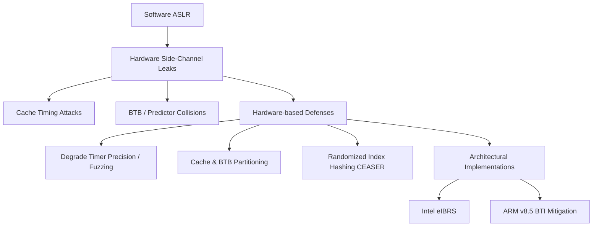

+++
title = "ASLR 하드웨어 기반 우회 방어"
weight = 576
+++

> **💡 Insight**
> - 핵심 개념: 메모리 주소 무작위화(ASLR)를 우회하려는 마이크로아키텍처 수준의 사이드 채널 공격(Side-channel Attack)을 하드웨어적으로 원천 차단하는 보안 기술.
> - 기술적 파급력: 해커가 분기 예측기나 캐시 타이밍을 이용해 숨겨진 메모리 레이아웃을 추론하는 것을 막아내어 시스템의 기본 보안 계층을 유지함.
> - 해결 패러다임: 타이머 정밀도 저하, 캐시 분할(Partitioning), 난수화된 하드웨어 해싱(Hashing) 도입을 통해 투기적 실행이 남기는 발자국(Microarchitectural Traces)을 지움.

## Ⅰ. ASLR의 한계와 하드웨어 기반 우회(Bypass) 위협
주소 공간 배치 무작위화(ASLR, Address Space Layout Randomization)는 운영체제가 프로그램이 실행될 때마다 코드, 데이터, 힙(Heap), 스택(Stack)이 메모리에 적재되는 주소를 무작위로 섞는 필수적인 소프트웨어 보안 기법입니다. ASLR이 작동하면 해커는 악성 코드를 주입할 '정확한 주소'를 알 수 없어 공격이 무력화됩니다.
그러나 최근의 해커들은 소프트웨어 취약점(버그)을 찾는 대신, CPU 하드웨어의 설계적 특성을 악용하는 사이드 채널 공격(Side-Channel Attack)으로 눈을 돌렸습니다. CPU의 캐시(Cache) 상태, 분기 타겟 버퍼(BTB), 페이지 테이블 워커(Page Table Walker) 등은 ASLR의 무작위 주소 변환 과정에서도 미세한 시간 차이(Timing Difference)를 남깁니다. 공격자는 이 시간 차이를 측정하여 ASLR이 숨겨놓은 실제 물리/가상 주소를 유추(우회)해내는 치명적인 위협을 가하고 있으며, 이를 방어하기 위한 하드웨어 수준의 재설계가 시급해졌습니다.

📢 섹션 요약 비유: ASLR은 범죄자가 침입하지 못하도록 매일 밤 집(프로그램)의 위치를 랜덤으로 바꾸는 마법입니다. 하지만 똑똑한 범죄자(우회 공격)는 집의 주소를 찾는 대신, 아침마다 우유 배달부(CPU 캐시/분기 예측기)가 어느 방향으로 걸어가서 얼마나 늦게 돌아오는지를 스톱워치로 재어 집의 정확한 위치를 알아내는 꼼수를 씁니다.

## Ⅱ. 마이크로아키텍처 수준의 ASLR 우회 메커니즘 (ASCII 다이어그램)
가장 대표적인 ASLR 하드웨어 우회 기법은 캐시 타이밍(Cache Timing)과 분기 타겟 버퍼(BTB) 충돌을 이용하는 방식입니다.

```text
[Hardware Side-Channel Attack on ASLR]

1. Attacker's Probe: 
   공격자가 특정 주소 'X'를 투기적으로(Speculatively) 실행하도록 유도.
   
2. Microarchitectural State Change:
   [Branch Target Buffer (BTB)] 
     Index 0x4A -> Target: 0xFFFF... (Victim's Secret Address)
     -> 공격자의 코드와 희생자의 코드가 동일한 BTB 인덱스를 공유(Collision)함.
     
3. Timing Measurement:
   공격자가 자신의 분기 명령어를 실행.
   - Case A (충돌 발생): 예측기가 희생자의 주소로 잘못 점프 -> 파이프라인 플러시 발생 -> '느림(Slow)'
   - Case B (충돌 없음): 정상 실행 -> '빠름(Fast)'

4. ASLR Defeated:
   '느림'이 관측된 BTB 인덱스를 역추적하면, 희생자의 커널/프로그램 주소가 
   현재 메모리의 어느 오프셋(Offset)에 무작위화되어 있는지(ASLR Base) 정확히 계산됨!
```
이 과정은 메모리 권한(Privilege) 검사가 이루어지기 전인 투기적 실행 단계에서 발생하므로, 운영체제나 백신 소프트웨어는 공격이 일어났다는 사실조차 인지할 수 없습니다.

📢 섹션 요약 비유: 범죄자가 옆집 담벼락에 돌을 던져봅니다. 만약 "아야!" 하는 소리가 1초 만에 들리면 담벼락 바로 뒤에 사람이 있는 것이고, 3초 만에 들리면 멀리 있는 것입니다. 눈으로 직접 보지 않고도(권한 없음) 소리가 돌아오는 시간만으로 타겟의 위치를 100% 알아맞히는 원리입니다.

## Ⅲ. 하드웨어 기반 우회 방어를 위한 핵심 기술요소
이러한 시간 기반의 우회를 막기 위해서는 하드웨어가 남기는 흔적(Footprint) 자체를 지우거나, 시간 측정 행위를 교란해야 합니다.
1. **정밀 타이머 제거 및 교란 (Fuzzing Timers):**
   공격의 핵심은 CPU 사이클 단위의 정밀한 시간 측정 명령어(예: x86의 `RDTSC`)입니다. 하드웨어 또는 OS 커널에서 유저 모드 프로그램이 이 명령어를 호출할 때 인위적인 지연(Jitter)이나 가짜 시간 값을 반환하도록 하여 타이밍 공격의 해상도를 뭉개버립니다.
2. **캐시 및 예측기 상태 분할 (Partitioning / Isolation):**
   공격자와 희생자가 동일한 캐시 라인이나 BTB를 공유해서 발생하는 충돌(Collision)을 원천 차단합니다. 인텔의 CAT(Cache Allocation Technology)나 하드웨어 스레드(SMT) 간의 BTB 공간을 물리적 혹은 논리적 격벽(Tagging)으로 분리하여 상태 누출을 막습니다.
3. **무작위화된 해싱 아키텍처 (Randomized Hardware Hashing):**
   메모리 주소를 캐시 인덱스나 BTB 인덱스로 매핑할 때, 단순한 비트 자르기(Bit Extraction) 대신 부팅 시마다 변경되는 비밀 키(Secret Key)를 적용한 암호화 해시 함수(예: CEASER Cache, Random Fill Architecture)를 통과시킵니다. 공격자가 충돌을 유도하려 해도 내부 매핑 규칙을 몰라 공격 패킷을 생성할 수 없습니다.

📢 섹션 요약 비유: 범죄자가 스톱워치로 시간을 재지 못하게 스톱워치의 초침을 고장 내버리거나(타이머 교란), 우유 배달부가 다니는 길을 미로처럼 매일 바꿔서 배달부가 걸린 시간만으로는 집 위치를 역산할 수 없게(하드웨어 해싱) 만드는 방어책입니다.

## Ⅳ. 현대 프로세서의 하드웨어 보안 패치 사례
ASLR 우회 및 스펙터(Spectre)/멜트다운(Meltdown) 사태 이후, 마이크로프로세서 벤더들은 아키텍처에 하드웨어적 완화책(Hardware Mitigations)을 칩 레벨에서 박아넣기 시작했습니다.
- **Intel eIBRS (Enhanced Indirect Branch Restricted Speculation):** 하드웨어 내부에 간접 분기(Indirect Branch) 예측이 다른 권한 레벨이나 프로세스로 넘어가는 것을 막는 격리 벽을 세웠습니다. 이를 통해 ASLR 레이아웃 누출을 차단합니다.
- **ARM v8.5-A BTI 방어:** 모바일 AP 생태계를 주도하는 ARM은 분기 타겟 명령어가 아닌 곳으로 점프하는 것을 방지하는 BTI(Branch Target Identification) 기능과 예측기 상태를 비우는 멍텅구리(Dummy) 캐시 라인을 하드웨어 사양에 표준으로 편입시켰습니다.

📢 섹션 요약 비유: 예전에는 건물을 지은 뒤에 보안요원을 추가 고용(소프트웨어 패치)했다면, 이제는 아예 설계도를 수정해서 건물 자체의 창문을 모두 방탄 유리로 바꾸고 통풍구를 없애버린(하드웨어 완화책) 튼튼한 요새를 짓고 있는 것입니다.

## Ⅴ. 한계점 및 미래 발전 방향
하드웨어 기반 방어는 필연적으로 성능 저하(Performance Penalty)를 동반합니다. 공유 캐시를 분할하면 캐시 활용률이 떨어지고, 복잡한 해싱을 도입하면 L1 캐시 레이턴시가 증가하여 클럭 속도 향상에 발목을 잡습니다.
미래의 컴퓨터 아키텍처는 성능을 갉아먹는 고정된 격벽 방식 대신, 머신러닝 기반의 이상 탐지 유닛(Anomaly Detection Unit)을 칩 내부에 탑재하여 평소에는 최대 성능으로 동작하다가, 특정 스레드가 의도적으로 캐시 충돌을 유발하거나 타이밍을 비정상적으로 측정하는 '공격 패턴'이 감지될 때만 동적으로 방어 매커니즘을 켜는 적응형 하드웨어 보안(Adaptive Hardware Security)으로 발전할 것입니다.

📢 섹션 요약 비유: 모든 승객을 매번 공항 보안 검색대에서 옷까지 벗겨가며 검사하면 비행기 탑승이 너무 느려집니다. 미래에는 평소엔 그냥 지나가게 하되, 수상한 땀을 흘리거나 눈동자가 흔들리는 사람(비정상적인 접근 패턴)만 AI CCTV가 순식간에 골라내어 집중 검사하는 스마트 보안 시스템으로 진화합니다.

---

### **지식 그래프 (Knowledge Graph)**


### **어린이 비유 (Child Analogy)**
우리가 보물(비밀 주소)을 숨바꼭질하듯 매일 다른 모래사장 구석에 몰래 파묻는 걸 ASLR이라고 해요. 그런데 나쁜 해커가 똑똑하게도 보물 위치를 직접 안 찾고, 우리가 보물을 묻고 돌아올 때 발에 모래가 얼마나 묻었는지, 돌아오는 데 시간이 몇 초나 걸렸는지를 재서(타이밍 공격) 보물 위치를 알아내 버렸어요! 그래서 우리는 아예 신발을 털어주는 마법의 터널(하드웨어 방어)을 지나서 집에 오게 만들고, 해커의 시계 바늘을 몰래 구부려놔서(타이머 교란) 해커가 절대 시간을 잴 수 없게 만들어 보물을 완벽히 지켜내는 거랍니다!
