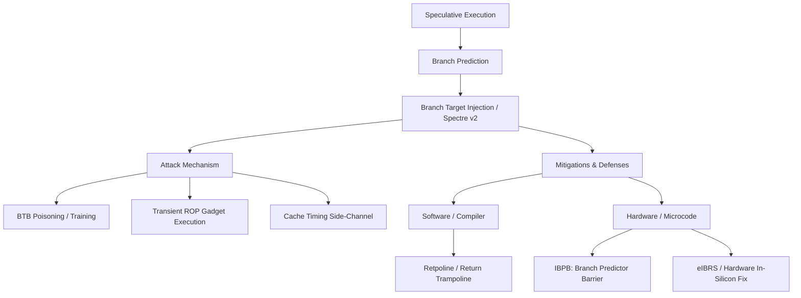

+++
title = "분기 목표 주입 (Branch Target Injection)"
weight = 577
+++

> **💡 Insight**
> - 핵심 개념: CPU의 투기적 실행(Speculative Execution)을 악용하여 간접 분기(Indirect Branch)의 예측기를 조작, 해커가 원하는 코드로 CPU를 강제 점프시키는 마이크로아키텍처 해킹 기법(Spectre v2).
> - 기술적 파급력: 권한 경계(가상 주소 분리, 샌드박스)를 완전히 무시하고 커널이나 다른 프로세스의 메모리를 읽어내어 시스템의 루트(Root) 보안을 붕괴시킴.
> - 해결 패러다임: IBPB(간접 분기 예측 제한)나 레트폴린(Retpoline) 같은 소프트웨어 컴파일러 기법을 통해 악의적인 예측 주입을 차단하거나 오도함.

## Ⅰ. 분기 목표 주입(BTI)의 본질과 Spectre v2 위협
분기 목표 주입(BTI, Branch Target Injection)은 2018년 전 세계를 강타한 스펙터(Spectre) 취약점의 두 번째 변종(Variant 2)을 지칭하는 공식적인 기술 용어입니다.
현대의 슈퍼스칼라 CPU는 성능을 높이기 위해 다음 실행할 명령어를 미리 추측하여 실행하는 투기적 실행(Speculative Execution)을 수행합니다. 특히 목적지가 고정되지 않은 간접 분기(`jmp *eax` 등)를 만날 경우, CPU 내의 분기 타겟 버퍼(BTB, Branch Target Buffer)의 과거 이력을 바탕으로 점프할 곳을 예측합니다. BTI 공격은 이 BTB에 악의적인 '가짜 목적지 주소'를 지속적으로 주입(학습)시켜 훈련시킴으로써, 희생자 프로세스(또는 OS 커널)가 투기적 실행을 할 때 해커가 짜놓은 ROP(Return-Oriented Programming) 가젯이나 데이터 유출 코드로 스스로 점프하도록 조종하는 고도의 착시 공격입니다.

📢 섹션 요약 비유: 택시 기사(CPU)에게 매일 같은 시간에 가짜 승객(해커)이 타서 "은행 뒷골목으로 가주세요"라고 반복해서 말합니다(학습 주입). 며칠 뒤 진짜 VIP 승객(커널)이 타서 "늘 가던 데로 가자"고 간접적으로 말했을 뿐인데, 세뇌당한 기사는 무의식중에 VIP를 은행 뒷골목(해커의 함정)으로 데려가 버리는 끔찍한 납치극입니다.

## Ⅱ. BTI 공격 발생 시나리오 및 아키텍처 내부 구조 (ASCII 다이어그램)
BTI 공격은 하드웨어의 분기 예측기가 프로세스의 권한(Privilege) 문맥을 제대로 구분하지 못하는 설계적 결함을 파고듭니다.

```text
[Hardware Branch Target Buffer (BTB)]
+-------------+-----------------------+
| PC (Source) | Target Address (Pred) |
+-------------+-----------------------+
| 0x1000      | 0x9999 (Hacker's Gadget)| <- 공격자가 이 테이블을 오염시킴!
+-------------+-----------------------+

[Victim (Kernel / High Privilege) Execution Flow]
1. Kernel executes Indirect Branch at PC:0x1000
   (예: 함수 포인터 호출)

2. Speculative Execution Kick-in!
   - CPU: "어? BTB를 보니 0x1000에서는 항상 0x9999로 갔었지!"
   - 권한 검사 완료 전에 CPU는 투기적으로 0x9999로 점프함.
   
3. Transient Execution (0x9999)
   - 0x9999: 은밀하게 커널의 비밀번호(Secret)를 읽어서 캐시에 자국(Timing)을 남김.
   
4. Rollback & Detection
   - CPU: "앗, 예측이 틀렸네! 0x9999로 가면 안되는 거였어. 실행 취소(Flush)!"
   - 레지스터 상태는 복구되지만, 캐시(Cache)에 남은 데이터 흔적은 복구되지 않음.
   - 공격자는 캐시 타이밍 공격을 통해 커널 비밀번호를 획득.
```
공격자는 투기적 실행이 결국 취소(Rollback)된다는 것을 압니다. 하지만 취소되기 전 아주 짧은 찰나(수십 나노초) 동안 CPU가 강제로 해커의 코드를 훑고 지나가며 남긴 미세한 '캐시 흔적(Microarchitectural Trace)'을 주워 담는 것이 공격의 완성입니다.

📢 섹션 요약 비유: 은행 직원이 서류를 잘못 인쇄했다는 걸 깨닫고 재빨리 파쇄기(Rollback)에 넣었지만, 이미 종이의 잉크가 파쇄기 옆의 벽에 살짝 묻어(캐시 흔적) 버렸습니다. 해커는 파쇄된 종이를 복구하는 게 아니라 벽에 묻은 잉크 모양을 현미경으로 분석해 은행 비밀을 알아냅니다.

## Ⅲ. BTI를 방어하기 위한 핵심 기술요소 (소프트웨어 및 하드웨어)
BTI는 실리콘 레벨의 취약점이므로 완벽한 해결은 CPU 교체뿐입니다. 그러나 교체 전까지 피해를 막기 위해 소프트웨어(컴파일러)와 마이크로코드(Microcode) 업데이트를 결합한 방어책이 동원됩니다.
1. **Retpoline (Return Trampoline):**
   구글(Google)의 엔지니어들이 고안한 천재적인 컴파일러 우회 기법입니다. 컴파일 타임에 모든 간접 분기 명령어를 특수한 구조(무한 루프에 빠지는 Call/Return 구조)로 치환하여, CPU의 투기적 실행 엔진이 엉뚱한 곳으로 예측(점프)하지 못하고 안전한 '트램펄린' 공간에서 갇혀 제자리걸음만 하도록 만듭니다. 이로 인해 소프트웨어 성능 저하를 최소화하며 BTI를 막아냅니다.
2. **IBPB (Indirect Branch Predictor Barrier):**
   컨텍스트 스위치(프로세스가 바뀌거나 커널 모드 진입 시)가 일어날 때, 이전 프로세스가 학습시켜 놓은 BTB(분기 예측기)의 내용을 강제로 초기화(Flush)하는 하드웨어 명령어를 마이크로코드 업데이트로 추가한 것입니다.
3. **STIBP (Single Thread Indirect Branch Predictors):**
   하이퍼스레딩(SMT) 환경에서 동일한 물리 코어를 공유하는 논리 스레드 간에 분기 예측기가 서로 영향을 미치지(주입하지) 못하도록 차단하는 격리 기능입니다.

📢 섹션 요약 비유: 레트폴린(Retpoline)은 납치된 택시가 해커의 골목으로 진입하려고 할 때, 바닥에 끈끈이(무한 루프)를 발라 택시를 꼼짝 못 하게 묶어두는 덫입니다. IBPB는 택시 승객이 바뀔 때마다 기사의 기억을 지우는 장치(맨인블랙의 뉴럴라이저)를 터뜨리는 것입니다.

## Ⅳ. 고성능 클라우드 환경 및 아키텍처의 패치 여파
BTI(Spectre v2) 패치는 전 세계 IT 업계에 막대한 경제적 손실(성능 하락)을 안겼습니다.
- **클라우드 벤더의 타격:** AWS, Azure, Google Cloud와 같은 멀티 테넌트(Multi-Tenant) 클라우드 환경에서는 하나의 물리 서버를 여러 고객이 공유하므로 BTI 공격의 완벽한 타겟이 되었습니다. 가상 머신(VM) 간의 공격을 막기 위해 IBPB와 하이퍼바이저 수준의 패치가 적용되었으나, 잦은 캐시 초기화와 레트폴린 연산 오버헤드로 인해 시스템 콜(System Call)이 잦은 데이터베이스 서버나 I/O 집약적 서버의 성능이 10~30%까지 폭락했습니다.
- **최신 칩셋의 근본적 방어:** 최근 출시되는 Intel(11세대 이상)이나 AMD(Zen 3 이상), Apple Silicon 칩들은 하드웨어 구조 자체를 뜯어고쳐, 분기 예측기에 권한 레벨 태그(Privilege Tag)를 하드와이어링하여 마이크로코드 패치(성능 저하) 없이도 BTI 주입을 하드웨어적으로 원천 차단(eIBRS 등)하고 있습니다.

📢 섹션 요약 비유: 아파트(클라우드 서버) 전체에 도둑이 들까 봐 모든 층의 계단마다 삼중 자물쇠(소프트웨어 패치)를 채워버려서, 주민들이 택배 하나 받으러 나갈 때마다 30분씩 걸리는 엄청난 불편(성능 저하)을 겪었습니다. 결국 최근에 지어지는 새 아파트(최신 칩)는 애초에 안면인식 자동문(하드웨어 방어)을 달아서 빠르고 안전하게 문제를 해결했습니다.

## Ⅴ. 한계점 및 미래 발전 방향
레트폴린이나 마이크로코드 패치는 어디까지나 반창고(Workaround)에 불과하며 지속 가능한 해결책이 아닙니다. 더 근본적인 문제는 파이프라인의 투기적 실행 자체가 속도 지상주의 설계의 산물이라는 점입니다.
미래의 마이크로아키텍처는 투기적 실행을 포기하지 않으면서도 보안을 달성하기 위해, 투기적으로 실행된 명령어가 가져온 데이터는 메인 캐시(L1/L2)가 아닌 '비밀스럽고 보이지 않는 별도의 그림자 캐시(Shadow Cache / Safe Speculation Buffer)'에 격리해두고, 최종적으로 올바른 분기임이 확정(Commit)되었을 때만 아키텍처 상태로 반영하는 안전한 투기적 실행(Safe Speculation) 패러다임으로 전환될 것입니다.

📢 섹션 요약 비유: 택시 기사가 예측 운전을 포기하면 목적지 도착이 너무 늦어집니다. 따라서 미래에는 기사가 일단 지름길(투기적 실행)로 미리 차를 몰아보되, 실제 승객을 태운 진짜 택시가 아니라 '투명한 유령 택시(그림자 캐시)'로 먼저 달려보게 합니다. 목적지가 맞으면 유령 택시를 진짜로 변환시키고, 해커의 함정이었다면 유령 택시를 흔적 없이 소멸시키는 완벽한 마법을 쓸 것입니다.

---

### **지식 그래프 (Knowledge Graph)**


### **어린이 비유 (Child Analogy)**
미래를 미리 보는 '수정구슬(분기 예측기)'을 가진 마법사가 있어요. 마법사는 구슬이 보여주는 환상(투기적 실행)을 믿고 다음 마법을 미리 준비해두죠. 그런데 나쁜 마녀(해커)가 몰래 수정구슬에 검은 물감을 칠해서, 마법사에게 '절벽으로 뛰어가라'는 가짜 환상을 계속 주입(BTI)했어요. 마법사가 절벽으로 한 발짝 내딛고 "앗 가짜구나!" 하고 돌아왔지만, 마법사의 신발에는 이미 절벽의 흙(비밀 데이터 흔적)이 묻어버렸죠! 마녀는 그 흙을 보고 마법사의 약점을 알아내게 됩니다. 이를 막기 위해 우리는 수정구슬을 볼 때마다 깨끗이 닦아내거나(IBPB), 마법사가 뛸 자리에 안전한 트램펄린(레트폴린)을 미리 설치해두는 거랍니다.
