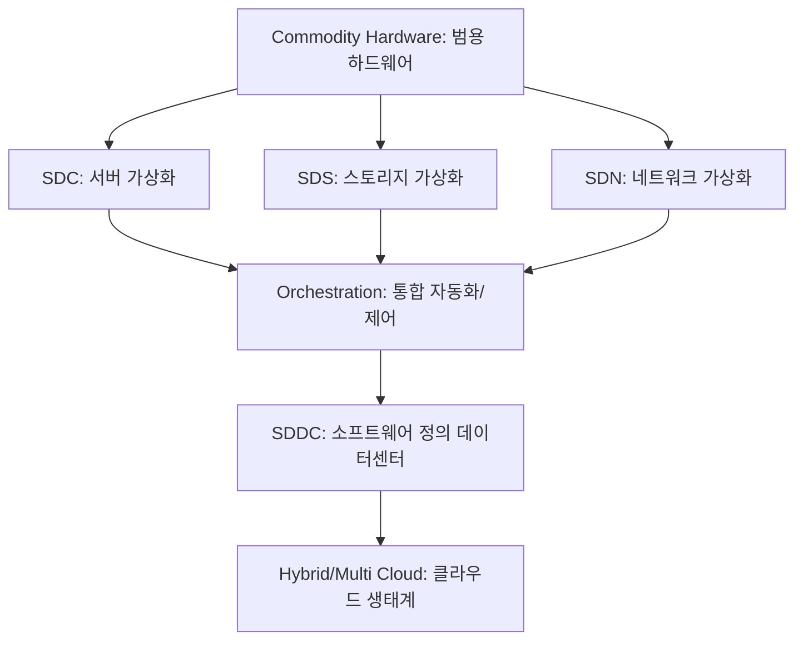

+++
title = "631. SDDC (Software Defined Data Center)"
date = "2026-03-14"
weight = 631
+++

> **Insight**
> * SDDC(Software Defined Data Center)는 컴퓨팅, 스토리지, 네트워크 등 모든 데이터센터 인프라를 가상화하여 소프트웨어로 제어하는 아키텍처입니다.
> * 하드웨어 종속성(Vendor Lock-in)을 탈피하고 자원 할당 및 관리를 자동화하여 클라우드 환경의 유연성과 확장성을 극대화합니다.
> * 통합 관리 플랫폼(Orchestration)을 통해 프로비저닝 시간을 단축하고 운영 비용(OPEX) 및 자본 지출(CAPEX)을 최적화합니다.

## Ⅰ. SDDC (Software Defined Data Center)의 개념 및 필요성

### 1. SDDC의 정의
SDDC(Software Defined Data Center)는 모든 인프라 자원(서버, 스토리지, 네트워크, 보안 등)이 가상화(Virtualization)되어 서비스로 제공되며, 이들의 통제 및 관리가 소프트웨어에 의해 자동화되는 차세대 데이터센터 아키텍처입니다.

### 2. SDDC 도입의 필요성
* **하드웨어 종속성(Vendor Lock-in) 극복**: 특정 하드웨어 벤더(Vendor)에 얽매이지 않고 범용 하드웨어(Commodity Hardware)를 활용할 수 있습니다.
* **민첩성(Agility) 확보**: 비즈니스 요구사항에 맞춰 IT 인프라 자원을 신속하게 프로비저닝(Provisioning)하고 확장/축소(Scale-out/Scale-in)할 수 있습니다.
* **운영 효율성 극대화**: 자동화(Automation) 및 오케스트레이션(Orchestration)을 통해 수동 작업을 최소화하고 휴먼 에러를 방지합니다.

> 📢 섹션 요약 비유: SDDC는 오케스트라의 지휘자와 같습니다. 개별 악기(하드웨어)가 무엇이든, 지휘자(소프트웨어)의 통제 아래에서 완벽한 교향곡(IT 서비스)을 유연하고 자동화된 방식으로 연주해냅니다.

## Ⅱ. SDDC의 핵심 구성 요소 및 아키텍처

### 1. SDDC 아키텍처 구성도
SDDC는 컴퓨팅, 네트워크, 스토리지의 가상화 계층과 이를 통합 관리하는 오케스트레이션 계층으로 구성됩니다.

```ascii
+-----------------------------------------------------------+
|          Cloud Management / Orchestration Layer           |
|  (Automation, Provisioning, Monitoring, Self-Service)     |
+-----------------------------------------------------------+
|                         API (RESTful)                     |
+-----------------------------------------------------------+
|   SDC (Compute)   |    SDS (Storage)   |   SDN (Network)  |
| (Hypervisor, VM)  | (vSAN, Ceph 등)    | (NFV, OpenFlow)  |
+-----------------------------------------------------------+
|             Hardware Abstraction Layer (HAL)              |
+-----------------------------------------------------------+
|   Commodity x86 Servers | JBOD / Flash | Whitebox Switches|
+-----------------------------------------------------------+
```

### 2. 주요 구성 요소 상세
* **SDC (Software Defined Compute)**: 하이퍼바이저(Hypervisor)를 통해 물리적 서버 자원을 논리적 가상 머신(VM, Virtual Machine)으로 분할 및 할당합니다. CPU, 메모리 자원의 효율성을 극대화합니다.
* **SDS (Software Defined Storage)**: 이기종 스토리지 하드웨어를 통합하여 단일 논리적 스토리지 풀(Pool)로 구성하고, 정책 기반으로 스토리지를 관리합니다.
* **SDN (Software Defined Network)**: 네트워크 제어부(Control Plane)와 전송부(Data Plane)를 분리하여 네트워크 트래픽 경로를 소프트웨어로 중앙 집중 제어합니다.
* **오케스트레이션 및 관리 (Orchestration & Management)**: SDC, SDS, SDN 자원을 통합 모니터링하고 프로비저닝 워크플로우를 자동화하는 클라우드 운영 체제(Cloud OS) 역할을 수행합니다.

> 📢 섹션 요약 비유: SDDC 아키텍처는 스마트 팩토리와 같습니다. 물리적인 기계(하드웨어) 위에 중앙 제어 시스템(오케스트레이션)이 있어, 재료(데이터)의 흐름과 보관, 가공 방식을 소프트웨어 명령 하나로 완벽하게 재구성합니다.

## Ⅲ. SDDC의 핵심 기술 요소

### 1. 가상화 (Virtualization) 및 컨테이너 (Container)
* 서버 가상화(Hypervisor)를 넘어, 최근에는 경량화된 가상화 기술인 컨테이너(Docker 등)와 쿠버네티스(Kubernetes) 기반의 컨테이너 오케스트레이션이 SDDC 환경에서 핵심 기술로 자리 잡고 있습니다.

### 2. 추상화 (Abstraction) 및 풀링 (Pooling)
* 물리적 하드웨어의 복잡성을 숨기는 추상화 계층을 제공하며, 분산된 자원들을 논리적인 단일 덩어리인 풀(Pool)로 묶어 필요에 따라 동적으로 분배합니다.

### 3. API 중심 아키텍처 (API-driven Architecture)
* 인프라를 코드로 관리(IaC, Infrastructure as Code)할 수 있도록 모든 구성 요소 간 통신 및 제어는 RESTful API(Application Programming Interface)를 기반으로 이루어집니다.

> 📢 섹션 요약 비유: 핵심 기술들은 레고 블록 놀이와 같습니다. 제각각인 블록(물리 자원)들을 똑같은 접합부(추상화/API)를 가진 블록으로 취급하여, 설명서(코드)에 따라 어떤 형태(서비스)로든 자유롭게 조립(풀링)할 수 있게 합니다.

## Ⅳ. SDDC 구현 시 고려사항 및 한계점

### 1. 초기 구축 비용 및 전문성 부족
* 기존 레거시 인프라를 SDDC 환경으로 마이그레이션(Migration)하는 데 초기 투자 비용(CAPEX)이 발생하며, 클라우드 아키텍처를 이해하는 전문 인력(Engineer) 확보가 필수적입니다.

### 2. 이기종 환경의 상호 운용성 (Interoperability)
* 다양한 벤더의 하드웨어와 오픈소스 소프트웨어를 결합할 때 발생하는 호환성 문제와 통합 과정의 복잡성을 관리해야 합니다.

### 3. 보안 및 컴플라이언스 (Security & Compliance)
* 단일 중앙 통제 지점(Control Plane)의 해킹 시 데이터센터 전체가 마비될 위험(Single Point of Failure)이 있으므로, 마이크로세그멘테이션(Micro-segmentation) 등 심층 방어(Defense in Depth) 전략이 필요합니다.

> 📢 섹션 요약 비유: SDDC 구축은 최신식 스마트 홈을 짓는 것과 같습니다. 지어놓으면 편리하지만 처음 설계비가 많이 들고, 여러 제조사의 가전기기를 하나의 앱에 연동하는 호환성 문제, 그리고 중앙 해킹 시 모든 문이 열릴 수 있는 보안 문제를 꼼꼼히 챙겨야 합니다.

## Ⅴ. SDDC의 발전 동향 및 미래 전망

### 1. AI옵스 (AIOps) 기반의 지능형 운영
* 인공지능(AI)과 머신러닝(ML) 기술을 접목하여 장애 징후를 사전에 예측하고, 자원 최적화를 스스로 수행하는 자율형(Autonomous) SDDC로 진화하고 있습니다.

### 2. 엣지 컴퓨팅 (Edge Computing)과의 결합
* 중앙 데이터센터의 SDDC 아키텍처가 엣지(Edge) 환경으로 확장되어, 코어 데이터센터부터 엣지까지 단일 플랫폼으로 통합 관리하는 엣지-클라우드 컨티뉴엄(Edge-Cloud Continuum) 트렌드가 확산되고 있습니다.

### 3. 하이브리드/멀티 클라우드(Hybrid/Multi Cloud) 통합
* 프라이빗 SDDC와 퍼블릭 클라우드 간의 경계를 허물고, 워크로드(Workload)를 자유롭게 이동시킬 수 있는 진정한 의미의 하이브리드 클라우드 인프라의 근간으로 발전 중입니다.

> 📢 섹션 요약 비유: SDDC의 미래는 자율주행 자동차 네트워크와 같습니다. AI가 도로 상황(장애)을 미리 예측하여 차를 조향하고, 도심(중앙 센터)부터 외곽(엣지)까지 모든 차량이 하나의 시스템처럼 매끄럽게 연동되어 주행하는 모습입니다.

---

### 💡 Knowledge Graph & Child Analogy



> 🧒 **Child Analogy (초등학생을 위한 비유)**
> 데이터센터를 장난감 로봇 공장이라고 상상해봐요. 옛날 공장에서는 일꾼들이 일일이 기계 버튼을 누르고 부품을 날라야 했어요. 하지만 SDDC 공장은 아주 똑똑한 컴퓨터 화면(소프트웨어) 하나로 운영돼요! 화면에서 "로봇 100개 만들어!"라고 명령만 치면, 공장 안에 있는 기계(서버), 창고(스토리지), 컨베이어 벨트(네트워크)가 알아서 움직이면서 순식간에 일을 끝내준답니다. 기계가 고장 나도 다른 기계가 바로 대신할 수 있게 모든 게 소프트웨어로 연결된 마법 같은 공장이에요!