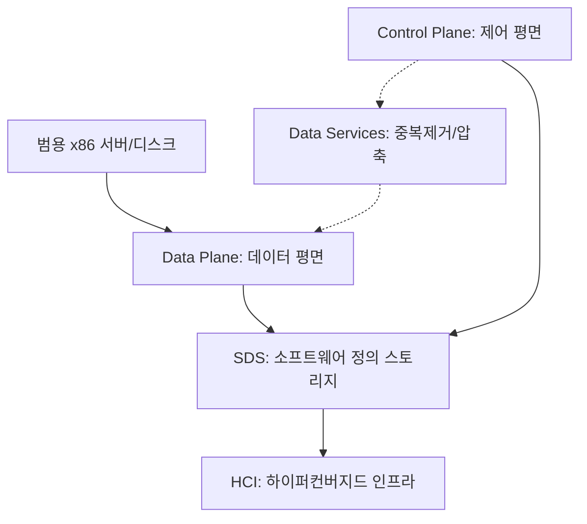

+++
title = "632. SDS (Software Defined Storage)"
date = "2026-03-14"
weight = 632
+++

> **Insight**
> * SDS(Software Defined Storage)는 스토리지 하드웨어와 데이터 제어 소프트웨어를 분리하여, 하드웨어 종속성 없이 스토리지를 논리적으로 구성하고 관리하는 기술입니다.
> * 정책 기반(Policy-based)의 자동화된 관리를 통해 프로비저닝 속도를 높이고, 범용 서버(x86)를 활용하여 스토리지 구축 비용을 절감합니다.
> * 스케일 아웃(Scale-out) 구조를 통해 대용량 데이터 환경에서도 유연한 확장성과 일관된 성능을 보장합니다.

## Ⅰ. SDS (Software Defined Storage)의 개념 및 등장 배경

### 1. SDS의 정의
SDS(Software Defined Storage)는 스토리지 하드웨어에 종속되어 있던 데이터 제어(Control Plane) 및 데이터 관리 기능(Data Plane)을 소프트웨어로 분리(Decoupling)하여, 하드웨어 유형에 관계없이 단일 논리적 스토리지 풀(Pool)로 통합 관리하는 아키텍처입니다.

### 2. 등장 배경 및 필요성
* **레거시 스토리지의 한계**: 기존의 SAN/NAS 장비는 특정 벤더에 종속(Vendor Lock-in)되며, 확장이 제한적(Scale-up 중심)이고 고가의 전용 하드웨어를 요구했습니다.
* **데이터 폭증**: 비정형 데이터의 폭발적인 증가로 인해, 저비용으로 무한히 확장할 수 있는 스토리지 인프라가 필요해졌습니다.
* **클라우드 민첩성 요구**: 애플리케이션 요구사항에 맞춰 스토리지를 동적으로 즉각 할당(Provisioning)하는 클라우드 네이티브 환경이 필수가 되었습니다.

> 📢 섹션 요약 비유: SDS는 커다란 공용 물탱크와 같습니다. 예전에는 비싼 전용 생수통(하드웨어)만 써야 했지만, 이제는 어떤 통이든 파이프(소프트웨어)로 연결해서 거대한 물탱크(스토리지 풀)를 만들고, 필요한 곳에 수도꼭지로 원하는 만큼 물을 틀어주는 방식입니다.

## Ⅱ. SDS의 아키텍처 및 구성 요소

### 1. SDS 핵심 아키텍처
SDS는 물리적 디스크를 추상화하여 볼륨을 생성하는 데이터 평면과, 이를 정책으로 관리하는 제어 평면으로 나뉩니다.

```ascii
+-----------------------------------------------------------+
|              Control Plane (Policy & Management)          |
|  (Provisioning, Snapshot, Replication, QoS, Tiering)      |
+-----------------------------------------------------------+
|                        API / CLI                          |
+-----------------------------------------------------------+
|               Data Plane (Storage Abstraction)            |
|       (Block Storage, File Storage, Object Storage)       |
+-----------------------------------------------------------+
|                     Commodity x86 Servers                 |
|  [ HDD ] [ SSD ] [ NVMe ]      [ HDD ] [ SSD ] [ NVMe ]   |
+-----------------------------------------------------------+
```

### 2. 주요 구성 요소
* **제어 평면 (Control Plane)**: 스토리지 자원의 할당, 성능 정책(QoS), 스냅샷(Snapshot), 데이터 복제(Replication) 등을 관장하는 두뇌 역할입니다.
* **데이터 평면 (Data Plane)**: 실제 데이터가 저장되고 읽히는 입출력(I/O) 경로로, 범용 x86 서버에 장착된 로컬 디스크(DAS)들을 묶어 논리적인 볼륨(Block, File, Object)으로 제공합니다.
* **정책 기반 관리 (Policy-Based Management)**: 애플리케이션의 요구(가용성, 성능)에 따라 스토리지 자원을 소프트웨어 정책으로 정의하고 자동 할당합니다.

> 📢 섹션 요약 비유: SDS 아키텍처는 스마트 물류 창고입니다. 각기 다른 크기의 상자(하드웨어 디스크)들을 하나의 거대한 창고(데이터 평면)에 모아두고, 중앙 관리 컴퓨터(제어 평면)가 주문(정책)에 맞춰 가장 빠른 배송 루트를 찾아 물건을 꺼내줍니다.

## Ⅲ. SDS의 핵심 기술 요소

### 1. 스토리지 풀링 (Storage Pooling)
* 물리적으로 분산된 이기종 스토리지 디바이스들을 논리적으로 결합하여 거대한 단일 스토리지 자원(Pool)으로 만듭니다. 사용자는 하드웨어의 물리적 위치를 몰라도 됩니다.

### 2. 스케일 아웃 확장성 (Scale-out Scalability)
* 노드(Node)를 추가하는 것만으로 스토리지의 용량(Capacity)과 성능(Performance)이 선형적으로 증가하는 분산 아키텍처를 채택합니다.

### 3. 데이터 서비스 (Advanced Data Services)
* 하드웨어 칩이 아닌 소프트웨어 엔진이 씬 프로비저닝(Thin Provisioning), 중복 제거(Deduplication), 압축(Compression), 자동 계층화(Auto-Tiering) 등을 수행합니다.

> 📢 섹션 요약 비유: 핵심 기술은 스마트폰의 소프트웨어 업데이트와 같습니다. 예전에는 카메라 성능을 높이려면 새 폰(스토리지 장비)을 사야 했지만, 이제는 소프트웨어(데이터 서비스)만으로 사진 압축률이나 화질을 개선할 수 있는 것과 같습니다.

## Ⅳ. SDS 구축 시 고려사항 및 한계점

### 1. 성능 오버헤드 (Performance Overhead)
* 스토리지 컨트롤러 기능을 하드웨어 ASIC(Application Specific Integrated Circuit)이 아닌 범용 CPU(Software)가 처리하므로, 과도한 I/O 발생 시 CPU 자원이 고갈되거나 지연 시간(Latency)이 증가할 수 있습니다.

### 2. 네트워크 대역폭 의존성 (Network Dependency)
* 분산된 노드 간에 데이터를 동기화하고 복제하기 때문에 이스트-웨스트(East-West) 네트워크 트래픽이 크게 증가합니다. 고속의 백본 네트워크(10G/25G/100G)가 필수적입니다.

### 3. 장애 도메인 격리 (Failure Domain Isolation)
* 여러 노드가 하나의 클러스터로 묶이므로, 네트워크 단절(Split-Brain)이나 소프트웨어 버그 발생 시 전체 스토리지 시스템으로 장애가 전파될 위험을 대비해야 합니다.

> 📢 섹션 요약 비유: SDS의 한계는 택배 회사의 중앙 시스템과 같습니다. 배달원(하드웨어)이 많아져서 한 번에 많은 짐을 나를 수는 있지만, 무전기(네트워크)가 끊기거나 본사 컴퓨터(소프트웨어)가 멈추면 모든 배달원이 길을 잃게 됩니다.

## Ⅴ. SDS의 발전 동향 및 미래 전망

### 1. NVMe-oF (NVMe over Fabrics) 통합
* 초고속 인터페이스인 NVMe를 네트워크 원격 스토리지에 적용한 NVMe-oF 기술이 SDS와 결합하여, 로컬 디스크와 같은 초저지연 성능을 분산 스토리지에서도 달성하고 있습니다.

### 2. 하이퍼컨버지드 인프라 (HCI, Hyper-Converged Infrastructure) 확산
* SDC(서버 가상화)와 SDS(스토리지 가상화)가 단일 어플라이언스로 결합된 HCI(예: VMware vSAN, Nutanix)가 엔터프라이즈 데이터센터의 표준 빌딩 블록으로 자리 잡고 있습니다.

### 3. AI 기반 스토리지 최적화
* 머신러닝을 활용하여 데이터의 접근 패턴을 예측하고, 핫 데이터(Hot Data)와 콜드 데이터(Cold Data)를 자동으로 스토리지 매체 간에 이동시키는 지능형 계층화(Smart Tiering)가 고도화되고 있습니다.

> 📢 섹션 요약 비유: SDS의 미래는 자율주행 택배 트럭입니다. 엄청나게 빠른 고속도로(NVMe-oF)를 달리면서, 트럭 스스로 인공지능을 통해 자주 찾는 물건은 앞칸에, 안 찾는 물건은 뒷칸에 실어(AI 최적화) 배송 속도를 극대화합니다.

---

### 💡 Knowledge Graph & Child Analogy



> 🧒 **Child Analogy (초등학생을 위한 비유)**
> 스토리지(데이터 저장소)를 장난감 상자라고 해볼까요? 옛날에는 빨간 상자에는 빨간 장난감만, 파란 상자에는 파란 장난감만 넣을 수 있는 비싼 특수 상자를 써야 했어요. SDS는 투명하고 엄청나게 큰 마법의 상자를 만드는 주문(소프트웨어)이에요! 굴러다니는 평범한 상자들을 하나로 합쳐주고, 내가 원하는 장난감을 언제든 마법처럼 쏙쏙 빼주니까 공간도 안 모자라고 상자 값도 아낄 수 있답니다.