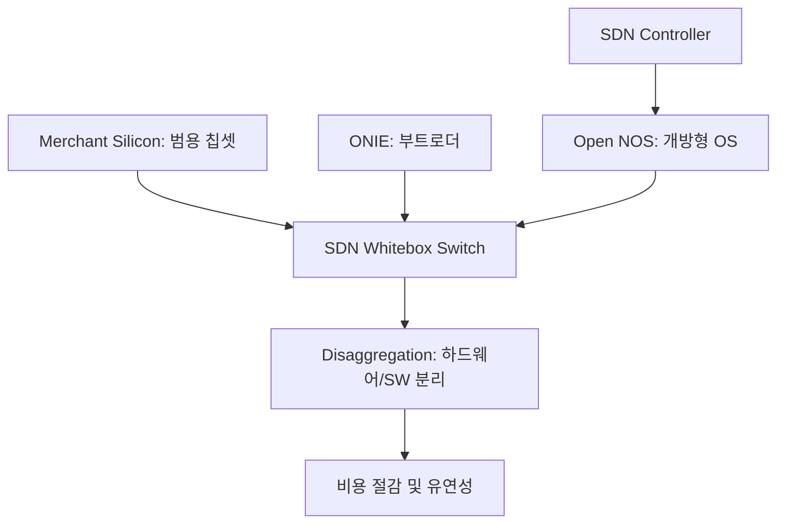

+++
title = "633. SDN (Software Defined Network) 화이트박스 스위치"
date = "2026-03-14"
weight = 633
+++

> **Insight**
> * SDN(Software Defined Network) 화이트박스 스위치는 네트워크 제어부와 전송부를 분리하는 SDN 사상을 물리적 스위치 하드웨어에 구현한 개방형 네트워크 장비입니다.
> * 시스코(Cisco) 등 기존 벤더의 폐쇄적인 운영체제를 탈피하고, 범용 스위치 칩셋 위에 리눅스 기반의 개방형 스위치 OS를 자유롭게 탑재할 수 있습니다.
> * 클라우드 서비스 사업자(CSP) 및 하이퍼스케일 데이터센터에서 네트워크 인프라 구축 비용(CAPEX)을 획기적으로 절감하고 프로그래밍 능력을 극대화합니다.

## Ⅰ. 화이트박스 스위치 (Whitebox Switch)의 개념 및 등장 배경

### 1. 화이트박스 스위치의 정의
화이트박스 스위치(Whitebox Switch)는 브랜드 라벨이 없는 범용 하드웨어 스위치 위에 사용자가 원하는 개방형 네트워크 운영체제(NOS, Network Operating System)를 설치하여 운영할 수 있도록 하드웨어와 소프트웨어가 분리(Disaggregation)된 SDN 스위치 장비입니다.

### 2. 등장 배경 및 필요성
* **기존 네트워크 벤더 종속(Vendor Lock-in)**: 기존 스위치는 하드웨어와 전용 OS(예: Cisco IOS)가 일체형으로 제공되어 폐쇄적이고 가격이 비쌌습니다.
* **오픈 네트워킹(Open Networking) 요구**: 거대 클라우드 기업(메타, 구글 등)은 수만 대의 스위치를 효율적으로 제어하기 위해 서버처럼 리눅스 환경에서 네트워크를 제어할 수 있는 개방형 환경이 필요했습니다.
* **SDN의 실현**: 컨트롤 플레인(제어)과 데이터 플레인(전송)을 분리하는 SDN 철학을 물리적 하드웨어 계층까지 확장한 결과물입니다.

> 📢 섹션 요약 비유: 화이트박스 스위치는 '조립식 PC'와 같습니다. 대기업의 비싼 일체형 컴퓨터(기존 스위치) 대신, 성능 좋은 범용 부품(하드웨어)을 사고 그 위에 내가 원하는 윈도우나 리눅스(개방형 OS)를 마음대로 깔아서 쓰는 것과 똑같습니다.

## Ⅱ. 화이트박스 스위치의 아키텍처 및 구성 요소

### 1. 화이트박스 스위치 아키텍처
스위치 하드웨어(ASIC), 설치 환경(ONIE), 그리고 분리된 개방형 NOS로 구성되는 아키텍처입니다.

```ascii
+-----------------------------------------------------------+
|    SDN Controller / Automation Tools (Ansible, Chef)      |
+-----------------------------------------------------------+
|                          API                              |
+-----------------------------------------------------------+
|         Network Operating System (NOS) (e.g., SONiC)      |
|    (Routing, Switching Logic, Control Plane protocols)    |
+-----------------------------------------------------------+
|                  ONIE (Open Network Install Environment)  |
+-----------------------------------------------------------+
|         SAI (Switch Abstraction Interface) / OpenFlow     |
+-----------------------------------------------------------+
|                  Merchant Silicon (Switch ASIC)           |
|            (Broadcom, Barefoot 등 범용 스위치 칩셋)         |
+-----------------------------------------------------------+
```

### 2. 주요 구성 요소 상세
* **머천트 실리콘 (Merchant Silicon)**: 브로드컴(Broadcom), 멜라녹스(Mellanox) 등 칩셋 제조사가 대량 생산하는 범용 스위치 데이터 전송 칩셋(ASIC)입니다.
* **ONIE (Open Network Install Environment)**: OCP(Open Compute Project)에서 정의한 부트로더로, 마치 PC의 BIOS처럼 스위치 부팅 시 네트워크를 통해 OS를 자동 다운로드 및 설치하게 해줍니다.
* **NOS (Network Operating System)**: 커물러스 리눅스(Cumulus Linux), SONiC(Software for Open Networking in the Cloud) 등 리눅스 기반의 개방형 네트워크 운영체제입니다.
* **SAI (Switch Abstraction Interface)**: 서로 다른 하드웨어 칩셋의 명령어를 표준화하여 위쪽 NOS가 하드웨어를 제어할 수 있게 해주는 추상화 API 계층입니다.

> 📢 섹션 요약 비유: 이 아키텍처는 스마트폰과 비슷합니다. 부품(머천트 실리콘)을 조립한 뒤, 구글 플레이스토어 같은 환경(ONIE)을 통해 안드로이드(NOS)를 설치하면, 똑같은 기계라도 어떤 앱(SDN 컨트롤러)을 쓰느냐에 따라 무한한 기능을 발휘합니다.

## Ⅲ. 화이트박스 스위치의 핵심 기술 요소

### 1. 하드웨어/소프트웨어 분리 (Disaggregation)
* 네트워크 장비의 하드웨어 구매와 소프트웨어 라이선스를 완벽하게 분리하여 각각 최적의 공급자를 선택할 수 있게 합니다.

### 2. 리눅스 네이티브 네트워킹 (Linux Native Networking)
* 스위치 운영체제가 표준 리눅스 기반이므로, 서버 관리자가 서버를 관리하는 동일한 자동화 도구(Ansible, Puppet 등)를 사용하여 수천 대의 네트워크 스위치를 한 번에 설정할 수 있습니다.

### 3. OpenFlow 및 텔레메트리 (Telemetry)
* 제어 평면은 OpenFlow 프로토콜로 중앙 집중 제어되며, 스위치의 상세 상태 정보를 실시간으로 스트리밍하는 텔레메트리 기술을 통해 네트워크 가시성을 극대화합니다.

> 📢 섹션 요약 비유: 핵심 기술은 프랜차이즈 식당의 메뉴판과 같습니다. 식재료(하드웨어)는 시장에서 싸게 사오고, 요리법(소프트웨어)은 본사에서 표준화된 레시피(리눅스/자동화)를 내려보내, 수백 개의 식당이 일사불란하고 저렴하게 운영되는 원리입니다.

## Ⅳ. 화이트박스 스위치 도입 시 고려사항 및 한계점

### 1. 기술 지원(Tech Support) 및 책임 소재의 모호성
* 하드웨어와 소프트웨어 벤더가 다르기 때문에 시스템 장애 발생 시 누구의 책임인지 원인 규명(Troubleshooting)이 어렵고 통합적인 기술 지원을 받기 힘듭니다.

### 2. 전문 운영 인력의 부족
* 기존의 Cisco CLI 명령어에 익숙한 네트워크 엔지니어들이 리눅스 서버 관리 및 프로그래밍 역량(DevOps)을 갖춰야 하므로 조직 내 학습 곡선(Learning Curve)이 큽니다.

### 3. 기능의 파편화 및 검증 부담
* 다양한 개방형 OS와 하드웨어 조합의 호환성을 자체적으로 철저히 검증(BVT, Build Verification Test)해야 하는 부담이 존재합니다.

> 📢 섹션 요약 비유: 도입의 한계는 조립 PC 고장과 같습니다. 모니터 안 나올 때 메인보드(하드웨어) 탓인지 윈도우(소프트웨어) 탓인지 혼자 찾아내야 하고, AS센터에 전화해도 서로 자기네 부품 문제가 아니라고 책임을 미루는 상황이 발생할 수 있습니다.

## Ⅴ. 화이트박스 스위치의 발전 동향 및 미래 전망

### 1. 오픈소스 NOS의 확산 (SONiC 중심)
* 마이크로소프트가 주도하여 오픈소스로 공개한 SONiC(Software for Open Networking in the Cloud)이 화이트박스 스위치 운영체제의 사실상 표준(De Facto Standard)으로 자리매김하고 있습니다.

### 2. P4 언어 기반의 프로그래머블 스위치
* 데이터 전송 평면(Data Plane)의 패킷 처리 방식마저 개발자가 직접 프로그래밍(P4 Language)할 수 있는 차세대 화이트박스 스위치가 등장하여 AI 트래픽 최적화에 활용되고 있습니다.

### 3. 스마트 닉(SmartNIC) 및 DPU와의 결합
* 스위치의 기능이 서버의 랜카드(SmartNIC)나 데이터 처리 장치(DPU)로 오프로드(Offload) 분산되면서, 화이트박스 생태계가 서버 노드 내부로까지 깊숙이 침투하고 있습니다.

> 📢 섹션 요약 비유: 화이트박스 스위치의 미래는 스마트폰의 진화와 같습니다. 기본 통화 기능만 하던 폰에서, 이제는 개발자가 직접 앱을 만들어 코어 시스템의 동작 방식(P4)까지 자유자재로 바꾸는 만능 기계로 진화하는 중입니다.

---

### 💡 Knowledge Graph & Child Analogy



> 🧒 **Child Analogy (초등학생을 위한 비유)**
> 옛날에는 '게임기'와 '게임 팩'이 하나로 찰싹 붙어 있어서, 다른 게임을 하려면 아예 비싼 게임기를 통째로 새로 사야 했어요. 하지만 화이트박스 스위치는 그냥 평범한 '컴퓨터'예요. 하드웨어만 싸게 사서 인터넷으로 내가 원하는 게임 운영체제(소프트웨어)를 쏙 다운로드 받아 깔면 끝! 고장 나면 부품만 쓱 바꾸면 되고, 똑똑하게 컴퓨터 명령어로 모든 걸 내 마음대로 조종할 수 있는 자유로운 기계랍니다.