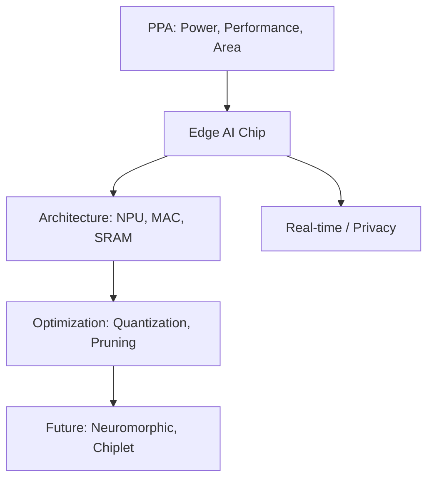

+++
title = "634. 엣지 AI 칩 아키텍처"
date = "2026-03-14"
weight = 634
+++

> **Insight**
> * 엣지 AI 칩(Edge AI Chip)은 클라우드를 거치지 않고 디바이스 자체(Edge)에서 인공지능 연산(추론)을 수행하도록 설계된 저전력, 고효율 반도체입니다.
> * 클라우드 서버급의 연산 능력을 극도로 제한된 면적(Area)과 전력(Power) 환경에 맞추기 위해 PPA(Power, Performance, Area) 최적화에 집중합니다.
> * 실시간 반응(Low Latency)과 데이터 프라이버시가 핵심인 자율주행, 스마트 카메라, 로보틱스 분야의 필수 두뇌로 자리 잡고 있습니다.

## Ⅰ. 엣지 AI 칩 아키텍처의 개념 및 필요성

### 1. 엣지 AI 칩의 정의
엣지 AI 칩(Edge AI Chip)은 데이터가 생성되는 말단 장치(Edge Device) 내부에서 딥러닝 모델의 추론(Inference) 작업을 고속으로 처리하기 위해 만들어진 신경망 처리 장치(NPU, Neural Processing Unit) 또는 AI 가속기를 의미합니다.

### 2. 엣지 AI 칩의 필요성
* **초저지연(Low Latency) 요구**: 자율주행이나 산업용 로봇은 클라우드로 데이터를 보내고 받을 시간이 없습니다. 즉각적인 실시간 판단이 필요합니다.
* **통신 대역폭 비용 절감**: 모든 센서 데이터(고해상도 영상 등)를 클라우드로 전송하면 막대한 네트워크 트래픽과 통신 비용이 발생합니다.
* **보안 및 프라이버시 유지**: 민감한 개인 정보(음성, 얼굴 영상)를 외부 서버로 보내지 않고 기기 내에서 처리하여 데이터 유출을 원천 차단합니다.

> 📢 섹션 요약 비유: 엣지 AI 칩은 현장 파견 수사관입니다. 모든 단서(데이터)를 본부(클라우드 서버)로 보내서 결과를 기다리면 범인을 놓치기 때문에, 수사관이 직접 현장(디바이스)에서 머리를 굴려 즉각 판단을 내리는 것과 같습니다.

## Ⅱ. 엣지 AI 칩의 핵심 아키텍처

### 1. 아키텍처 구성도
엣지 AI 칩은 대량의 단순 연산을 병렬로 처리하는 MAC 유닛 배열과 데이터 이동을 최소화하는 온칩 메모리로 구성됩니다.

```ascii
+-----------------------------------------------------------+
|                      Edge AI Chip (SoC)                   |
+-----------------------------------------------------------+
|  +----------------+  +---------------------------------+  |
|  |   Host MCU /   |  |          AI Accelerator         |  |
|  |     CPU        |  |  +---------------------------+  |  |
|  | (Control Logic)|  |  |   SRAM (On-Chip Memory)   |  |  |
|  +----------------+  |  +---------------------------+  |  |
|          |           |  | +-------+ +-------+ +---+ |  |  |
|     System Bus       |  | | MAC   | | MAC   | |MAC| |  |  |
|          |           |  | | Array | | Array | |...| |  |  |
|  +----------------+  |  | +-------+ +-------+ +---+ |  |  |
|  | Interfaces     |  |  |    Activation Functions   |  |  |
|  | (I2C, SPI, MIPI|  |  +---------------------------+  |  |
|  +----------------+  +---------------------------------+  |
+-----------------------------------------------------------+
```

### 2. 주요 구성 요소 상세
* **MAC (Multiply-Accumulate) 연산기 배열**: 딥러닝 연산의 90% 이상을 차지하는 행렬 곱셈-합산 연산을 하드웨어적으로 동시에(병렬) 처리하는 핵심 엔진입니다.
* **온칩 메모리 (On-Chip SRAM)**: 연산 시 데이터를 외부 DRAM에서 가져오면 전력 소모가 큽니다. 칩 내부에 대용량 SRAM을 두어 데이터 이동에 따른 병목(Memory Wall)을 해소합니다.
* **활성화 함수 장치 (Activation Function Unit)**: MAC 연산 결과를 비선형 값(ReLU, Sigmoid 등)으로 변환하는 전용 하드웨어 블록입니다.
* **제어 MCU/CPU**: 칩 전체의 데이터 흐름(Data Flow)을 스케줄링하고 외부 센서나 메인 프로세서와의 통신을 제어합니다.

> 📢 섹션 요약 비유: 엣지 AI 칩의 구조는 대규모 단순 조립 공장과 같습니다. 수천 명의 작업자(MAC 연산기)가 바로 자기 책상 앞(온칩 메모리)에 부품을 쌓아두고 한꺼번에 나사 조립(행렬 연산)만 반복하여, 이동 시간(DRAM 접근)을 완전히 없애 속도를 극대화합니다.

## Ⅲ. 엣지 AI 칩의 핵심 최적화 기술

### 1. 양자화 (Quantization)
* AI 모델의 가중치(Weight)를 기존 32비트 소수(FP32)에서 8비트 정수(INT8)나 그 이하로 변환하여, 메모리 사용량과 연산 전력 소모를 획기적으로 줄이는 기술입니다.

### 2. 프루닝 (Pruning, 가지치기)
* 신경망 모델에서 결과에 거의 영향을 주지 않는 불필요한 연결(0에 가까운 가중치)을 제거하여 연산량을 물리적으로 줄이는 압축 기술입니다.

### 3. PIM (Processing-In-Memory) 아키텍처
* 폰 노이만 아키텍처의 한계를 넘어, 메모리 반도체 내부 자체에 연산 기능을 집어넣어 데이터 이동을 최소화하는 궁극의 저전력 기술입니다.

> 📢 섹션 요약 비유: 최적화 기술은 등산 배낭 싸기와 같습니다. 무거운 양장본 책(FP32) 대신 얇은 요약본(INT8 양자화)으로 바꿔 무게를 줄이고, 산에서 안 쓸 물건(프루닝)은 다 빼버려서 짐을 최대한 가볍게 만들어 산을 빠르게 오르는 원리입니다.

## Ⅳ. 엣지 AI 칩 설계 시 고려사항 및 하드웨어 제약

### 1. 발열 및 쿨링의 한계 (Thermal Constraints)
* 스마트폰이나 CCTV 카메라는 커다란 냉각팬을 달 수 없습니다. 칩에서 발생하는 열(TDP, Thermal Design Power)을 수 와트(Watt) 이하로 억제하지 않으면 기기가 타버리거나 스로틀링(성능 저하)이 발생합니다.

### 2. 메모리 대역폭(Memory Bandwidth)의 제약
* 작은 칩 면적으로 인해 핀(Pin) 개수와 대역폭이 제한되므로, 외부 메모리(DRAM) 접근 횟수를 줄이는 데이터 재사용(Data Reuse) 스케줄링 알고리즘이 칩 성능의 성패를 가릅니다.

### 3. 범용성 vs 전용성 트레이드오프
* 특정 AI 모델(예: CNN) 연산에만 극도로 맞추면 효율은 최고지만 모델 트렌드가(예: Transformer) 바뀌면 칩을 못 쓰게 되므로, 어느 정도의 프로그래밍 유연성을 남겨두는 설계가 어렵습니다.

> 📢 섹션 요약 비유: 설계의 제약은 잠수함 설계와 같습니다. 공간은 좁은데 열을 밖으로 빼낼 환풍구(냉각팬)는 뚫을 수 없고, 연료(전력)도 극도로 아껴 써야 하기 때문에 부품 하나하나의 효율을 극한으로 쥐어짜야 합니다.

## Ⅴ. 엣지 AI 칩의 발전 동향 및 미래 전망

### 1. 뉴로모픽 반도체 (Neuromorphic Chip)
* 인간의 뇌신경 구조(뉴런과 시냅스)를 하드웨어로 직접 모방하여 이벤트가 발생할 때만 전력을 소모(Spiking Neural Network)하는 1,000배 이상 고효율의 차세대 AI 칩이 개발 중입니다.

### 2. 칩렛 (Chiplet) 패키징 도입
* 커다란 칩 하나를 만드는 대신, 작은 엣지 AI 가속기 모듈(칩렛)을 레고처럼 메인 칩셋(AP/CPU)에 고속 패키징 기술로 붙여 수율과 개발 속도를 높이는 방식이 트렌드가 되고 있습니다.

### 3. 온디바이스 SLM (Small Language Model) 가속
* ChatGPT 같은 거대 언어 모델이 아닌, 모바일 기기용으로 경량화된 SLM을 엣지 디바이스에서 직접 오프라인으로 돌리기 위한 최적화 NPU 아키텍처 연구가 활발합니다.

> 📢 섹션 요약 비유: 엣지 AI 칩의 미래는 인간의 진짜 뇌(뉴로모픽)를 닮아가는 과정입니다. 예전에는 계산기처럼 계속 전기를 먹으며 숫자를 더했다면, 미래의 칩은 평소엔 잠자다가 자극이 올 때만 뇌세포처럼 번뜩이며 전력 소모 거의 없이 판단을 내리게 될 것입니다.

---

### 💡 Knowledge Graph & Child Analogy



> 🧒 **Child Analogy (초등학생을 위한 비유)**
> 엣지 AI 칩은 장난감 로봇의 머릿속에 들어가는 아주 작고 똑똑한 '천재 개미'예요. 보통 컴퓨터(클라우드)는 덩치가 커서 밥(전기)을 많이 먹지만, 이 개미는 밥을 아주 조금만 먹고도 눈앞의 장애물(데이터)을 보고 0.1초 만에 피할지 말지 결정해요! 저 멀리 있는 본부 컴퓨터에 "이거 피해?"라고 물어볼 시간도 아껴서 로봇이 혼자서도 척척 움직이게 만들어주는 아주 소중한 작은 두뇌랍니다.