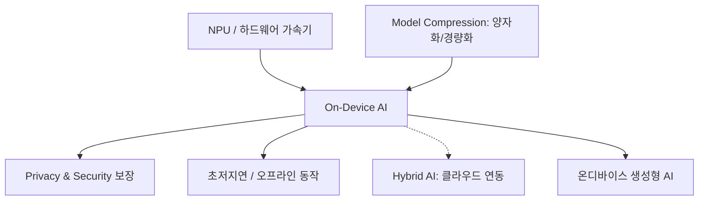

+++
title = "635. 온디바이스 AI (On-Device AI)"
date = "2026-03-14"
weight = 635
+++

> **Insight**
> * 온디바이스 AI(On-Device AI)는 인공지능 모델의 데이터 처리 및 추론 연산을 클라우드 서버가 아닌 스마트폰, 가전, 자동차 등 사용자 단말기(Device)에서 자체적으로 수행하는 기술입니다.
> * 인터넷 연결 없이도 동작하여 극도의 저지연(Ultra-Low Latency)을 제공하며, 개인정보가 기기 밖으로 나가지 않아 보안 및 프라이버시 문제를 원천 해결합니다.
> * 하드웨어(NPU)의 발전과 소프트웨어(모델 경량화 기술)의 결합을 통해 모바일 환경에서도 고도화된 AI 경험을 가능하게 합니다.

## Ⅰ. 온디바이스 AI의 개념 및 등장 배경

### 1. 온디바이스 AI의 정의
온디바이스 AI(On-Device AI)는 딥러닝 기반의 AI 알고리즘을 중앙 클라우드 서버에 의존하지 않고, 데이터를 수집하는 엣지 디바이스(스마트폰, IoT 기기 등) 내부의 자체 칩(NPU)과 메모리만으로 구동시키는 AI 기술 아키텍처입니다.

### 2. 기존 클라우드 AI의 한계와 필요성
* **프라이버시 침해 우려**: 음성 명령, 얼굴 인식, 생체 데이터 등 민감한 데이터가 클라우드 서버로 상시 전송되어 유출 위험이 있었습니다.
* **네트워크 지연(Latency) 및 단절 문제**: 클라우드 통신 과정에서 발생하는 수백 밀리초(ms)의 지연은 자율주행, 실시간 번역 등 즉각적 반응이 필요한 서비스에 치명적이며, 통신 음영 지역에서는 서비스가 중단됩니다.
* **클라우드 운영 비용(OPEX) 증가**: 기기 수가 수십억 대로 늘어나면서 중앙 서버가 모든 연산 트래픽을 감당하는 것은 경제적으로 한계에 도달했습니다.

> 📢 섹션 요약 비유: 온디바이스 AI는 전속 요리사를 집에 두는 것과 같습니다. 예전에는 밥을 먹으려면 매번 식당(클라우드)에 전화를 걸고 배달을 기다려야(지연 시간) 했고 내 입맛 데이터가 남에게 알려졌지만, 이제는 요리사(AI)가 내 폰 안에 있어서 언제든, 인터넷이 끊겨도 내 비밀 레시피를 안전하게 즉시 만들어줍니다.

## Ⅱ. 온디바이스 AI 시스템 아키텍처

### 1. 하드웨어-소프트웨어 통합 구조
온디바이스 AI는 기기 하드웨어와 경량화된 AI 프레임워크가 결합된 구조를 가집니다.

```ascii
+-----------------------------------------------------------+
|                    Application Layer                      |
|      (Face Unlock, Camera AI, On-device Translator)       |
+-----------------------------------------------------------+
|                  AI Framework & API Layer                 |
|       (TensorFlow Lite, PyTorch Mobile, Core ML)          |
|      [ Model Compression (Quantization, Pruning) ]        |
+-----------------------------------------------------------+
|             Hardware Abstraction / OS Layer               |
|            (Android NNAPI, Linux Kernel, HAL)             |
+-----------------------------------------------------------+
|                   Hardware Layer (SoC)                    |
|  +--------+    +--------+    +--------+    +-----------+  |
|  |   CPU  |    |   GPU  |    |  NPU   |    |    DSP    |  |
|  | (Ctrl) |    | (Math) |    | (AI)   |    |(Audio/Img)|  |
|  +--------+    +--------+    +--------+    +-----------+  |
+-----------------------------------------------------------+
```

### 2. 주요 구성 요소 상세
* **하드웨어 가속기 (NPU / DSP / GPU)**: AI 모델의 핵심인 행렬 곱셈을 초저전력으로 고속 처리하는 신경망 처리 장치(NPU)가 모바일 AP(Application Processor) 안에 탑재됩니다.
* **경량화 프레임워크**: 스마트폰에서 가볍게 돌아가도록 최적화된 TensorFlow Lite, PyTorch Mobile, Apple Core ML 등이 모델 실행을 담당합니다.
* **안드로이드 NNAPI (Neural Networks API)**: 앱이 어떤 하드웨어 칩(CPU, GPU, NPU 중)을 사용하여 연산을 처리할지 동적으로 스케줄링하고 분배하는 운영체제 계층입니다.

> 📢 섹션 요약 비유: 이 시스템은 스마트 오케스트라와 같습니다. 악보(AI 모델)를 받아들면, 지휘자(NNAPI)가 상황에 맞춰 빠르고 정밀한 바이올린(NPU)에게 맡길지, 힘 있는 관악기(GPU)에게 맡길지 결정하여 아름다운 음악(결과)을 폰 안에서 완벽하게 연주해냅니다.

## Ⅲ. 온디바이스 AI의 핵심 구현 기술

### 1. 모델 경량화 기술 (Model Compression)
클라우드용 거대 모델을 작은 기기에 우겨넣기 위한 필수 기술입니다.
* **양자화 (Quantization)**: 32비트 실수를 8비트 정수로 변환하여 모델 크기와 메모리 사용량을 1/4로 줄입니다.
* **지식 증류 (Knowledge Distillation)**: 크고 똑똑한 모델(Teacher)의 지식을 작고 가벼운 모델(Student)이 모방하여 학습하게 함으로써, 작은 크기로도 높은 정확도를 유지합니다.

### 2. 하드웨어/소프트웨어 공동 설계 (Co-Design)
* 칩 설계 단계부터 특정 AI 알고리즘의 데이터 흐름에 맞춰 메모리 구조와 연산 유닛 배치를 최적화하여 전력 소모를 극한으로 줄이는 설계 방식입니다.

### 3. 연합 학습 (Federated Learning) 지원
* 기기에서 직접 학습(Training)을 하진 않더라도, 기기에서 발생한 데이터로 모델을 미세 조정(Fine-tuning)하고 그 결과(가중치 업데이트값)만 클라우드로 보내 여러 기기가 협력하여 모델을 발전시키는 기술이 결합됩니다.

> 📢 섹션 요약 비유: 핵심 기술은 여행 가방 싸기의 달인 기술입니다. 엄청 두꺼운 백과사전(원본 모델)을 핵심만 요약한 얇은 수첩(지식 증류)으로 만들고, 글자 크기를 확 줄여(양자화) 작은 스마트폰이라는 핸드백 안에 쏙 집어넣는 마법입니다.

## Ⅳ. 온디바이스 AI 구현 시 고려사항 및 한계점

### 1. 배터리 소모와 발열 문제
* AI 연산은 막대한 배터리를 소모하며 기기 온도를 급격히 올립니다. 이로 인한 스로틀링(Throttling)으로 기기 성능 저하가 발생할 수 있어 전력 관리(Power Management)가 최우선 과제입니다.

### 2. 연산력과 메모리의 한계 (Resource Constraints)
* 아무리 경량화해도 최신 챗GPT 같은 초거대 모델(LLM) 수백 기가바이트를 모바일 기기에 다 넣을 수는 없으므로, 처리할 수 있는 AI 작업의 복잡도와 정확도(Accuracy)에 한계가 존재합니다.

### 3. 모델 업데이트의 파편화
* 클라우드는 한 번 패치하면 모든 사용자에게 적용되지만, 온디바이스 AI는 수천만 대의 단말기에 각각 업데이트 파일을 배포해야 하며 기기 종류별 하드웨어 파편화로 인해 동일한 모델이라도 성능 편차가 발생합니다.

> 📢 섹션 요약 비유: 온디바이스 AI의 한계는 소형 전기차의 엔진과 같습니다. 동네를 혼자 쌩쌩 달리기엔 최고지만, 배터리가 금방 닳고 너무 무거운 짐(초거대 AI 모델)을 실으면 차가 멈추거나 퍼져버리는 제약이 항상 뒤따릅니다.

## Ⅴ. 온디바이스 AI의 발전 동향 및 미래 전망

### 1. 하이브리드 AI (Hybrid AI) 모델 확산
* 온디바이스 단독의 한계를 극복하기 위해, 간단한 연산과 프라이버시 데이터는 폰(On-device)에서 처리하고, 복잡한 초거대 연산은 클라우드로 넘기는 '클라우드-엣지 협력 구조'가 대세가 되고 있습니다.

### 2. 온디바이스 생성형 AI (On-Device Generative AI)
* 단순 인식/분류를 넘어, 파라미터 7B 이하의 소형 언어 모델(sLLM, 예: Llama 3 8B, Gemini Nano)을 스마트폰 자체에 탑재하여 오프라인 상태에서도 문장 요약, 이미지 생성을 수행하는 시대가 열렸습니다.

### 3. AI PC 및 AI 스마트폰의 기본 탑재
* 인텔 코어 Ultra, 스냅드래곤 X 엘리트, 애플 M 시리즈 등 NPU를 기본 탑재한 하드웨어가 표준화되면서, 온디바이스 AI는 선택이 아닌 모든 IT 기기의 기본 스펙(OS 레벨 통합)으로 자리 잡고 있습니다.

> 📢 섹션 요약 비유: 미래의 온디바이스 AI는 아이언맨의 자비스 수트와 같습니다. 수트(스마트폰) 자체에 내장된 작은 두뇌가 내 말을 다 알아듣고 바로바로 기능(생성형 AI)을 만들어내며, 너무 어려운 문제는 기지의 슈퍼컴퓨터(하이브리드)에 살짝 물어봐서 완벽하게 처리해냅니다.

---

### 💡 Knowledge Graph & Child Analogy



> 🧒 **Child Analogy (초등학생을 위한 비유)**
> 옛날 스마트폰은 모르는 걸 물어보면 저 멀리 우주에 있는 도서관(클라우드)에 전화를 걸어서 답을 받아왔어요. 인터넷이 안 터지는 산속에서는 바보가 됐죠. 그런데 온디바이스 AI는 폰 안에 아예 '아주 작고 똑똑한 꼬마 마법사 사전'을 통째로 넣어버린 거예요! 인터넷이 전혀 안 되는 깊은 산속 텐트 안에서도 내 목소리를 바로 알아듣고, 사진을 예쁘게 고쳐주는 마법을 혼자서도 척척 부릴 수 있답니다.