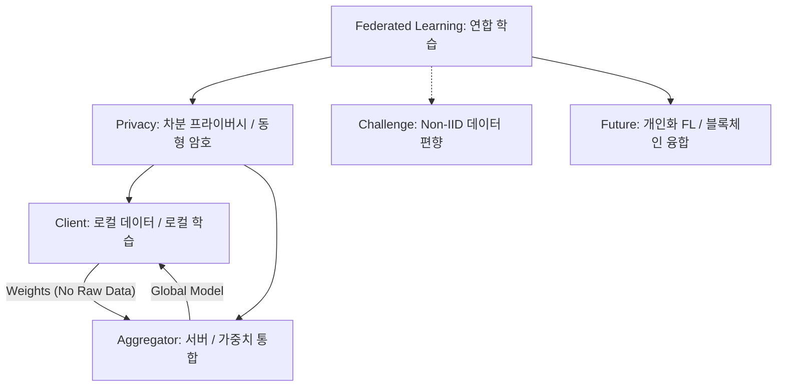

+++
title = "636. 연합 학습 (Federated Learning) 분산 아키텍처"
date = "2026-03-14"
weight = 636
+++

> **Insight**
> * 연합 학습(Federated Learning)은 수많은 로컬 기기(스마트폰, IoT 등)에 저장된 사용자 데이터를 중앙 서버로 보내지 않고, 각 기기에서 개별적으로 AI 모델을 학습시키는 분산형 머신러닝 기법입니다.
> * 기기들은 원본 데이터 대신 학습된 '가중치(Weight) 업데이트 값'만을 중앙 서버와 교환하여, 데이터 프라이버시를 강력하게 보호하면서도 고도화된 글로벌 모델을 구축할 수 있습니다.
> * 구글 키보드(Gboard)의 다음 단어 예측과 같이 민감한 개인정보를 활용해야 하는 의료, 금융, 모바일 AI 분야의 핵심 아키텍처로 주목받고 있습니다.

## Ⅰ. 연합 학습(Federated Learning)의 개념 및 등장 배경

### 1. 연합 학습의 정의
연합 학습(Federated Learning)은 중앙 서버가 데이터를 모아 학습하는 전통적인 방식과 달리, 데이터가 생성되는 말단 디바이스(Client)에서 직접 모델을 학습(Training)하고, 중앙 서버(Aggregator)는 각 디바이스가 보내온 모델의 파라미터(업데이트된 가중치)만을 취합하여 글로벌 모델을 갱신하는 분산 학습 아키텍처입니다.

### 2. 등장 배경 및 필요성
* **프라이버시 규제 강화**: GDPR, HIPAA 등 데이터 보호법의 강화로 인해, 사용자의 민감한 개인정보(사진, 타이핑 기록, 의료 데이터 등)를 중앙 서버로 전송하고 수집하는 것이 법적으로 매우 어려워졌습니다.
* **데이터 사일로(Data Silo) 문제 해결**: 각 병원이나 은행이 가진 데이터를 외부로 반출할 수 없어 AI 학습이 불가능했던 고립된 환경에서, 데이터 공유 없이도 AI 모델을 공동으로 학습할 수 있는 방법론이 필요했습니다.
* **통신 대역폭 비용 절감**: 테라바이트급의 원본 빅데이터를 중앙 서버로 계속 전송하는 막대한 네트워크 비용을 절감하기 위함입니다.

> 📢 섹션 요약 비유: 연합 학습은 각자의 집에서 요리를 연구하는 것과 같습니다. 예전에는 모든 재료(개인 데이터)를 중앙 주방으로 다 가져와서 요리(학습)해야 했다면, 이제는 각자 자기 집 냉장고 재료로 요리를 해보고 '비법 레시피(모델 가중치)'만 중앙 본부에 보내서 최고의 마스터 레시피(글로벌 모델)를 완성하는 것입니다.

## Ⅱ. 연합 학습 분산 아키텍처 및 동작 프로세스

### 1. 연합 학습 아키텍처
크게 로컬 디바이스(Client)와 중앙 취합 서버(Central Server/Aggregator)로 구성됩니다.

```ascii
+-----------------------------------------------------------+
|               Central Server (Aggregator)                 |
|                                                           |
| 1. 글로벌 모델 배포 -> (Initial Global Model)              |
| 4. 글로벌 모델 갱신 <- (Aggregating Weights e.g. FedAvg)   |
+-----------------------------------------------------------+
           /                 |                 \
 (Model)  / (Weight) (Model) | (Weight) (Model) \ (Weight)
         v   ^               v   ^               v   ^
+----------------+  +----------------+  +----------------+
|    Client A    |  |    Client B    |  |    Client C    |
| (Smartphone)   |  |   (Hospital)   |  |   (IoT Car)    |
|                |  |                |  |                |
| [Local Data]   |  | [Local Data]   |  | [Local Data]   |
| 2. 로컬 학습   |  | 2. 로컬 학습   |  | 2. 로컬 학습   |
| 3. 가중치 추출 |  | 3. 가중치 추출 |  | 3. 가중치 추출 |
+----------------+  +----------------+  +----------------+
* 절대 로컬 데이터(Local Data)는 기기 밖으로 나가지 않음.
```

### 2. 핵심 동작 프로세스 4단계
1. **초기화 및 배포 (Initialization)**: 중앙 서버가 초기 AI 글로벌 모델을 여러 클라이언트(스마트폰 등)로 다운로드(전송)합니다.
2. **로컬 학습 (Local Training)**: 각 클라이언트는 자신의 기기에 저장된 개인 데이터(사진, 텍스트 등)를 사용하여 다운받은 모델을 자체적으로 학습시킵니다.
3. **업데이트 전송 (Update Transmission)**: 학습이 끝나면 원본 데이터는 기기에 남겨두고, 변화된 모델의 가중치(Weight Update, 기울기)만을 추출하여 중앙 서버로 암호화하여 전송합니다.
4. **글로벌 통합 (Aggregation)**: 중앙 서버는 수만 대의 기기에서 올라온 가중치들을 모아 평균을 내거나 수학적으로 결합(FedAvg 알고리즘 등)하여 글로벌 모델을 새롭게 똑똑하게 업데이트합니다. 이 과정을 반복합니다.

> 📢 섹션 요약 비유: 이 과정은 전국 시험 출제 위원회와 같습니다. 본부에서 예비 문제집(글로벌 모델)을 나눠주면, 각 지역 학교(기기)가 학생들(로컬 데이터)을 가르쳐보고 어느 부분이 틀렸는지 '오답 노트(가중치)'만 본부로 보냅니다. 본부는 학생 개인 신상(원본 데이터)은 전혀 모른 채 오답 노트만 모아서 더 완벽한 다음 문제집을 만들어냅니다.

## Ⅲ. 연합 학습의 핵심 기술 요소

### 1. FedAvg (Federated Averaging) 알고리즘
* 구글이 제안한 연합 학습의 가장 대표적인 통합 알고리즘으로, 여러 클라이언트가 보내온 가중치(파라미터)들의 평균을 계산하여 새 글로벌 모델 파라미터를 결정하는 수학적 기법입니다.

### 2. 차분 프라이버시 (Differential Privacy)
* 클라이언트가 가중치를 서버로 보낼 때, 가중치 값에 인위적인 수학적 노이즈(Noise)를 섞어서 전송합니다. 이렇게 하면 해커가 가중치를 역추적하여 원본 데이터를 복원해내는 공격(Inversion Attack)을 원천 차단할 수 있습니다.

### 3. 동형 암호 (Homomorphic Encryption)
* 클라이언트가 보낸 가중치를 암호화된 상태 그대로 풀지 않고 수학적 덧셈/평균 연산(통합)을 수행할 수 있게 하는 차세대 암호화 기술로, 서버 관리자조차 가중치의 내용을 볼 수 없게 만듭니다.

> 📢 섹션 요약 비유: 핵심 기술들은 비밀 선거와 같습니다. 투표지(가중치)를 낼 때 누가 썼는지 모르게 살짝 얼룩을 묻히고(차분 프라이버시), 투표함을 열지 않은 채로 기계가 암호가 걸린 표들을 알아서 집계(동형 암호)하여, 절대 개인의 비밀이 새어나가지 않게 합니다.

## Ⅳ. 연합 학습 시스템의 고려사항 및 한계점

### 1. Non-IID 데이터 분포 (데이터 불균형 문제)
* 연합 학습의 가장 큰 난제입니다. 각 기기마다 가지고 있는 데이터의 양과 특징이 완전히 다릅니다(Non-Independent and Identically Distributed). 어떤 폰에는 개 사진만 있고 어떤 폰에는 고양이 사진만 있으면 글로벌 모델이 한쪽으로 편향되거나 수렴(학습 완성)이 매우 느려집니다.

### 2. 통신 오버헤드 (Communication Overhead)
* 수천 번의 라운드(Round) 동안 거대한 AI 모델 파라미터 수백 메가바이트를 수십만 대의 기기와 지속적으로 주고받아야 하므로 막대한 네트워크 트래픽과 통신 불안정(끊김 현상) 문제를 해결해야 합니다.

### 3. 기기 리소스 파편화 (Straggler Problem)
* 참여하는 디바이스들의 배터리, 연산 속도, 네트워크 상태가 제각각입니다. 몇몇 느린 기기(Straggler) 때문에 전체 서버의 통합 과정이 지연되는 병목 현상이 발생합니다.

> 📢 섹션 요약 비유: 연합 학습의 한계는 전국 합창단 연습과 같습니다. 지역마다 부르는 노래 장르가 다르고(Non-IID), 악보를 우편으로 수천 번 주고받아야 해서 오래 걸리며(통신 오버헤드), 몇 명의 박치 단원이 늦게 노래를 부르면 전체 합창(학습)이 지연되는(Straggler) 어려움이 있습니다.

## Ⅴ. 연합 학습의 발전 동향 및 미래 전망

### 1. 개인화된 연합 학습 (Personalized Federated Learning)
* 하나의 공통된 글로벌 모델을 만드는 것을 넘어, 글로벌 모델의 지식은 공유하되 기기별 특성에 맞게 최종 모델을 살짝 변형하여 '나에게 딱 맞는 AI 모델'을 만들어주는 개인화 기술이 각광받고 있습니다.

### 2. 연합 학습과 블록체인의 결합
* 중앙 서버조차 믿을 수 없다는 가정하에, 중앙 서버(Aggregator)를 없애고 블록체인의 스마트 컨트랙트를 통해 기기들끼리(P2P) 안전하고 탈중앙화된 방식으로 가중치를 통합하는 연구(BlockFL)가 활발합니다.

### 3. 의료 및 자율주행 B2B 산업 확산
* 스마트폰 키보드 추천을 넘어, 여러 병원이 환자 데이터 반출 없이 희귀병 진단 AI를 공동 개발하거나, 여러 제조사의 자율주행 자동차가 사고 데이터를 공유 없이 운전 AI를 공동 학습하는 B2B 컨소시엄 형태로 발전하고 있습니다.

> 📢 섹션 요약 비유: 미래의 연합 학습은 블록체인 조합원과 같습니다. 중앙 통제자 없이도 참여자(병원, 자율주행차)들이 서로의 영업 비밀은 완벽히 지키면서 똑똑한 뇌(AI)만 공동으로 복제하여 모두가 윈-윈(Win-Win)하는 거대한 지능형 네트워크 생태계가 될 것입니다.

---

### 💡 Knowledge Graph & Child Analogy



> 🧒 **Child Analogy (초등학생을 위한 비유)**
> 연합 학습은 반 친구들과 함께 '최고의 종이접기 비법'을 만드는 과정이에요. 예전에는 선생님(중앙 서버)이 친구들의 일기장(개인 데이터)을 다 뺏어서 비법을 알아냈다면, 이제는 일기장은 각자 자기 서랍에 꽁꽁 숨겨둬요. 대신 친구들이 집에서 각자 종이를 접어보고 "이쪽 모서리를 접는 게 좋아!"라는 '요령(가중치)'만 선생님한테 적어 내요. 선생님은 이 요령들만 모아서 '초강력 종이접기 교본'을 만들어 반 전체에 나눠주는 거랍니다. 내 비밀 일기장은 안전하게 지키면서도 다 같이 똑똑해지는 마법이에요!