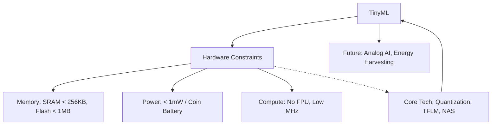

+++
title = "637. TinyML 하드웨어 제약"
date = "2026-03-14"
weight = 637
+++

> **Insight**
> * TinyML(Tiny Machine Learning)은 전력, 메모리, 연산 능력이 극도로 제한된 마이크로컨트롤러(MCU)와 같은 초소형 엣지 디바이스에서 머신러닝 모델을 구동하는 기술 분야입니다.
> * 밀리와트(mW) 이하의 극초저전력과 수 킬로바이트(KB) 수준의 메모리라는 가혹한 하드웨어 제약을 극복하기 위해 모델의 압축과 하드웨어-소프트웨어 공동 설계가 필수적입니다.
> * 배터리 교체 없이 수년간 동작해야 하는 스마트 센서, 웨어러블, 스마트 팩토리의 말단 노드에서 지능형 IoT를 완성하는 핵심 기술로 부상하고 있습니다.

## Ⅰ. TinyML의 개념 및 마이크로컨트롤러(MCU) 환경

### 1. TinyML의 정의
TinyML은 '아주 작은(Tiny)'과 '머신러닝(ML)'의 합성어로, 클라우드나 고성능 스마트폰 프로세서가 아닌 1달러 이하의 저렴하고 리소스가 극도로 제한된 마이크로컨트롤러(MCU)에서 추론(Inference)을 실행하는 기술적 패러다임을 의미합니다.

### 2. TinyML 도입의 필요성
* **물리적 환경의 편재성(Ubiquity)**: 일상생활의 가전기기, 장난감, 공장 밸브 등 수백억 개의 기기에는 고성능 AP가 아닌 저렴한 MCU가 들어가 있습니다. 이 모든 사물에 지능을 부여하기 위해 필요합니다.
* **항상 켜져 있는(Always-On) 감지 기능**: "시리야"와 같은 음성 호출(Wake-word) 인식기나 이상 진동 감지 센서 등은 24시간 감시해야 하므로 배터리 소모를 극한으로 줄여야 합니다.

> 📢 섹션 요약 비유: TinyML은 개미의 뇌를 만드는 작업과 같습니다. 거대한 코끼리 뇌(클라우드 서버)가 할 수 있는 판단력을, 이슬 한 방울의 에너지(초저전력)만 먹고 사는 개미의 아주 작은 머리(MCU) 안에 우겨넣어 개미 스스로 길을 찾게 만드는 마법입니다.

## Ⅱ. TinyML 하드웨어 환경 및 아키텍처 한계

### 1. 전형적인 TinyML 시스템 아키텍처
기본적인 센서 데이터 수집부터 MCU 내의 초소형 추론 엔진까지의 구조입니다.

```ascii
+-----------------------------------------------------------+
|                  TinyML Edge Device (Sensor Node)         |
+-----------------------------------------------------------+
|  +-------------+     +---------------------------------+  |
|  |             | I2C |    Microcontroller Unit (MCU)   |  |
|  |  Sensors    |---->|                                 |  |
|  | (Mic, IMU,  | SPI |  [ ARM Cortex-M0/M4/M7 ]        |  |
|  |  Camera)    |     |                                 |  |
|  +-------------+     |  +---------------------------+  |  |
|                      |  | Flash (ROM): ~1MB (Model) |  |  |
|  +-------------+     |  +---------------------------+  |  |
|  | Power/      |     |  +---------------------------+  |  |
|  | Battery     |---->|  | SRAM: ~256KB (Variables)  |  |  |
|  | (Coin cell) |     |  +---------------------------+  |  |
|  +-------------+     |  +---------------------------+  |  |
|                      |  | TinyML Framework (TFLM)   |  |  |
|                      |  +---------------------------+  |  |
|                      +---------------------------------+  |
+-----------------------------------------------------------+
```

### 2. 결정적인 하드웨어 제약 (Hardware Constraints)
* **메모리(Memory)의 극단적 부족**:
  * **SRAM (수십~수백 KB)**: 연산 중 발생하는 중간 데이터를 저장하기에 턱없이 부족하여 레이어 단위의 메모리 재사용 최적화가 필수적입니다.
  * **Flash (수백 KB ~ 수 MB)**: 신경망 모델의 가중치(Weights)를 저장해야 하지만, 최신 딥러닝 모델 크기의 1/1000 수준의 공간밖에 없습니다.
* **연산 능력(Compute)의 부재**: 부동소수점 연산기(FPU)가 없거나 약한 경우가 많아 정수 연산에 의존해야 하며, 클럭 속도가 수십 MHz에 불과합니다.
* **전력 소모(Power) 제약**: 코인 배터리 하나로 1년 이상 버텨야 하므로 동작 전력이 1밀리와트(1mW) 이하로 제한되어야 합니다.

> 📢 섹션 요약 비유: 하드웨어 제약은 원룸 자취방에서 그랜드 피아노를 치려는 것과 같습니다. 피아노(AI 모델)를 넣을 공간(플래시 메모리)도 부족하고, 연주할 때 팔을 뻗을 공간(SRAM)도 없으며, 전기료(배터리)까지 아껴야 하는 극한의 환경입니다.

## Ⅲ. 하드웨어 제약을 극복하기 위한 TinyML 핵심 기술

### 1. 극단적 모델 압축 및 양자화 (Int8 / Int4 Quantization)
* AI 모델의 가중치를 부동소수점(Float32)에서 8비트, 심지어 4비트 정수(Integer)로 변환합니다. FPU가 없는 MCU 환경에서는 정수 양자화(Integer-only Quantization)가 연산 속도를 기하급수적으로 높이고 메모리를 줄이는 유일한 해법입니다.

### 2. 마이크로 프레임워크 (Micro-Frameworks)
* 수백 MB의 일반적인 TensorFlow 대신, 실행 코드가 수십 KB에 불과한 **TensorFlow Lite for Microcontrollers (TFLM)** 같이 운영체제(OS) 없이 베어메탈(Bare-metal)에서 돌아가는 초경량 추론 엔진을 사용합니다.

### 3. 하드웨어-알고리즘 공동 설계 (Hardware-Aware Neural Architecture Search, NAS)
* 사람이 직접 모델을 짜는 대신, 타겟 MCU의 메모리와 전력 제약 조건을 자동 검색 알고리즘(NAS)에 입력하여 제약 조건을 완벽히 만족하면서 정확도가 가장 높은 최적의 신경망 구조를 컴퓨터가 찾아냅니다.

> 📢 섹션 요약 비유: 기술적 극복 방법은 초소형 텐트 치기 대회와 같습니다. 텐트의 불필요한 장식(가중치)은 모두 잘라내고 폴대를 가장 얇게(양자화) 만든 다음, 설계도(마이크로 프레임워크)를 바닥에 딱 맞게 컴퓨터로 계산하여(NAS) 좁은 공간에 쏙 들어가게 만드는 기술입니다.

## Ⅳ. TinyML 개발 파이프라인 및 생태계의 한계

### 1. 파편화된 MCU 툴체인 (Toolchain Fragmentation)
* 스마트폰은 iOS, Android 두 개로 통일되어 있지만, MCU는 제조사(STMicro, NXP, TI 등)마다 아키텍처와 컴파일러, 디버깅 환경이 수백 가지로 파편화되어 있어 한 번 만든 모델을 다른 칩에 이식하기가 매우 까다롭습니다.

### 2. 센서 데이터 수집의 난해함
* TinyML은 기계의 진동 소리, 공장 라인의 특수 가스 냄새 등 비정형 데이터를 주로 다룹니다. 클라우드에서 쉽게 구할 수 있는 인터넷 이미지 데이터와 달리 현장에서 양질의 훈련 데이터를 수집하고 라벨링하는 작업 자체가 엄청난 장벽입니다.

### 3. 디버깅 및 모니터링의 어려움
* 칩 내부에 OS가 없고 인터페이스가 빈약하므로, 모델이 기기 내부에서 어떤 이유로 오작동을 일으켰는지 내부 상태를 들여다보며 원인을 분석(Troubleshooting)하기가 물리적으로 매우 어렵습니다.

> 📢 섹션 요약 비유: 개발의 어려움은 아마존 정글에서 요리하기와 같습니다. 가스레인지(통일된 개발 툴)도 집집마다 규격이 다르고, 요리할 재료(특수 센서 데이터)를 구하기도 어려우며, 요리가 망쳤을 때 왜 탔는지 확인할 투명 유리창(디버깅 도구)조차 없는 힘든 환경입니다.

## Ⅴ. TinyML의 발전 동향 및 미래 전망

### 1. 아날로그 AI 및 인-메모리 컴퓨팅 (In-Memory Computing) 칩셋
* 기존의 디지털 연산을 넘어서, 센서에서 들어오는 아날로그 신호(전압/전류)를 디지털로 변환(ADC)하지 않고 아날로그 회로 자체에서 바로 행렬 곱셈 연산을 수행하여 전력 소모를 0에 가깝게 만드는 칩이 연구되고 있습니다.

### 2. 에너지 하베스팅 (Energy Harvesting) 결합
* 배터리 교체의 번거로움을 아예 없애기 위해, 주변의 미세한 빛, 온도 차이, 진동 등에서 전기를 스스로 생산(하베스팅)하여 영구적으로 동작하는 배터리리스(Battery-less) TinyML 시스템이 구현되고 있습니다.

### 3. MCU용 온디바이스 학습 (On-Device Learning for MCU)
* 현재 TinyML은 추론(Inference)만 가능하지만, 기기가 설치된 환경(공장 소음 등)에 맞춰 사용자 데이터로 자신의 모델을 조금씩 스스로 재학습(Fine-tuning)하는 경량 학습 알고리즘 연구가 최전선에서 진행 중입니다.

> 📢 섹션 요약 비유: TinyML의 미래는 영원히 죽지 않는 마법의 씨앗과 같습니다. 흙에 심어두면 스스로 햇빛과 바람에서 밥(에너지 하베스팅)을 얻고, 주변 환경을 보면서 스스로 진화(온디바이스 학습)하여 배터리를 갈아줄 필요 없이 영구적으로 똑똑하게 살아 숨 쉬는 센서가 될 것입니다.

---

### 💡 Knowledge Graph & Child Analogy



> 🧒 **Child Analogy (초등학생을 위한 비유)**
> 컴퓨터나 스마트폰이 거대한 백과사전을 통째로 외우는 '대학생 형'이라면, 마이크로컨트롤러(MCU)는 주머니도 작고 밥도 아주 조금밖에 못 먹는 '아기 요정'이에요. TinyML 기술은 이 거대한 백과사전의 핵심만 한 줄로 쫙 요약해서, 아기 요정의 아주 작은 주머니 속에 쏙 넣어주는 마법입니다. 덕분에 요정은 건전지 하나만으로도 1년 내내 잠들지 않고 방안의 온도를 재거나 도둑의 발소리를 알아채는 똑똑한 지킴이가 될 수 있어요!