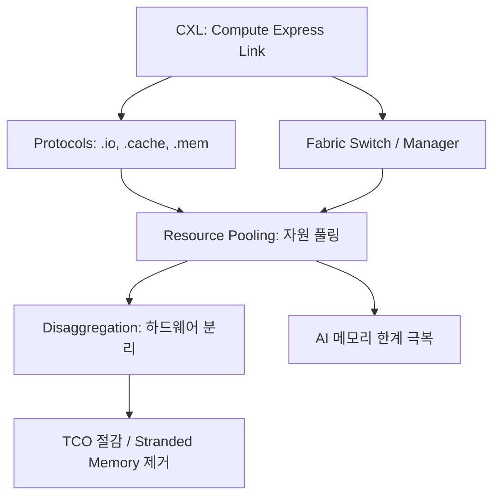

+++
title = "638. 자원 풀링 (Resource Pooling, CXL 기반)"
date = "2026-03-14"
weight = 638
+++

> **Insight**
> * CXL(Compute Express Link) 기반 자원 풀링(Resource Pooling)은 서버 내부에 종속되었던 메모리와 가속기를 외부의 거대한 논리적 풀(Pool)로 분리하고 동적으로 할당하는 차세대 아키텍처입니다.
> * PCIe의 물리적 규격을 활용하면서도 캐시 일관성(Cache Coherency)을 유지하여 메모리 용량 부족과 메모리 장벽(Memory Wall) 문제를 획기적으로 해결합니다.
> * 클라우드 데이터센터에서 유휴 자원(Stranded Memory)을 최소화하여 인프라 구축 비용(TCO)을 극적으로 절감하고 AI 워크로드의 처리량을 극대화합니다.

## Ⅰ. 자원 풀링과 CXL(Compute Express Link)의 등장 배경

### 1. 자원 풀링(Resource Pooling)의 개념
서버의 3대 요소인 CPU, 메모리, 스토리지가 하나의 보드에 단단히 결합되어 있던 구조(Direct Attached)를 해체(Disaggregation)하여, 거대한 '메모리 풀'이나 '가속기 풀'을 만들고 각 CPU가 필요한 순간에 필요한 만큼 네트워크처럼 당겨 쓰는 아키텍처입니다.

### 2. 기존 아키텍처의 한계와 CXL의 필요성
* **Stranded Memory (고립된 유휴 메모리) 문제**: 클라우드 환경에서 어떤 서버는 CPU만 바쁘고 메모리가 텅 비어있고, 어떤 서버는 메모리가 부족해 시스템이 멈춥니다. 서버 간 메모리 공유가 불가능해 낭비되는 메모리 비용이 데이터센터 전체 비용의 절반에 육박합니다.
* **메모리 월(Memory Wall)**: AI 모델이 급격히 커지면서 CPU 패키지에 꽂을 수 있는 DRAM 모듈의 물리적 핀(Pin) 개수와 용량 확장의 한계에 도달했습니다.
* **가속기와의 데이터 병목**: 기존 PCIe로 연결된 GPU 등은 CPU 메모리와 자신의 메모리(HBM)가 분리되어 있어, 데이터 복사(Data Copy) 과정에서 엄청난 지연(Latency)이 발생합니다. 이를 극복할 캐시 일관성 인터페이스가 필요해졌습니다.

> 📢 섹션 요약 비유: 자원 풀링과 CXL은 각자 집(서버)에 개인 우물(메모리)을 파던 방식에서 벗어나, 마을 한가운데 거대한 저수지(풀)를 만들고 초고속 파이프(CXL)를 연결하는 것입니다. 물이 넘치는 집과 모자라는 집의 불균형을 없애고 누구나 수도꼭지만 틀면 물을 쓸 수 있게 합니다.

## Ⅱ. CXL 기반 자원 풀링 아키텍처 및 프로토콜

### 1. CXL 기반 풀링 아키텍처 구성도
CXL 스위치를 중심에 두고 컴퓨팅 노드(CPU)와 메모리 풀(디바이스)이 거미줄처럼 연결되는 구조입니다.

```ascii
+-----------------------------------------------------------+
|                      Cloud Management                     |
|                   (Fabric Manager - API)                  |
+-----------------------------------------------------------+
| +----------+   +----------+   +----------+   +----------+ |
| | CPU Node |   | CPU Node |   | CPU Node |   | CPU Node | |
| | (Host A) |   | (Host B) |   | (Host C) |   | (Host D) | |
| +----+-----+   +----+-----+   +----+-----+   +----+-----+ |
|      | CXL          | CXL          | CXL          | CXL   |
+------|--------------|--------------|--------------|-------+
|      |              |              |              |       |
|  +----------------------------------------------------+   |
|  |                 CXL Fabric Switch                  |   |
|  |       (Dynamic Routing & Resource Allocation)      |   |
|  +----------------------------------------------------+   |
|      |              |              |              |       |
+------|--------------|--------------|--------------|-------+
| +----+-----+   +----+-----+   +----+-----+   +----+-----+ |
| | Memory   |   | Memory   |   | AI Accel |   | SmartNIC | |
| | Expander |   | Pool     |   | (GPU/NPU)|   | (DPU)    | |
| +----------+   +----------+   +----------+   +----------+ |
+-----------------------------------------------------------+
```

### 2. CXL의 3가지 핵심 프로토콜 (CXL Protocols)
물리적인 선(PHY)은 기존 PCIe 규격을 그대로 쓰되, 그 위에서 3가지 다른 언어를 씁니다.
* **CXL.io**: 기존 PCIe와 동일하게 장치 검색, 구성, 인터럽트 등 입출력 제어를 담당합니다.
* **CXL.cache**: 가속기(GPU 등)가 CPU의 캐시(Cache) 메모리에 직접 접근할 수 있게 하여 데이터 복사 없이 일관성(Coherency)을 유지합니다.
* **CXL.mem**: CPU가 외부에 있는 확장 메모리나 메모리 풀(CXL Memory Device)을 마치 자신의 로컬 메인보드에 꽂힌 메인 메모리(DRAM)처럼 지연 없이 직접 읽고 쓸 수 있게 해줍니다.

> 📢 섹션 요약 비유: CXL 프로토콜은 외국인 친구와 일하는 통역기입니다. 일상 대화(CXL.io)도 하고, 내 머릿속 생각(CXL.cache)을 친구가 바로 읽게도 해주고, 내 책상 위 공책(CXL.mem)을 친구가 언제든 같이 쓸 수 있게 텔레파시를 연결해주는 완벽한 협업 시스템입니다.

## Ⅲ. CXL 자원 풀링의 핵심 기술 및 토폴로지

### 1. CXL 패브릭 매니저 (Fabric Manager)
* CXL 스위치에 연결된 수많은 호스트(CPU)와 장치(메모리) 사이의 연결 상태를 모니터링하고, 소프트웨어 명령(API)에 따라 어떤 메모리 모듈을 어느 CPU에 할당할지 동적으로 스위칭하는 두뇌 역할의 소프트웨어입니다.

### 2. MLD (Multi-Logical Device)
* 물리적으로 거대한 하나의 CXL 메모리 모듈(예: 1TB)을 논리적으로 여러 개(예: 16개)로 쪼개어, 여러 대의 CPU가 각자 독립된 메모리로 인식하고 동시에 사용할 수 있게 하는 기술입니다.

### 3. 메모리 계층화 (Memory Tiering)
* 가장 빠르고 비싼 로컬 HBM/DRAM을 최상위 계층(Hot Data)으로 두고, CXL로 연결된 메모리 풀을 중간 계층으로, NVMe 스토리지를 하위 계층(Cold Data)으로 두어 운영체제가 데이터 중요도에 따라 자동으로 위치를 배치하는 기술입니다.

> 📢 섹션 요약 비유: 패브릭 매니저와 MLD 기술은 대형 주차장의 스마트 관리인과 같습니다. 커다란 공용 주차장(메모리 풀)을 구역별로 쪼개어(MLD), A회사 직원과 B회사 직원이 출근할 때마다 남는 자리를 실시간으로 배정해주어(패브릭 매니저) 빈 주차 공간(Stranded Memory)이 없게 만듭니다.

## Ⅳ. 자원 풀링 구현 시 고려사항 및 한계점

### 1. 지연 시간(Latency)의 불가피한 증가
* 물리적인 스위치를 거치고 케이블을 타고 이동해야 하므로, 메인보드에 직접 꽂힌 로컬 DRAM보다는 당연히 지연 시간(수십~수백 나노초 추가)이 발생합니다. 따라서 지연에 극도로 민감한 워크로드 배치에는 주의가 필요합니다.

### 2. 보안(Security) 및 장애 도메인 전파
* 여러 서버가 거대한 메모리 풀을 공유하기 때문에, 스위치 오류나 한 서버의 해킹/메모리 침범 버그가 전체 클러스터로 퍼져나가는 장애 전파(Blast Radius) 문제가 커집니다. 하드웨어적 격리(Isolation)가 중요합니다.

### 3. 생태계와 표준화(CXL 2.0 / 3.0) 과도기
* 기술 표준이 빠르게 진화(CXL 1.1 -> 2.0 스위칭 -> 3.0 패브릭)하고 있어, 인텔, AMD의 CPU 지원 여부와 메모리 제조사(삼성, SK하이닉스)의 규격 호환성 검증 등 생태계 성숙까지 시간이 필요합니다.

> 📢 섹션 요약 비유: 풀링의 한계는 수도 배관망의 단점과 같습니다. 파이프가 길어지니 물 나오는 데 약간의 시간(지연)이 더 걸리고, 중앙 배관망이 오염되면(장애 전파) 마을 전체가 오염된 물을 마시게 되는 위험이 있어서 정밀한 차단 밸브(보안)가 생명입니다.

## Ⅴ. 자원 풀링의 발전 동향 및 미래 전망

### 1. 랙 스케일(Rack-Scale) 아키텍처로의 진화
* 단일 서버를 넘어, 서버 랙(Rack) 전체가 마치 하나의 거대한 컴퓨터(메모리 구역, 연산 구역, 스토리지 구역이 분리된)처럼 동작하는 진정한 의미의 '조립형 인프라(Composable Infrastructure)'의 핵심 기반 기술이 되고 있습니다.

### 2. AI 메모리 월 돌파 (PIM과의 융합)
* 단순히 용량만 늘리는 메모리 확장을 넘어, CXL 메모리 모듈 자체에 연산 기능(PIM/PNM)을 집어넣어, CPU로 데이터를 가져오기 전에 메모리 풀 안에서 데이터 전처리를 끝내버리는 스마트 메모리 풀로 진화하고 있습니다.

### 3. 스위치 토폴로지의 다단화 (CXL 3.0+)
* 스위치 여러 대를 계층형(Tree)이나 링(Ring) 구조로 엮어, 수천 대의 노드가 페타바이트(PB) 급의 메모리를 공유하는 초거대 스케일 아웃(Scale-out) 패브릭 아키텍처가 실현될 것입니다.

> 📢 섹션 요약 비유: 미래의 자원 풀링은 레고 블록으로 만든 초거대 로봇과 같습니다. 예전에는 100개의 작은 로봇(서버)이 각자 싸웠다면, 이제는 부품을 모두 떼어내 거대한 팔(가속기), 거대한 몸통(메모리)을 가진 하나의 초거대 로봇(랙 스케일 아키텍처)으로 합체하여 상상할 수 없는 괴력을 발휘하게 됩니다.

---

### 💡 Knowledge Graph & Child Analogy



> 🧒 **Child Analogy (초등학생을 위한 비유)**
> 옛날에는 컴퓨터들이 각자 자기 필통(메모리)에만 연필을 담아두고 공부했어요. 어떤 애는 연필이 10자루나 남는데 안 빌려주고, 어떤 애는 연필이 없어서 시험을 못 봤죠. CXL 자원 풀링은 교실 한가운데에 아주 커다란 '마법의 공용 필통'을 놓는 거예요! 그리고 아이들 책상에 보이지 않는 초고속 파이프(CXL)를 연결해둬서, 연필이 필요한 순간 0.0001초 만에 파이프를 타고 슝~ 하고 연필이 책상 위로 나타나게 해준답니다. 더 이상 연필이 모자라 우는 친구가 없겠죠?