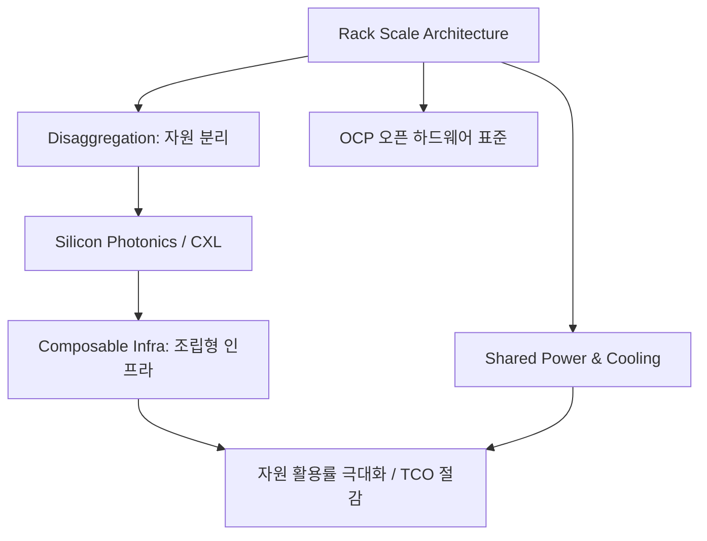

+++
title = "639. 랙 스케일 아키텍처 (Rack Scale Architecture)"
date = "2026-03-14"
weight = 639
+++

> **Insight**
> * 랙 스케일 아키텍처(Rack Scale Architecture, RSA)는 데이터센터의 서버 단위 기준을 개별 컴퓨터 장비(1U, 2U 서버)에서 커다란 서버 랙(Rack) 전체로 확장하여, 하나의 랙을 거대한 단일 컴퓨팅 시스템처럼 취급하는 설계 사상입니다.
> * 컴퓨팅(CPU), 메모리, 스토리지를 물리적으로 분리(Disaggregation)한 뒤 초고속 광통신망으로 연결하고, 소프트웨어를 통해 워크로드에 맞춰 자원을 동적으로 재조립(Composable)합니다.
> * 자원 활용률을 극대화하고 냉각 비용을 절감하여, 하이퍼스케일 클라우드 제공자(CSP)의 미래 인프라 혁신을 이끄는 핵심 아키텍처입니다.

## Ⅰ. 랙 스케일 아키텍처(RSA)의 개념 및 등장 배경

### 1. 랙 스케일 아키텍처의 정의
랙 스케일 아키텍처는 개별 서버 메인보드에 CPU, 메모리, 스토리지가 종속된 기존 구조를 해체하여, 컴퓨팅 모듈(Sled), 스토리지 모듈 등 자원별로 물리적으로 나누어 랙에 장착하고, 이를 고속 네트워크 인터페이스로 엮어 소프트웨어 정의 기반으로 자원을 풀링(Pooling)하는 아키텍처입니다. (인텔이 주도한 Intel RSA/RSD가 대표적)

### 2. 기존 랙 구조의 한계와 필요성
* **자원 파편화(Stranded Capacity)**: 서버 1은 CPU가 100%인데 스토리지가 텅 비고, 서버 2는 스토리지 100%인데 CPU가 노는 식의 극심한 자원 낭비가 발생했습니다.
* **업그레이드 비효율성**: CPU만 최신으로 바꾸고 싶어도, 기존에는 서버 장비를 통째로 교체(Rip and Replace)해야 해서 불필요한 메인보드, 팬, 전원 장치 비용이 낭비되었습니다.
* **전력 및 쿨링의 한계**: 수십 대의 서버가 각자 전원 장치(PSU)와 냉각 팬을 가지는 구조는 데이터센터의 전력(PUE) 효율을 치명적으로 떨어뜨렸습니다.

> 📢 섹션 요약 비유: 기존 서버가 '일체형 노트북'이라면, RSA는 '초거대 조립 PC'입니다. 노트북은 메모리만 고장나도 버리거나 뜯기 힘들지만, 조립 PC는 하나의 거대한 케이스(랙) 안에 CPU 칸, 하드디스크 칸, 메모리 칸을 따로 두고 필요할 때마다 부품만 쓱 빼서 업그레이드할 수 있어 낭비가 전혀 없습니다.

## Ⅱ. 랙 스케일 아키텍처의 핵심 구성 요소

### 1. RSA 시스템 아키텍처 구성도
자원들이 랙 내에서 Sled(서랍형 모듈) 형태로 물리적으로 분리되고 중앙 집중형 전원/냉각을 공유합니다.

```ascii
+-----------------------------------------------------------+
|               Rack Management Module (RMM)                |
|       (POD Manager, Resource Orchestration API - Redfish) |
+-----------------------------------------------------------+
|                 Top of Rack (ToR) Switch                  |
|          (Optical Fabric / Silicon Photonics)             |
+-----------------------------------------------------------+
|  [ Compute Sleds ]   |   [ Memory Sleds ] (CXL Pool)      |
|  CPU + 최소 메모리     |   거대한 DRAM / SCM 묶음             |
+-----------------------------------------------------------+
|  [ Storage Sleds ]   |   [ Accelerator Sleds ]            |
|  NVMe SSD Pool       |   GPU / NPU Pool                   |
+-----------------------------------------------------------+
|        Shared Power Supply & Cooling Zone (Fans/Liquid)   |
|            (중앙 집중식 전력 버스바 및 냉각 시스템)             |
+-----------------------------------------------------------+
```

### 2. 주요 구성 요소 상세
* **디스어그리게이티드 자원 슬레드 (Disaggregated Sleds)**: CPU, 스토리지, 가속기 등 목적별로 특화된 얇은 서랍형 보드입니다. 메인보드 껍데기 없이 자원만 고집적도로 담겨 있습니다.
* **랙 관리자 (Rack Manager, POD Manager)**: 랙 전체의 자원 현황을 파악하고, 상위 오케스트레이션(Cloud OS)의 명령을 받아 분산된 자원들을 논리적인 가상 서버로 조립(Compose)해줍니다.
* **공유 전력 및 냉각 (Shared Infrastructure)**: 랙 하단에 거대한 전원 공급 장치와 쿨링 팬을 통합 배치하여 전체 슬레드가 이를 공유함으로써 전력 효율(Power Usage Effectiveness)을 극대화합니다.

> 📢 섹션 요약 비유: 이 구조는 커다란 호텔(랙)과 같습니다. 각 방(서버)마다 작은 냉장고와 에어컨을 따로 두는 대신, 호텔 전체를 책임지는 거대한 중앙 에어컨(공유 냉각)과 대형 주방(스토리지 풀)을 두고 중앙 서비스(랙 관리자)가 고객(워크로드)이 원하는 것을 즉시 배달해주는 효율적인 시스템입니다.

## Ⅲ. RSA를 실현하는 핵심 기술 (Enabling Technologies)

### 1. 실리콘 포토닉스 (Silicon Photonics, 광 연결)
* 구리선(PCIe 등)은 길이가 길어지면 신호가 끊기고 속도가 느려집니다. 랙 내의 분리된 자원들을 마치 메인보드에 꽂혀 있는 것처럼 지연 없이 연결하기 위해, 반도체 칩 안에 빛(레이저)으로 데이터를 주고받는 초고속 광통신 기술이 필수적입니다.

### 2. 조립형 인프라스트럭처 (Composable Infrastructure)
* 소프트웨어 명령(API) 한 번에 CPU 슬레드 1개, 메모리 슬레드 2개, GPU 슬레드 4개를 네트워크를 통해 묶어 하나의 '논리적 베어메탈 서버'를 1초 만에 창조해 내는 소프트웨어 기술입니다.

### 3. Redfish API 표준
* 기존의 복잡한 서버 관리 프로토콜(IPMI) 대신, 최신 웹 프로토콜(RESTful API) 기반으로 수많은 랙과 장비를 표준화된 방식으로 원격 제어하고 모니터링하기 위한 오픈 산업 표준 기술입니다.

> 📢 섹션 요약 비유: 핵심 기술들은 빛의 속도로 움직이는 로봇 팔과 같습니다. 컴퓨터 명령(API)이 떨어지면, 빛으로 된 보이지 않는 선(실리콘 포토닉스)이 서랍장(랙) 여기저기에 있는 부품을 순식간에 연결하여 내 눈앞에 완벽한 맞춤형 컴퓨터(조립형 인프라)를 마법처럼 뚝딱 만들어냅니다.

## Ⅳ. RSA 도입 시 고려사항 및 한계점

### 1. 높은 초기 도입 비용 및 인프라 전면 교체 부담
* 기존의 표준 19인치 서버 랙 환경을 완전히 뜯어고치고 전용 백플레인과 랙 장비를 새로 도입해야 하므로, 초기 투자 비용(CAPEX)이 막대하여 거대 클라우드 기업(CSP)이 아니면 도입이 어렵습니다.

### 2. 초고속 인터커넥트 패브릭의 지연 시간(Latency) 이슈
* 아무리 광통신을 쓰더라도, 물리적 CPU 핀에 꽂혀 있던 램(DRAM)을 외부 네트워크 너머로 빼놓았기 때문에 발생하는 나노초 단위의 네트워크 홉(Hop) 지연은 여전히 민감한 데이터베이스 환경에서는 병목이 될 수 있습니다.

### 3. 단일 장애점 (Single Point of Failure) 위험
* 랙 전체가 하나의 전원 장치나 하나의 랙 관리자 모듈을 공유하기 때문에, 이 중앙 장비가 고장 나면 랙 하나(수십 대의 서버 분량)가 통째로 다운되는 막대한 장애 전파 위험(Blast Radius)을 가집니다.

> 📢 섹션 요약 비유: RSA의 한계는 최첨단 중앙 통제식 아파트를 짓는 것과 같습니다. 지을 때 돈이 너무 많이 들고, 만약 아파트의 중앙 전기실이 고장 나버리면 모든 세대의 불이 한꺼번에 다 꺼져버리는 무시무시한 대형 사고(단일 장애점)를 대비해야만 합니다.

## Ⅴ. 랙 스케일 아키텍처의 발전 동향 및 미래 전망

### 1. CXL 3.0 토폴로지와의 완벽한 융합
* 메모리와 가속기를 네트워크처럼 묶어주는 CXL 프로토콜이 랙 스케일 아키텍처의 논리적 핏줄 역할을 완벽히 대체하면서, 진정한 의미의 메모리 디스어그리게이션(Memory Disaggregation)이 랙 단위에서 완성되고 있습니다.

### 2. 액침 냉각 (Immersion Cooling) 및 수랭 시스템 도입
* 초고집적 랙은 팬으로 열을 식히는 공랭식(Air Cooling)의 한계를 초과했습니다. 따라서 랙 전체를 특수 냉각유에 담그거나(액침 냉각), 칩에 직접 물이 흐르는 관을 연결하는 고밀도 쿨링 랙이 표준이 되고 있습니다.

### 3. 데이터센터가 곧 하나의 컴퓨터 (Data Center as a Computer)
* 랙 스케일을 넘어 수십 개의 랙(Pod 단위)을 다시 광통신으로 묶어, 수십만 개의 코어와 페타바이트급 메모리를 가진 거대한 '클라우드 슈퍼컴퓨터' 하나로 동작하게 만드는 아키텍처의 궁극적 진화 방향입니다.

> 📢 섹션 요약 비유: 랙 스케일의 미래는 영화 속 거대한 우주선과 같습니다. 작은 셔틀(개별 서버)들이 각자 날아다니는 것이 아니라, 서로가 레고처럼 철컥철컥 결합하여 하나의 초거대 모함(랙 스케일 인프라)이 되어 상상 초월의 파워와 인공지능 연산을 처리하며 우주(클라우드)를 항해합니다.

---

### 💡 Knowledge Graph & Child Analogy



> 🧒 **Child Analogy (초등학생을 위한 비유)**
> 보통 컴퓨터는 잘 포장된 '종합선물세트' 과자 상자예요. 내가 초콜릿(메모리)만 더 먹고 싶어도, 사탕(CPU)까지 다 들어있는 상자를 비싸게 새로 통째로 사야만 하죠. 랙 스케일 아키텍처는 슈퍼마켓의 '거대한 뷔페 진열대'와 같아요! 초콜릿 칸, 사탕 칸, 젤리 칸이 따로따로 어마어마하게 쌓여 있어서, 내가 언제든 원하는 간식만 쏙쏙 접시(소프트웨어 명령)에 담아서 나만의 맞춤형 세트를 만들어 먹을 수 있는 최고의 마법 진열장이랍니다!