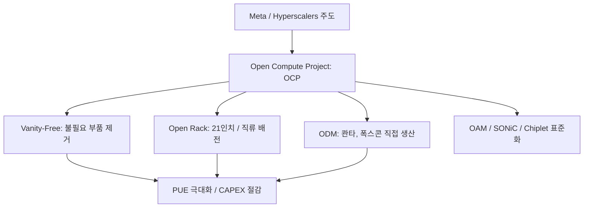

+++
title = "640. 오픈 컴퓨트 프로젝트 (OCP, Open Compute Project)"
date = "2026-03-14"
weight = 640
+++

> **Insight**
> * OCP(Open Compute Project)는 메타(Meta, 구 Facebook)가 주도하여 시작한 이니셔티브로, 하이퍼스케일 데이터센터를 위한 개방형 하드웨어 설계 도면과 규격을 공유하는 글로벌 오픈소스 프로젝트입니다.
> * 불필요한 장식(Bezel)과 부품(VGA 포트 등)을 제거한 베어본(Barebone) 설계로 서버 비용을 낮추고, 12V/48V 직류 배전과 중앙 냉각을 통해 전력 에너지 효율을 극대화합니다.
> * 오픈소스 소프트웨어(Linux)가 IT 산업을 바꾼 것처럼, 서버, 스토리지, 랙 아키텍처의 하드웨어 독점을 타파하고 범용화(Commoditization)를 이끄는 거대한 생태계 혁신입니다.

## Ⅰ. OCP(Open Compute Project)의 개념 및 등장 배경

### 1. OCP의 정의
OCP(Open Compute Project)는 가장 효율적이고 경제적인 데이터센터 서버, 스토리지, 네트워크 스위치, 랙(Rack) 구조 등의 하드웨어 설계도를 누구나 무료로 열람, 사용, 기여할 수 있도록 오픈소스로 공개하는 프로젝트 및 비영리 재단입니다. (2011년 페이스북이 설립)

### 2. 등장 배경 및 필요성
* **폭발적인 스케일 아웃(Scale-out) 비용 부담**: 페이스북, 구글 등은 수십만 대의 서버가 필요했지만, HP, 델, IBM 등 기존 브랜드 서버(OEM) 장비를 구매하는 것은 비용상 감당이 불가능했습니다.
* **불필요한 기능(Vanity Free)의 제거**: 기존 상용 서버는 데이터센터에 전혀 필요 없는 화려한 플라스틱 베젤, 개별 VGA/USB 포트, 과도한 예비 부품을 달고 있어 가격과 전력 소모만 높였습니다.
* **전력 효율(PUE)의 극대화**: 수십만 대의 서버에서 발생하는 1%의 전력 손실도 수백억 원의 비용으로 직결되므로, 기존 교류(AC) 어댑터를 매번 거치는 비효율을 랙 단위 직류(DC) 배전으로 혁신해야 했습니다.

> 📢 섹션 요약 비유: OCP는 하드웨어계의 '백종원 레시피'입니다. 비싼 프랜차이즈 식당(브랜드 서버) 메뉴 대신, 누구나 집에서 싸고 맛있게 똑같이 만들 수 있도록 원가 절감의 비법 레시피(설계도)를 인터넷에 무료로 다 공개해버린 것입니다.

## Ⅱ. OCP 아키텍처 및 핵심 하드웨어 규격

### 1. OCP 서버 및 랙 아키텍처 특징
전통적인 19인치 랙 규격을 버리고, 서버 본체의 껍데기를 모두 벗겨낸 혁신적인 구조를 채택했습니다.

```ascii
+-----------------------------------------------------------+
|                   OCP Open Rack Architecture              |
+-----------------------------------------------------------+
|                                  [ Busbar ] (후면 전력선)    |
|  +----------------------------+      |                    |
|  |  Battery Backup Unit (BBU) |------| 중앙집중형 배터리       |
|  +----------------------------+      |                    |
|  +----------------------------+      |                    |
|  |  Power Supply Unit (PSU)   |------| 랙 통합 전원 공급 장치   |
|  |  (AC to DC 12V or 48V)     |      |                    |
|  +----------------------------+      |                    |
|                                      |                    |
|  +----------------------------+      |    21인치 광폭 섀시   |
|  | [ Compute Node (Vanilla) ] |<-----+-- (3개 노드 병렬배치) |
|  | (No Bezel, No VGA, No Case)|      |                    |
|  +----------------------------+      |                    |
|  +----------------------------+      |                    |
|  | [ Storage Node (JBOD) ]    |<-----+-- (거대 팬 쿨링)      |
|  +----------------------------+      |                    |
+-----------------------------------------------------------+
```

### 2. 주요 아키텍처 혁신 요소 상세
* **오픈 랙 (Open Rack)**: 기존 19인치 표준 폭을 21인치로 넓혀 쿨링 팬의 크기를 키웠습니다(팬이 클수록 천천히 돌아도 바람이 세어 전력이 절감됨).
* **바닐라 보드 (Vanity-Free Design)**: 로고 베젤, 페인트칠, 불필요한 나사, 포트들을 모두 제거한 순수한 메인보드 형태(베어본)로 무게와 원가를 극적으로 줄였습니다.
* **랙 통합 전원 공급 (Centralized Power Shelf)**: 서버마다 달려있던 무거운 파워 서플라이를 없애고, 랙 전체가 하나의 큰 파워(PSU)를 쓴 뒤 뒷면의 구리 기둥(Busbar)을 통해 직류(DC 12V/48V) 전기를 노드에 직접 공급하여 교류-직류 변환 손실을 최소화했습니다.

> 📢 섹션 요약 비유: OCP 구조는 화려한 포장지를 벗겨낸 '알뜰폰'과 '벌크형 과자' 같습니다. 겉모습의 화려함(베젤, 나사)을 다 버리고 진짜 먹을 내용물(CPU, 메모리)만 커다란 박스(21인치 랙)에 꽉 채워 넣어 가성비와 실속을 끝판왕 수준으로 올렸습니다.

## Ⅲ. OCP의 핵심 파생 프로젝트 및 기술

### 1. OAI (Open Accelerator Infrastructure) 및 OAM
* 엔비디아(Nvidia)의 독자 규격에서 벗어나기 위해, 구글, 메타, AMD 등이 연합하여 AI 가속기(GPU/NPU)를 꽂는 하드웨어 폼팩터 모듈 규격인 **OAM(OCP Accelerator Module)**을 표준화했습니다.

### 2. 소닉 (SONiC, Software for Open Networking in the Cloud)
* 마이크로소프트가 OCP에 기여한 오픈소스 네트워크 운영체제입니다. OCP 규격을 맞춘 화이트박스 스위치 하드웨어 위에 SONiC을 올려서 값비싼 시스코 장비를 완벽히 대체합니다.

### 3. 액침 냉각 (Immersion Cooling) 표준화
* AI GPU의 발열량이 1000W를 넘어가자 공랭식의 한계를 극복하기 위해, OCP 재단 차원에서 장비를 비전도성 액체에 담가 식히는 액침 냉각 랙(Rack) 표준 규격을 제정하고 있습니다.

> 📢 섹션 요약 비유: 파생 기술들은 '레고 블록의 표준 설명서'와 같습니다. 예전에는 회사마다 레고 블록 구멍 크기가 달라 호환이 안 됐지만, OCP가 구멍 크기(OAM)와 조립 방법(SONiC)의 세계 표준을 정해버려서 누구나 싼 부품을 사서 호환성 걱정 없이 조립할 수 있게 되었습니다.

## Ⅳ. OCP 도입 시 고려사항 및 한계점

### 1. 생태계 종속성 및 공급망 관리 (Supply Chain)
* 완성품을 파는 델이나 HP를 거치지 않고 대만이나 중국의 제조업체(ODM - 콴타, 폭스콘 등)로부터 대량의 부품을 직접 수입해야 하므로, 물류 및 글로벌 공급망(SCM) 관리 능력이 없는 기업은 도입이 불가능합니다.

### 2. 데이터센터 물리적 인프라 호환성
* OCP 랙은 21인치로 기존 19인치 표준 랙과 물리적 크기가 맞지 않으며, 무게도 훨씬 무겁고 48V 직류 배전을 요구합니다. 따라서 일반적인 레거시(Legacy) 데이터센터 건물에는 물리적으로 욱여넣을 수 없습니다.

### 3. 기술 지원(Technical Support)의 부재
* 벤더가 "장비 보증"을 해주지 않습니다. 고장이 나면 랙을 뜯고 부품을 교체하는 모든 과정을 자사의 데이터센터 엔지니어들이 직접 100% 자체 해결해야 하는 강력한 하드웨어 기술력이 요구됩니다.

> 📢 섹션 요약 비유: OCP의 한계는 이케아(IKEA) 가구를 사는 것과 똑같습니다. 가격은 엄청 싸지만 배달, 조립, 수리까지 내 손으로 직접 해야 하고, 만약 이케아 가구가 우리 집 문을 통과하기엔 너무 크다면(물리적 인프라 호환성) 집을 고쳐야 하는 딜레마에 빠지게 됩니다.

## Ⅴ. OCP의 발전 동향 및 미래 전망

### 1. 하이퍼스케일러를 넘어 통신 및 엣지로의 확장
* 초기에는 메타, 구글 같은 초대형 클라우드 기업 전유물이었으나, 최근에는 5G 통신사(Telco OCP)와 분산된 엣지 컴퓨팅(Open Edge) 환경에 맞춘 소형 OCP 폼팩터가 개발되며 적용 범위를 넓히고 있습니다.

### 2. 칩렛 (Chiplet) 생태계 표준화 (BoW, UCIe)
* OCP는 랙 단위를 넘어, 반도체 칩 내부의 작은 조각(Chiplet)들을 서로 연결하는 초미세 패키징 통신 규격(Bunch of Wires)까지 오픈소스 표준으로 제정하며 반도체 설계까지 혁신하고 있습니다.

### 3. 지속 가능성 (Sustainability) 및 순환 경제
* 탄소 중립 시대를 맞아, 사용 연한이 끝난 OCP 서버를 버리지 않고 메인보드에서 CPU만 쉽게 떼어 재활용(Upcycling)할 수 있는 모듈러 디자인과 친환경 소재 적용 지침이 핵심 트렌드로 부상하고 있습니다.

> 📢 섹션 요약 비유: OCP의 미래는 전 세계를 하나로 묶는 '오픈소스 하드웨어 혁명'입니다. 처음에는 거인들(거대 클라우드)만 쓰던 비밀 무기가 이제는 작은 마을(엣지), 심지어 아주 작은 모래알(반도체 칩셋) 단위까지 내려와 누구나 평등하고 저렴하게 최고 기술을 누리는 세상으로 나아가고 있습니다.

---

### 💡 Knowledge Graph & Child Analogy



> 🧒 **Child Analogy (초등학생을 위한 비유)**
> 옛날에는 자동차를 탈 때 무조건 비싼 '벤츠'나 'BMW' 같은 브랜드 완성차만 통째로 사야 했어요. 고장 나면 부품 하나만 바꾸는 것도 엄청 비쌌죠. 그런데 OCP라는 착한 아저씨들이 "야, 그냥 굴러가기만 하면 되잖아! 겉멋 든 외관이나 무거운 에어컨 떼버리고 제일 가볍고 빠른 자동차 만드는 '비밀 설계도'를 전 세계에 공짜로 뿌리자!"라고 한 거예요. 그래서 이제 누구나 그 도면만 보고 싼 부품을 사서 '최고 성능의 슈퍼 조립 자동차'를 마음껏 뚝딱뚝딱 만들어 탈 수 있게 된 거랍니다!