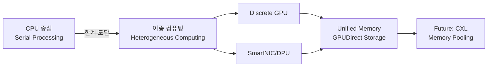

+++
title = "645. 데이터 파이프라인 (Data Pipeline) 가속"
date = "2026-03-14"
weight = 645
+++

### # [데이터 파이프라인(Data Pipeline) 가속]
#### 핵심 인사이트 (3줄 요약)
> 1. **본질**: 페타바이트(PB)급 데이터 처리 과정에서 발생하는 CPU 연산 병목과 I/O 복사 오버헤드를 제거하기 위해, 전용 하드웨어(GPU/FPGA/DPU) 오프로딩과 Direct I/O 기술을 적용하는 **컴퓨팅 패러다임의 전환**입니다.
> 2. **가치**: ETL(Extract, Transform, Load) 배치 시간을 획기적으로 단축(최대 100배 이상)하여 **Time-to-Insight**를 실시간(Real-time) 수준으로 향상시키며, **TCO(Total Cost of Ownership)** 절감 효과를 거둡니다.
> 3. **융합**: 네트워크(RoCE), 스토리지(NVMe), 컴퓨팅(GPU) 경계를 허무는 **CXL(Compute Express Link)** 기반의 **Data-Centric Architecture**와 **Zero-copy** 데이터 포맷(Apache Arrow)이 결합된 풀 스택 최적화가 필수적입니다.

---

### Ⅰ. 개요 (Context & Background) - 병 진단과 패러다임 시프트

#### 1. 개념 및 철학
데이터 파이프라인 가속은 단순히 하드웨어 사양을 높이는 것이 아니라, 데이터가 생성되어 소비되기까지의 **여정(Journey)에서 발생하는 불필요한 정거장(Context Switch, Memory Copy)을 제거**하는 것에 집중합니다. 전통적인 범용 CPU(Central Processing Unit)는 복잡한 분기 처리(Control Logic)에 강하지만, 대용량 데이터를 처리하는 단순 반복 연산(SIMD)과 대규모 I/O 처리에는 비효율적입니다. 이를 해결하기 위해 데이터 흐름 경로상의 연산을 **특수 목적 가속기(Hardware Accelerator)**로 위임(Offloading)하고, 장치 간 데이터 이동을 **직접 접근(Direct Access)** 방식으로 최적화하는 기술적 접근입니다.

#### 2. 등장 배경: 폰 노이만 병목(Von Neumann Bottleneck)의 극복
데이터 처리 속도는 트랜지스터 집적도에 따라 발전했으나, 메모리와 스토리지의 데이터 전송 속도는 이를 따라가지 못해 **메모리 벽(Memory Wall)**이 형성되었습니다. 특히 AI 및 빅데이터 시대로 오며 데이터 양은 폭증했지만, 파이프라인 처리 과정에서 데이터를 '복사하고(Copy)', '직렬화하고(Serialize)', '이동하는(Move)' I/O 오버헤드가 실제 연산 시간을 압도하게 되었습니다. 이러한 **I/O Bound** 문제를 해결하기 위해 연산 장치와 주변 장치 간의 데이터 경로를 재설계하는 **Architecture Redesign**이 필수불가결해졌습니다.

#### 3. 아키텍처 진화 과정



#### 4. 비유
마치 식당 주방에서 요리사(CPU) 혼자서 재료 손질(ETL), 조리(연산), 그릇 세척(I/O 처리)을 모두 도맡아 하는 구조였습니다. 이를 손님(데이터)이 몰리면 주방이 멈추는 문제를 해결하기 위해, 재료 손질 기계(GPU)와 설거지 담당 직원(DPU)을 고용하여 요리사가 '오직 맛있는 요리(비즈니스 로직)'에만 집중하도록 직무 분담을 확실하게 하는 시스템 재설계와 같습니다.

> **📢 섹션 요약 비유**: 데이터 파이프라인 가속은 엄청난 양의 밀가루(데이터)를 빵(인사이트)으로 만드는 대형 공장에서, 밀가루를 창고에서 오븐으로 나르는 과정(I/O)에 로봇 팔(Direct I/O)과 컨베이어 벨트(Accelerator)를 도입하여, 요리사(CPU)가 멈추지 않고 계속 요리만 할 수 있게 하는 '하이퍼 레스토(Hyper-loop)' 물류 시스템을 구축하는 것입니다.

---

### Ⅱ. 아키텍처 및 핵심 원리 (Deep Dive) - 하드웨어 오프로딩과 데이터 경로

#### 1. 핵심 구성 요소 (Components)

| 요소명 | 전체 명칭 | 역할 | 내부 동작 메커니즘 | 연관 프로토콜/기술 | 비유 |
|:---|:---|:---|:---|:---|:---|
| **GPU** | Graphics Processing Unit | 대규모 병렬 연산 가속 | 수천 개의 코어가 SIMD(Single Instruction Multiple Data) 방식으로 동시에 데이터 블록 처리 | CUDA, OpenCL, RAPIDS | 수천 명의 일꾼이 나란히 서서 짐을 나르는 인부 대열 |
| **DPU** | Data Processing Unit | 인프라/네트워크 오프로딩 | 네트워크 패킷 수신부터 암호화/압축 해제까지 CPU 개입 없이 하드웨어 처리 | DPDK, DOCA, VirtIO | 택배 분류 센터의 자동화된 소터(Sorter) |
| **SmartNIC** | Smart Network Interface Card | I/O 처리 가속 및 보안 | NIC(Network Interface Card) 자체에 내장된 프로세서가 OSI 2계층~7계층까지 처리 | RoCE, iWARP, Geneve | 배차 관제 시스템이 내장된 스마트 고속 버스 |
| **FPGA** | Field-Programmable Gate Array | 특정 연산 논리 하드웨어화 | 회로 자체를 프로그래밍하여 특정 ETL 로직(예: Regex 필터링)을 전기신호 속도로 처리 | Verilog, HLS, OpenCL | 필요할 때마다 모양이 바뀌는 변신 로봇 장난감 |
| **NVMe** | Non-Volatile Memory Express | 고속 스토리지 접근 | PCIe 버스를 통해 SSD와 직접 통신하여 기존 SATA/SAS의 병목 제거 | PCIe, NVMe-oF | 창고 문을 뚫어서 트럭이 바로 진입하는 통로 |

#### 2. 가속 파이프라인 데이터 흐름 (ASCII Diagram)

아래는 기존 방식과 GPU/DPU 가속 방식의 데이터 흐름 차이를 도식화한 것입니다.

```text
[Legacy Architecture - CPU Bottleneck]
+------------------+      +---------------------+      +------------------+
|   Storage (NVMe) | ---> |   Host RAM (Copy)   | ---> |      CPU         |
+------------------+      |   (Bounce Buffer)   |      |   (Overloaded)   |
                            +---------------------+      +------------------+
                                    |   ^   (Latency)
                                    v   |
                            +---------------------+
                            |   Network Stack     |
                            +---------------------+


[Accelerated Architecture - Offloading & Bypass]
+------------------+      +----------------------+      +------------------+
|   Storage (NVMe) | ---> |   GPU VRAM (Direct)  | <---- |      CPU         |
+------------------+      |   (GPUDirect Storage)|      | (Free for Logic) |
                            +----------------------+      +------------------+
                                   |          ^
                                   | (Zero-copy)
                                   v          |
+------------------+      +----------------------+      +------------------+
|   Remote Node    | <--> |   DPU / SmartNIC     | <--> |   Host Memory    |
+------------------+      | (Network/Security)   |      +------------------+
                            +----------------------+
```

#### 3. 심층 동작 원리: 단계별 가속 메커니즘

1.  **Ingestion (수집 단계)**:
    데이터 소스(JDBC, Kafka, API)로부터 들어온 데이터는 네트워크 패킷 형태로 **SmartNIC/DPU**에 도달합니다. 이때 CPU를 깨우지 않고(NOT Interrupt), DPU가 직접 패킷을 조립하여 **Reassembly**하고, 메모리에 직접 쓰기(DMA)를 수행합니다. 이 과정에서 SSL/TLS 암호화 해제 및 압축 해제까지 DPU가 처리하여 호스트 CPU의 부하를 0에 가깝게 만듭니다.

2.  **Transformation (변환 단계 - GPU Offloading)**:
    호스트 메모리에 적재된 원시 데이터는 **GPUDirect Storage(GDS)** 기술을 통해 호스트 CPU 개입 없이 GPU 메모리 영역(VRAM)으로 직접 전송됩니다. GPU는 RAPIDS cuDF와 같은 라이브러리를 사용하여 파싱(Parsing), 필터링(Filtering), 조인(Join), 집계(Aggregation) 작업을 수행합니다. 이 과정은 CPU의 수백 개 코어가 순차 처리하는 것보다 GPU의 수천 개 코어가 병렬 처리하는 것이 훨씬 효율적입니다.

3.  **Load/Shuffle (적재 및 분산 단계)**:
    처리된 데이터가 분산 클러스터의 다른 노드로 이동해야 할 때, **RDMA(Remote Direct Memory Access)** 기술이 사용됩니다. RDMA는 상대방 메모리에 직접 쓰기 수행을 OS 커널의 개입 없이(Zero-copy, Kernel-bypass) 완료하여 마이크로초(µs) 단위의 초저지연 네트워킹을 제공합니다.

#### 4. 핵심 알고리즘: Zero-Copy 구현 예시 (Python/Pseudocode)

```python
# Conceptual Pseudo-code for Zero-Copy Pipeline
# 얕은 복사(Shallow Copy)와 메모리 맵(Memory Map)을 활용하여 복사 비용 제거

import cudf  # GPU DataFrame library
import cupy as cp

# 1. DPU/Kernel Bypassing: 네트워크 카드가 메모리에 직접 기록
raw_packet_buffer = allocate_host_memory('pinned', size=GB(10)) 

# 2. Direct Access: CPU를 거치지 않고 GPU가 직접 스토리지/메모리 읽기
# (GPUDirect Storage/RDMA 하에서 메모리 포인터 전달)
gpu_dataframe = cudf.read_io(raw_packet_buffer, format='arrow')

# 3. GPU Processing: SIMD 방식 병렬 필터링
filtered_df = gpu_dataframe[gpu_dataframe['category'] == 'hardware']

# 4. Result: 결과 메모리 주소만 전달(데이터 복사 X)
return filtered_df.device_pointer 
```

> **📢 섹션 요약 비유**: 공장의 생산 라인을, 멍청한 로봇 팔(CPU)이 하나씩 물건을 옮기는 방식에서, 물건이 컨베이어 벨트(GPU) 위를 미끄러지듯 지나가고, 필요할 때마다 자석(Direct Access)으로 콕 집어 결과물만 뽑아내는 방식으로 바꾼 것입니다. 운영자는 컨베이어 벨트 속도만 조절하면 되고, 물건을 직접 들어 올릴 필요가 없어집니다.

---

### Ⅲ. 융합 비교 및 다각도 분석 (Comparison & Synergy)

#### 1. 심층 기술 비교: Legacy vs. Accelerated Pipeline

| 비교 항목 | Legacy CPU Pipeline | Accelerated Pipeline (GPU/DPU) |
|:---|:---|:---|
| **연산 유닛** | 소수의 강력한 코어(Cores) | 다수의 효율적인 코어(SIMD) |
| **데이터 처리** | Row-wise (Tuple-at-a-time) | Column-wise (Vectorized/Vector) |
| **메모리 전송** | CPU 중심(Copy 중심) | **DMA 중심(Direct Access)** |
| **병목 지점** | CPU 연산 능력, Memory Bandwidth | I/O Bandwidth, Storage Latency |
| **Latency** | 밀리초(ms) ~ 초(s) 단위 | 마이크로초(µs) 단위 |
| **주요 라이브러리** | Pandas, Spark (Core) | RAPIDS, Polars, Velox (Native) |

#### 2. 과목 융합 관점 (OS & 네트워크 & Architecture)

*   **Operating System (OS)과의 융합 - Kernel Bypassing**:
    기존 OS는 I/O 요청마다 시스템 콜(System Call)을 발생시키고 인터럽트(Interrupt)를 처리하여 오버헤드가 큽니다. 데이터 파이프라인 가속은 **OS 커널 스택을 우회(Bypass)**하여 사용자 공간(User-space) 드라이버가 하드웨어를 직접 제어하게 합니다. 이는 **DPDK (Data Plane Development Kit)**나 **SPDK (Storage Performance Development Kit)**와 같은 기술로 구현되며, 컨텍스트 스위칭(Context Switching) 비용을 제거합니다.

*   **네트워크와의 융합 - RoCE(RDMA over Converged Ethernet)**:
    네트워크 패킷 처리는 기본적으로 CPU 연산을 많이 소모합니다. 이를 SmartNIC이나 RDMA NIC(RNIC)으로 오프로딩함으로써, TCP/IP 프로토콜 스택의 처리 부담을 제거합니다. 이는 데이터 센터 내부의 동서향 트래픽(East-West Traffic)이 폭증하는 MSA(Microservices Architecture) 환경에서 필수적인 기술입니다.

#### 3. I/O 병목 분석 다이어그램

```text
[System Resource Utilization Comparison]

Legacy Pipeline (CPU Bound):
| CPU Usage | #################### 100% (Waiting on I/O inside logic) |
| Memory BW | ########## 50%                                              |
| Network   | #### 20%                                                     |

Accelerated Pipeline (I/O Bound Solved):
| CPU Usage | ### 15% (Control Plane Only)                                  |
| Memory BW | ####################### 95% (Full Stream)                     |
| Network   | ################# 80% (RoCE / GPUDirect)                      |
```

> **📢 섹션 요약 비유**: 운전을 할 때, 신호 대기마다 차를 세우고 엔진을 껐다 켜는 일반적인 차량(Legacy CPU)과 같습니다. 반면, 앰뷸런스처럼 신호를 무시하고(Ignore Interrupt), 고속도로를 갈아탈 때마다 요금소를 통과하지 않고 휴게소 테이블 위로만 지나가는 드론(Accelerated Pipeline)과 같습니다.

---

### Ⅳ. 실무 적용 및 기술사적 판단 (Strategy & Decision)

#### 1. 실무 시나리오: 실시간 추천 시스템 (Real-time Recommendation)

**상황**: 전자상거래 이벤트 기간 중 초당 100만 건의 클릭 로그가 발생하며, 이를 즉시 분석하여 개인화된 상품을 추천해야 함.
*   **문제점**: 기존 Apache Spark 배치 작업이 15분 지연. CPU 사용율 99%로 응답 불가.
*   **해결 방안**:
    1.  **데이터 수집**: Kafka SmartNIC Offload (DPU) 적용하여 패킷 수신/디컴퍼레션 부하 제거.
    2.  **데이터 처리**: Spark -> RAPIDS Spark plugin으로 교체하여 GPU 기반 DataFrame 처리 가속