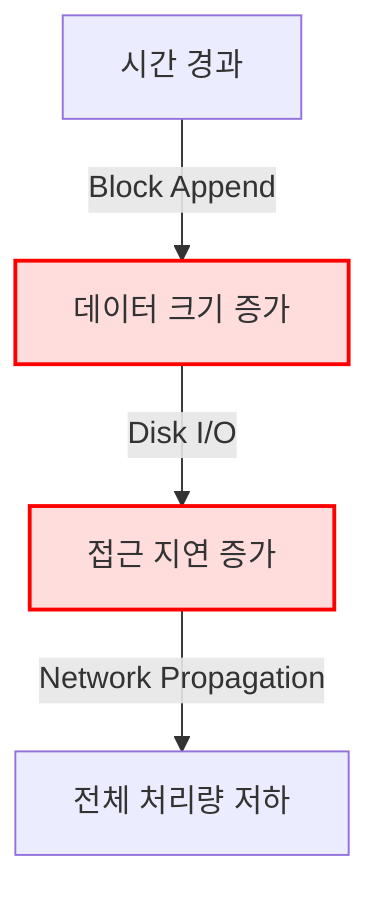

+++
title = "646. 블록체인 노드 스토리지 병목 현상"
date = "2026-03-14"
weight = 646
+++

# # [블록체인 노드 스토리지 병목 현상]

### 핵심 인사이트 (3줄 요약)
> 1. **본질**: 블록체인의 'Append-only(추가 전용)' 특성으로 인한 무한정 증가하는 원장(Ledger) 데이터와, 상태(State) 접근을 위한 효율성 저하가 합쳐져 발생하는 구조적 병목 현상입니다.
> 2. **가치**: 노드의 운영 비용(Hardware/Cloud Cost)을 폭증시키고 네트워크의 탈중앙성(Decentralization)을 저해하며, TPS(Transaction Per Second) 확대의 근본적인 한계로 작용합니다.
> 3. **융합**: 데이터베이스(DB) 인덱싱 기술과 분산 파일 시스템의 원리가 융합되며, ZKP(Zero-Knowledge Proof)와 Modular Blockchain 아키텍처로 진화하고 있습니다.

---

### Ⅰ. 개요 (Context & Background)

#### 1. 개념 및 정의
블록체인 노드 스토리지 병목 현상(Blockchain Node Storage Bottleneck)이란, 블록체인 네트워크의 참여자(Node)가 블록 데이터를 생성, 검증, 전파하고 저장하는 과정에서, **스토리지 용량의 물리적 한계**와 **데이터 입출력(Input/Output) 속도의 지연**이 성능 저하를 초래하는 현상을 의미합니다. 이는 단순히 "디스크가 꽉 참"을 넘어, 데이터의 크기(Size)와 접근 패턴(Access Pattern)이 시스템의 처리량(Throughput)을 물리적으로 막아버리는 구조적 문제입니다.

#### 2. 💡 비유
마치 **'평생 지우지 못하고 매일 1GB씩 쌓이는 일기장'**을 쓰는 인류 최고의 기억왕(Keeper)이 있다고 상상해 보십시오. 처음엔 가볍지만, 10년 뒤에는 1페이지를 쓰기 위해 3.6TB 분량의 과거 기록을 뒤져야 하므로 아무리 독해 속도가 빨라도 글을 쓰는 속도가 느려집니다.

#### 3. 등장 배경
① **기존 한계**: 비트코인(Bitcoin)과 같은 초기 블록체인은 단순한 거래 기록 전송이 주 목적이었으나, 이더리움(Ethereum) 이후 스마트 컨트랙트(Smart Contract)가 등장하며 '상태(State)' 개념이 도입되었습니다.
② **혁신적 패러다임**: 단순 잔액(Balance)이 아닌 프로그램의 코드, 변수, 저장소 등 복잡한 데이터를 영구 저장하게 되면서 스토리지 요구량이 기하급수적으로 팽창했습니다.
③ **현재의 비즈니스 요구**: DeFi(탈중앙 금융), NFT(대체 불가능 토큰), 메타버스 등 대용량 데이터를 다루는 dApp이 등장하며, 기존의 모노리식(Monolithic) 스토리지 구조로는 확장성(Scalability)을 확보할 수 없게 되었습니다.

#### 4. 📢 섹션 요약 비유
블록체인 스토리지 병목은 **"절대 폐기할 수 없는 영구 보관법에 따라 모든 도시의 폐기물을 그대로 보관해야 하는 쓰레기장"**과 같습니다. 도시가 커질수록(데이터가 늘어날수록) 새로운 쓰레기(트랜잭션)를 처리하려면 과거의 쓰레기 산을 뒤져야 하므로 처리 속도는 점점 느려질 수밖에 없습니다.



---

### Ⅱ. 아키텍처 및 핵심 원리 (Deep Dive)

#### 1. 구성 요소 분석 (표)
블록체인 노드의 스토리지는 단일 계층이 아니라 여러 계층(Layer)의 데이터 구조로 복합적으로 작동합니다.

| 구성 요소 (Component) | 역할 (Role) | 내부 동작 (Internal Operation) | 주요 프로토콜/포맷 | 비유 (Analogy) |
|:---|:---|:---|:---|:---|
| **Chain Data** | 블록 본문 및 헤더 저장 | 순차적 쓰기(Sequential Write) 위주, 수정 불가 | RLP (Recursive Length Prefix) | 쌓이는 신문 원본 |
| **State Trie** | 현재 계정 상태(잔액, Nonce) 저장 | 트리 구조 탐색 및 노드 업데이트 | MPT (Merkle Patricia Trie) | 현재 페이지 주소록 |
| **Storage Trie** | 스마트 컨트랙트 데이터 저장 | 계정별 로컬 스토리지 관리 | MPT (Merkle Patricia Trie) | 개인 사물함 |
| **Transaction Pool** | 검증 대기 중인 트랜잭션 | 메모리 상에서의 임시 관리 | Mempool Protocol | 발송 대기실 |
| **Snapshot/History** | 과거 상태 스냅샷 | 특정 시점의 상태 트리 복원을 위한 백업 | Flat DB | 과거 도면 보관소 |

#### 2. ASCII 구조 다이어그램: 노드 내부 데이터 흐름
노드가 트랜잭션을 처리할 때 스토리지 I/O가 어떻게 발생하는지 시각화합니다.

```text
+-----------------------------------------------------------------------+
|                        Blockchain Node (Full Node)                    |
+-----------------------------------------------------------------------+
|                                                                       |
|  [Mempool] --(1) Tx Exec --------> +------------------+               |
|                                   |   EVM / Consensus |               |
|                                   +--------+---------+               |
|                                            |                         |
|           (3) Random Read/Write            | (2) State Access        |
|           (Bottleneck Point)               v                         |
|    +-----------------------------+  +-----------------------------+  |
|    |      Key-Value Store       |  |      State Database         |  |
|    |      (LevelDB / RocksDB)   |  |   (Merkle Patricia Trie)    |  |
|    |                             |  |                             |  |
|    |  [Key: Hash(Address)]       |  |  [Root Hash]                |  |
|    |  [Value: Account State]     |  |      |                      |  |
|    |                             |  |      +----+----+----+       |  |
|    +-------------|---------------+  +------------|----|----+       |  |
|                  |                             |    |            |
|                  v                             v    v            |
|  +--------------------------------------------------------------+  |
|  |                    DISK I/O (SSD / HDD)                      |  |
|  |  (가장 느린 자원, 병목의 근원지)                                |  |
|  +--------------------------------------------------------------+  |
+-----------------------------------------------------------------------+
```

#### 3. 심층 동작 원리: 왜 I/O 병목이 발생하는가?
① **트랜잭션 실행**: `ECDSA (Elliptic Curve Digital Signature Algorithm)` 서명을 검증하고 가스(Gas)를 계산합니다.
② **상태 조회**: 송신자와 수신자의 `State Object`를 가져오기 위해 MPT의 Root Hash에서부터 Leaf 노드까지 경로를 추적합니다. 이 과정에서 디스크상의 불연속적인 위치에 있는 데이터를 **N번(Random I/O)** 읽어야 합니다.
③ **상태 갱신**: 잔액이 변경되면 해당 노드를 수정하고, 상위 노드들의 Hash 값을 재계산하여 루트까지 올라갑니다. 이때마다 디스크 쓰기(Write)가 발생합니다.
④ **영구 저장**: 블록이 완성되면 이를 블록체인 DB에 추가합니다. 블록 하나의 크기는 작지만, 수천 개의 트랜잭션이 각각 수백 번의 I/O를 유발하여 **"Amplification Write(증폭된 쓰기)"** 현상이 발생합니다.

#### 4. 핵심 공식 및 코드
**I/O 병모 지표 (Approximation)**
$$ \text{Total Latency} = \sum_{i=1}^{N} (\text{Random Read Latency}_i) + \sum_{j=1}^{M} (\text{Write Latency}_j) $$
여기서 $N$은 트리의 깊이(Depth)이며, 이더리움의 경우 평균 Depth가 깊어 Random Read 비중이 큽니다.

**Go 코드 스니펫 (LevelDB Write)**
```go
// 데이터베이스에 상태를 쓰는 추상화 코드
func (db *Database) WriteState(addr common.Address, state StateObject) error {
    // 1. Serialization (직렬화)
    data, err := rlp.EncodeToBytes(state)
    if err != nil { return err }

    // 2. Key-Value Store에 Write (디스크 I/O 발생)
    batch := db.kv.NewBatch()
    batch.Put(addr.Bytes(), data) // Put 연산은 디스크 Seek + Write 유발
    
    // 3. Commit (실제 디스크로 Flush)
    return db.kv.Write(batch, nil) // 이 순간 병목 발생 가능
}
```

#### 5. 📢 섹션 요약 비유
스마트 컨트랙트가 실행될 때의 스토리지 I/O는 **"복잡한 미로(MPT) 찾기"** 게임과 같습니다. 책상(Disk) 위에 펼쳐진 미로 지도에서 출발점(Root)부터 목적지(Account)까지 이동할 때마다 발걸음마다 책장에서 책을 꺼내고(Read), 다시 넣어야(Wrtie) 하므로, 미로가 복잡할수록 단순한 이동(트랜잭션)에도 엄청난 시간이 소요됩니다.

---

### Ⅲ. 융합 비교 및 다각도 분석 (Comparison & Synergy)

#### 1. 심층 기술 비교: 데이터베이스 관점
관계형 데이터베이스(RDBMS)와 블록체인 스토리지의 근본적인 차이를 분석합니다.

| 비교 항목 | RDBMS (예: Oracle, MySQL) | Blockchain DB (예: Ethereum LevelDB) |
|:---|:---|:---|
| **저장 방식** | UPDATE 가능 (Row 수정) | Append-Only (Immutable) |
| **인덱싱** | B+Tree (Sequential Access 유리) | Merkle Patricia Trie (Hash 접근) |
| **무결성** | ACID 트랜잭션 (Rollback 가능) | Consensus (Rollback 불가, Reorg 제외) |
| **병목 포인트** | Lock Contention (CPU/Buffer) | Disk I/O Latency (Storage Bound) |
| **저장 크기** | Purging/Archiving으로 관리 가능 | 무한 증가 (State Bloat) |

#### 2. 과목 융합 관점: OS 및 네트워크
- **운영체제(OS) 융합**: OS의 `Page Cache(페이지 캐시)` 기법이 블록체인 클라이언트에 그대로 사용됩니다. 자주 접근하는 상태(Hot State)는 RAM에 캐싱하여 디스크 접근을 줄이지만, 콜드 데이터(Cold State) 접근 시 `Page Fault(페이지 폴트)`와 유사한 대기 지연이 발생합니다.
- **네트워크(Network) 융합**: 스토리지 병목은 네트워크 전파 속도에도 영향을 미칩니다. 노드가 블록을 검증(Processing)하는 속도보다 데이터를 읽는 속도(IO)가 느려지면, 네트워크 상의 `Transaction Propagation(트랜잭션 전파)` 지연으로 이어져 전체 네트워크의 `Orphan Rate(고아 블록 비율)`을 증가시킵니다.

#### 3. 📢 섹션 요약 비유
RDBMS는 지우개를 사용해 언제든 내용을 고칠 수 있는 **"칠판"**이지만, 블록체인은 한 번 적으면 영원히 지울 수 없는 **"돌비석에 새겨진 점톼판"**입니다. 칠판은 지우고 다시 쓰면 공간이 유지되지만, 점톼판은 새 정보를 쓸 때마다 집(스토리지)을 넓혀야 하므로, 점점 더 넓은 부지(용량)와 더 많은 도서관管理员(I/O 처리 능력)이 필요합니다.

---

### Ⅳ. 실무 적용 및 기술사적 판단 (Strategy & Decision)

#### 1. 실무 시나리오 및 의사결정
**시나리오 1: 대규모 DeFi 서비스 운용**
- **문제**: Archival Node(아카이브 노드)를 운영하며 4TB 이상의 SSD가 필요함. 조회 latency가 높아 사용자 경험(UX) 저하.
- **의사결정**: 자체 노드 운영 포기 및 **Node-as-a-Service(Infura, Alchemy)** 사용 결정. 혹은 라이트 노드 전환.
- **이유**: 스토리지 비용(Capex)과 유지보수(Opex) 비용이 아웃소싱 비용보다 높음.

**시나리오 2: EIP-4844(Proto-Danksharding) 도입 검토**
- **문제**: Layer 2 수수료가 높은 이유는 Calldata(호출 데이터)를 메인넷에 저장하기 때문.
- **의사결정**: `Blob(대용량 바이너리 객체)` 개념을 도입하여 데이터를 별도 스토리지에 저장하고, 즉시 삭제(Pruning)하는 로직으로 업그레이드.
- **결과**: 스토리지에 오래 머무는 부담을 줄여 Gas 비용 획기적 절감.

#### 2. 도입 체크리스트
| 항목 | 기술적 체크포인트 | 운영·보안적 체크포인트 |
|:---|:---|:---|
| **Pruning(가지치기)** | DB 설정에서 `ancient` 데이터 분리 여부 확인 | 과거 데이터 복구 가능성(Restore Point) 확보 여부 |
| **Snapshot(스냅샷)** | 최신 상태로의 동기화 속도(Sync Time) 단축 확인 | 스냅샷 데이터 신뢰성(서명 검증) 여부 |
| **Storage Tiering** | NVMe vs HDD 층별 데이터 배치 전략 | 저장 매체의 수명(TEB - Total Erased Bytes) 관리 |
| **Backup** | 노드 재시작 시 재동기화 속도 | 재해 복구(Disaster Recovery) 계획 수립 |

#### 3. 안티패턴 (Anti-pattern)
- **과도한 Archive 모드 운영**: 전체 네트워크의 100% 데이터를 보관하려 할 경우, 비용 대비 효율이 급격히 떨어짐.
- **단일 디스크 장착**: 데이터 무결성 검사를 위해서는 최소 `RAID 1` 이상의 구성이