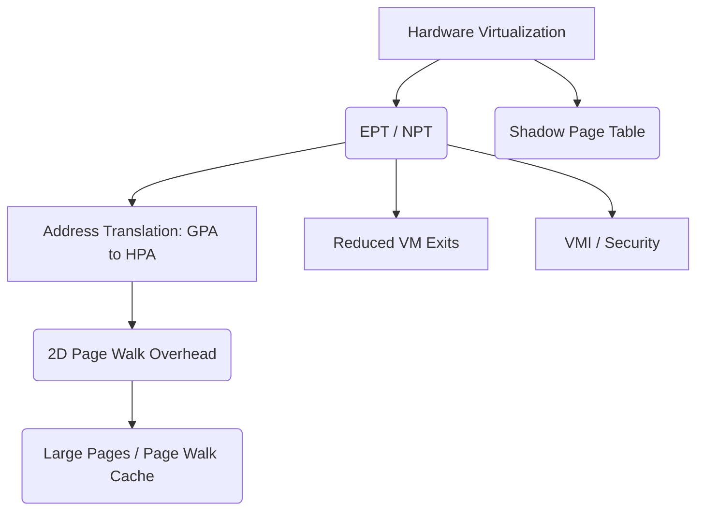

+++
title = "확장 페이지 테이블 (Extended Page Table, EPT)"
weight = 661
+++

> 💡 **핵심 인사이트 (3-Line Insight)**
> - 확장 페이지 테이블 (Extended Page Table, EPT)은 하드웨어 지원 가상화에서 메모리 주소 변환의 오버헤드를 획기적으로 줄이는 핵심 기술입니다.
> - 소프트웨어적인 그림자 페이지 테이블 (Shadow Page Table, SPT)의 한계를 극복하고, 게스트 물리 주소 (Guest Physical Address, GPA)를 호스트 물리 주소 (Host Physical Address, HPA)로 직접 변환합니다.
> - 이중 페이징 (Two-Dimensional Paging) 구조를 통해 가상 머신 (Virtual Machine, VM)의 성능을 네이티브 환경에 가깝게 끌어올립니다.

## Ⅰ. 확장 페이지 테이블 (Extended Page Table, EPT)의 개요
확장 페이지 테이블 (Extended Page Table, EPT)은 인텔 (Intel)의 하드웨어 가상화 기술인 가상화 기술 (Virtualization Technology, VT-x)의 핵심 기능 중 하나로, 가상 머신 (Virtual Machine, VM) 내부의 메모리 접근을 효율적으로 처리하기 위한 하드웨어 기반의 메모리 주소 변환 메커니즘입니다. 가상화 환경에서는 주소 변환이 두 단계로 이루어져야 합니다. 첫째, 게스트 운영체제 (Guest OS)가 게스트 가상 주소 (Guest Virtual Address, GVA)를 게스트 물리 주소 (Guest Physical Address, GPA)로 변환합니다. 둘째, 하이퍼바이저 (Hypervisor) 또는 가상 머신 모니터 (Virtual Machine Monitor, VMM)가 이 GPA를 실제 시스템의 호스트 물리 주소 (Host Physical Address, HPA)로 변환합니다.

과거에는 이러한 이중 주소 변환을 소프트웨어 방식인 그림자 페이지 테이블 (Shadow Page Table, SPT)을 통해 처리했으나, 빈번한 가상 머신 출구 (Virtual Machine Exit, VM Exit)와 동기화 오버헤드로 인해 심각한 성능 저하가 발생했습니다. EPT는 두 번째 변환 단계(GPA -> HPA)를 하드웨어 메모리 관리 장치 (Memory Management Unit, MMU)가 직접 수행하도록 지원함으로써, 하이퍼바이저의 개입을 최소화하고 메모리 집약적인 가상화 작업의 성능을 대폭 향상시킵니다. AMD에서는 이를 빠른 가상화 인덱싱 (Rapid Virtualization Indexing, RVI) 또는 중첩 페이지 테이블 (Nested Page Tables, NPT)이라고 부르며, 동일한 원리로 작동합니다.

> 📢 **섹션 요약 비유**
> - **건물 주소 체계:** EPT는 건물의 가상 호수(게스트 주소)를 건물 자체의 설계도(게스트 물리 주소)로 바꾸고, 이를 다시 실제 도시의 토지 번호(호스트 물리 주소)로 한 번에 찾아주는 스마트 내비게이션 시스템과 같습니다. 이전에는 경비원(하이퍼바이저)에게 매번 물어봐야 했지만, 이제는 스마트 기기(하드웨어 MMU)가 바로 알려줍니다.

## Ⅱ. EPT의 아키텍처 및 동작 원리
EPT의 구조는 기존의 x86-64 아키텍처에서 사용되는 4단계 페이지 테이블 구조와 유사하지만, 변환 대상이 GVA가 아닌 GPA라는 점에서 차이가 있습니다.

```text
[ GVA (Guest Virtual Address) ]
       |
       v  <-- Guest CR3 (Guest Page Table)
[ GPA (Guest Physical Address) ]
       |
       v  <-- EPTP (EPT Pointer)
[ HPA (Host Physical Address) ]
```

### 1. 이중 주소 변환 구조 (Two-Dimensional Address Translation)
- **게스트 변환 (Guest Translation):** Guest OS는 자신의 CR3 레지스터를 사용하여 GVA를 GPA로 변환합니다.
- **호스트 변환 (Host Translation):** 하드웨어 MMU는 확장 페이지 테이블 포인터 (Extended Page Table Pointer, EPTP)를 참조하여 GPA를 HPA로 변환합니다.

### 2. EPT 계층 구조 (4-Level EPT)
EPT는 4KB 페이지 크기를 기준으로 4단계 계층 구조를 가집니다:
1. **페이지 맵 레벨 4 엔트리 (Page Map Level 4 Entry, PML4E):** EPT의 최상위 디렉토리.
2. **페이지 디렉토리 포인터 테이블 엔트리 (Page Directory Pointer Table Entry, PDPTE)**
3. **페이지 디렉토리 엔트리 (Page Directory Entry, PDE):** 2MB 대형 페이지 (Large Page) 지원 가능.
4. **페이지 테이블 엔트리 (Page Table Entry, PTE):** 최종적으로 4KB HPA를 가리킴.

> 📢 **섹션 요약 비유**
> - **다중 번역기:** 외국어(GVA)를 공용어(GPA)로 번역하는 첫 번째 번역기(Guest OS)와, 공용어(GPA)를 모국어(HPA)로 번역하는 두 번째 하드웨어 자동 번역기(EPT)가 직렬로 연결된 구조입니다.

## Ⅲ. EPT의 주요 기술적 특징 및 장점
1. **가상 머신 출구 (VM Exit) 감소:** SPT 방식에서는 Guest OS가 페이지 테이블을 수정할 때마다 하이퍼바이저로 제어권이 넘어가는 VM Exit가 발생하지만, EPT 환경에서는 Guest OS가 자신의 페이지 테이블을 자유롭게 수정할 수 있어 VM Exit가 급격히 감소합니다.
2. **변환 색인 버퍼 (Translation Lookaside Buffer, TLB) 효율성:** 최신 프로세서는 가상 프로세서 식별자 (Virtual Processor ID, VPID)를 지원하여, 여러 VM의 TLB 엔트리를 동시에 캐싱할 수 있습니다. 이는 EPT와 결합하여 컨텍스트 스위칭 시 TLB 플러시 (Flush) 오버헤드를 줄입니다.
3. **대형 페이지 (Large Pages) 지원:** EPT는 2MB 또는 1GB 크기의 대형 페이지를 지원하여 EPT 탐색 (Walk) 횟수를 줄이고 TLB 히트율을 높입니다.
4. **메모리 절약:** SPT는 각 프로세스마다 별도의 그림자 테이블을 유지해야 하지만, EPT는 각 VM당 하나의 EPT 구조만 유지하면 되므로 시스템 메모리 소모가 적습니다.

> 📢 **섹션 요약 비유**
> - **프리패스 시스템:** 놀이공원에서 기구를 탈 때마다 관리자(하이퍼바이저)의 승인을 받는 대신, 한 번 발급받은 스마트 패스(EPT)로 모든 기구를 자유롭게 이용하는 것과 같습니다. 대기 시간(VM Exit)이 사라져 훨씬 빠릅니다.

## Ⅳ. EPT의 성능 오버헤드 (EPT Walk)
EPT는 매우 효율적이지만, TLB 미스 (Miss) 발생 시 심각한 페널티 (Penalty)를 동반합니다. 
일반적인 네이티브 환경에서는 TLB 미스 시 4번의 메모리 접근 (Page Walk)이 필요하지만, 이중 페이징 (Two-Dimensional Paging) 환경에서는 최악의 경우 다음과 같은 접근 횟수가 필요합니다:
- GVA를 변환하기 위해 4단계 Guest Page Table을 탐색합니다.
- 이때 Guest Page Table의 각 단계(GPA)를 HPA로 변환하기 위해 다시 4단계 EPT 탐색이 필요합니다.
- 따라서, 최악의 경우 **$4 \times 4 + 4 = 20$번** (또는 그 이상)의 메모리 접근이 발생할 수 있습니다 (2D Page Walk).
이러한 문제를 완화하기 위해 하드웨어는 페이지 워크 캐시 (Page Walk Cache)와 대형 페이지 (Large Pages)를 적극적으로 활용합니다.

> 📢 **섹션 요약 비유**
> - **지도 속의 지도:** 길을 찾기 위해 지도를 보는데, 그 지도 안의 특정 건물을 찾으려면 또 다른 상세 지도를 4번씩 더 찾아봐야 하는 복잡한 상황입니다. 그래서 자주 가는 길은 굵은 펜(대형 페이지)으로 표시해 두거나 머릿속(캐시)에 외워둡니다.

## Ⅴ. 확장 페이지 테이블의 발전 방향 (응용 분야)
EPT의 기능은 단순한 주소 변환을 넘어 시스템 보안 및 메모리 모니터링 영역으로 확장되고 있습니다.
- **가상 머신 인트로스펙션 (Virtual Machine Introspection, VMI):** 하이퍼바이저가 EPT 권한 제어(읽기/쓰기/실행 권한 분리)를 통해 Guest OS 내부의 악성코드 실행을 감지하고 차단합니다.
- **하위 페이지 보호 (Sub-Page Protection, SPP):** 인텔의 최신 기술로, 4KB 페이지 내부의 128바이트 단위로 쓰기 권한을 제어하여 더욱 세밀한 메모리 보호를 제공합니다.
- **소프트웨어 가드 익스텐션 (Software Guard Extensions, SGX) / 트러스트 도메인 익스텐션 (Trust Domain Extensions, TDX):** 기밀 컴퓨팅 (Confidential Computing) 환경에서 EPT는 게스트의 메모리를 암호화하고 호스트(하이퍼바이저 포함)의 무단 접근을 차단하는 핵심 격리 수단으로 작용합니다.

> 📢 **섹션 요약 비유**
> - **다목적 보안 요원:** 단순한 길 안내(주소 변환)를 넘어서, 방문객이 위험한 행동을 하는지 감시하고(VMI), 특정 구역의 출입을 철저히 통제하는(TDX) 보안 책임자의 역할을 수행하고 있습니다.

### 🧠 지식 그래프 및 하위 비유 (Knowledge Graph & Child Analogy)

- **하위 비유:** EPT는 **"스마트폰의 내장 GPS 칩"**과 같습니다. 과거에는 기지국 삼각측량(소프트웨어 방식 SPT)으로 느리고 복잡하게 위치를 찾았지만, 이제는 전용 하드웨어 칩(EPT)이 위성 신호를 직접 받아 빠르고 정확하게 현재 위치(HPA)를 계산해냅니다.
