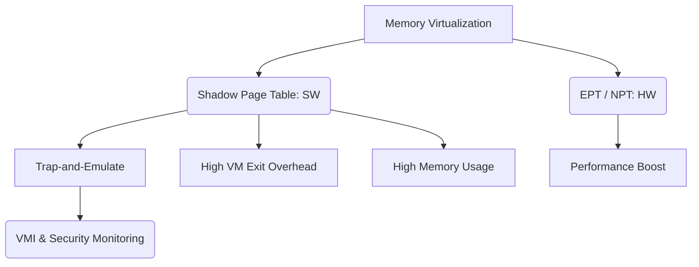

+++
title = "그림자 페이지 테이블 (Shadow Page Table)"
weight = 662
+++

> 💡 **핵심 인사이트 (3-Line Insight)**
> - 그림자 페이지 테이블 (Shadow Page Table, SPT)은 하드웨어 지원 (EPT/NPT)이 없던 시절, 소프트웨어 하이퍼바이저 (Hypervisor)가 메모리 가상화를 구현하기 위해 사용한 고전적인 기법입니다.
> - 게스트 운영체제 (Guest OS)가 관리하는 페이지 테이블의 구조를 하이퍼바이저가 몰래 추적하고 복사하여, 실제 하드웨어 메모리 관리 장치 (Memory Management Unit, MMU)가 사용할 수 있는 형태 (GVA -> HPA)로 직접 변환한 테이블을 유지합니다.
> - 동기화 과정에서 막대한 가상 머신 출구 (Virtual Machine Exit, VM Exit)가 발생하여 성능 오버헤드가 크지만, 가상 머신 인트로스펙션 (Virtual Machine Introspection, VMI) 같은 보안 모니터링 분야에서는 여전히 중요한 개념으로 응용됩니다.

## Ⅰ. 그림자 페이지 테이블 (Shadow Page Table, SPT)의 개요
그림자 페이지 테이블 (Shadow Page Table, SPT)은 전가상화 (Full Virtualization) 환경에서 하이퍼바이저 (Hypervisor)가 게스트 운영체제 (Guest OS)의 메모리 관리 기능을 속이고 시스템의 실제 물리 메모리를 통제하기 위해 사용하는 소프트웨어 기반의 메모리 가상화 기법입니다. 
게스트 OS는 자신이 실제 하드웨어를 제어하고 있다고 믿으며, 게스트 가상 주소 (Guest Virtual Address, GVA)를 게스트 물리 주소 (Guest Physical Address, GPA)로 변환하는 자신만의 페이지 테이블(Guest Page Table)을 생성하고 관리합니다. 그러나 실제 하드웨어 프로세서 (CPU)의 메모리 관리 장치 (Memory Management Unit, MMU)는 실제 물리 주소인 호스트 물리 주소 (Host Physical Address, HPA)만을 이해할 수 있습니다. 
따라서 하이퍼바이저는 게스트 OS의 페이지 테이블을 그림자처럼 따라다니며, GVA를 HPA로 직접 맵핑하는 '그림자 페이지 테이블'을 별도로 생성하여 실제 CPU의 제어 레지스터 3 (Control Register 3, CR3) 레지스터에 적재합니다.

> 📢 **섹션 요약 비유**
> - **이중장부 작성:** 회사(VM)의 재무팀(Guest OS)이 가짜 장부(Guest Page Table)를 작성하고 있을 때, 감사팀(하이퍼바이저)이 이 내역을 몰래 보고 진짜 은행 계좌(HPA)에 맞춰 비밀리에 진짜 장부(Shadow Page Table)를 작성하여 은행(CPU)에 제출하는 것과 같습니다.

## Ⅱ. SPT의 동작 원리 및 아키텍처
SPT의 핵심은 하이퍼바이저가 게스트 OS의 페이지 테이블 수정 시도를 가로채어 (Trap), 이를 자신의 그림자 테이블에 반영하는 동기화 (Synchronization) 과정입니다.

```text
[ GVA (Guest Virtual Address) ]
       |
       | (Guest Page Table - Read Only 처리됨) --> (VM Exit 발생, Hypervisor 개입)
       v
[ GPA (Guest Physical Address) ]
       |
       | (Hypervisor의 내부 P2M (Physical-to-Machine) 맵핑 테이블)
       v
[ HPA (Host Physical Address) ]

** 실제 CPU MMU가 사용하는 테이블 (Shadow Page Table) **
[ GVA ] -----------------------------------------> [ HPA ]
```

### 1. 주소 변환 및 동기화 메커니즘
- **트랩 및 에뮬레이션 (Trap-and-Emulate):** 하이퍼바이저는 Guest OS의 페이지 테이블이 저장된 메모리 영역을 '읽기 전용 (Read-Only)'으로 설정합니다.
- Guest OS가 페이지 테이블을 업데이트(PTE 수정)하려고 시도하면, 권한 위반 (Page Fault)이 발생하여 제어권이 하이퍼바이저로 넘어갑니다 (VM Exit).
- 하이퍼바이저는 Guest OS의 수정 의도를 파악하고, 물리-기계 변환 (Physical-to-Machine, P2M) 테이블을 참조하여 GPA를 HPA로 계산한 뒤, 이 결과를 바탕으로 Shadow Page Table을 업데이트합니다.
- 하이퍼바이저는 실제 CPU의 CR3 레지스터가 이 Shadow Page Table을 가리키도록 설정합니다.

> 📢 **섹션 요약 비유**
> - **그림자 인형극:** 조종자(하이퍼바이저)가 인형(Guest OS)의 움직임을 실시간으로 관찰하고, 뒤에 있는 진짜 그림자(SPT)를 조작하여 관객(CPU MMU)이 그 그림자만 보도록 만드는 정교한 연극 무대입니다.

## Ⅲ. SPT의 성능 이슈와 한계
SPT는 하드웨어 지원 없이 메모리 가상화를 완벽히 구현했다는 점에서 혁신적이었으나, 치명적인 성능적 한계를 지닙니다.
1. **과도한 가상 머신 출구 (VM Exit) 오버헤드:** 게스트 OS가 프로세스를 생성, 종료하거나 메모리를 할당 (Context Switching, Page Fault 처리 등)할 때마다 페이지 테이블을 수정합니다. 이때마다 수많은 VM Exit가 발생하여 CPU 사이클을 심각하게 낭비합니다.
2. **메모리 소모 (Memory Overhead):** 하이퍼바이저는 게스트 OS 내의 모든 활성화된 프로세스에 대해 각각의 Shadow Page Table을 유지해야 합니다. 이는 막대한 호스트 메모리 자원의 소모를 초래합니다.
3. **변환 색인 버퍼 (Translation Lookaside Buffer, TLB) 플러시 오버헤드:** 하이퍼바이저와 게스트 OS 간의 잦은 컨텍스트 스위칭은 CPU의 TLB를 지속적으로 무효화시켜, 전체적인 메모리 접근 성능을 저하시킵니다.

> 📢 **섹션 요약 비유**
> - **과잉 결재 시스템:** 직원이 서류에 글자 하나를 수정할 때마다 매번 사장님(하이퍼바이저)에게 불려가 결재를 받아야 하는 비효율적인 회사 구조입니다. 서류 수정(페이지 업데이트)이 잦을수록 회사의 업무(성능)는 마비됩니다.

## Ⅳ. SPT vs 하드웨어 지원 페이징 (Hardware Assisted Paging)
현대의 가상화 시스템은 대부분 SPT 대신 확장 페이지 테이블 (Extended Page Table, EPT) 또는 중첩 페이지 테이블 (Nested Page Tables, NPT)과 같은 하드웨어 지원 페이징 기술을 사용합니다.
- **주소 변환 주체:** SPT는 하이퍼바이저(소프트웨어)가 주도하지만, EPT는 CPU 내의 MMU(하드웨어)가 자동으로 변환합니다.
- **VM Exit 여부:** SPT는 페이지 테이블 수정 시마다 VM Exit가 발생하지만, EPT는 게스트 OS가 자신의 페이지 테이블을 직접 수정하므로 VM Exit가 발생하지 않습니다.
- **메모리 접근 횟수:** 흥미롭게도 TLB 미스 시 순수 메모리 접근 횟수는 SPT가 더 적습니다 (GVA->HPA 1번의 4단계 탐색). 반면 EPT는 2D Page Walk (최대 20번 탐색)가 필요합니다. 그럼에도 불구하고 VM Exit 오버헤드를 없앤 EPT가 전체적인 성능에서 압도적으로 우수합니다.

> 📢 **섹션 요약 비유**
> - **수동 번역 vs 자동 번역기:** SPT는 번역가가 문장이 바뀔 때마다 일일이 사전을 찾아 번역본을 다시 쓰는 수동 작업이며, EPT는 시스템에 내장된 AI 실시간 자동 번역기를 돌리는 것과 같습니다.

## Ⅴ. SPT의 현대적 활용 (응용 분야)
하드웨어 기술의 발전으로 주류 가상화 시장에서 SPT는 밀려났지만, 그 특유의 '가로채기(Trap)' 메커니즘은 보안 및 특수 목적 가상화에서 재조명받고 있습니다.
- **가상 머신 인트로스펙션 (Virtual Machine Introspection, VMI):** 보안 솔루션이 악성코드를 탐지하기 위해 SPT 기법을 응용합니다. 게스트 OS 커널의 중요 데이터 구조를 가리키는 페이지를 읽기 전용으로 만들고, 악성코드가 이를 변조하려 할 때 발생하는 트랩을 이용해 공격을 차단합니다.
- **메모리 디버깅 및 분석:** 보안 연구원들이 게스트 운영체제의 메모리 접근 패턴을 투명하게 추적하고 프로파일링하는 데 사용됩니다.
- **중첩 가상화 (Nested Virtualization):** 최신 하드웨어 가상화 확장을 지원하지 않는 환경이나 복잡한 가상화 시나리오에서 백업 솔루션으로 여전히 활용됩니다.

> 📢 **섹션 요약 비유**
> - **함정 수사망:** 일반적인 교통 통제(주소 변환) 역할에서는 은퇴했지만, 이제는 범죄자(악성코드)가 중요한 금고(커널 메모리)를 건드리는 순간 즉시 알람이 울리도록 설치해 둔 정교한 보안 트랩(함정)으로 활약하고 있습니다.

### 🧠 지식 그래프 및 하위 비유 (Knowledge Graph & Child Analogy)

- **하위 비유:** SPT는 **"스파이의 도청 장치"**와 같습니다. 상대방(Guest OS)이 모르게 모든 대화(메모리 수정)를 엿듣고 가로채어 자신만의 기록(Shadow Table)을 남깁니다. 도청에는 많은 수고와 에너지가 들지만, 상대방의 일거수일투족을 감시(보안 모니터링)하는 데는 최고의 방법입니다.
