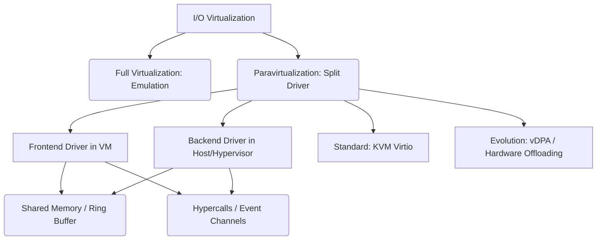

+++
title = "반가상화 (Paravirtualization) I/O"
weight = 663
+++

> 💡 **핵심 인사이트 (3-Line Insight)**
> - 반가상화 (Paravirtualization) 입출력 (I/O)은 가상 머신(Virtual Machine, VM)이 자신이 가상화 환경에 있음을 인지하고, 하이퍼바이저 (Hypervisor)와 직접 협력하여 입출력 작업을 수행하는 고효율 통신 메커니즘입니다.
> - 하드웨어를 소프트웨어로 완벽히 모방하는 전가상화 (Full Virtualization)의 막대한 에뮬레이션 (Emulation) 오버헤드를 제거하기 위해 고안되었습니다.
> - 프론트엔드 (Frontend)와 백엔드 (Backend) 분할 드라이버 모델 (예: Xen의 split-driver, KVM의 Virtio)과 하이퍼콜 (Hypercall)을 사용하여 고속 데이터 전송을 실현합니다.

## Ⅰ. 반가상화 (Paravirtualization) I/O의 개요
가상화 시스템에서 가장 큰 병목 현상을 일으키는 영역은 네트워크나 디스크와 같은 입출력 (Input/Output, I/O) 장치 처리입니다. 전가상화 방식에서는 게스트 운영체제 (Guest OS)가 실제 하드웨어에 접근한다고 착각하게 만들기 위해, 하이퍼바이저가 복잡한 장치 에뮬레이션 과정을 거쳐야 하며, 이는 심각한 성능 저하를 유발합니다. 
반가상화 (Paravirtualization) I/O는 이러한 한계를 극복하기 위해 설계된 아키텍처입니다. 반가상화 환경에서는 Guest OS의 커널을 수정하거나 (과거의 방식), 반가상화 전용 드라이버를 설치하여, Guest OS가 자신이 가상 머신 위에서 동작 중임을 '인지'하도록 합니다. 이를 통해 복잡한 하드웨어 에뮬레이션을 우회하고, Guest OS와 하이퍼바이저 간에 표준화된 고속 통신 채널인 응용 프로그램 인터페이스 (Application Programming Interface, API)를 사용하여 I/O 요청을 직접 주고받음으로써 성능을 베어메탈 (Bare-metal) 수준에 가깝게 끌어올립니다.

> 📢 **섹션 요약 비유**
> - **직통 전화(Hotline):** 전가상화가 복잡한 ARS 시스템을 거쳐 상담원과 연결되는 방식이라면, 반가상화 I/O는 VIP 고객(Guest OS)이 다이렉트 핫라인(하이퍼콜)을 통해 전담 매니저(하이퍼바이저)에게 직접 업무를 지시하여 중간의 불필요한 대기 시간을 없앤 것과 같습니다.

## Ⅱ. 반가상화 I/O 아키텍처: 분할 드라이버 (Split Driver) 모델
반가상화 I/O의 핵심 설계 패턴은 드라이버를 두 개의 계층으로 분리하는 '분할 드라이버 (Split Driver)' 모델입니다.

```text
[ Guest OS (Virtual Machine) ]
      |
( Frontend Driver ) <--- I/O 요청 (블록, 네트워크 등)
      |
      | ==== 공유 메모리 (Shared Memory) / 링 버퍼 (Ring Buffer) ====
      | ==== 이벤트 채널 (Event Channel) / 하이퍼콜 (Hypercall) ====
      v
( Backend Driver )  <--- 하이퍼바이저 내부 (또는 호스트 OS/Domain 0)
      |
[ 실제 하드웨어 장치 드라이버 (Physical Device Driver) ]
      |
[ 물리적 하드웨어 (NIC, Disk) ]
```

### 분할 드라이버 구성 요소의 역할
- **프론트엔드 드라이버 (Frontend Driver):** Guest OS 내부에 설치되는 가상 드라이버입니다. 실제 하드웨어를 제어하는 대신, 애플리케이션의 I/O 요청을 수집하여 백엔드로 전달하는 포워더 (Forwarder) 역할을 합니다.
- **백엔드 드라이버 (Backend Driver):** 커널 기반 가상 머신 (Kernel-based Virtual Machine, KVM) 하이퍼바이저 또는 권한이 있는 관리 도메인 (Xen의 Domain 0)에 위치합니다. 프론트엔드로부터 요청을 받아 실제 물리 하드웨어 드라이버로 전달하고, 그 결과를 다시 프론트엔드로 반환합니다.
- **공유 메모리 및 링 버퍼:** 두 드라이버 간의 대량의 데이터(Payload)는 복사(Copy) 오버헤드 없이 공유 메모리 영역(Ring Buffer)을 통해 교환됩니다.
- **하이퍼콜 (Hypercall) / 이벤트 채널:** I/O 요청이 준비되었음을 알리는 가벼운 신호 체계(인터럽트 대체)입니다.

> 📢 **섹션 요약 비유**
> - **택배 접수처와 물류 센터:** 프론트엔드 드라이버는 동네의 택배 접수처(Guest OS 내부)이고, 백엔드 드라이버는 거대한 중앙 물류 센터(하이퍼바이저)입니다. 둘 사이에는 물건을 빠르고 대량으로 옮기는 전용 컨베이어 벨트(공유 메모리와 링 버퍼)가 설치되어 있습니다.

## Ⅲ. 반가상화 I/O의 통신 메커니즘
반가상화 I/O가 고성능을 내는 이유는 기존 하드웨어 인터럽트 및 I/O 포트 접근 방식을 소프트웨어적으로 최적화했기 때문입니다.
1. **하이퍼콜 (Hypercall):** Guest OS가 하이퍼바이저의 서비스를 요청할 때 사용하는 소프트웨어 트랩 (Trap)입니다. 시스템 콜 (System Call)이 애플리케이션과 OS 간의 통신이라면, 하이퍼콜은 OS와 하이퍼바이저 간의 통신 수단입니다. I/O 에뮬레이션으로 인한 불필요한 가상 머신 출구 (VM Exit)를 최소화합니다.
2. **공유 메모리 (Shared Memory) 기반 큐잉:** 네트워크 패킷이나 디스크 블록 데이터는 Guest OS와 하이퍼바이저 간의 잦은 데이터 복사를 피하기 위해, 서로 공유하는 메모리 공간 (예: Virtio의 Virtqueue)에 기록됩니다.
3. **비동기식 알림 (Asynchronous Notification):** 데이터가 공유 메모리에 적재되면, 가상의 인터럽트(Xen의 Event Channel 등)를 통해 비동기적으로 상대방에게 알림을 보냅니다. 이를 통해 I/O 완료를 기다리는 블로킹 (Blocking) 시간을 최소화합니다.

> 📢 **섹션 요약 비유**
> - **레스토랑 주방 시스템:** 웨이터(프론트엔드)가 손님의 주문서(I/O 요청)를 주방의 회전 선반(공유 링 버퍼)에 올려놓고 종(하이퍼콜/이벤트)을 치면, 요리사(백엔드)가 즉시 요리를 시작합니다. 웨이터가 주방 안까지 들어가서 일일이 설명(에뮬레이션)할 필요가 없어 서비스가 매우 빠릅니다.

## Ⅳ. 주요 반가상화 I/O 기술 (Xen vs KVM Virtio)
반가상화 I/O는 가상화 플랫폼에 따라 서로 다른 구현체를 가집니다.
- **Xen 반가상화 (Xen PV):** 초창기 반가상화의 대표 주자로, Guest OS의 커널 소스코드를 직접 수정하여 I/O 명령어들을 하이퍼콜로 대체했습니다. Domain 0(관리 OS)에 백엔드 드라이버(blkback, netback)가 위치합니다. 성능은 뛰어나지만, 커널 수정이 불가능한 폐쇄형 OS에는 적용하기 어려웠습니다.
- **가상 입출력 (Virtual I/O, Virtio):** 현대 반가상화의 사실상 표준 (De facto standard)입니다. OS 커널을 수정하는 대신, Guest OS에 Virtio 호환 규격을 따르는 전용 디바이스 드라이버만 설치하면 됩니다. 블록 스토리지(virtio-blk), 네트워크(virtio-net) 등 다양한 장치를 지원하며, 리눅스 커널에 기본 내장되어 있습니다. 

> 📢 **섹션 요약 비유**
> - **맞춤 양복 vs 기성복 어댑터:** Xen 방식은 사람의 체형 자체를 옷에 맞게 개조(OS 커널 수정)하는 극단적인 맞춤형이었다면, KVM Virtio는 누구나 입을 수 있는 표준화된 다목적 어댑터(전용 드라이버)를 제공하여 편리함과 성능을 모두 잡은 모델입니다.

## Ⅴ. 반가상화 I/O의 장단점 및 진화 방향
**장점:**
- 에뮬레이션 오버헤드 제거로 인한 획기적인 I/O 처리량 (Throughput) 향상 및 지연 시간 (Latency) 감소.
- 중앙 처리 장치 (Central Processing Unit, CPU) 점유율 (Overhead) 최소화.

**단점/한계:**
- Guest OS에 전용 드라이버(Virtio 드라이버 등)를 추가 설치해야 하므로 100% 투명한 가상화는 아님.
- 하드웨어 직접 할당 (Passthrough/VFIO) 방식보다는 여전히 소프트웨어 스택(백엔드 드라이버)을 거치므로 극단적인 초저지연 성능에는 미치지 못함.

**진화 방향 (Vhost 및 하드웨어 오프로딩):**
하이퍼바이저 내부의 백엔드 처리조차도 성능에 병목이 될 수 있어, 최근에는 패킷 처리를 커널이나 호스트 사용자 공간으로 빼내는 **가상 호스트 (Vhost) / Vhost-user** 기술과 결합됩니다. 나아가 스마트 네트워크 인터페이스 카드 (SmartNIC)이나 데이터 처리 장치 (Data Processing Unit, DPU)에 Virtio 백엔드 로직 자체를 하드웨어적으로 오프로딩(vDPA 기술)하여, 반가상화의 유연성과 하드웨어 직접 할당의 초고성능을 동시에 달성하는 방향으로 발전하고 있습니다.

> 📢 **섹션 요약 비유**
> - **자율주행의 진화:** 반가상화가 운전석(VM)과 엔진(물리 장치)을 전자식(소프트웨어)으로 연결해 효율을 높인 'Drive-by-Wire' 기술이라면, 최근의 진화 방향은 아예 엔진에 지능형 제어기(DPU 오프로딩)를 달아 운전석의 소프트웨어 개입조차 완전히 없애는 자율주행으로 나아가는 것입니다.

### 🧠 지식 그래프 및 하위 비유 (Knowledge Graph & Child Analogy)

- **하위 비유:** 반가상화 I/O는 **"드라이브스루 (Drive-Thru) 매장"**과 같습니다. 매장에 내려서 복잡하게 주문(전가상화의 에뮬레이션)할 필요 없이, 정해진 창구(하이퍼콜)에서 전용 메뉴판(Virtio 규격)으로 주문하고, 창문(공유 메모리)을 통해 빠르고 효율적으로 음식(데이터)을 주고받는 최적화된 시스템입니다.
