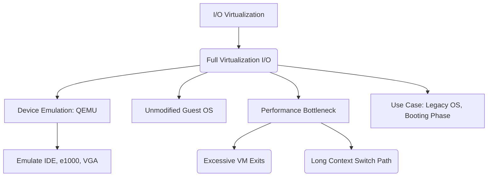

+++
title = "전가상화 (Full Virtualization) I/O"
weight = 664
+++

> 💡 **핵심 인사이트 (3-Line Insight)**
> - 전가상화 (Full Virtualization) 입출력 (I/O)은 가상 머신(Virtual Machine, VM) 내부의 운영체제(Guest OS)가 자신이 가상 환경에 있다는 사실을 전혀 모른 채, 수정 없이 그대로 실행될 수 있도록 돕는 장치 에뮬레이션 (Emulation) 기술입니다.
> - 하이퍼바이저 (Hypervisor, 예: QEMU)가 메인보드, 디스크 컨트롤러, 네트워크 카드 등 레거시 하드웨어의 동작을 소프트웨어로 완벽하게 흉내냅니다.
> - 뛰어난 호환성을 자랑하지만, 트랩 앤 에뮬레이트 (Trap-and-Emulate) 과정에서 막대한 컨텍스트 스위칭 (Context Switching)과 중앙 처리 장치 (Central Processing Unit, CPU) 오버헤드가 발생하여 성능이 크게 저하되는 치명적인 단점이 있습니다.

## Ⅰ. 전가상화 (Full Virtualization) I/O의 개요
전가상화 (Full Virtualization) I/O 모델은 가상 머신(Guest OS)에게 실제 물리적 하드웨어와 100% 동일한 인터페이스(가상의 마더보드, 주변장치 상호연결 버스 (Peripheral Component Interconnect, PCI) 버스, 통합 드라이브 전자공학 (Integrated Drive Electronics, IDE) / 직렬 첨단 기술 첨부 (Serial Advanced Technology Attachment, SATA) 컨트롤러, 레거시 네트워크 카드 등)를 소프트웨어적으로 구현하여 제공하는 방식입니다. 
이 방식의 가장 큰 목적은 **'완전한 투명성(Transparency)과 호환성'**입니다. 환경을 전혀 인지하지 못하고 소스코드 수정조차 불가능한 운영체제도 아무런 변경이나 전용 드라이버 설치 없이 즉시 실행될 수 있습니다. Guest OS는 자신이 펜티엄 보드에 꽂힌 Realtek 네트워크 카드나 IDE 하드디스크를 제어하고 있다고 굳게 믿게 됩니다.

> 📢 **섹션 요약 비유**
> - **트루먼 쇼 (The Truman Show):** 영화 속 주인공(Guest OS)이 진짜 세상(실제 하드웨어)에 살고 있다고 굳게 믿지만, 사실 그가 보는 모든 집, 자동차, 이웃 사람들은 방송국(하이퍼바이저)이 세밀하게 만들어낸 정교한 세트장(소프트웨어 에뮬레이터)인 것과 완벽히 동일합니다.

## Ⅱ. 전가상화 I/O의 동작 아키텍처 및 QEMU
전가상화 I/O를 구현하기 위해서는 하드웨어 장치의 레지스터 수준 동작까지 소프트웨어로 모사하는 장치 에뮬레이터 (Device Emulator)가 필요합니다. 커널 기반 가상 머신 (Kernel-based Virtual Machine, KVM) 환경에서는 보통 사용자 공간 (User-space)에서 동작하는 **퀵 에뮬레이터 (Quick Emulator, QEMU)**가 이 막중한 역할을 담당합니다.

```text
[ Guest OS (VM) ]
  |-- 1. I/O 포트 쓰기 (outb 명령어 등) 시도
  v
[ 하드웨어 CPU (VT-x) ] ---> (권한 위반, VM Exit 발생)
  |-- 2. 제어권 KVM으로 전환
  v
[ Host OS 커널 (KVM 하이퍼바이저) ]
  |-- 3. I/O 원인 파악 후 QEMU로 전달
  v
[ 사용자 공간 (QEMU Device Emulator) ]
  |-- 4. 가상 IDE 컨트롤러 / e1000 랜카드 동작 시뮬레이션
  |-- 5. 호스트 OS의 시스템 콜 (read/write, socket) 호출
  v
[ Host OS 커널 (물리 디바이스 드라이버) ]
  |-- 6. 실제 하드웨어로 I/O 전송
  v
[ 물리적 하드웨어 (Disk, NIC) ]
```

### 1. 전가상화 I/O (QEMU 에뮬레이션) 구조도
위 구조와 같이 QEMU는 KVM과 협력하여 디바이스 입출력을 시뮬레이션합니다.

### 2. 주요 에뮬레이션 대상
QEMU는 다음과 같은 범용적인 구형 하드웨어들을 주로 에뮬레이션합니다.
- **네트워크:** Intel e1000 (기가비트), Realtek RTL8139
- **스토리지:** IDE (PIIX4), SATA (AHCI), 구형 소형 컴퓨터 시스템 인터페이스 (Small Computer System Interface, SCSI) 컨트롤러
- **기타:** 비디오 그래픽 어레이 (Video Graphics Array, VGA) 디스플레이 어댑터, PS/2 키보드/마우스, 시리얼 포트

> 📢 **섹션 요약 비유**
> - **초정밀 성대모사:** QEMU는 수십 가지 다른 기계들의 목소리와 행동을 완벽하게 흉내 내는 천재 성대모사 달인입니다. 게스트 OS가 "e1000 랜카드야 응답해!"라고 부르면, QEMU가 e1000 랜카드의 목소리로 똑같이 대답해 주는 원리입니다.

## Ⅲ. 트랩 앤 에뮬레이트 (Trap-and-Emulate) 오버헤드
전가상화 I/O의 가장 큰 문제점은 극심한 성능 병목입니다. 하드웨어 장치를 제어하기 위해 Guest OS가 I/O 명령(예: 포트 I/O, 메모리 매핑 입출력 (Memory-Mapped I/O, MMIO) 접근)을 내릴 때마다 막대한 오버헤드가 발생합니다.

1. **가상 머신 출구 (VM Exit)의 늪:** Guest OS가 하드웨어 레지스터를 조작하려 할 때마다 CPU는 권한 위반을 감지하고 하이퍼바이저로 제어권을 넘기는 **VM Exit**가 발생합니다.
2. **복잡한 컨텍스트 스위칭:** KVM(커널)은 단순한 I/O 요청을 처리하기 위해 사용자 공간의 QEMU 프로세스를 깨워야 합니다. 즉, `VM -> 커널(KVM) -> 유저(QEMU) -> 커널(호스트 OS) -> 하드웨어`라는 길고 험난한 경로를 왕복해야 합니다.
3. **바이트 단위 처리:** 초기 에뮬레이션은 데이터를 한 번에 블록 단위로 보내지 못하고, 인터럽트와 바이트 단위의 레지스터 접근을 모사하느라 수천 번의 VM Exit를 동반하기도 했습니다.
결과적으로 전가상화 I/O의 처리량이나 성능은 네이티브 환경에 비해 현저히 낮아질 수 있습니다.

> 📢 **섹션 요약 비유**
> - **결재판 릴레이:** 직원이 볼펜(데이터) 하나를 신청할 때마다, 부서장(VM Exit) $
ightarrow$ 외부 용역업체(QEMU) $
ightarrow$ 본사 구매팀(Host OS) $
ightarrow$ 실제 문구점(하드웨어)까지 복잡한 결재 라인을 거쳐야 하는 최악의 관료주의 시스템입니다.

## Ⅳ. 전가상화 vs 반가상화 (Virtio) 비교
현대의 클라우드 및 가상화 인프라에서는 성능 문제로 인해 전가상화 I/O를 메인 데이터 경로로 사용하지 않습니다.

| 구분 | 전가상화 (Full Virtualization) I/O | 반가상화 (Paravirtualization) I/O |
| :--- | :--- | :--- |
| **핵심 개념** | 하드웨어 완벽 모방 (Emulation) | 하이퍼바이저와 직접 협력 (API 통신) |
| **Guest OS 인지** | 가상화 환경임을 모름 (수정 불가) | 가상화 환경임을 앎 (전용 드라이버 필요) |
| **성능** | 매우 느림 (막대한 VM Exit 및 컨텍스트 스위칭) | 베어메탈에 근접 (Ring Buffer, VM Exit 최소화) |
| **호환성** | 매우 높음 (레거시 OS, 구형 시스템 완벽 지원) | Guest OS에 Virtio 드라이버 설치 필수 |
| **사용 사례** | 구형 시스템, 부팅 초기 단계 | 최신 클라우드 인스턴스, 고성능 네트워크/스토리지 |

> 📢 **섹션 요약 비유**
> - **클래식카 모형 vs 최신 전기차:** 전가상화는 외관부터 엔진 소리까지 옛날 클래식카를 똑같이 구현해 누구나 몰 수 있지만 속도가 느린 모형 자동차입니다. 반가상화는 호환성을 버린 대신 극한의 속도를 내는 최신형 전기차입니다.

## Ⅴ. 현대 가상화에서 전가상화의 역할
성능이 떨어짐에도 불구하고 전가상화 I/O 에뮬레이션 기술은 가상화 생태계에서 절대 없어질 수 없는 필수적인 역할을 담당하고 있습니다.
1. **부팅 (Bootstrapping) 및 설치 단계:** Guest OS에 가상 입출력 (Virtio) 드라이버가 깔리기 전, 최초의 OS 설치 단계에서는 범용 IDE 디스크와 네트워크 에뮬레이션이 반드시 필요합니다.
2. **레거시 마이그레이션:** 수십 년 된 산업용 제어 시스템을 현대적인 클라우드로 리프트 앤 시프트 (Lift and Shift) 방식으로 이전할 때 유일한 해결책입니다.
3. **디바이스 모델링 및 보안 연구:** 새로운 칩셋이나 사물인터넷 (Internet of Things, IoT) 기기의 프로토타입을 소프트웨어로 개발하고 테스트하거나, 악성코드 분석을 위한 정교한 샌드박스 (Sandbox) 환경을 구축하는 데 QEMU 에뮬레이션 엔진이 핵심적으로 활용됩니다.

> 📢 **섹션 요약 비유**
> - **박물관의 큐레이터:** 실생활의 고속도로(데이터센터)에서는 더 이상 타지 않지만, 오래된 역사적 유물(레거시 OS)을 완벽하게 보존하고 누구나 체험할 수 있게 해주는 필수적인 박물관 시스템과 같습니다.

### 🧠 지식 그래프 및 하위 비유 (Knowledge Graph & Child Analogy)

- **하위 비유:** 전가상화 I/O는 **"비행기 시뮬레이터 조종석"**과 같습니다. 조종사(Guest OS)는 눈앞의 계기판과 조종간(에뮬레이션된 장치)이 실제 비행기와 똑같이 움직인다고 느끼지만, 사실 그 뒤에는 수많은 컴퓨터(QEMU 프로세스)가 엄청난 연산(오버헤드)을 하며 가짜 상황을 실시간으로 만들어내고 있는 것입니다.
