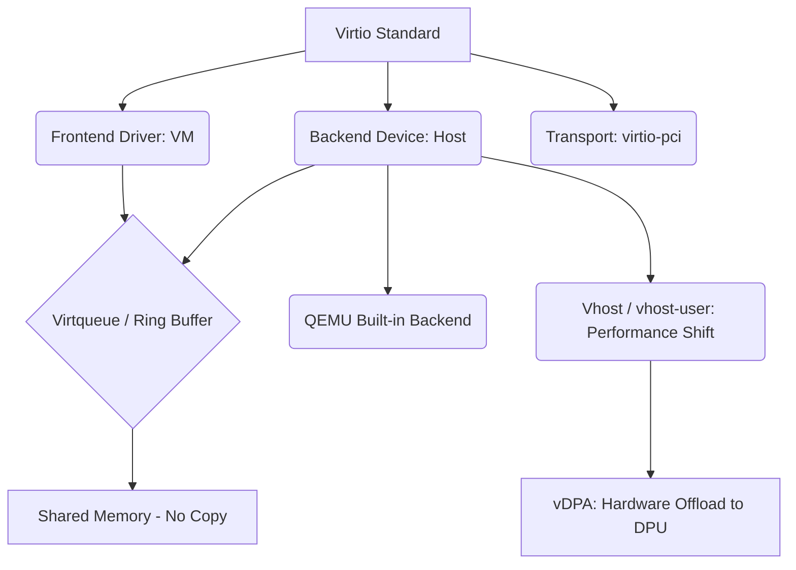

+++
title = "Virtio 드라이버 모델"
weight = 665
+++

> 💡 **핵심 인사이트 (3-Line Insight)**
> - Virtio (Virtual I/O)는 가상 환경에서 게스트 운영체제 (Guest OS)와 하이퍼바이저 (Hypervisor) 간에 입출력 (I/O) 장치를 효율적으로 통신하게 해주는 '반가상화 (Paravirtualization) 디바이스의 사실상 표준 (De Facto Standard) API'입니다.
> - 에뮬레이션 (Emulation)의 병목을 없애기 위해 공유 메모리 (Shared Memory) 기반의 '가상 큐 (Virtqueue)'를 사용하여 데이터를 대량으로 복사 없이 전송합니다.
> - 프론트엔드 (Frontend) 드라이버와 백엔드 (Backend) 디바이스로 역할을 분리한 아키텍처를 통해 뛰어난 확장성과 이식성 (Portability)을 제공합니다.

## Ⅰ. Virtio 드라이버 모델의 개요
가상화 시스템 초기에는 각 하이퍼바이저(VMware, Xen, KVM 등)가 자신들만의 독자적인 반가상화 드라이버 인터페이스를 가지고 있었습니다. 이는 Guest OS 입장에서 이식성을 심각하게 떨어뜨렸고, 개발자들에게 큰 부담을 주었습니다.
이를 해결하기 위해 등장한 **가상 입출력 (Virtual I/O, Virtio)**는 커널 기반 가상 머신 (Kernel-based Virtual Machine, KVM)을 이끄는 개발자들에 의해 리눅스 커널에 도입된 **가상화 I/O 장치를 위한 표준 추상화 계층 및 응용 프로그램 인터페이스 (API) 규격**입니다. Virtio는 특정한 하드웨어나 하이퍼바이저에 종속되지 않으며, 블록 디바이스(virtio-blk), 네트워크(virtio-net), 콘솔(virtio-console) 등 거의 모든 종류의 디바이스를 단일화된 공통 아키텍처(Virtio Ring/Virtqueue) 위에서 구현할 수 있도록 프레임워크를 제공합니다. 오늘날 주요 클라우드 프로바이더들은 최고 수준의 I/O 성능을 제공하기 위해 Virtio를 기본 채택하고 있습니다.

> 📢 **섹션 요약 비유**
> - **범용 I/O 어댑터 규격:** 과거에는 스마트폰마다 충전기 단자가 달라 불편했던 것처럼 가상화 드라이버도 제각각이었습니다. Virtio는 가상화 세계의 'USB-C 타입 표준'과 같아서, 어떤 가상 머신이나 하이퍼바이저든 이 규격만 맞추면 즉시 고속으로 장치를 연결하고 사용할 수 있게 해줍니다.

## Ⅱ. Virtio 아키텍처: 프론트엔드와 백엔드의 분리
Virtio는 전통적인 반가상화의 분할 드라이버 (Split Driver) 모델을 기반으로 설계되었습니다. 전체 구조는 가상 머신 안의 **프론트엔드 (Frontend)**와 호스트 측의 **백엔드 (Backend)**, 그리고 이 둘을 연결하는 **전송 계층 (Transport Layer)**으로 나뉩니다.

```text
[ 가상 머신 (Guest OS) 공간 ]
   (응용 프로그램) -> VFS / TCP/IP 스택
        |
   [ Virtio Frontend Drivers (virtio-blk, virtio-net) ]  <-- 디바이스별 특화
        |
   [ Virtio Ring (Virtqueue) API ]  <-- 공통 데이터 전송 로직
        |
   [ 전송 계층 (Virtio-PCI, Virtio-MMIO) ]  <-- 버스 추상화

================== 하드웨어/하이퍼바이저 경계 (VM Exit / 공유 메모리) ==================

[ 호스트 / 하이퍼바이저 (QEMU / Vhost) 공간 ]
   [ 전송 계층 에뮬레이션 (PCI 디바이스 등) ]
        |
   [ Virtqueue 처리 백엔드 ]
        |
   [ Virtio Backend Devices (QEMU 내장 또는 Vhost 커널/유저스페이스) ]
        |
   (호스트 물리 드라이버 / 실제 디스크/NIC)
```

### 1. 계층적 구조 및 구성 요소 설명
- **프론트엔드 드라이버 (Frontend Drivers):** Guest OS 커널에 적재되는 모듈입니다. Guest OS는 이 드라이버들을 실제 하드웨어 드라이버처럼 인식합니다.
- **백엔드 디바이스 (Backend Devices):** 퀵 에뮬레이터 (Quick Emulator, QEMU) 프로세스 내부나 Host OS 커널 (vhost-net)에 존재하며, 프론트엔드의 요청을 받아 실제 물리 I/O 작업을 수행합니다.
- **전송 계층 (Transport):** 가상 주변장치 상호연결 (Peripheral Component Interconnect, PCI) 버스를 주로 사용하여, Guest OS가 부팅 과정에서 플러그 앤 플레이 (Plug and Play) 방식으로 장치를 발견 (Discover)할 수 있게 해줍니다.

> 📢 **섹션 요약 비유**
> - **원격 조종 로봇 시스템:** 프론트엔드는 조종사(VM)가 쥐고 있는 규격화된 조이스틱이고, 백엔드는 실제 작업을 수행하는 기계팔(호스트 장치)입니다. Virtio 프레임워크는 조이스틱의 신호를 기계팔로 지연 없이 전달해주는 통신 케이블(Virtqueue) 역할을 합니다.

## Ⅲ. 핵심 데이터 구조: Virtqueue와 Ring Buffer
Virtio의 압도적인 I/O 성능은 데이터를 전달하는 핵심 메커니즘인 **가상 큐 (Virtqueue)**에서 나옵니다. Virtqueue는 Guest OS와 하이퍼바이저가 서로 공유하는 메모리 영역 (Shared Memory)에 구축된 **링 버퍼 (Ring Buffer)** 구조입니다.

### 1. 분할 가상 큐 (Split Virtqueue) 구조
하나의 Virtqueue는 3개의 논리적인 링으로 구성됩니다.
- **디스크립터 테이블 (Descriptor Table):** 데이터가 들어있는 메모리 버퍼의 주소(GPA)와 크기를 지시하는 포인터들의 배열입니다.
- **가용 링 (Available Ring):** 프론트엔드가 백엔드에게 처리할 I/O 요청이 준비되었음을 알려주는 큐입니다.
- **사용 완료 링 (Used Ring):** 백엔드가 I/O 처리를 완료한 후, 작업이 끝났음을 프론트엔드에게 알려주는 큐입니다.

### 2. 통신 흐름과 이벤트 알림
1. 프론트엔드는 전송할 데이터를 메모리에 쓰고 디스크립터 테이블을 업데이트한 뒤 가용 링에 인덱스를 추가합니다.
2. 프론트엔드는 백엔드에게 알림 (Kick, 가벼운 가상 머신 출구(VM Exit) 수반)을 보냅니다.
3. 백엔드는 공유 메모리를 읽어 작업을 처리하고, 사용 완료 링에 인덱스를 넣습니다.
4. 백엔드는 프론트엔드에게 가상 인터럽트 (Interrupt Request, IRQ)를 주입하여 작업 완료를 알립니다.

> 📢 **섹션 요약 비유**
> - **회전 초밥집 레일:** 주방장(프론트엔드)이 초밥(데이터)을 접시(디스크립터)에 담아 회전 레일(Available Ring)에 올리고 종을 칩니다(Kick). 손님(백엔드)은 레일에서 초밥을 가져다 먹고 빈 접시를 다른 레일(Used Ring)에 올려놓은 뒤 다 먹었다고 손을 듭니다(인터럽트). 이 레일 덕분에 복잡한 대화 없이 음식만 빠르게 교환할 수 있습니다.

## Ⅳ. 고성능 백엔드 최적화: Vhost 아키텍처
QEMU 내부에서 Virtio 백엔드를 처리하는 기본 방식은 여전히 사용자 공간과 커널 공간을 넘나드는 컨텍스트 스위칭 오버헤드를 유발합니다. 이 병목을 제거하기 위해 등장한 것이 **가상 호스트 (Vhost)** 기술입니다.

- **커널 수준 백엔드 (vhost-net):** 백엔드 처리 로직을 QEMU에서 호스트 (Host) 커널로 내렸습니다. 가상 머신(VM)에서 나온 패킷이 QEMU 프로세스를 거치지 않고 호스트 커널의 네트워크 스택으로 직접 전달되므로 처리량이 대폭 상승합니다.
- **사용자 공간 백엔드 (vhost-user):** 데이터 평면 개발 키트 (Data Plane Development Kit, DPDK) 등과 결합하여, 백엔드를 커널 밖의 독립적인 고성능 프로세스로 완전히 분리합니다. 공유 메모리를 직접 매핑하여 초고속 패킷 처리를 달성합니다.

> 📢 **섹션 요약 비유**
> - **직거래 고속도로 (Vhost):** 기존 QEMU 방식이 물건을 중간 도매상(QEMU 프로세스)을 거쳐 배송하는 것이라면, Vhost는 공장(VM)과 대형 마트(호스트 커널)를 다이렉트 고속도로로 연결하여 중간 유통 단계를 완전히 없애버린 초고속 물류 혁신입니다.

## Ⅴ. Virtio의 미래: 하드웨어 오프로딩 (vDPA)
최근 데이터센터의 발전 방향은 하드웨어와 소프트웨어의 경계를 허무는 것입니다. **가상 호스트 데이터 경로 가속화 (vhost Data Path Acceleration, vDPA)** 기술은 Virtio 데이터 평면 (Data Plane)을 소프트웨어가 아닌 **스마트 네트워크 인터페이스 카드 (SmartNIC)이나 데이터 처리 장치 (Data Processing Unit, DPU)** 하드웨어에 직접 오프로딩 (Offloading)합니다.
가상 머신 내부의 Virtio 프론트엔드는 그대로 유지하여 유연성(라이브 마이그레이션 등)을 보존하면서도, 데이터는 중앙 처리 장치 (CPU)를 거치지 않고 직접 전송됩니다. 이는 반가상화의 클라우드 친화적 장점과 하드웨어 직접 할당의 극단적 성능을 융합한 궁극의 형태입니다.

> 📢 **섹션 요약 비유**
> - **인공지능 자동 물류 로봇 (vDPA):** 시스템이 발전하여, 물건을 나르는 컨베이어 벨트(Virtqueue)의 끝에 사람이 아닌 전용 AI 로봇(DPU 하드웨어)이 연결되었습니다. 중앙 서버(CPU)는 신경 쓰지 않아도 로봇이 알아서 초고속으로 물건을 처리합니다.

### 🧠 지식 그래프 및 하위 비유 (Knowledge Graph & Child Analogy)

- **하위 비유:** Virtio는 **"국제 표준 물류 컨테이너 규격"**과 같습니다. 화물의 종류(블록, 네트워크)가 무엇이든 표준 컨테이너(Virtqueue)에 담기만 하면, 트럭(QEMU), 화물선(vhost), 혹은 최신 자동화 크레인(vDPA) 등 어떤 운송 수단(백엔드)이든 규격에 맞춰 가장 빠르고 효율적으로 처리할 수 있게 해줍니다.
