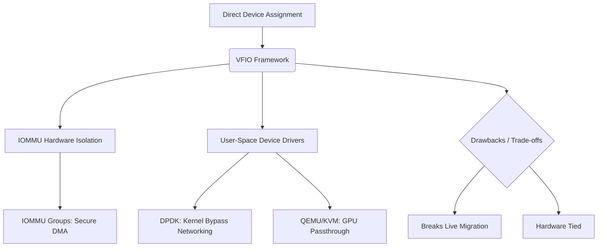

+++
title = "VFIO 프레임워크"
weight = 666
+++

> 💡 **핵심 인사이트 (3-Line Insight)**
> - 가상 기능 입출력 (Virtual Function I/O, VFIO)은 호스트 시스템의 물리적 하드웨어 디바이스를 가상 머신(VM)이나 사용자 공간 (User-space) 애플리케이션에 안전하고 직접적으로 할당 (Passthrough)하기 위한 리눅스 커널 프레임워크입니다.
> - 입출력 메모리 관리 장치 (I/O Memory Management Unit, IOMMU)를 기반으로 디바이스의 직접 메모리 접근 (Direct Memory Access, DMA)과 인터럽트를 하드웨어적으로 철저히 격리 (Isolation)하여 시스템 보안과 안정성을 보장합니다.
> - 데이터 평면 개발 키트 (Data Plane Development Kit, DPDK) 패킷 처리나 그래픽 처리 장치 (Graphics Processing Unit, GPU) 패스스루 등, 제로 오버헤드 (Zero-Overhead) 베어메탈급 성능이 필수적인 환경에서 핵심적인 역할을 수행합니다.

## Ⅰ. 가상 기능 입출력 (Virtual Function I/O, VFIO) 프레임워크 개요
디바이스 패스스루 (Device Passthrough) 또는 직접 할당 (Direct Assignment)은 가상 머신 (Guest OS)이 하이퍼바이저의 에뮬레이션이나 반가상화 계층을 거치지 않고, 물리적인 하드웨어 장치(네트워크 인터페이스 카드 (NIC), GPU, 비휘발성 메모리 익스프레스 (NVMe) 등)를 독점적으로 직접 제어하는 기술입니다. 이를 통해 I/O 지연을 베어메탈 (Bare-metal) 수준으로 낮출 수 있습니다.
과거에는 KVM 전용 디바이스 할당 모듈을 사용했으나, 이는 리눅스 커널의 권한 통제 모델을 훼손하고 KVM 하이퍼바이저에 너무 강하게 결합되어 있다는 단점이 있었습니다. 이를 범용적이고 안전하게 대체하기 위해 등장한 것이 **가상 기능 입출력 (VFIO)**입니다. VFIO는 KVM뿐만 아니라 일반적인 리눅스 사용자 공간 애플리케이션에서도 IOMMU의 보호 아래 안전하게 물리 디바이스 드라이버를 개발하고 접근할 수 있도록 해주는 범용 커널 프레임워크입니다.

> 📢 **섹션 요약 비유**
> - **특급 전용 차선 (Passthrough)과 안전 펜스 (VFIO):** 장치 패스스루가 대중교통(하이퍼바이저)을 타지 않고 목적지까지 한 번에 가는 'VIP 전용 차선'이라면, VFIO는 이 전용 차선을 달리는 차가 다른 일반 차선(호스트 OS 메모리)으로 돌진하지 못하게 막아주는 '견고한 안전 펜스 및 통행 관리 시스템'입니다.

## Ⅱ. VFIO의 보안 핵심: IOMMU와 DMA 격리
사용자 공간의 프로세스가 물리 디바이스를 직접 제어한다는 것은, 프로세스가 디바이스의 직접 메모리 접근 (DMA) 기능을 조작하여 호스트 커널 등 시스템 전체 메모리를 마음대로 읽고 쓸 수 있다는 치명적인 보안 위협을 의미합니다. VFIO는 이를 **입출력 메모리 관리 장치 (IOMMU)** 하드웨어를 통해 완벽히 차단합니다.

### 1. IOMMU의 역할
일반적인 MMU가 CPU의 가상 주소를 물리 주소로 변환한다면, IOMMU는 **디바이스(하드웨어)가 요청하는 DMA 주소(입출력 가상 주소, IOVA)를 호스트 물리 주소 (Host Physical Address, HPA)로 변환**합니다. IOMMU는 각 디바이스가 접근할 수 있는 물리 메모리 영역을 페이지 단위로 엄격히 제한(격리)할 수 있습니다.

### 2. IOMMU 그룹 (IOMMU Group)
특정 디바이스들은 독립적으로 DMA 격리가 불가능하고 물리적인 버스를 공유할 수 있습니다. VFIO는 안전한 격리를 보장하는 최소 단위인 **IOMMU Group** 단위로 디바이스를 묶어서 관리합니다. 특정 디바이스를 패스스루하려면, 그 디바이스가 속한 IOMMU Group 전체를 동시에 VFIO로 넘겨야만 보안이 보장됩니다.

> 📢 **섹션 요약 비유**
> - **출입 통제 게이트(IOMMU):** 외주 직원(하드웨어 디바이스)이 회사 건물(물리 메모리)을 자유롭게 돌아다니게 두는 대신, IOMMU라는 스마트 게이트를 설치하여 사전에 허가된 특정 사무실(가상 머신의 메모리 영역)에만 들어갈 수 있도록 물리적으로 차단하는 보안 시스템입니다.

## Ⅲ. VFIO 프레임워크의 동작 아키텍처
VFIO는 리눅스 커널 내에서 디바이스 자원을 사용자 공간으로 안전하게 노출하는 API를 제공합니다.

```text
[ 사용자 공간 (User-Space) ]
  (QEMU/KVM 프로세스) 또는 (DPDK 애플리케이션)
      |  (1. VFIO API 호출: /dev/vfio/vfio, ioctl 등)
      v
[ 호스트 OS 커널 공간 (Host OS Kernel) ]
  [ VFIO Core (vfio.ko) ]  <-- IOMMU 그룹 관리, 권한 검증
      |
  [ VFIO 버스 드라이버 (vfio-pci) ] <-- 실제 물리 디바이스 바인딩
      |
  [ IOMMU API (iommu.ko) ] <-- 하드웨어 IOMMU (VT-d/AMD-Vi) 설정
      |
[ 물리적 하드웨어 디바이스 (PCIe NIC, GPU 등) ]
```

### 동작 과정
1. **바인딩 해제/재바인딩:** 호스트 OS가 사용 중이던 디바이스를 커널에서 분리(Unbind)하고, VFIO 전용 드라이버에 바인딩(Bind)합니다.
2. **IOMMU 매핑:** 프로세스는 VFIO ioctl 명령을 통해 메모리 공간을 IOMMU에 매핑합니다.
3. **직접 접근:** 이제 디바이스는 DMA 작업을 수행할 때 IOMMU를 거쳐 가상 머신의 메모리에 직접 접근하며, 인터럽트는 하이퍼바이저 개입 없이 KVM으로 전달됩니다.

> 📢 **섹션 요약 비유**
> - **소유권 이전 등기:** 호스트 OS가 사용하던 장비의 소유권을 완전히 말소시킨 뒤, VFIO라는 신탁 기관(안전장치)을 통해 새로운 주인(VM 프로세스)에게 소유권과 리모컨(제어권)을 안전하게 넘겨주는 법적, 물리적 양도 절차입니다.

## Ⅳ. 주요 유스케이스: DPDK와 GPU 패스스루
VFIO는 성능 타협이 불가능한 엔터프라이즈 환경의 필수 요소입니다.

1. **데이터 평면 개발 키트 (DPDK):** 네트워크 패킷 처리 속도를 극대화하기 위해 리눅스 커널의 네트워크 스택을 완전히 우회합니다. 애플리케이션(DPDK)이 물리 네트워크 카드를 직접 제어할 때 보안이 강화된 VFIO를 표준으로 사용합니다.
2. **GPU 패스스루 (GPU Passthrough):** 인공지능 딥러닝 연산이나 가상 데스크톱 인프라 (Virtual Desktop Infrastructure, VDI) 환경을 위해 가상 머신 내부에서 물리적인 GPU를 100% 네이티브 성능으로 사용해야 할 때 VFIO 프레임워크가 필수적으로 사용됩니다.
3. **단일 루트 I/O 가상화 (Single Root I/O Virtualization, SR-IOV) 결합:** 단일 물리 장치를 논리적으로 분할한 가상 기능(Virtual Function)들을 IOMMU 그룹으로 묶어 여러 VM에 각각 패스스루합니다.

> 📢 **섹션 요약 비유**
> - **슈퍼컴퓨터 직결:** 고사양 그래픽 작업이나 초고속 통신이 필요한 전문가(VM)에게, 일반적인 사무용 네트워크망(가상화 I/O)이 아닌 전용 광케이블과 워크스테이션(물리 GPU)을 책상에 직접 꽂아주는(패스스루) 가장 강력한 지원 방식입니다.

## Ⅴ. 장점과 한계 (Live Migration 문제)
**장점:**
- 가상화 오버헤드가 제로(0)에 수렴하는 궁극의 I/O 및 컴퓨팅 성능.
- 하드웨어 고유의 특수 기능을 100% 활용 가능.

**한계 및 단점:**
- **자원의 독점:** 패스스루된 장치는 해당 VM이 독점하므로 다른 VM과 공유할 수 없습니다.
- **실시간 마이그레이션 (Live Migration) 불가:** 가상 머신이 특정 물리 서버의 고유 하드웨어에 직접 결합되어 버립니다. 따라서 VM을 중단 없이 다른 호스트로 이동시키는 라이브 마이그레이션이 원칙적으로 불가능해지며, 클라우드의 유연성이 훼손됩니다.

> 📢 **섹션 요약 비유**
> - **집터의 딜레마:** 텐트(가상 머신)는 언제든 다른 곳으로 쉽게 이사(마이그레이션)할 수 있지만, 성능을 위해 텐트 안에 무거운 지하 암반수 펌프(패스스루 디바이스)를 직접 박아버리면 더 이상 텐트를 다른 곳으로 옮길 수 없게 되는 딜레마와 같습니다.

### 🧠 지식 그래프 및 하위 비유 (Knowledge Graph & Child Analogy)

- **하위 비유:** VFIO는 맹수(물리 하드웨어)를 다루기 위해 서커스단(호스트)이 설치한 **"투명한 특수 방탄 유리벽 (IOMMU)"**입니다. 관객(유저 프로세스/VM)은 방탄유리 덕분에 맹수와 교감(직접 I/O)할 수 있는 엄청난 성능을 즐기면서도, 맹수가 관람석(호스트 메모리)으로 튀어 오르는 사고(DMA 공격)로부터 완벽히 보호받습니다.
