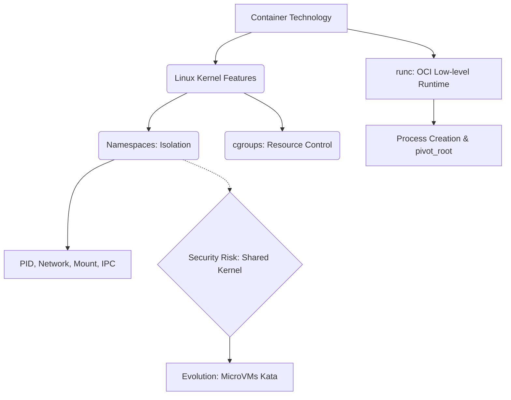

+++
title = "컨테이너 런타임 (runc) HW 네임스페이스"
weight = 667
+++

> 💡 **핵심 인사이트 (3-Line Insight)**
> - 컨테이너 기술은 전통적인 하드웨어 가상화 (Hypervisor) 없이, 리눅스 커널의 네임스페이스 (Namespace)와 제어 그룹 (cgroups)을 이용해 프로세스 수준의 논리적 격리를 제공하는 경량 가상화 기법입니다.
> - runc는 개방형 컨테이너 이니셔티브 (Open Container Initiative, OCI) 표준을 준수하는 저수준 컨테이너 런타임으로, 도커 (Docker)나 쿠버네티스 (Kubernetes)의 지시를 받아 실제 컨테이너 환경을 커널 위에서 생성하고 실행하는 핵심 엔진입니다.
> - 네임스페이스는 컨테이너 내부의 프로세스가 자신만의 독립적인 시스템 자원을 가진 것처럼 착각하게 만드는 '가시성 격리 (Visibility Isolation)'의 핵심 기술입니다.

## Ⅰ. 컨테이너 런타임과 runc의 개요
가상 머신 (Virtual Machine, VM)이 하드웨어 전체를 가상화하여 독립된 운영체제 (Guest OS)를 실행하는 방식이라면, 컨테이너는 호스트 운영체제의 커널을 공유하면서 애플리케이션과 그 종속성 (Dependencies)만을 패키징하여 격리 실행하는 경량화된 기술입니다.
**runc (Run Container)**는 이러한 컨테이너를 실제로 리눅스 시스템에 생성하고 실행하는 역할을 담당하는 '저수준 (Low-level) 컨테이너 런타임'입니다. 사용자가 컨테이너 생성 명령을 내리면, 고수준 런타임을 거쳐 최종적으로 runc가 호출됩니다. runc는 리눅스 커널의 핵심 기능인 **네임스페이스 (Namespace)**와 **제어 그룹 (Control Groups, cgroups)** 시스템 콜 (System Call)을 호출하여 프로세스를 완벽한 격리된 환경 안에 가두고 실행을 시작합니다.

> 📢 **섹션 요약 비유**
> - **건설 현장의 실무 작업반장 (runc):** 건축가(Docker/Kubernetes)가 "여기에 이런 방(컨테이너)을 만들어!"라고 도면을 넘기면, 도면의 표준 규격(OCI)을 보고 실제 벽돌을 쌓고(네임스페이스) 전기를 배분하여(cgroups) 완성된 방을 물리적으로 만들어내는 현장 소장입니다.

## Ⅱ. 리눅스 네임스페이스 (Namespace)의 원리
컨테이너의 '격리' 중 자신이 시스템 전체를 독점하고 있다고 느끼게 만드는 기술이 네임스페이스입니다. 네임스페이스는 전역적인 시스템 리소스를 논리적으로 분할하여 프로세스 그룹마다 별도의 뷰 (View)를 제공합니다.

### 6가지 주요 리눅스 네임스페이스
runc는 컨테이너 생성 시 `clone()` 시스템 콜을 통해 네임스페이스를 생성합니다.
1. **프로세스 식별자 (Process ID, PID) 네임스페이스:** 컨테이너 내부의 첫 프로세스에게 PID 1을 부여합니다.
2. **마운트 (Mount) 네임스페이스:** 컨테이너만의 독립적인 파일 시스템 구조를 가집니다. 특정 디렉토리를 루트(`/`)로 인식하게 합니다.
3. **네트워크 (Network) 네임스페이스:** 독립적인 가상 네트워크 인터페이스, 인터넷 프로토콜 (Internet Protocol, IP) 주소, 라우팅 테이블을 제공합니다.
4. **유닉스 시분할 시스템 (UNIX Time-Sharing, UTS) 네임스페이스:** 컨테이너만의 독립적인 호스트네임 (Hostname)을 가질 수 있게 합니다.
5. **프로세스 간 통신 (Inter-Process Communication, IPC) 네임스페이스:** 프로세스 간 통신 자원을 호스트 및 다른 컨테이너와 격리합니다.
6. **사용자 (User) 네임스페이스:** 컨테이너 내부에서는 루트(root) 권한을 가진 것처럼 보이지만, 실제 호스트 시스템에서는 권한이 제한된 일반 사용자로 매핑되게 하여 보안을 극대화합니다.

> 📢 **섹션 요약 비유**
> - **평행 우주 (Parallel Universe):** 네임스페이스는 프로세스를 평행 우주로 보내는 것과 같습니다. 이 우주 안의 주인공은 자신이 세상을 지배한다고 생각하지만, 실제로는 거대한 우주(호스트 커널) 안의 아주 작은 투명한 방앗간 안에 갇혀 있는 상태입니다.

## Ⅲ. runc의 컨테이너 생성 라이프사이클
runc가 OCI 번들을 기반으로 네임스페이스를 설정하고 컨테이너를 실행하는 과정은 매우 체계적입니다.

1. **초기화 (Init):** runc는 새로운 프로세스를 생성하면서 네임스페이스 플래그를 적용하여 격리된 공간을 만듭니다.
2. **루트 파일 시스템 변경 (pivot_root):** `pivot_root`를 사용하여, 컨테이너 프로세스의 루트 디렉토리를 호스트 파일 시스템에서 컨테이너 이미지의 파일 시스템으로 완전히 교체합니다.
3. **환경 설정:** 네임스페이스 내부에서 가상 네트워크 인터페이스를 설정하고, cgroups 파라미터를 적용하여 리소스 할당량을 설정합니다.
4. **실행 (Exec):** 모든 환경이 준비되면, 컨테이너 내부에 정의된 애플리케이션 진입점 (Entrypoint)을 `execve` 시스템 콜로 덮어씌워 실행을 시작합니다.

> 📢 **섹션 요약 비유**
> - **맞춤형 세트장 구축:** 배우(애플리케이션)가 무대에 오르기 전에, 작업반장(runc)이 빠르게 가벽을 치고(네임스페이스), 외부 풍경을 가짜 배경으로 바꾸고, 소품을 배치한 뒤, "액션!" 하고 큐사인을 보내면 비로소 배우가 자신이 주인공인 줄 알고 연기를 시작하는 과정입니다.

## Ⅳ. 하드웨어 가상화 (VM) vs 네임스페이스 (컨테이너)
전통적인 하드웨어 가상화와 컨테이너 네임스페이스의 차이는 인프라 아키텍처를 변화시켰습니다.

| 구분 | 하드웨어 가상화 (VM) | 컨테이너 (Namespace) |
| :--- | :--- | :--- |
| **격리 수준** | 하드웨어 레벨 (Hardware-level) | 운영체제 레벨 (OS-level) 프로세스 격리 |
| **핵심 기술** | 하이퍼바이저, 메모리 가상화 | 리눅스 커널 Namespace, cgroups |
| **Guest OS 존재** | VM마다 별도의 운영체제 부팅 필요 | 호스트 커널 공유 (Guest OS 없음) |
| **크기 및 부팅** | 기가바이트(GB) 단위, 수 분 소요 | 메가바이트(MB) 단위, 즉시 실행 |
| **보안 (격리 강도)**| 매우 높음 | 상대적으로 낮음 (컨테이너 탈옥 시 커널 전체 위험) |

> 📢 **섹션 요약 비유**
> - **단독 주택 vs 아파트 파티션:** 가상 머신(VM)은 아예 배관이 별도로 설치된 단독 주택들을 새로 지어주는 무거운 방식입니다. 반면 네임스페이스(컨테이너)는 하나의 큰 강당에 가벼운 칸막이(파티션)를 쳐서 빠르게 여러 개의 작은 방을 만들어주는 효율적인 방식입니다.

## Ⅴ. 네임스페이스의 한계와 진화: 샌드박스 컨테이너
네임스페이스 기반의 전통적인 컨테이너는 호스트 커널을 직접 공유하기 때문에, 커널 취약점을 공격하면 호스트 내의 모든 컨테이너가 해킹당하는 단일 장애점 (Single Point of Failure)을 가집니다.
이를 해결하기 위해 등장한 것이 **샌드박스 컨테이너 (Sandboxed Containers)** 기술입니다. 카타 컨테이너 (Kata Containers)와 같은 기술은 겉으로는 가벼운 컨테이너처럼 보이지만, 내부적으로는 하드웨어 가상화(초경량 마이크로 VM)로 각각의 컨테이너를 한 번 더 감싸서 실행합니다.

> 📢 **섹션 요약 비유**
> - **방탄유리 칸막이:** 가벼운 종이 칸막이(네임스페이스)가 찢어질까 불안한 사람들을 위해, 똑같이 가볍게 설치할 수 있지만 총알도 뚫지 못하는 방탄유리 소재의 특수 칸막이(초경량 VM)를 적용하여 안전성을 극대화한 혁신입니다.

### 🧠 지식 그래프 및 하위 비유 (Knowledge Graph & Child Analogy)

- **하위 비유:** 네임스페이스는 마술사의 **"거울 방 (House of Mirrors)"**과 같습니다. 좁은 공간 안에서도 거울의 반사와 착시를 통해, 안에 있는 사람은 자신이 넓고 독립된 거대한 공간을 혼자 차지하고 있다고 완벽하게 착각하게 만듭니다.
