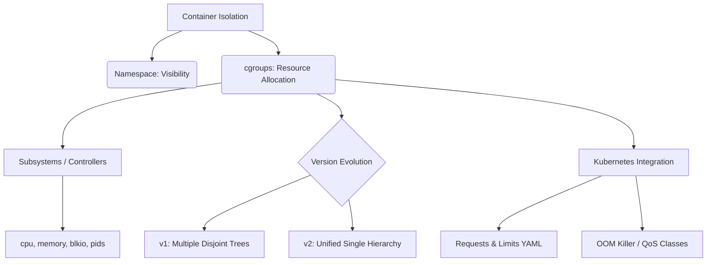

+++
title = "cgroups (Control Groups) 자원 할당"
weight = 668
+++

> 💡 **핵심 인사이트 (3-Line Insight)**
> - 제어 그룹 (Control Groups, cgroups)은 리눅스 커널이 프로세스 그룹별로 중앙 처리 장치 (CPU), 메모리, 디스크 입출력 (I/O) 등 물리적 하드웨어 자원의 사용량을 모니터링하고 제한하는 자원 할당 기술입니다.
> - 네임스페이스 (Namespace)가 컨테이너의 '시각적 격리'를 담당한다면, cgroups는 '물리적 격리'를 통제하여 특정 컨테이너가 시스템 자원을 독점하는 '시끄러운 이웃 (Noisy Neighbor)' 문제를 원천 차단합니다.
> - 최근에는 구조의 복잡성을 줄이고 안전성을 강화한 단일 계층 구조의 cgroup v2가 클라우드 네이티브와 쿠버네티스 생태계의 표준으로 자리 잡았습니다.

## Ⅰ. 제어 그룹 (Control Groups, cgroups)의 개요
컨테이너 가상화 환경에서는 여러 컨테이너가 하나의 호스트 커널과 물리적 하드웨어 위에서 실행됩니다. 만약 특정 컨테이너에 버그가 발생하여 메모리 누수 (Memory Leak)를 일으키거나 CPU를 과도하게 점유한다면, 호스트 시스템이나 다른 컨테이너들이 자원 부족으로 멈추는 **'시끄러운 이웃 (Noisy Neighbor)' 문제**가 발생합니다.
**제어 그룹 (cgroups)**은 이러한 문제를 해결하기 위해 특정 프로세스들의 집합을 묶고, 이 그룹이 사용할 수 있는 최대 리소스(CPU 코어, 메모리 한도, 네트워크 대역폭 등)를 엄격하게 제한하고 제어하는 메커니즘입니다.

> 📢 **섹션 요약 비유**
> - **호텔의 무한 리필 뷔페 통제:** 뷔페(호스트 서버)에서 한 테이블의 대식가 손님(버그가 있는 컨테이너)이 음식을 쓸어 담아 다른 손님들이 굶는 사태를 막기 위해, 지배인(cgroups)이 테이블마다 먹을 수 있는 음식 양(자원 한도)을 정해놓고 제한하는 시스템입니다.

## Ⅱ. cgroups의 주요 서브시스템 (Controllers)
cgroups는 자원을 통제하기 위해 다양한 형태의 '컨트롤러 (Controller)' 모듈을 제공합니다. 관리자는 리눅스의 가상 파일 시스템 (Virtual File System, VFS)에 있는 설정 파일을 통해 제어할 수 있습니다.

### 핵심 컨트롤러 목록
1. **cpu:** 프로세스 그룹이 사용할 수 있는 CPU 시간과 스케줄링 가중치를 조절합니다.
2. **cpuset:** 프로세스를 특정 물리적 CPU 코어 및 특정 메모리 노드에 바인딩하여 성능 간섭을 없앱니다.
3. **memory:** 그룹이 사용할 수 있는 물리 메모리 및 스왑 (Swap) 메모리의 한도를 설정합니다. 초과 시 커널의 메모리 부족 (Out Of Memory, OOM) 킬러 (Killer)가 프로세스를 종료시킵니다.
4. **blkio (Block I/O):** 물리 디스크에 대한 읽기/쓰기 대역폭을 제한합니다.
5. **pids:** 그룹 내에서 생성될 수 있는 프로세스나 스레드의 개수를 제한하여 리소스 고갈 공격을 방어합니다.

> 📢 **섹션 요약 비유**
> - **건물 관리 사무소의 계량기:** CPU 컨트롤러는 각 호실에 공급되는 전력량을 조절하는 차단기이고, Memory 컨트롤러는 수도 사용량 한도를 정해주는 계량기입니다. 한도를 초과하면 단수/단전(OOM Kill) 조치를 취해 건물 전체의 안전을 지킵니다.

## Ⅲ. 계층적 구조와 적용 방식
cgroups는 디렉토리의 트리 구조를 이용하여 계층적 (Hierarchical)으로 자원을 할당합니다.
부모 그룹의 제약 사항은 자식 그룹에 그대로 상속됩니다. 디렉토리에 자원 한도를 기록하고, 실행 중인 프로세스의 PID를 파일에 추가하면 해당 프로세스는 설정된 자원 제약의 지배를 받게 됩니다.

```text
[ Root cgroup (예: 100% CPU, 16GB Memory) ]
      |
      +-- [ docker (예: 제한 8GB Memory) ]
            |
            +-- [ containerA (제한 4GB Memory) ] -> 프로세스 PID 100, 101
            |
            +-- [ containerB (제한 4GB Memory) ] -> 프로세스 PID 200
```

> 📢 **섹션 요약 비유**
> - **기업의 예산 분배 트리:** 본사에서 각 부서에 예산을 할당하고, 부서장은 다시 각 팀에 예산을 쪼개어 내려보내는 하향식 예산 통제 시스템과 동일한 계층 구조를 갖습니다.

## Ⅳ. cgroups v1의 한계와 cgroups v2의 등장
기존 **cgroups v1**은 컨트롤러마다 개별적인 트리 구조를 허용하여, 계층 구조가 심각하게 파편화되고 관리의 복잡성을 유발했습니다.

이를 재설계한 것이 **cgroups v2**입니다.
- **단일 통합 계층:** 모든 프로세스는 오직 하나의 트리(계층 구조)에만 위치할 수 있습니다. 특정 그룹에서 필요한 컨트롤러를 활성화하는 직관적인 방식으로 변경되었습니다.
- **안전성 향상:** 리소스 분배의 모호성을 제거하기 위해 내부 구조를 개선했습니다.

> 📢 **섹션 요약 비유**
> - **통합 멤버십으로:** v1은 마트, 주유소, 영화관 멤버십을 각각 따로 가입하고 관리하느라 지갑이 복잡했던 상태라면, v2는 단 하나의 '통합 스마트 멤버십 카드'로 모든 서비스의 혜택과 제한을 한 곳에서 명확하게 관리하는 현대화된 시스템입니다.

## Ⅴ. 쿠버네티스 (Kubernetes)와 cgroups의 결합
쿠버네티스는 파드 (Pod)의 리소스를 관리하기 위해 cgroups를 활용합니다. `requests`와 `limits` 설정은 컨테이너 런타임을 통해 cgroups 값으로 변환됩니다.
- **요청 (Requests):** 최소한으로 보장받을 수 있는 자원 가중치를 설정합니다.
- **제한 (Limits):** 절대 넘을 수 없는 물리적 한계선을 설정합니다.
- **서비스 품질 (Quality of Service, QoS) 클래스:** 자원 부족 시 OOM 킬러 점수를 조절하여, 중요도가 낮은 파드부터 희생시킵니다 (Guaranteed, Burstable, BestEffort).

> 📢 **섹션 요약 비유**
> - **비행기 좌석 등급:** 비상 상황(메모리 고갈)이 발생하여 짐을 버려야 할 때, 승무원(cgroups)이 규정에 따라 가장 저렴한 표를 산 승객(BestEffort)의 짐부터 밖으로 던져(OOM Kill) 기체 전체를 구합니다.

### 🧠 지식 그래프 및 하위 비유 (Knowledge Graph & Child Analogy)

- **하위 비유:** cgroups는 도로의 **"스마트 통행량 제어 시스템 (Tollgate)"**입니다. 수많은 차들이 고속도로에 진입하려 할 때, 소속 그룹에 따라 진입 차선 수와 제한 속도를 실시간으로 조절하여 도로 전체가 꽉 막히는 교통 마비를 방지합니다.
