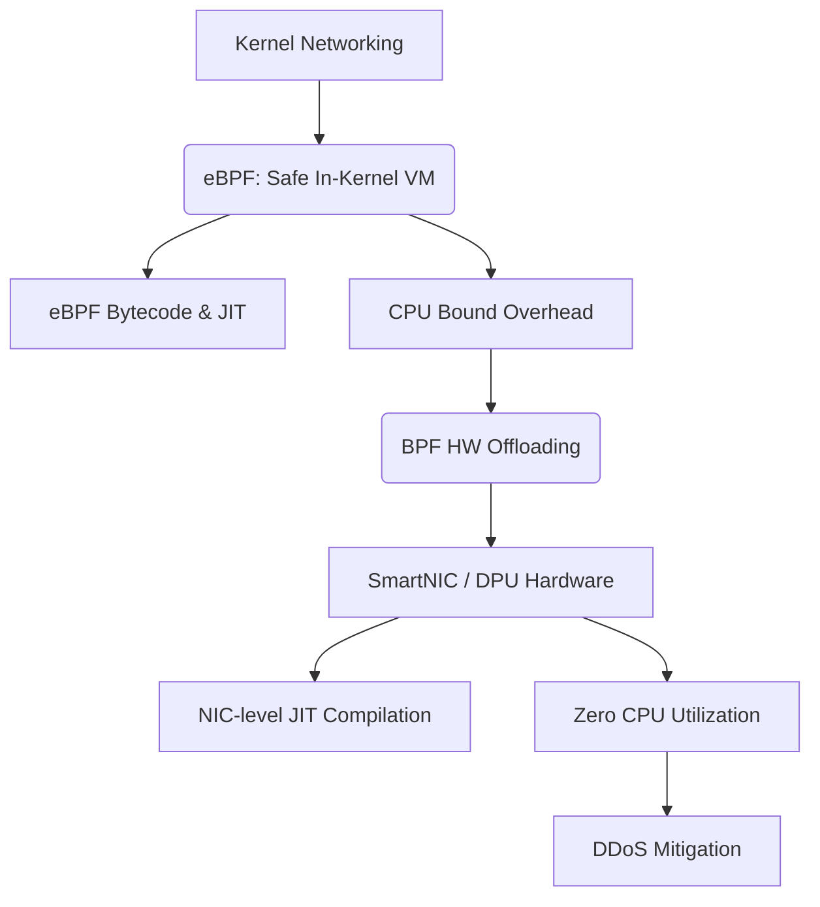

+++
title = "BPF (Berkeley Packet Filter) HW 오프로딩"
weight = 669
+++

> 💡 **핵심 인사이트 (3-Line Insight)**
> - 확장 버클리 패킷 필터 (Extended Berkeley Packet Filter, eBPF)는 리눅스 커널의 소스코드를 수정하지 않고도, 사용자 정의 프로그램을 커널 내부에서 안전하고 빠르게 실행시키는 혁명적인 기술입니다.
> - BPF 하드웨어 오프로딩 (Hardware Offloading)은 커널에서 실행되던 eBPF 프로그램을 중앙 처리 장치 (CPU)가 아닌, 스마트 네트워크 인터페이스 카드 (SmartNIC)나 데이터 처리 장치 (Data Processing Unit, DPU) 하드웨어에 이관하여 실행하는 기술입니다.
> - 이를 통해 호스트 CPU 자원 소모를 '제로(0)'로 만들면서 초고속 네트워크 패킷 필터링과 보안 처리를 가능하게 합니다.

## Ⅰ. 확장 버클리 패킷 필터 (Extended BPF, eBPF) 기술 개요
운영체제의 심장부인 커널 (Kernel)은 보수적이고 안전해야 하므로, 새로운 기능을 추가하려면 소스코드를 수정하거나 커널 모듈을 로드하는 위험을 감수해야 했습니다. 
그러나 **확장 버클리 패킷 필터 (eBPF)**는 "커널을 위한 가상 머신(VM) 및 적시 컴파일러 (Just-In-Time Compiler, JIT)" 역할을 합니다. eBPF 프로그램을 커널에 주입하면, 커널 내부의 검증기 (Verifier)가 안전성을 보장한 후 동적으로 커스텀 코드를 실행할 수 있게 해줍니다.

> 📢 **섹션 요약 비유**
> - **인체 내 나노 로봇 (eBPF):** 과거에는 환자(운영체제)를 고치기 위해 개복 수술(커널 수정)을 해야 했습니다. eBPF는 수술 없이 혈관에 주입할 수 있는 지능형 나노 로봇으로, 실시간으로 문제를 진단하고 치료하면서도 부작용을 일으키지 않도록 검증됩니다.

## Ⅱ. 호스트 CPU의 병목과 BPF 하드웨어 오프로딩
네트워크 속도가 비약적으로 증가하면서 호스트 서버의 메인 CPU가 패킷을 처리하느라 정작 중요한 애플리케이션 처리를 하지 못하는 병목 현상이 발생했습니다.
이를 해결하는 기술이 **BPF 하드웨어 오프로딩 (HW Offloading)**입니다. eBPF 프로그램의 실행 위치를 서버 CPU에서 떼어내어, 네트워크 카드(NIC)에 내장된 스마트닉 (SmartNIC) 하드웨어 칩셋 내부로 옮겨 하드웨어적으로 실행하는 기술입니다.

> 📢 **섹션 요약 비유**
> - **본사의 외주화 정책:** 쏟아지는 서류를 본사 핵심 직원(메인 CPU)이 처리하느라 업무가 마비되었습니다. 그래서 이 초고속 처리 절차서(eBPF)를 아예 안내데스크의 자동화 기기(스마트닉 하드웨어)에 이식하여 본사 직원은 이 업무에서 완전히 손을 떼게 만든 것과 같습니다.

## Ⅲ. BPF 하드웨어 오프로딩 동작 원리
BPF 오프로딩이 가능한 이유는 eBPF가 특정한 하드웨어 아키텍처에 종속되지 않는 범용 바이트코드 (Bytecode) 형태이기 때문입니다.

```text
[ eBPF 소스코드 (C/Rust) ] -> (LLVM 컴파일) -> [ eBPF 바이트코드 ]
                                                   |
[ 리눅스 커널 (Verifier 검증) ] <---------------------+
       |
       v (JIT 컴파일 대상을 SmartNIC으로 지정)
[ 스마트닉 장치 드라이버 (Device Driver) ]
       |
       v (하드웨어 기계어로 변환)
[ 스마트닉 / DPU 하드웨어 칩셋 ]  <-- 초고속 패킷 필터링 실행
```

1. 커널 로드 시, 대상을 하드웨어 오프로드 장치로 지정하면 네트워크 카드의 장치 드라이버가 코드를 가로챕니다.
2. 장치 드라이버는 범용 eBPF 바이트코드를 하드웨어 칩셋이 이해할 수 있는 기계어 (Machine Code)로 동적 변환(JIT)하여 적재합니다.
3. 랜선을 통해 패킷이 도착하는 즉시, 실리콘 칩셋이 하드웨어 속도로 로직을 실행하여 호스트 CPU 개입 없이 패킷을 처리합니다.

> 📢 **섹션 요약 비유**
> - **동시통역과 설계도 제작:** 범용 설계도(eBPF 바이트코드)를 현장 감독관(드라이버)이 공장 기계가 알아먹을 수 있는 전용 도면(하드웨어 기계어)으로 번역하여 기계에 꽂아 넣습니다. 공장은 본사 지시 없이 독립적으로 불량품을 골라냅니다.

## Ⅳ. 주요 활용 사례: DDoS 방어와 클라우드
하드웨어 오프로딩은 데이터센터 환경에서 극단적인 효율성을 발휘합니다.
1. **분산 서비스 거부 (Distributed Denial of Service, DDoS) 공격 방어:** 악의적인 공격 트래픽이 유입될 때, 커널이나 CPU에 닿기 전 랜카드 하드웨어 단에서 초고속으로 필터링하여 즉시 폐기(Drop)시킵니다.
2. **클라우드 네이티브 라우팅:** 파드(Pod) 간의 로드 밸런싱과 방화벽 정책을 하드웨어로 오프로딩하여 통신 지연을 극단적으로 낮춥니다.

> 📢 **섹션 요약 비유**
> - **성벽 외부의 방어선:** 대규모 미사일 공격을 성 안의 기사들(CPU)이 막는 대신, 성문 밖의 자동 방어 포탑(오프로딩된 NIC)이 실시간으로 요격하여 성 내부를 완벽히 방어합니다.

## Ⅴ. 기술적 한계 및 미래 방향 (DPU 시대)
**한계:**
하드웨어 칩의 한정된 메모리와 레지스터 제약으로 인해 너무 복잡한 eBPF 프로그램은 오프로드될 수 없습니다. 복잡한 연결 추적 상태를 유지하기도 어렵습니다.

**미래 (DPU의 부상):**
CPU 코어, 하드웨어 가속기를 독자적으로 갖춘 **데이터 처리 장치 (DPU)**가 인프라의 중심으로 떠오르고 있습니다. 미래의 오프로딩은 보안 샌드박스 전체를 DPU로 이주시켜 **제로 트러스트 (Zero-Trust)** 인프라를 달성하는 방향으로 진화하고 있습니다.

> 📢 **섹션 요약 비유**
> - **초소형 컴퓨터의 이식:** 단순한 계산기를 달아주는 수준에서 벗어나, 랜선 바로 뒤에 작고 강력한 두뇌(DPU)를 아예 심어버립니다. 메인 뇌(CPU)는 연산만 하고, 잡다한 인프라 관리는 이 두 번째 뇌가 전담합니다.

### 🧠 지식 그래프 및 하위 비유 (Knowledge Graph & Child Analogy)

- **하위 비유:** BPF 하드웨어 오프로딩은 스마트폰의 **"항시 대기 음성 인식 칩"**과 같습니다. 특정 단어만 감지하는 초저전력 전용 하드웨어 칩(오프로드된 BPF)에 이 기능을 맡겨, 평소에는 CPU가 깊은 잠을 잘 수 있게 해주는 원리입니다.
