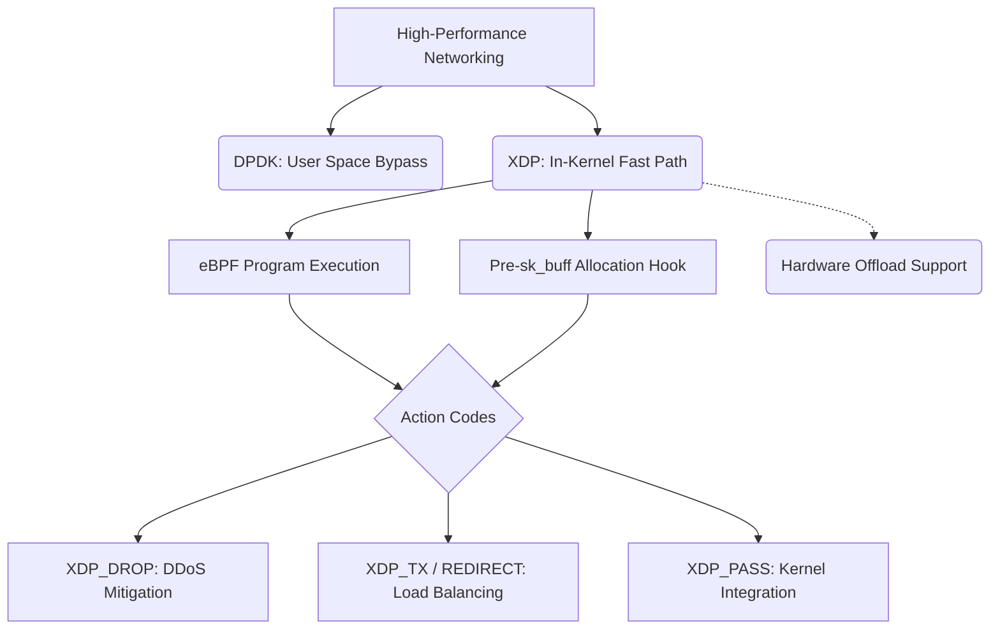

+++
title = "XDP (eXpress Data Path)"
weight = 670
+++

> 💡 **핵심 인사이트 (3-Line Insight)**
> - 익스프레스 데이터 패스 (eXpress Data Path, XDP)는 리눅스 커널에서 네트워크 패킷을 처리하는 방식 중 가장 낮은 레벨 (NIC 드라이버 직후)에 위치하여 극단적인 성능을 제공하는 확장 버클리 패킷 필터 (Extended Berkeley Packet Filter, eBPF) 기반 고성능 데이터 경로 기술입니다.
> - 커널 네트워크 스택의 무거운 데이터 구조체가 할당되기도 전에 패킷을 가로채어 분석, 폐기 (Drop), 통과 (Pass)시킴으로써 패킷 처리 지연을 제로에 가깝게 만듭니다.
> - 완전한 커널 바이패스 (Kernel Bypass) 기술과 달리, 리눅스 커널의 기존 네트워크 보안 및 라우팅 기능을 조화롭게 활용할 수 있는 뛰어난 유연성을 갖추고 있습니다.

## Ⅰ. XDP (eXpress Data Path)의 개요
전통적인 리눅스 네트워크 스택은 패킷이 도착한 후 메모리에 거대한 데이터 구조체를 할당하고 수많은 커널 레이어를 거치며 처리됩니다. 이러한 구조는 고속 네트워크 환경에서 심각한 성능 병목이 됩니다.
이를 회피하기 위한 기술도 있지만 기존 리눅스 생태계 통합에 어려움이 있습니다.
**익스프레스 데이터 패스 (XDP)**는 패킷이 랜카드 인터페이스를 통해 시스템 메모리에 도착한 가장 **초기 단계 (Early Hook)**에서 사용자 정의 eBPF 프로그램을 실행합니다. 커널의 무거운 메커니즘이 시작되기 전에 패킷의 운명을 결정짓는 '초고속 데이터 고속도로'입니다.

> 📢 **섹션 요약 비유**
> - **입국 심사대의 사전 분류 시스템:** XDP는 정식 입국 심사대(리눅스 커널 스택)에 사람들이 줄을 서기도 전에, 비행기 문(NIC 인터페이스) 바로 앞에서 1초 만에 서류를 보고 수상한 사람을 그 자리에서 쫓아내거나 특정 지역으로 보내는 초고속 사전 검열 요원입니다.

## Ⅱ. XDP의 동작 위치와 핵심 아키텍처
XDP의 본질은 패킷을 다루는 '위치'의 극단적인 전진 배치에 있습니다.

```text
[ 물리적 네트워크 카드 (Physical NIC) ]
      |
      v
[ NIC 장치 드라이버 (Device Driver) ]
      |  <======== ** [ XDP Hook (eBPF 프로그램 실행) ] ** ========>
      |            |-- XDP_DROP (즉시 폐기)
      |            |-- XDP_TX (들어온 포트로 즉시 재전송)
      |            |-- XDP_REDIRECT (다른 포트나 CPU로 전달)
      |            |-- XDP_PASS (커널 네트워크 스택으로 정상 전달)
      v
[ 데이터 구조체 (sk_buff) 할당 등 무거운 커널 작업 시작 ]
```
XDP 프로그램은 위 액션 코드 중 하나를 반환하여 패킷을 처리합니다. 필요 없는 패킷은 메모리 할당 비용을 치르기 전에 `XDP_DROP`을 통해 폐기할 수 있습니다.

> 📢 **섹션 요약 비유**
> - **택배 물류 센터의 입구 컷:** 택배가 컨베이어 벨트에 올라가 전산망에 등록되기 전에, 트럭 하역장에서 곧바로 송장만 바코드 스캐너로 읽어 반품, 폐기, 혹은 상차해버리는 극강의 물류 최적화입니다.

## Ⅲ. XDP의 주요 실행 모드
하드웨어 지원 여부에 따라 XDP는 세 가지 모드로 동작합니다.

1. **네이티브 (Native) XDP:** 네트워크 카드의 리눅스 장치 드라이버 내부에서 코드가 실행됩니다. 커널 스택을 우회하므로 성능이 뛰어납니다.
2. **오프로드 (Offloaded) XDP:** XDP 프로그램이 서버의 CPU를 떠나 스마트 네트워크 인터페이스 카드 (SmartNIC) 내부로 오프로드되어 하드웨어 로직으로 직접 실행됩니다. 호스트 CPU 사용률이 전혀 발생하지 않습니다.
3. **제네릭 (Generic) XDP:** 드라이버가 XDP를 지원하지 않을 경우 소프트웨어적으로 에뮬레이션하여 실행합니다. 테스트 용도이며 네이티브 수준의 성능 향상은 없습니다.

> 📢 **섹션 요약 비유**
> - **게임의 그래픽 처리 방식:** Offloaded XDP는 외장 그래픽카드(GPU)가 연산을 전담하는 것이고, Native XDP는 내장 그래픽이 효율적으로 처리하는 것이며, Generic XDP는 순수 소프트웨어 연산으로 그리는 느린 방식(테스트용)과 같습니다.

## Ⅳ. XDP vs DPDK 비교
고성능 네트워크 생태계에서 데이터 평면 개발 키트 (Data Plane Development Kit, DPDK)와 XDP는 자주 비교됩니다.

| 구분 | XDP (eXpress Data Path) | DPDK (Data Plane Development Kit) |
| :--- | :--- | :--- |
| **처리 위치** | 커널 공간 (드라이버 레벨) | 사용자 공간 (커널 완전 우회) |
| **커널 연계** | 기존 커널 라우팅, 방화벽 재활용 가능 | 커널 기능 사용 불가, 직접 구현 필요 |
| **CPU 점유** | 이벤트 구동 (필요할 때만 점유) | 폴링 (패킷이 없어도 지속적 점유) |

최근 트렌드는 둘을 결합하여, 패킷을 초고속으로 필터링한 후 사용자 공간 애플리케이션 메모리로 직접 쏘아 보내는(Zero-Copy) 방식을 사용합니다.

> 📢 **섹션 요약 비유**
> - **XDP는 똑똑한 교통 경찰, DPDK는 전용 고속도로:** DPDK는 기존 국도를 부수고 사설 고속도로를 깔아 무조건 차를 빨리 달리게 만들지만 유지보수가 힘듭니다. 반면 XDP는 기존 국도 톨게이트에 초능력을 가진 교통 경찰을 세워, 기존 도로 시스템을 그대로 유지하면서 정리하는 스마트한 방식입니다.

## Ⅴ. XDP의 대표적인 활용 사례
1. **소프트웨어 정의 로드 밸런서:** 들어오는 패킷의 헤더만 XDP로 신속하게 조작하여 백엔드 서버로 즉시 전달(REDIRECT)함으로써 엄청난 트래픽을 처리합니다.
2. **초고속 DDoS 방어:** 공격 패킷의 특징을 감지하자마자 마이크로초 이내에 폐기(DROP) 시켜버립니다.
3. **네트워크 모니터링:** 패킷 통계를 수집하고 정상 통과(PASS)시킵니다. CPU에 부담을 주지 않는 투명한 모니터링이 가능합니다.

> 📢 **섹션 요약 비유**
> - **레이저 요격 시스템과 분류기:** 대규모 공격이 오면 빛의 속도로 요격해버리고, 일반 우편물(정상 트래픽)은 도착하자마자 목적지 주소를 읽어 물류 센터로 자동 분류해 주는 현대 마법과 같은 만능 도구입니다.

### 🧠 지식 그래프 및 하위 비유 (Knowledge Graph & Child Analogy)

- **하위 비유:** XDP는 **"응급실 입구의 트리아지 (Triage) 전문의"**와 같습니다. 환자(패킷)가 복잡한 수속(커널 네트워크 스택)을 밟기 전에, 문 앞에서 단 1초 만에 상태를 파악하여 즉시 돌려보내거나(DROP), 다른 전문 병원으로 이송하거나(REDIRECT), 일반 대기실로 들여보내는 결정적인 역할을 수행합니다.
