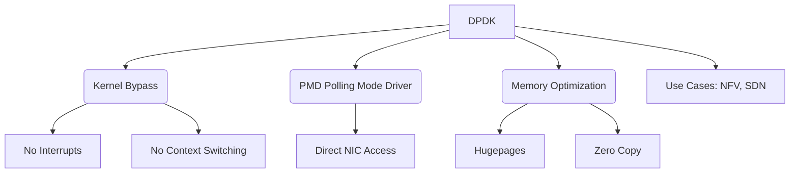

+++
title = "DPDK (Data Plane Development Kit)"
weight = 671
+++

> **DPDK (Data Plane Development Kit)의 핵심 통찰**
> 운영체제 커널의 개입 없이 패킷을 사용자 공간에서 직접 처리하여 네트워크 I/O 성능을 극대화한다.
> 폴링 모드 드라이버(PMD)를 사용하여 인터럽트 오버헤드를 제거하고 지연 시간을 최소화한다.
> NFV(Network Functions Virtualization) 및 고성능 소프트웨어 정의 네트워크(SDN) 환경의 필수 기술이다.

### Ⅰ. 개요 및 정의
DPDK (Data Plane Development Kit)는 범용 프로세서(CPU, Central Processing Unit) 상에서 빠른 패킷 처리를 위해 최적화된 데이터 플레인(Data Plane) 라이브러리 및 네트워크 인터페이스 컨트롤러(NIC, Network Interface Controller) 드라이버의 집합입니다. 전통적인 네트워크 처리는 커널 공간(Kernel Space)의 네트워크 스택을 거쳐야 하므로 문맥 교환(Context Switch)과 인터럽트(Interrupt) 처리로 인한 오버헤드가 발생하지만, DPDK는 커널을 우회(Bypass)하여 사용자 공간(User Space)에서 직접 네트워크 패킷을 송수신함으로써 초고속 패킷 처리를 가능하게 합니다.

📢 **섹션 요약 비유:** 택배 상하차를 할 때, 본사(운영체제 커널)의 결재를 일일이 받지 않고 현장 작업자(사용자 공간 어플리케이션)가 트럭(NIC)에서 직접 택배를 내리고 분류하는 것과 같습니다.

### Ⅱ. 아키텍처 및 동작 원리
DPDK의 핵심은 커널 우회(Kernel Bypass)와 PMD (Polling Mode Driver)에 있습니다.

```ascii
+-----------------------------------------------------------+
| User Space Application (NFV, SDN, vRouter, Load Balancer) |
+-------------+-----------------------+---------------------+
|             | DPDK Environment Abstraction Layer (EAL)    |
| Packet Rx/Tx+-----------------------+---------------------+
| Processing  | PMD (Polling Mode)    | Memory Management   |
| (Ring Buff) | Driver                | (Hugepages)         |
+-------------+-----------------------+---------------------+
      | direct memory access                  | mapping
+-----+---------------------------------------+-------------+
| Kernel Space (Bypassed)                                   |
| (No Interrupts, No Protocol Stack processing for DPDK)    |
+-----------------------------------------------------------+
      | PCIe bus
+-----+-----------------------------------------------------+
| NIC (Network Interface Controller)                        |
| - HW queues directly accessed by PMD via DMA              |
+-----------------------------------------------------------+
```

1. **EAL (Environment Abstraction Layer):** 하드웨어와 운영체제 환경을 추상화하여, 상위 애플리케이션이 하드웨어 세부 사항을 알지 못해도 구동되도록 지원합니다. 메모리 할당, 스레드 초기화, PCI 디바이스 접근 등을 관리합니다.
2. **PMD (Polling Mode Driver):** 기존 인터럽트 방식 대신 CPU 코어가 NIC의 수신 큐를 지속적으로 폴링(Polling)하여 패킷 도착 여부를 확인합니다. 이는 인터럽트 핸들링 오버헤드를 완전히 제거합니다.
3. **Hugepages 및 NUMA (Non-Uniform Memory Access) 최적화:** 대용량 메모리 페이지(Hugepages)를 사용하여 TLB (Translation Lookaside Buffer) 미스 비율을 줄이고, 메모리 접근이 해당 코어가 속한 NUMA 노드 내에서 이루어지도록 최적화합니다.

📢 **섹션 요약 비유:** 택배 기사가 벨을 누를 때까지 기다리는 것(인터럽트)이 아니라, 문 밖에서 트럭이 도착했는지 계속 쳐다보고 있다가 오자마자 즉시 물건을 받아오는(폴링) 시스템입니다.

### Ⅲ. 주요 기술 요소 및 특징
- **Lockless Queues:** 여러 스레드가 패킷 버퍼 링(Ring)에 접근할 때 락(Lock)을 사용하지 않고 CAS(Compare-and-Swap) 명령어 등을 활용하여 병목을 없앱니다.
- **Memory Pools (Mempool):** 패킷 버퍼를 미리 할당해 두고 재사용함으로써 동적 메모리 할당(Dynamic Memory Allocation)에 따른 성능 저하를 방지합니다.
- **Zero Copy 패킷 전송:** 네트워크 카드(NIC)의 메모리 버퍼에서 애플리케이션 메모리로 패킷을 복사하지 않고, DMA(Direct Memory Access)를 통해 직접 패킷 데이터 포인터를 넘겨주어 메모리 대역폭 소모를 막습니다.
- **CPU Affinity (Core Pinning):** 특정 스레드를 특정 CPU 코어에 고정(Pinning)하여 캐시 로컬리티(Cache Locality)를 높이고 문맥 교환을 억제합니다.

📢 **섹션 요약 비유:** 작업자들이 매번 빈 박스를 사오는 대신, 미리 준비해둔 박스 더미(Mempool)를 재사용하고, 담당 구역(CPU 코어)을 고정하여 작업 효율을 극대화하는 방식입니다.

### Ⅳ. 응용 사례 및 비교
- **통신사 NFV (Network Functions Virtualization):** 가상화된 라우터, 방화벽, EPC (Evolved Packet Core) 등에서 트래픽 처리 성능을 하드웨어 어플라이언스 수준으로 끌어올리기 위해 사용됩니다.
- **고성능 로드 밸런서:** 대량의 클라이언트 연결과 짧은 지연 시간이 요구되는 클라우드 데이터센터 인프라에서 활용됩니다. (예: Nginx, HAProxy의 고속화 확장)
- **비교 (전통적 Linux Network Stack vs DPDK):** 전통적 스택은 유연성과 범용성이 뛰어나지만 대량 패킷(10Gbps, 40Gbps 이상) 환경에서 병목이 발생합니다. 반면 DPDK는 100Gbps 이상의 회선에서도 라인 레이트(Line Rate) 처리가 가능하지만, 프로토콜 스택을 애플리케이션 레벨에서 별도로 구현해야 하는 개발 복잡도가 따릅니다.

📢 **섹션 요약 비유:** 전통적인 스택이 다양한 화물을 꼼꼼히 검수하는 일반 우체국이라면, DPDK는 엄청난 양의 표준 규격 택배를 빛의 속도로 스캔하고 넘기는 대규모 자동화 물류 센터입니다.

### Ⅴ. 결론 및 향후 전망
DPDK는 x86 및 ARM 기반 범용 서버에서 하드웨어 스위치와 맞먹는 네트워크 패킷 처리 능력을 제공하며 클라우드 컴퓨팅과 5G 네트워크 인프라의 핵심 기술로 자리 잡았습니다. 향후에는 SmartNIC 및 DPU (Data Processing Unit)와 결합하여 CPU의 부하를 하드웨어 오프로딩(Offloading)으로 더욱 분산시키는 방향으로 발전할 것입니다. 또한 클라우드 네이티브(Cloud-Native) 환경을 위한 사용자 공간 네트워크 스택(e.g., VPP, F-Stack)과의 통합이 계속 가속화될 전망입니다.

📢 **섹션 요약 비유:** 고속도로 톨게이트(서버 네트워크)에서 하이패스 전용 차로(DPDK)가 도입되어 차량(패킷)이 정차 없이 통과하듯, 미래 인프라에서도 고속 데이터 처리의 기본 표준이 될 것입니다.

---

### Knowledge Graph & Child Analogy



**Child Analogy:**
장난감 기차를 가지고 놀 때, 역장님(운영체제)에게 매번 "기차 출발해도 되나요?" 묻고 출발하면 너무 느리잖아요? DPDK는 역장님 허락 없이 내가 직접 기차선로 스위치를 잡고 기차가 오는 즉시 바로바로 다른 선로로 쌩쌩 보내주는 '초고속 직행 철도 컨트롤러'와 같아요!