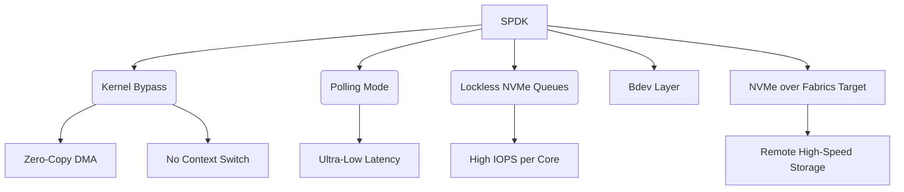

+++
title = "SPDK (Storage Performance Development Kit)"
weight = 672
+++

> **SPDK (Storage Performance Development Kit)의 핵심 통찰**
> NVMe 스토리지의 성능을 극한으로 끌어올리기 위해 고안된 사용자 공간(User Space) 라이브러리이다.
> 스토리지 I/O 처리에서 운영체제 커널의 개입, 인터럽트, 문맥 교환을 배제하는 폴링 모드(Polling Mode)를 적용한다.
> 초당 수백만 번의 I/O 작업(IOPS)을 매우 낮은 지연 시간으로 처리하여 차세대 데이터센터 스토리지 백엔드의 표준이 되고 있다.

### Ⅰ. 개요 및 정의
SPDK (Storage Performance Development Kit)는 인텔(Intel) 주도로 개발된 오픈 소스 라이브러리와 도구들의 집합으로, 고성능 플래시 스토리지 매체, 특히 NVMe (Non-Volatile Memory Express) SSD의 잠재력을 최대한 활용하기 위해 설계되었습니다. DPDK (Data Plane Development Kit)의 철학을 스토리지 영역으로 확장한 것으로, 애플리케이션이 운영체제 커널(OS Kernel)과 스토리지 스택을 거치지 않고 직접 스토리지 하드웨어와 통신하도록 하여 오버헤드를 혁신적으로 줄입니다.

📢 **섹션 요약 비유:** 식당에서 웨이터(운영체제 커널)를 통해 주방에 주문을 넣지 않고, 손님(애플리케이션)이 주방장(NVMe SSD)과 직접 다이렉트로 소통하여 요리를 즉각 받아내는 시스템입니다.

### Ⅱ. 아키텍처 및 동작 원리
SPDK는 커널 스토리지 스택(VFS, Block Layer, NVMe Driver 등)을 우회(Bypass)합니다.

```ascii
+-------------------------------------------------------------+
| User Space Application (Database, Storage Target, SDS)      |
+-------------------+--------------------+--------------------+
| SPDK Bdev Layer   | SPDK NVMe-oF Target| SPDK vhost         |
+-------------------+--------------------+--------------------+
| SPDK NVMe Driver (User Space, Polled-mode, Lockless)        |
+-------------------------------------------------------------+
| User Space Memory (Hugepages, DMA directly mapped to SSD)   |
+-------------------------------------------------------------+
      | PCIe bus (Direct Hardware Access)
+-----+-------------------------------------------------------+
| NVMe SSD (Hardware)                                         |
+-------------------------------------------------------------+
(Kernel Space is entirely bypassed during data transfer)
```

1. **사용자 공간 드라이버 (User Space Driver):** SPDK NVMe 드라이버는 사용자 공간에서 실행되며 하드웨어 레지스터에 직접 접근합니다.
2. **폴링 모드 (Polled-mode Execution):** 스토리지의 응답(Completion)을 기다릴 때 인터럽트(Interrupt)를 사용하지 않고 스레드가 지속적으로 완료 큐(Completion Queue)를 폴링하여 확인합니다.
3. **락리스 큐 (Lockless Queues):** 코어별로 독립적인 I/O 큐(NVMe Queue Pair)를 할당하여 스레드 간 락(Lock) 경합 없이 병렬 I/O 처리가 가능합니다.
4. **Zero-Copy:** 데이터가 애플리케이션 버퍼와 SSD 사이에 DMA(Direct Memory Access)를 통해 직접 전송되어 CPU 복사 연산이 없습니다.

📢 **섹션 요약 비유:** 택배 도착 알림 문자(인터럽트)를 기다리지 않고, 배송 조회 화면을 계속 새로고침(폴링)하다가 도착 즉시 직접 수령하여 처리 속도를 최고로 높인 방식입니다.

### Ⅲ. 주요 기술 요소 및 특징
- **NVMe-oF (NVMe over Fabrics) 타겟:** RDMA나 TCP 네트워크를 통해 원격지에 있는 NVMe SSD를 마치 로컬 디스크처럼 초저지연으로 접근하게 해주는 기능입니다.
- **Bdev (Block Device) 추상화 계층:** 다양한 백엔드 스토리지(로컬 NVMe, 원격 NVMe-oF, Ceph RBD 등)를 동일한 블록 디바이스 인터페이스로 묶어 상위 애플리케이션에 제공합니다.
- **vhost-user:** 가상 머신(VM, Virtual Machine)에 SPDK로 구동되는 가상 스토리지 디바이스(vhost-scsi, vhost-blk)를 제공하여 VM 스토리지 I/O 성능을 극대화합니다.
- **CPU 오버헤드 최소화:** IOPS(Input/Output Operations Per Second)당 소모되는 CPU 사이클이 커널 드라이버 대비 획기적으로 낮아 컴퓨팅 자원을 애플리케이션 자체 로직에 집중할 수 있습니다.

📢 **섹션 요약 비유:** 여러 개의 다른 창고(로컬 SSD, 원격 스토리지)를 통합 관리하는 만능 관리자(Bdev)가 있어서, 사용자는 창고 위치에 상관없이 가장 빠른 속도로 물건을 꺼내 쓸 수 있습니다.

### Ⅳ. 응용 사례 및 비교
- **클라우드 데이터센터 스토리지:** AWS, Azure 등 퍼블릭 클라우드 환경에서 블록 스토리지 서비스(EBS 등)의 백엔드를 구성하여 초고성능을 보장합니다.
- **SDS (Software Defined Storage):** 분산 스토리지 솔루션 노드 내부의 디스크 I/O 엔진으로 사용되어 병목을 제거합니다.
- **데이터베이스 가속:** 고성능 NoSQL 데이터베이스(ScyllaDB, Aerospike 등)가 SPDK를 직접 연동하여 I/O 대기 시간을 마이크로초(µs) 단위로 단축합니다.
- **비교 (Kernel NVMe vs SPDK):** 단일 NVMe SSD는 초당 수십만 번의 I/O를 처리할 수 있지만, 커널 드라이버를 사용하면 소프트웨어 오버헤드가 병목이 됩니다. SPDK는 하드웨어 한계치까지 I/O 대역폭과 IOPS를 선형적으로 끌어올립니다.

📢 **섹션 요약 비유:** 일반 스포츠카(SSD)를 꽉 막힌 시내 도로(커널 스택)에서 모는 대신, F1 전용 서킷(SPDK)에서 최고 속도로 달릴 수 있게 환경을 만들어 주는 것입니다.

### Ⅴ. 결론 및 향후 전망
NVMe 스토리지의 등장으로 스토리지 장치의 속도가 메인 메모리 속도에 근접해짐에 따라, 전통적인 커널 기반 I/O 스택은 더 이상 적합하지 않게 되었습니다. SPDK는 이러한 "소프트웨어 병목" 문제를 해결하는 사실상의 산업 표준(De facto standard)이 되었습니다. 향후 PCIe Gen5, CXL (Compute Express Link)과 같은 차세대 인터페이스의 확산에 발맞추어 데이터센터 I/O 아키텍처의 중심축으로서 지속 발전할 것입니다.

📢 **섹션 요약 비유:** 마차에서 자동차로 엔진이 바뀌었으니 달리는 길도 비포장도로에서 고속도로로 바꾸어야 하듯, SPDK는 차세대 초고속 스토리지를 위한 필수 고속도로입니다.

---

### Knowledge Graph & Child Analogy



**Child Analogy:**
장난감을 상자에서 꺼낼 때 엄마(운영체제)한테 "상자 열어주세요" 부탁하지 않고, 내가 직접 열쇠(SPDK)를 가지고 상자를 계속 쳐다보다가 장난감이 보이면 바로 낚아채는(Polling) 방식이에요. 기다리는 시간 없이 가장 빨리 장난감을 꺼내 놀 수 있어요!