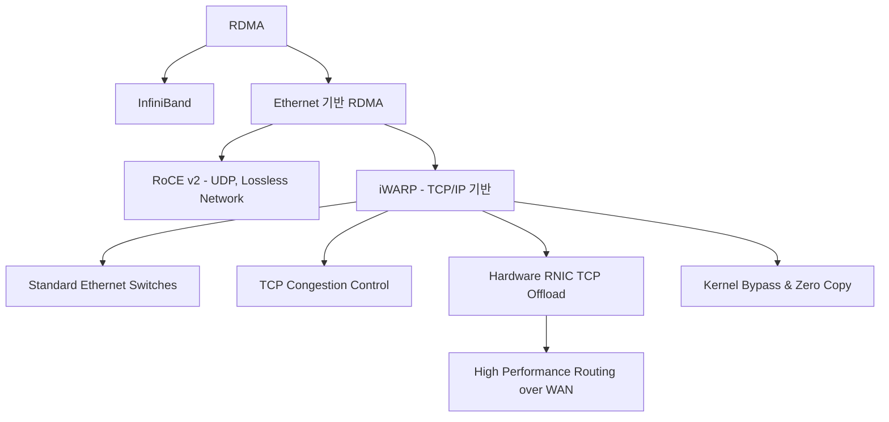

+++
title = "RDMA iWARP 프로토콜"
weight = 673
+++

> **RDMA iWARP 프로토콜의 핵심 통찰**
> 이더넷/TCP/IP 표준 인프라 위에서 RDMA(Remote Direct Memory Access) 기능을 구현한 프로토콜이다.
> 서버 간 메모리 데이터 전송 시 CPU 개입과 복사 과정을 생략하여 초저지연 통신을 달성한다.
> 스위치나 라우터 같은 기존 이더넷 네트워크 장비를 그대로 활용할 수 있어 범용성과 도입 용이성이 높다.

### Ⅰ. 개요 및 정의
RDMA (Remote Direct Memory Access)는 네트워크로 연결된 두 컴퓨터 간에 호스트 CPU, 캐시, 운영체제 커널의 개입 없이 메모리(Memory)에서 메모리로 데이터를 직접 읽고 쓰는 기술입니다. **iWARP (Internet Wide Area RDMA Protocol)**은 이러한 RDMA 기능을 기존의 범용 TCP/IP 네트워크 스택 위에서 구현한 프로토콜입니다. iWARP는 하드웨어 오프로딩(Hardware Offloading)을 지원하는 RNIC (RDMA-enabled NIC)을 사용하여, TCP/IP의 신뢰성과 혼잡 제어(Congestion Control) 기능을 유지하면서도 제로 카피(Zero-Copy)와 커널 우회(Kernel Bypass)의 장점을 제공합니다.

📢 **섹션 요약 비유:** 두 회사 사이의 우편물을 각 회사의 비서실(CPU, 커널)을 거치지 않고 상대방 사장님의 책상(메모리)에 직접 꽂아두는 획기적인 문서 직통 전달 시스템입니다.

### Ⅱ. 아키텍처 및 동작 원리
iWARP 계층은 표준 TCP/IP 위에서 동작하며, 데이터 전송은 RNIC 하드웨어에 의해 처리됩니다.

```ascii
+-----------------------------------------------------------+
| Application Memory Buffer (User Space)                    |
+-----------------------------------------------------------+
| RDMA Verbs API (libibverbs, OS Bypass)                    |
+-----------------------------------------------------------+
| iWARP RDMA Layers (RDMAP, DDP, MPA)  [Implemented in RNIC]|
| - RDMAP: RDMA Protocol (Read/Write semantics)             |
| - DDP: Direct Data Placement (Places data into memory)    |
| - MPA: Marker PDU Aligned Framing (Adapts DDP to TCP)     |
+-----------------------------------------------------------+
| TCP / IP / Ethernet Layer            [Implemented in RNIC]|
+-----------------------------------------------------------+
| Hardware RNIC (RDMA Network Interface Controller)         |
+-----------------------------------------------------------+
```

1. **OS Bypass & Zero-Copy:** 애플리케이션은 운영체제를 거치지 않고 하드웨어(RNIC) 큐에 직접 명령을 내립니다. RNIC는 송신 측 메모리에서 DMA로 데이터를 읽어 수신 측 호스트의 지정된 메모리 주소로 직접 DMA를 수행합니다.
2. **MPA (Marker PDU Aligned Framing):** TCP 바이트 스트림(Byte stream) 환경에서 메시지의 경계(Boundary)를 식별하기 위해 마커를 삽입하여, 스트림 기반의 TCP 위에서도 메시지 지향적인 RDMA 전송을 가능하게 합니다.
3. **DDP (Direct Data Placement):** 수신된 패킷을 분석하여 CPU 개입 없이 애플리케이션의 메모리 버퍼 정확한 위치에 데이터를 조립(Placement)합니다.
4. **TCP Offload Engine (TOE):** iWARP는 복잡한 TCP/IP 처리를 CPU가 아닌 RNIC 하드웨어 내에서 오프로딩하여 수행합니다.

📢 **섹션 요약 비유:** 일반 택배 트럭(TCP/IP)을 이용하지만, 상하차 작업은 운전기사(CPU)가 하지 않고 물류센터의 첨단 로봇 팔(RNIC, DDP)이 알아서 분류하고 선반(메모리)에 정확히 올려놓는 것과 같습니다.

### Ⅲ. 주요 기술 요소 및 특징
- **기존 네트워크 장비 호환성:** 특수한 스위치(예: InfiniBand 스위치)나 무손실 네트워크(Lossless Network) 설정(예: RoCE의 PFC, ECN 요구사항) 없이 표준 이더넷 라우터 및 스위치 환경에서 작동합니다.
- **라우팅 가능성 (Routability):** IP 기반이므로 서브넷을 넘어 WAN (Wide Area Network) 환경에서도 라우팅이 원활하게 지원됩니다.
- **TCP 혼잡 제어 활용:** TCP의 안정적인 윈도우 기반 흐름 제어 및 혼잡 제어 메커니즘을 그대로 상속받아 패킷 손실이 발생하는 환경에서도 비교적 안정적인 동작을 보장합니다.
- **RNIC 의존성:** 복잡한 TCP 상태 관리와 iWARP 계층 처리를 하드웨어가 담당하므로, 고성능의 전용 RNIC 칩셋이 필수적입니다.

📢 **섹션 요약 비유:** 새로 특수 도로(무손실 네트워크)를 깔 필요 없이 이미 깔려 있는 일반 국도(TCP/IP)를 그대로 달리면서도 스포츠카(RDMA)의 직진 성능을 내는 기술입니다.

### Ⅳ. 응용 사례 및 비교
- **클라우드 및 엔터프라이즈 스토리지:** NVMe-oF (NVMe over Fabrics) 백엔드, iSCSI Extensions for RDMA (iSER) 등을 통해 스토리지 네트워크를 최적화할 때 사용됩니다.
- **HPC (고성능 컴퓨팅) 및 AI 클러스터:** 노드 간 분산 학습 및 데이터 동기화에서 지연 시간을 단축합니다.
- **비교 (iWARP vs RoCE v2 vs InfiniBand):**
  - **InfiniBand:** 최고 성능과 초저지연을 제공하지만, 전용 스위치와 케이블 등 인프라 전체 교체가 필요합니다.
  - **RoCE v2 (RDMA over Converged Ethernet):** UDP 위에서 동작하며 iWARP보다 약간 더 빠르고 가벼우나, 스위치에서 우선순위 기반 흐름 제어(PFC) 등 무손실(Lossless) 네트워크 설정이 엄격히 요구됩니다.
  - **iWARP:** RoCE 대비 성능/지연 시간은 미세하게 떨어질 수 있으나, 기존 네트워크 장비 설정을 변경하지 않고 즉시 도입할 수 있는 "플러그 앤 플레이" 성격이 강합니다.

📢 **섹션 요약 비유:** InfiniBand가 KTX 전용 철도를 새로 까는 것이라면, RoCE는 도로의 버스 전용 차로를 비워두는 것이고, iWARP는 기존 막히는 일반 도로에서도 알아서 요리조리 잘 빠져나가는 똑똑한 자율주행차입니다.

### Ⅴ. 결론 및 향후 전망
데이터 폭증과 AI 워크로드의 증가로 분산 처리 노드 간 통신에서 CPU 병목 현상을 해소하는 RDMA 기술의 중요성은 날로 커지고 있습니다. iWARP는 구축 비용과 기존 이더넷 인프라 관리의 편리성을 무기로 엔터프라이즈 환경 및 범용 클라우드 데이터센터를 중심으로 그 입지를 확고히 하고 있습니다. 향후에는 하드웨어 발전으로 TCP 오프로드 엔진의 한계가 극복되며, RoCE v2와 함께 이더넷 기반 RDMA의 양대 산맥으로서 클라우드 스토리지 네트워킹 표준으로 지속 채택될 것입니다.

📢 **섹션 요약 비유:** 일반 우편 인프라를 그대로 쓰면서도 초고속 특급 배송을 보장하는 iWARP는, 인프라 투자 비용을 걱정하는 기업들에게 가장 현실적이고 효율적인 마법의 배송 시스템으로 남을 것입니다.

---

### Knowledge Graph & Child Analogy



**Child Analogy:**
친구 집에 장난감을 빌려주러 갈 때, 부모님(CPU)께 허락받고 우체국(Kernel)에 가서 부치는 게 아니라, 내가 친구 방 창문(메모리)으로 몰래 직통으로 던져주는(RDMA) 거예요. iWARP는 우리가 매일 다니는 평범한 동네 골목길(TCP/IP)을 그대로 이용하면서도 마법처럼 정확하게 창문 안으로 던져 넣는 기술이랍니다.