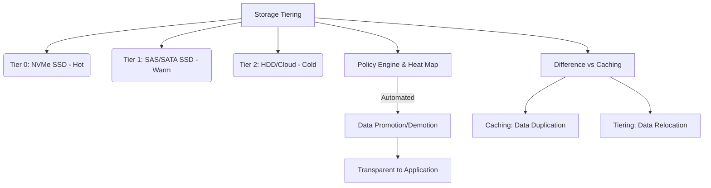

+++
title = "스토리지 티어링 (Storage Tiering)"
weight = 674
+++

> **스토리지 티어링 (Storage Tiering)의 핵심 통찰**
> 데이터의 접근 빈도와 중요도에 따라 서로 다른 성능과 비용을 가진 스토리지 매체로 데이터를 자동 재배치한다.
> 고가의 고성능 스토리지(SSD/NVMe)와 저렴한 대용량 스토리지(HDD/Tape)를 혼합하여 TCO(총소유비용)를 최적화한다.
> 정보 수명주기 관리(ILM, Information Lifecycle Management)를 인프라 차원에서 구현한 핵심 아키텍처이다.

### Ⅰ. 개요 및 정의
스토리지 티어링(Storage Tiering)은 엔터프라이즈 환경에서 데이터의 특성(접근 빈도, 성능 요구사항, 생성 시기 등)을 분석하여, 여러 계층(Tier)으로 구성된 스토리지 시스템 간에 데이터를 동적 또는 정책적으로 이동시키는 데이터 관리 기술입니다. 모든 데이터를 가장 빠르고 비싼 플래시 스토리지에 저장하는 것은 비용 측면에서 비효율적이므로, 성능이 중요한 'Hot' 데이터는 최상위 계층에 두고 접근 빈도가 낮은 'Warm' 또는 'Cold' 데이터는 하위의 저비용, 대용량 스토리지 계층으로 이동시킴으로써 성능과 스토리지 비용의 균형을 맞춥니다.

📢 **섹션 요약 비유:** 도서관에서 사람들이 자주 찾는 베스트셀러는 1층 입구(고성능 매체)에 배치하고, 1년에 한 번 찾을까 말까 한 오래된 고문서는 지하 깊숙한 서고(저비용 매체)에 보관하는 것과 완벽히 일치합니다.

### Ⅱ. 아키텍처 및 동작 원리
스토리지 티어링은 데이터의 I/O 패턴을 모니터링하고 정책 엔진에 의해 데이터를 승격(Promotion)하거나 강등(Demotion)시킵니다.

```ascii
+-------------------------------------------------------------+
| Application / File System / Database Request                |
+------------------------------+------------------------------+
                               |
                   +-----------v-----------+
                   | Tiering Controller    | (Monitors I/O heat,
                   | & Policy Engine       |  migrates extents)
                   +---+---------------+---+
                       |               |
     +----- Promote ---+               +---- Demote -------+
     | (Hot Data)                              (Cold Data) |
+----v--------------------+            +-------------------v--+
| Tier 0 / Tier 1         |            | Tier 2 / Tier 3      |
| [Ultra Performance]     |            | [Capacity & Archive] |
| NVMe SSDs, Optane Memory|            | SATA HDDs, Tape,     |
| Sub-millisecond latency |            | Object Storage (S3)  |
| Highest Cost per GB     |            | Lowest Cost per GB   |
+-------------------------+            +----------------------+
```

1. **데이터 청크/익스텐트 분할:** 데이터를 파일 단위가 아닌 더 작은 블록(Block)이나 익스텐트(Extent, 예: 수 MB 크기) 단위로 나누어 관리합니다.
2. **I/O 히트 맵(Heat Map) 생성:** 스토리지 컨트롤러는 각 블록에 대한 읽기/쓰기 빈도를 추적하여 온도를 측정합니다. (자주 접근 = Hot, 안 접근 = Cold)
3. **오토 티어링(Automated Tiering) 엔진:** 정해진 정책(예: 심야 시간대 일괄 이동 또는 실시간 이동)에 따라 온도가 높아진 블록은 상위 티어로 마이그레이션(승격)하고, 식은 블록은 하위 티어로 이동(강등)시킵니다. 이동 과정은 상위 애플리케이션에 투명(Transparent)하게 이루어집니다.

📢 **섹션 요약 비유:** 매장의 진열대 위치를 관리자가 직접 바꾸는 것이 아니라, 스마트 선반이 상품 판매량을 스스로 측정하여 잘 팔리는 물건은 고객 눈높이 골든존으로 올리고 안 팔리는 건 구석으로 자동 이동시키는 시스템입니다.

### Ⅲ. 주요 기술 요소 및 특징
- **동적 볼륨 재배치 (Dynamic Volume Relocation):** 호스트의 중단(Downtime) 없이 데이터의 물리적 위치를 백그라운드에서 변경합니다.
- **서브 LUN (Sub-LUN) 티어링:** 단일 디스크 볼륨(LUN, Logical Unit Number) 내에서도 데이터베이스의 인덱스 부분은 SSD에, 오래된 레코드 부분은 HDD에 나누어 저장하는 정밀한 티어링 기술입니다.
- **캐싱(Caching)과의 차이:** 캐싱은 데이터의 **복사본**을 빠른 매체에 두는 반면(데이터가 두 곳에 존재), 티어링은 데이터 원본의 **물리적 위치 자체를 이동**시킵니다(데이터는 한 곳에만 존재). 따라서 스토리지 전체 가용 용량을 100% 활용할 수 있습니다.
- **클라우드 티어링:** 최근에는 하위 티어를 로컬 HDD가 아닌 AWS S3, Azure Blob 같은 퍼블릭 클라우드 오브젝트 스토리지로 확장하는 하이브리드 클라우드 티어링이 대세입니다.

📢 **섹션 요약 비유:** 캐싱이 교과서 내용을 포스트잇에 적어 책상에 붙여두는(복사본) 것이라면, 티어링은 다 쓴 1학기 교과서는 창고로 치우고 2학기 교과서를 책상에 가져다 놓는(물리적 이동) 것입니다.

### Ⅳ. 응용 사례 및 비교
- **엔터프라이즈 데이터베이스 (OLTP/OLAP 혼합):** 실시간 트랜잭션 데이터는 NVMe 티어에서 처리하고, 과거 결산 데이터나 로그 파일은 HDD 티어로 내려보내 성능과 용량을 동시 확보합니다.
- **미디어 및 엔터테인먼트:** 방금 촬영된 4K 비디오 편집 작업은 고성능 플래시에서 수행하고, 편집이 완료된 최종본은 아카이빙 스토리지로 이동시킵니다.
- **비교 (수동 마이그레이션 vs 자동화된 티어링):** 과거에는 스토리지 관리자가 주말에 수동으로 스크립트를 돌려 데이터를 복사/이동했다면, 오토 티어링은 인공지능/머신러닝 기법까지 결합하여 향후의 I/O 패턴을 예측하고 실시간으로 최적화합니다.

📢 **섹션 요약 비유:** 겨울옷과 여름옷을 철 바뀔 때마다 사람이 일일이 옷장에서 넣고 빼는 수동 방식에서, 스마트 옷장이 날씨를 예측해 자주 입을 옷을 맨 앞에 자동으로 걸어주는 진화된 모델입니다.

### Ⅴ. 결론 및 향후 전망
데이터의 기하급수적 증가로 인해 "모든 데이터를 플래시 메모리에 담는다(All-Flash)"는 전략은 비용상 한계에 직면했습니다. 이에 따라 스토리지 티어링은 NVMe 스토리지와 QLC(Quad-Level Cell) 플래시, 그리고 클라우드 오브젝트 스토리지(Object Storage)를 결합하는 방향으로 고도화되고 있습니다. 향후에는 AI 기반 메타데이터 분석을 통해 애플리케이션의 컨텍스트(Context)까지 이해하여 사전에 데이터를 준비해두는 '예측적(Predictive) 자율형 스토리지 계층화'로 발전할 것입니다.

📢 **섹션 요약 비유:** 단순히 "과거에 많이 찾았으니 앞으로 뺀다"를 넘어, "내일 비가 오면 우산을 많이 찾을 테니 미리 입구에 꺼내둔다"는 수준의 지능형 예측 인프라로 진화하고 있습니다.

---

### Knowledge Graph & Child Analogy



**Child Analogy:**
장난감 상자를 정리할 때, 요즘 매일 가지고 노는 로봇 장난감(Hot Data)은 손이 가장 잘 닿는 책상 위(Tier 0)에 두고, 작년에 놀던 블록 장난감(Cold Data)은 침대 밑 깊은 상자(Tier 2)에 넣어두는 거예요. 그리고 로봇에 싫증 나고 블록이 다시 좋아지면, 똑똑한 로봇 청소기(티어링 엔진)가 알아서 밤새 위치를 바꿔주는 마법 같은 장난감 정리법이랍니다.