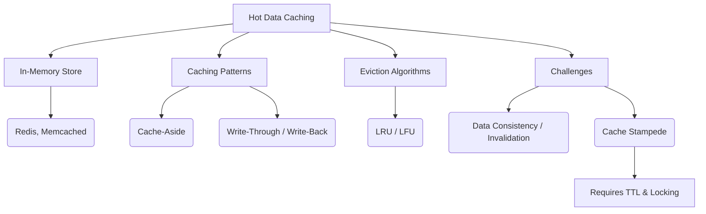

+++
title = "핫 데이터 (Hot Data) 캐싱"
weight = 675
+++

> **핫 데이터 (Hot Data) 캐싱의 핵심 통찰**
> 데이터베이스나 스토리지 시스템에서 빈번하게 조회/수정되는 극소수의 데이터를 초고속 메모리(RAM)에 상주시켜 응답 속도를 극대화한다.
> 캐시 적중률(Cache Hit Ratio)을 높이는 알고리즘(LRU, LFU 등)이 전체 시스템 성능의 지렛대 역할을 한다.
> 데이터 일관성(Consistency) 유지와 캐시 무효화(Invalidation) 전략이 아키텍처 설계의 가장 큰 과제이다.

### Ⅰ. 개요 및 정의
핫 데이터(Hot Data)란 전체 데이터 세트 중에서 짧은 시간 내에 매우 빈번하게 접근(읽기 또는 쓰기)되는 데이터를 의미합니다. 파레토 법칙(80/20 법칙)에 따라 시스템 전체 I/O의 80%는 20%의 핫 데이터에서 발생합니다. **핫 데이터 캐싱(Hot Data Caching)**은 이러한 핫 데이터를 상대적으로 느린 디스크 기반 영구 저장소(DB, 백엔드 스토리지)에서 가져와, 접근 속도가 마이크로초(µs) 또는 나노초(ns) 단위인 인메모리(In-Memory) 저장소(예: Redis, Memcached, RAM)에 복사본을 임시로 저장하여 어플리케이션의 응답 지연 시간(Latency)을 최소화하는 기술입니다.

📢 **섹션 요약 비유:** 도서관 깊숙한 서고(DB)에 있는 수만 권의 책 중에서, 지금 시험 기간이라 학생들이 계속 찾는 교과서 10권(핫 데이터)만 뽑아서 도서관 사서의 데스크(캐시 메모리) 위에 올려두어 바로바로 빌려주게 하는 것입니다.

### Ⅱ. 아키텍처 및 동작 원리
캐싱 레이어는 주로 웹/앱 서버 애플리케이션과 메인 데이터베이스 사이에 위치합니다.

```ascii
+-----------------------+       Cache Miss       +-----------------------+
|                       |   (2. Query to DB)     |                       |
|   Web / App Server    +------------------------>   Backend Database    |
|   (Client Request)    |                        |   (HDD/SSD Storage)   |
|                       <------------------------+                       |
+-------+-------^-------+   (3. Return Data)     +-----------+-----------+
        |       |
 (1. Check Cache) | (4. Write Data to Cache)
        |       |
+-------v-------+-------+
|                       |
|   In-Memory Cache     |
|   (Redis, Memcached)  |
|   [HOT DATA ONLY]     |
+-----------------------+
```

1. **캐시 읽기 패턴 (Look-Aside / Cache Aside):** 가장 보편적인 패턴입니다. 애플리케이션은 먼저 캐시를 확인합니다. 데이터가 있으면(Cache Hit) 바로 반환하고, 없으면(Cache Miss) DB에서 조회한 후 캐시에 복사본을 저장(Put)하고 클라이언트에 반환합니다.
2. **캐시 쓰기 패턴:**
   - **Write-Through:** 데이터를 캐시와 DB에 동시에 씁니다. 일관성은 높지만 쓰기 지연 시간이 증가합니다.
   - **Write-Behind (Write-Back):** 먼저 캐시에만 빠르게 쓰고 클라이언트에 완료 응답을 보낸 후, 비동기적으로 배치(Batch)로 모아서 DB에 씁니다. 쓰기 성능은 최고이나 장애 시 데이터 유실 위험이 있습니다.
3. **교체 정책 (Eviction Policy):** 캐시 공간이 꽉 차면, 안 쓰이는 데이터(Cold)를 밀어내야 합니다. 대표적으로 가장 오래전에 사용된 것을 버리는 LRU(Least Recently Used)나 가장 적게 사용된 것을 버리는 LFU(Least Frequently Used) 알고리즘이 쓰입니다.

📢 **섹션 요약 비유:** 손님이 메뉴를 주문할 때, 이미 만들어둔 진열장(캐시)에 햄버거가 있으면 즉시 주고(Cache Hit), 없으면 주방(DB)에 새로 주문을 넣고 만들어서(Cache Miss) 진열장도 채우고 손님에게도 주는 방식입니다.

### Ⅲ. 주요 기술 요소 및 특징
- **TTL (Time-To-Live):** 캐시된 데이터가 영원히 남아있으면 DB의 원본 데이터가 변경되었을 때 과거의 틀린 데이터(Stale Data)를 보여주게 됩니다. 이를 방지하기 위해 데이터에 유효기간(TTL)을 설정하여 만료 시 자동 삭제되게 합니다.
- **Cache Stampede (Thundering Herd) 현상 방지:** 초대형 트래픽 이벤트에서 핵심 핫 데이터의 TTL이 만료되어 캐시에서 사라지는 순간, 수만 개의 요청이 일제히 무거운 쿼리로 DB에 몰려가 DB가 다운되는 현상입니다. 분산 락(Distributed Lock)이나 사전 갱신(Cache Warming) 기법으로 방어해야 합니다.
- **분산 캐시 (Distributed Cache):** 트래픽이 커지면 단일 서버 메모리로는 감당할 수 없어 여러 노드에 데이터를 샤딩(Sharding, 예: Consistent Hashing)하여 저장하고 클러스터를 구성합니다.

📢 **섹션 요약 비유:** 우유(데이터)에 유통기한(TTL)을 적어두고 기한이 지나면 버림으로써 항상 신선한 상태를 유지하려 노력하는 과정과 같습니다.

### Ⅳ. 응용 사례 및 비교
- **전자상거래 (E-Commerce):** 블랙프라이데이 이벤트 상품 정보, 메인 페이지 배너, 사용자 세션 데이터 등 읽기 비중이 압도적으로 높고 순간 접속이 폭주하는 데이터를 Redis에 캐싱합니다.
- **소셜 미디어 (SNS):** 트위터나 인스타그램의 유명인 타임라인, 실시간 트렌드 검색어, 좋아요 카운트 등은 실시간 메모리 캐싱이 필수적입니다.
- **비교 (티어링 vs 캐싱):** 티어링(Tiering)은 데이터의 위치를 '이동'시켜 전체 용량을 최적화하는 스토리지 관점의 기술인 반면, 핫 데이터 캐싱은 데이터의 '복사본'을 메모리에 두어 연산 및 응답 성능을 가속하는 애플리케이션 및 아키텍처 관점의 기술입니다.

📢 **섹션 요약 비유:** 유명 가수의 콘서트 티켓팅 날, 수백만 명이 동시에 접속해서 확인하는 '잔여 좌석 수'를 데이터베이스에서 매번 계산하면 서버가 터지므로, 이 숫자 하나(핫 데이터)만 칠판(메모리 캐시)에 크게 적어놓고 보여주는 구조입니다.

### Ⅴ. 결론 및 향후 전망
MSA(Microservices Architecture) 및 클라우드 네이티브 환경이 확산되면서, 백엔드 데이터베이스의 부하를 줄이고 사용자 경험(UX)을 결정짓는 빠른 응답성을 보장하기 위해 핫 데이터 캐싱은 선택이 아닌 필수 표준 아키텍처가 되었습니다. 향후에는 단순한 Key-Value 저장소를 넘어 서버리스(Serverless) 캐시 서비스, 머신러닝을 이용해 어떤 데이터가 Hot해질지 미리 예측하여 적재하는 AI 기반 Predictive Caching 기술로 진화하고 있습니다.

📢 **섹션 요약 비유:** 핫 데이터 캐싱은 인터넷 서비스라는 거대한 엔진이 과열되지 않도록 열을 식혀주고 부드럽게 돌아가게 해주는 최상급 윤활유와도 같은 역할을 영원히 지속할 것입니다.

---

### Knowledge Graph & Child Analogy



**Child Analogy:**
학교에서 선생님이 "1더하기 1은?" 하고 물으면 머릿속에 바로 떠오르는 답(핫 데이터)은 입으로 즉시 튀어나오죠? 이게 '캐시'예요. 하지만 "123 곱하기 456은?" 하고 물으면 연습장(하드디스크 DB)을 꺼내서 복잡하게 계산해야 하잖아요. 자주 묻는 구구단 같은 것들을 머릿속(메모리)에 바로 기억해두는 것이 핫 데이터 캐싱이랍니다.