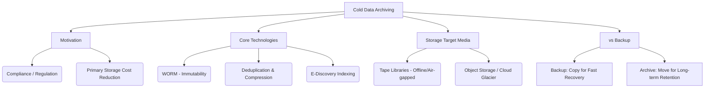

+++
title = "콜드 데이터 (Cold 단) 아카이빙"
weight = 676
+++

> **콜드 데이터 (Cold 단) 아카이빙의 핵심 통찰**
> 접근 빈도가 극히 낮거나 거의 없는 데이터를 저비용, 고용량 스토리지 매체로 장기 보존 목적으로 이관한다.
> 컴플라이언스(법적 규제 준수), 데이터 보호, 프라이머리 스토리지의 TCO(총소유비용) 절감이 주된 목적이다.
> 압축, 중복 제거, WORM(Write Once Read Many) 기술을 적용하여 불변성과 저장 효율성을 극대화한다.

### Ⅰ. 개요 및 정의
데이터 생명주기(Data Lifecycle)에서 **콜드 데이터(Cold Data)**란 생성된 지 오래되어 향후 재사용되거나 조회될 확률이 0에 가깝지만, 법적 의무(Compliance), 감사(Audit), 혹은 미래의 빅데이터 분석 잠재력을 위해 삭제할 수 없는 데이터를 의미합니다. **데이터 아카이빙(Data Archiving)**은 이러한 콜드 데이터를 고가의 고성능 운영 스토리지(Primary Storage)에서 분리하여, 광디스크, 자기 테이프(Tape), 혹은 클라우드 아카이브 스토리지(예: AWS Glacier)와 같은 저비용/대용량 매체로 영구적으로 이동시켜 보관하는 프로세스와 인프라 아키텍처를 말합니다.

📢 **섹션 요약 비유:** 매일 쓰는 필기도구와 노트는 책상 위(핫 데이터)에 두지만, 10년 전 졸업 앨범이나 초등학교 일기장은 버릴 수는 없으니 압축팩에 넣어 다락방 깊숙한 상자(콜드 스토리지 아카이브)에 보관하는 것과 같습니다.

### Ⅱ. 아키텍처 및 동작 원리
운영 환경의 백업(Backup) 시스템과 아카이빙(Archiving) 시스템은 분리되어 동작합니다. (백업은 복구를 위한 '복사본', 아카이빙은 '원본의 이동')

```ascii
+-------------------------------------------------------------+
| Primary System (Database / File Server / Email Server)      |
| [Expensive High Performance Storage (NVMe, SSD)]            |
+------------------------------+------------------------------+
                               | (1) Metadata scanning &
                               |     Policy Match (Age > 3yrs)
                   +-----------v-----------+
                   | Archive Server Engine | (Deduplication,
                   | (Index & Search DB)   |  Compression,
                   +-----------+-----------+  Encryption)
                               | (2) Data Extraction & Movement
                               v (3) Create Stub (Shortcut) on Primary
+-------------------------------------------------------------+
| Cold Data Archive Storage Target                            |
| +-------------------+  +-------------------+  +-----------+ |
| | Tape Library (LTO)|  | Object Storage    |  | Cloud     | |
| | (Offline Storage) |  | (Erasure Coding)  |  | (Glacier) | |
| +-------------------+  +-------------------+  +-----------+ |
+-------------------------------------------------------------+
```

1. **정책 기반 분류:** 보존 연한 정책(Retention Policy)을 설정하여, 3년 이상 접근되지 않은 파일, 퇴사자 이메일, 완료된 프로젝트 데이터 등을 식별합니다.
2. **이동 및 스터빙(Stubbing):** 원본 데이터를 아카이브 스토리지로 이동시킵니다. 운영 스토리지에는 사용자가 클릭하면 아카이브 스토리지를 가리키는 몇 KB짜리 빈 껍데기 링크인 '스텁(Stub)' 파일만 남겨두어 투명성을 유지합니다.
3. **불변성(Immutability) 적용:** 저장된 데이터가 임의로 수정되거나 삭제되지 않도록 WORM(Write Once Read Many) 속성을 부여하고, 하드웨어 레벨에서 잠금을 설정합니다.

📢 **섹션 요약 비유:** 하드디스크에 영화 파일 원본을 지우고 USB로 옮긴 다음, 컴퓨터 바탕화면에는 그 USB 안의 영화를 가리키는 '바로가기 아이콘(Stub)'만 남겨두어 하드디스크 용량을 확보하는 방식입니다.

### Ⅲ. 주요 기술 요소 및 특징
- **비용 효율적인 매체 (Tape & Cold Cloud):** 테이프 카트리지(LTO)는 전력을 소모하지 않는 오프라인(Offline) 미디어이므로 전력 비용과 랜섬웨어 방어(Air-Gap)에 탁월합니다. 최근에는 클라우드의 Cold/Archive Tier(S3 Glacier Deep Archive 등)가 테이프를 대체하고 있습니다.
- **WORM (Write Once Read Many):** 한 번 기록되면 지정된 보존 기간(Retention Period)이 지날 때까지 관리자조차도 삭제나 덮어쓰기를 할 수 없게 강제하는 기술로, 금융/의료 규제(SEC 17a-4, HIPAA 등) 준수에 필수적입니다.
- **인덱싱 및 E-Discovery:** 아카이빙된 페타바이트급 데이터 속에서 법적 분쟁 시 특정 키워드나 이메일을 신속하게 찾아내어 법원에 제출할 수 있도록(Electronic Discovery), 메타데이터와 본문을 색인화(Indexing)해 두는 검색 엔진 기능이 포함됩니다.
- **데이터 축소 기술:** 중복 제거(Deduplication)와 고효율 압축(Compression) 알고리즘을 통해 물리적 저장 공간 요구량을 1/10 이하로 줄입니다.

📢 **섹션 요약 비유:** 문서를 특수 금고에 넣고, 입구에 '5년 동안 절대 열지 말 것'이라는 시한장치(WORM)를 달아둔 채, 책의 목차만 따로 빼내어 도서관 카드 카탈로그(E-Discovery 인덱스)에 정리해두는 과정입니다.

### Ⅳ. 응용 사례 및 비교
- **금융 및 의료 규제 준수:** 은행의 10년 치 거래 내역, 병원의 환자 PACS(의료 영상) 데이터 및 진료 기록 등은 법적 의무 보관 기간 동안 아카이빙되어야 합니다.
- **빅데이터 AI 학습 데이터 저장소:** 자율주행 자동차가 수집한 방대한 비디오 센서 데이터나 기업의 과거 로그 파일 등은 당장 쓰이지 않지만 미래의 AI 모델 훈련을 위한 '데이터 호수(Data Lake)'의 차가운 바닥층을 형성합니다.
- **비교 (백업 vs 아카이빙):** 백업의 목적은 하드웨어 장애나 랜섬웨어 발생 시 '어제 상태로 **빠른 시스템 복구(Recovery)**'를 하는 것이며 데이터는 주기적으로 덮어씌워집니다. 반면, 아카이빙의 목적은 시스템 복구가 아니라 '오래된 단일 데이터를 **장기 보존(Retention)하고 언제든 검색**'하는 공간 확보에 있습니다.

📢 **섹션 요약 비유:** 백업이 휴대폰을 통째로 애플 아이클라우드에 매일 동기화해두는 것(분실 대비 복구용)이라면, 아카이빙은 휴대폰 용량이 꽉 차서 수천 장의 옛날 사진들을 통째로 외장 하드로 잘라내기(이동) 한 후 보관하는 것입니다.

### Ⅴ. 결론 및 향후 전망
전체 생성되는 데이터의 70~80%가 생성 후 수개월 내에 '콜드 데이터'로 변합니다. 프라이머리 스토리지의 단위 비용은 계속 상승하는 반면, 데이터 폭증은 가속화되고 있어 콜드 데이터 아카이빙은 기업의 IT 예산 방어를 위한 가장 강력한 무기입니다. 향후에는 자기 테이프를 넘어 안정성이 수백 년 유지되는 DNA 스토리지나 홀로그래픽 스토리지, 석영 유리(Silica) 스토리지 등의 혁신적 콜드 미디어 연구가 활발히 진행 중이며 클라우드와의 경계가 허물어지는 서비스형 아카이빙(Archive-as-a-Service)이 대세가 될 것입니다.

📢 **섹션 요약 비유:** 넘쳐나는 짐을 버리지도 못하고 집 안에 쌓아두면 집값(스토리지 유지비)을 낭비하게 됩니다. 콜드 아카이빙은 저렴한 외곽의 대형 창고를 임대하여 짐을 안전하게 옮기고 집을 항상 쾌적하게 유지해주는 필수 정리 정돈 철학입니다.

---

### Knowledge Graph & Child Analogy



**Child Analogy:**
방 정리를 할 때요, 매일 가지고 노는 장난감은 장난감 상자(메인 스토리지)에 두지만, 아기가 입었던 배냇저고리나 유치원 때 그린 그림(콜드 데이터)은 버릴 수가 없잖아요? 그래서 엄마가 예쁜 상자(아카이브)에 넣어서 절대 지워지지 않게 방습제(WORM)를 넣고 이름표(인덱스)를 붙여서 창고 제일 안쪽에 소중히 10년 동안 보관하는 거랍니다.