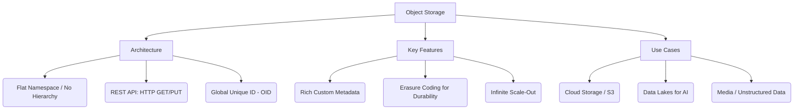

+++
title = "오브젝트 스토리지 (Object Storage)"
weight = 677
+++

> **오브젝트 스토리지 (Object Storage)의 핵심 통찰**
> 파일 시스템 계층 구조(디렉토리 트리)를 버리고, 모든 데이터를 평면적인 고유 식별자(ID)를 가진 '객체(Object)'로 저장하는 구조이다.
> 메타데이터(Metadata) 확장이 매우 자유로워 비정형 데이터(사진, 영상, 로그 등) 관리에 최적화되어 있다.
> RESTful API (HTTP) 통신을 기반으로 하여 인터넷 스케일의 무한한 용량 확장이 가능한 클라우드 스토리지의 근간이다.

### Ⅰ. 개요 및 정의
전통적인 블록 스토리지나 파일 스토리지(NAS/SAN)는 데이터 용량이 페타바이트(PB) 단위로 커지고 파일 개수가 수십억 개가 되면, 트리 구조의 인덱스 검색 병목 현상으로 성능이 급격히 저하되는 한계가 있습니다. **오브젝트 스토리지(Object Storage)**는 데이터를 폴더나 블록이 아닌 독립적인 '객체(Object)'라는 단위로 캡슐화하여 거대한 평면(Flat) 주소 공간에 저장하는 아키텍처입니다. 각 객체는 [데이터 본문(Payload) + 확장 가능한 메타데이터 + 글로벌 고유 식별자(OID)] 묶음으로 구성되며, AWS S3가 이 분야의 사실상(De-facto) 표준 인터페이스를 정립했습니다.

📢 **섹션 요약 비유:** 자동차를 주차할 때, 전통적인 방식은 '지하 3층 D구역 4번 자리(디렉토리 경로)'를 기억해야 하지만, 오브젝트 스토리지는 발렛 파킹 직원에게 자동차를 주고 '교환권 번호(고유 ID)'만 받으면 나중에 번호표만 주고 바로 차를 찾는 것과 같습니다.

### Ⅱ. 아키텍처 및 동작 원리
오브젝트 스토리지는 클라이언트가 HTTP REST API로 통신하며, 내부적으로는 분산 노드들 간에 데이터를 쪼개어 저장합니다.

```ascii
+-------------------------------------------------------------+
| Web App / Mobile App / Analytics Engine (REST API Client)   |
| HTTP PUT / GET / DELETE (e.g., https://mybucket.s3.aws.com) |
+------------------------------+------------------------------+
                               | (HTTP Request)
                   +-----------v-----------+
                   | API Gateway /         |
                   | Metadata Server       | (Global Namespace)
                   +---+---------------+---+
                       | (Hash function determines location)
     +-----------------+-----------------+-----------------+
     |                 |                 |                 |
+----v----+       +----v----+       +----v----+       +----v----+
| Storage |       | Storage |       | Storage |       | Storage |
| Node 1  |       | Node 2  |       | Node 3  |       | Node 4  |
| (Disk)  |       | (Disk)  |       | (Disk)  |       | (Disk)  |
+---------+       +---------+       +---------+       +---------+
 [ Distributed Object Storage Cluster with Erasure Coding ]
```

1. **평면적 네임스페이스 (Flat Address Space):** 폴더 계층이 없습니다. 고유 ID(해시값)만으로 데이터의 물리적 위치를 즉시 산출(O(1) 시간 복잡도)하므로, 수십억 개의 파일이 있어도 속도 저하가 없습니다.
2. **이레이저 코딩 (Erasure Coding) 및 복제:** RAID 기술 대신 데이터 조각을 수학적으로 분할하고 패리티(Parity) 데이터를 생성해 여러 노드에 분산 저장합니다. 노드나 디스크가 여러 개 고장 나도 데이터를 안전하게 복구합니다.
3. **RESTful API:** 애플리케이션은 OS 레벨의 마운트(Mount) 과정 없이 HTTP 프로토콜(PUT, GET, DELETE 등)을 통해 인터넷 구간 어디서든 스토리지에 직접 접근합니다.

📢 **섹션 요약 비유:** 전통적인 파일 시스템이 복잡한 족보를 따져야만 사람을 찾을 수 있는 시스템이라면, 오브젝트 스토리지는 전 국민에게 무작위 주민등록번호를 부여하고 번호만으로 단번에 사람을 조회해 내는 거대한 데이터베이스 구조입니다.

### Ⅲ. 주요 기술 요소 및 특징
- **풍부한 커스텀 메타데이터 (Custom Metadata):** 단순한 '생성일자, 용량' 외에도 "환자 이름=김철수, 촬영 부위=X-Ray, 질병=폐렴"과 같이 객체 자체에 태그를 자유롭게 붙여 저장할 수 있어 데이터 검색과 빅데이터 분석에 매우 유리합니다.
- **무한한 확장성 (Scale-Out):** 컨트롤러나 파일 시스템 트리 구조의 병목이 없기 때문에, x86 범용 서버(노드)를 네트워크에 추가하기만 하면 용량과 성능이 선형적으로 무한히 확장됩니다.
- **최종 일관성 (Eventual Consistency):** 분산 환경의 가용성을 위해 데이터를 갱신(Update)할 때 모든 노드에 동시에 반영되지 않고 일정 시간(수 밀리초~초) 이후에 일관성이 맞춰집니다. 따라서 데이터 변경이 빈번한 트랜잭션 DB 용도로는 부적합합니다. (최근에는 S3 등에서 강한 일관성(Strong Consistency)을 지원하도록 발전하기도 함).
- **데이터 불변성 (Immutable):** 객체 스토리지는 기존 파일의 특정 부분만 수정(Append/Modify)하는 것을 기본적으로 허용하지 않으며, 수정하려면 전체 객체를 새 버전으로 완전히 덮어써야 합니다(버전 관리).

📢 **섹션 요약 비유:** 사진 뒷면에 "2023년 파리 여행 에펠탑 앞"이라고 메모를 적어 박스에 던져 넣는 것(메타데이터)입니다. 박스가 꽉 차면 빈 박스(스토리지 노드)를 옆에 계속 가져다 놓기만 하면 되므로 무한대로 확장이 가능합니다.

### Ⅳ. 응용 사례 및 비교
- **클라우드 네이티브 백엔드:** 넷플릭스 동영상 원본, 스포티파이 음원, 인스타그램 사진 등 글로벌 서비스의 미디어 자산을 저장하는 핵심 인프라입니다 (예: Amazon S3, Google Cloud Storage).
- **데이터 레이크 (Data Lake):** 하둡(HDFS)을 대체하여 머신러닝/AI 훈련을 위한 방대한 원시 데이터(Raw Data)를 한곳에 모아두는 중앙 저장소 역할을 합니다.
- **백업 및 아카이빙 타겟:** 랜섬웨어 방어를 위한 객체 잠금(Object Lock, WORM) 기능을 활용하여 백업 데이터를 안전하게 보관합니다.
- **비교 (NAS vs Object):** NAS(NFS/SMB)는 LAN 환경에서 파일을 빈번하게 수정하고 여러 사용자가 공유하는 오피스 문서 작업에 적합하지만, 오브젝트 스토리지는 한 번 쓰고 여러 번 읽는(WORM) 페타바이트급 비정형 데이터(사진/영상/로그)를 인터넷 환경에서 서비스하는 데 특화되어 있습니다.

📢 **섹션 요약 비유:** NAS가 직원들이 서류철을 넣고 빼며 수정하는 사무실 캐비닛이라면, 오브젝트 스토리지는 전 세계에서 쏟아지는 화물 컨테이너를 식별 번호표만 붙여 거대한 부두 평지에 끝없이 쌓아두는 글로벌 물류항만입니다.

### Ⅴ. 결론 및 향후 전망
IT 인프라 패러다임이 클라우드로 전환되면서, 오브젝트 스토리지는 정형화된 블록/파일 스토리지를 밀어내고 '세상 모든 비정형 데이터를 담는 표준 그릇'으로 자리매김했습니다. 향후에는 단순한 저장을 넘어, 저장소 안에서 직접 데이터를 필터링하고 분석하는 기능(예: S3 Select)이나 서버리스 컴퓨팅(AWS Lambda)과 결합한 이벤트 구동형 스토리지로 진화하며 데이터 중심 아키텍처의 심장부 역할을 굳건히 할 것입니다.

📢 **섹션 요약 비유:** 단순히 물건을 보관만 하던 무식한 창고가 이제는 물건을 보관하면서 내용표(메타데이터)를 분석해 통계까지 내어주는 '초지능형 스마트 물류 센터'로 진화하고 있는 것입니다.

---

### Knowledge Graph & Child Analogy



**Child Analogy:**
컴퓨터 폴더 안에 폴더를 계속 만들어서 숨바꼭질하듯 파일을 찾는 게 기존 방식이라면, 오브젝트 스토리지는 마법의 자판기예요. 물건(데이터)을 넣을 때, 자판기가 '비밀번호 카드(Object ID)'를 줘요. 이 카드는 전 세계 어디서든 이 자판기 구멍에 넣기만 하면 즉시 내가 넣었던 물건을 뿅! 하고 뱉어낸답니다. 폴더를 뒤질 필요가 없어서 가장 빠르고 끝없이 물건을 넣을 수 있어요.