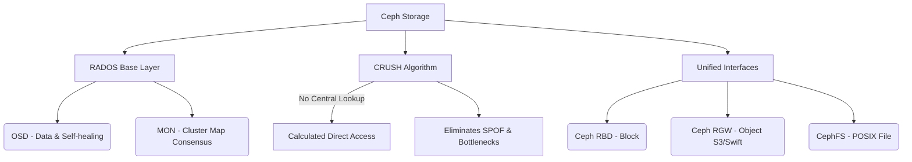

+++
title = "Ceph 스토리지 아키텍처"
weight = 678
+++

> **Ceph 스토리지 아키텍처의 핵심 통찰**
> 단일 클러스터에서 블록(Block), 객체(Object), 파일(File) 스토리지를 모두 제공하는 완벽한 유니파이드(Unified) 오픈소스 분산 스토리지이다.
> 메타데이터 서버를 거치지 않고 클라이언트가 CRUSH 알고리즘을 통해 데이터 위치를 직접 계산하여 성능 병목과 단일 장애 점(SPOF)을 제거했다.
> 자가 복구(Self-healing) 및 자율 관리 능력을 갖추어 엑사바이트(EB) 규모의 무한 확장이 가능한 클라우드 데이터센터의 표준 백엔드이다.

### Ⅰ. 개요 및 정의
Ceph(세프)는 오픈 소스 기반의 소프트웨어 정의 스토리지(SDS, Software-Defined Storage) 솔루션으로, 범용 하드웨어(x86 서버 등)를 묶어 거대한 스토리지 클러스터를 구축합니다. Ceph의 가장 큰 특징은 하단의 신뢰성 높은 객체 스토리지 기반인 **RADOS (Reliable Autonomic Distributed Object Store)** 코어 위에서, 상위 애플리케이션들에게 블록 스토리지(RBD), 객체 스토리지(RGW), POSIX 호환 파일 스토리지(CephFS)의 세 가지 인터페이스를 모두 제공하는 통합형(Unified) 아키텍처라는 점입니다.

📢 **섹션 요약 비유:** 하나의 거대한 발전소(RADOS)에서 전기를 생산한 뒤, 사용자의 요구에 맞게 220V 콘센트(블록), USB 포트(객체), 대형 공장용 3상 전원(파일)으로 자유롭게 변환해서 제공하는 만능 에너지 발전소입니다.

### Ⅱ. 아키텍처 및 동작 원리
Ceph는 데이터의 물리적 위치 정보를 중앙 메타데이터 서버에 저장하는 대신, 알고리즘(CRUSH)을 이용해 동적으로 계산합니다.

```ascii
+-----------------------------------------------------------------+
| Applications / Cloud Platforms (OpenStack, Kubernetes, KVM)     |
+-------------+-----------------------+---------------------------+
| Ceph RBD    | Ceph RGW              | CephFS                    |
| (Block)     | (Object: S3/Swift)    | (File System: POSIX)      |
+-------------+-----------------------+---------------------------+
| LIBRADOS (Client Library interacting directly with RADOS)       |
+-----------------------------------------------------------------+
                              | CRUSH Algorithm
                              v (Data location computed instantly)
+-----------------------------------------------------------------+
| RADOS (Reliable Autonomic Distributed Object Store)             |
+-------------------+----------------------+----------------------+
| OSD (Object       | MON (Monitor)        | MDS (Metadata Server)|
| Storage Daemon)   | - Cluster Map state  | - Only for CephFS    |
| - Manages Disks   | - Quorum (Paxos)     |   file directories   |
| - Replication     +----------------------+----------------------+
| - Self-healing    |  Networked x86 Commodity Servers            |
+-------------------+---------------------------------------------+
```

1. **OSD (Object Storage Daemon):** 각 물리적 디스크 드라이브당 1개씩 할당되는 데몬입니다. 실제 데이터를 저장하고, 복제, 복구, 리밸런싱(Rebalancing) 작업을 OSD 노드들끼리 P2P 방식으로 알아서 수행합니다.
2. **MON (Monitor):** 클러스터의 전체 맵(OSD 상태, 네트워크 토폴로지 등) 정보를 관리합니다. 단일 장애 점(SPOF)을 막기 위해 3, 5개의 홀수 노드로 구성되어 Paxos 알고리즘으로 합의를 이룹니다.
3. **CRUSH 알고리즘 (Controlled Replication Under Scalable Hashing):** Ceph의 핵심입니다. 클라이언트는 데이터를 읽거나 쓸 때 MON 서버에 "이 데이터 어디 있나요?"라고 묻지 않습니다. 클러스터 맵과 해시 함수 기반의 CRUSH 알고리즘 공식을 돌려 클라이언트가 직접 대상 OSD(디스크)를 계산하고 바로 통신합니다.

📢 **섹션 요약 비유:** 택배를 찾을 때 중앙 안내데스크(메타데이터 서버)에 줄을 서서 창고 번호를 묻지 않고, 고객이 직접 스마트폰 앱의 수학 공식(CRUSH)에 택배 번호를 넣으면 몇 번 창고에 있는지 바로 알아내어 직행하는 병목 제로 시스템입니다.

### Ⅲ. 주요 기술 요소 및 특징
- **완전 분산형 자가 복구 (Self-Healing):** 특정 디스크(OSD)나 서버 노드가 다운되면, 중앙의 지시 없이도 살아남은 OSD들이 알아서 데이터의 복제본(Replica)을 찾아 다른 안전한 디스크로 데이터를 재복제(Rebuild)하여 가용성을 복원합니다.
- **SPOF (단일 장애 점) 부재:** CRUSH 알고리즘 덕분에 중앙 집중형 룩업 테이블(Look-up Table)이 없으므로, 데이터 노드가 수만 개로 늘어나도 성능 병목이나 중앙 장비 고장으로 인한 전체 마비가 발생하지 않습니다.
- **유니파이드 스토리지 (Unified Storage):** OpenStack의 가상머신 디스크용(RBD), 백업 보관용 S3(RGW), 컨테이너 공유 디렉터리(CephFS) 등을 하나의 물리적 클러스터에서 모두 프로비저닝할 수 있어 운영 효율성이 극대화됩니다.

📢 **섹션 요약 비유:** 마치 터미네이터(T-1000)처럼 팔이 잘리거나(노드 고장) 구멍이 나도, 세포(OSD)들이 스스로 소통하며 순식간에 원래 형태로 복구해 내는 불사신의 데이터 생명체입니다.

### Ⅳ. 응용 사례 및 비교
- **OpenStack / Kubernetes 백엔드:** 프라이빗 클라우드(IaaS)를 구축할 때 가상 머신의 블록 볼륨(Cinder)을 제공하는 디폴트 표준 스토리지로 가장 널리 쓰입니다.
- **빅데이터 분석 및 아카이빙:** S3 호환 객체 스토리지를 내부망에 구축하여 대규모 데이터를 경제적으로 저장합니다.
- **비교 (전통적 SAN/NAS vs Ceph):** EMC, NetApp 같은 전통적 하드웨어 스토리지는 고가의 전용 컨트롤러를 사용하며 확장 시 용량(Scale-up)의 한계가 명확합니다. 반면 Ceph는 저렴한 범용 x86 서버를 계속 이어 붙이는 스케일 아웃(Scale-out) 방식으로 페타바이트~엑사바이트 급 확장에 유리합니다. 반면 초기 설정과 튜닝의 난이도가 높다는 단점이 있습니다.

📢 **섹션 요약 비유:** 전통 스토리지가 수십억 원짜리 거대한 초호화 유람선 1척이라면, Ceph는 저렴한 소형 보트 수백 대를 밧줄로 묶어 거대한 항공모함 모양으로 만들고 언제든 보트를 추가할 수 있는 거대한 함대입니다.

### Ⅴ. 결론 및 향후 전망
Ceph는 하드웨어 벤더 종속성(Lock-in)을 탈피하고 소프트웨어 기반으로 스토리지 인프라를 혁신한 대표적 성공 사례입니다. 퍼블릭 클라우드에 AWS S3/EBS가 있다면, 프라이빗 클라우드 진영에는 Ceph가 존재합니다. 최근에는 NVMe 및 SPDK와 같은 고성능 프로토콜을 적극 수용하는 BlueStore 백엔드 엔진의 등장으로 성능 한계까지 극복하며, 고성능 AI 워크로드와 엣지 컴퓨팅 환경까지 그 영토를 확장하고 있습니다.

📢 **섹션 요약 비유:** 특정 브랜드의 값비싼 맞춤 정장(전통 스토리지)을 버리고, 원단(x86 서버)만 있으면 누구나 몸집(데이터)이 커져도 무한대로 천을 덧대어 늘릴 수 있는 스마트한 트랜스포머 옷(Ceph)입니다.

---

### Knowledge Graph & Child Analogy



**Child Analogy:**
블록 장난감으로 성을 만들 때, 설명서(메타데이터)를 들고 있는 대장 친구에게 "이 블록 어디다 꽂아?"라고 매번 물어보면 답답하잖아요. Ceph는 모든 친구들이 '마법의 암호 풀기 규칙(CRUSH)'을 머릿속에 알고 있어서, 각자 알아서 정확한 위치에 블록을 척척 끼워 넣어 순식간에 수만 개의 블록으로 된 거대한 성을 짓는 마법의 팀워크랍니다!