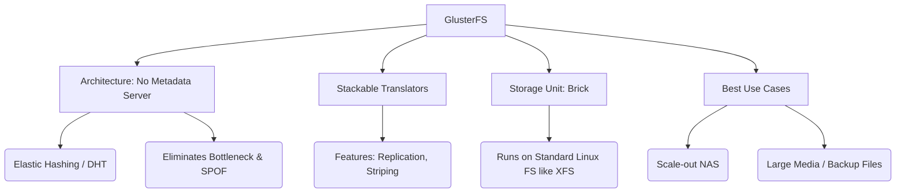

+++
title = "GlusterFS 분산 스토리지"
weight = 679
+++

> **GlusterFS 분산 스토리지의 핵심 통찰**
> 중앙집중형 메타데이터 서버를 완전히 배제한 순수(Pure) 스케일 아웃(Scale-out) 분산 파일 시스템이다.
> 탄력적인 해싱(Elastic Hashing) 알고리즘을 사용하여 파일의 저장 위치를 계산하므로 병목과 SPOF가 없다.
> 대용량 미디어 파일 처리와 확장성이 중요한 NAS(Network Attached Storage) 환경의 소프트웨어 정의 솔루션으로 탁월하다.

### Ⅰ. 개요 및 정의
GlusterFS(글러스터FS)는 레드햇(Red Hat)이 후원하는 오픈 소스 분산 파일 시스템으로, 수많은 x86 범용 서버의 디스크 자원을 이더넷/인피니밴드 네트워크로 묶어 하나의 거대한 병렬 네트워크 파일 시스템으로 만들어 줍니다. 다른 분산 파일 시스템(예: HDFS)과 가장 차별화되는 점은 데이터의 위치 정보를 관리하는 **'메타데이터 서버(Metadata Server)'가 아예 존재하지 않는다는 것**입니다. 대신 수학적 해시(Hash) 알고리즘을 사용해 데이터를 분산 배치하므로, 아키텍처가 매우 단순하고 확장이 무한대로 가능한 구조를 자랑합니다.

📢 **섹션 요약 비유:** 주차장 안내원(메타데이터 서버) 없이, 자동차 번호판의 끝자리를 공식에 넣으면 무조건 자신이 주차해야 할 지정석 번호가 나오게 만들어 안내원 앞의 교통 체증을 완전히 없앤 주차장입니다.

### Ⅱ. 아키텍처 및 동작 원리
GlusterFS의 아키텍처는 클라이언트 사이드 프로세싱과 모듈형 트랜슬레이터(Translator)에 기반을 둡니다.

```ascii
+-------------------------------------------------------------+
| User Applications (Mounts via FUSE, NFS, or SMB)            |
+-------------------------------------------------------------+
| Gluster Native Client (FUSE - Filesystem in Userspace)      |
| +---------------------------------------------------------+ |
| | Translators (Stackable modules: Cache, Replicate, DHT)  | |
| | - DHT (Distributed Hash Table) Elastic Hashing Algorithm| |
| +---------------------------------------------------------+ |
+-----------------------------+-------------------------------+
                              | (TCP/IP or RDMA)
     +------------------------+------------------------+
     |                        |                        |
+----v----+              +----v----+              +----v----+
| Server 1|              | Server 2|              | Server 3|
| (Brick) |              | (Brick) |              | (Brick) |
| xfs/ext4|              | xfs/ext4|              | xfs/ext4|
+---------+              +---------+              +---------+
 [ GlusterFS Storage Pool (Aggregated Bricks -> Volume) ]
```

1. **브릭 (Brick):** 스토리지를 제공하는 각 서버 노드의 기본 파티션 단위(보통 XFS 파일 시스템 사용)입니다. 이 브릭들을 모아 하나의 볼륨(Volume)을 만듭니다.
2. **트랜슬레이터 (Translators):** 데이터가 클라이언트에서 물리 디스크로 가기 전 거치는 레고 블록 같은 모듈입니다. 캐싱, 암호화, 복제(Replication), 스트라이핑(Striping) 기능 등을 이 트랜슬레이터를 쌓아 올려서 자유롭게 구성합니다.
3. **탄력적 해싱 (Elastic Hashing - DHT):** 파일 이름을 해시 함수에 넣어 32비트 정수 값을 추출하고, 각 브릭(서버)에 할당된 값의 범위(Range)와 비교하여 파일이 저장될 물리적 서버를 즉시 계산합니다. 메타데이터 서버가 필요 없는 핵심 이유입니다.

📢 **섹션 요약 비유:** 물을 정수할 때 필터(트랜슬레이터)를 여러 겹 겹쳐서 입맛에 맞게 조립하고, 물방울이 어느 정수통(브릭)으로 떨어질지는 물방울의 크기(파일 이름 해시값)에 따라 자동으로 미끄럼틀 경로가 결정되는 구조입니다.

### Ⅲ. 주요 기술 요소 및 특징
- **No Metadata Server (SPOF 제거):** 메타데이터 서버가 없으므로 해당 서버의 성능 한계나 고장으로 인한 전체 시스템 마비(SPOF) 위험이 없고, 아키텍처가 가벼우며 관리가 단순합니다.
- **다양한 볼륨 타입 지원:**
  - *Distributed:* 파일들을 여러 노드에 단순 분산 (용량 극대화)
  - *Replicated:* 같은 파일을 여러 노드에 미러링 (고가용성 확보, RAID 1과 유사)
  - *Distributed Replicated:* 분산과 복제를 혼합하여 엔터프라이즈 환경에서 가장 많이 쓰이는 방식
- **표준 파일 시스템 위에서 동작:** 각 노드(브릭)는 데이터 저장 시 독자적인 포맷을 쓰지 않고 리눅스의 표준 XFS, ext4 위에 그대로 파일을 저장합니다. 따라서 최악의 경우 Gluster 데몬이 죽어도 OS 쉘에서 파일을 바로 읽어낼 수 있습니다.

📢 **섹션 요약 비유:** 특수 암호 금고에 보관하는 것이 아니라 일반 서랍장(XFS 파일시스템)에 서류를 보관하기 때문에, 만약 전자식 관리 시스템(Gluster 데몬)이 고장 나도 사람이 직접 서랍을 열고 서류를 꺼낼 수 있는 높은 생존력을 가집니다.

### Ⅳ. 응용 사례 및 비교
- **대용량 미디어 및 콘텐츠 저장소:** 수 MB에서 수 GB에 이르는 이미지, 비디오 렌더링 파일, 스트리밍 미디어 파일 등을 저장하는 데 뛰어난 성능을 발휘합니다.
- **가상화 및 컨테이너 (Kubernetes) 스토리지:** Red Hat OpenShift 환경에서 영구 볼륨(Persistent Volume)을 제공하는 파일 기반 스토리지 백엔드로 사용됩니다.
- **비교 (GlusterFS vs Ceph vs HDFS):**
  - **HDFS:** 메타데이터 서버(NameNode)가 존재하며, 빅데이터/하둡 일괄 처리에 특화되어 대용량 단일 파일은 좋지만 수많은 작은 파일 처리나 일반적인 NAS 마운트에는 부적합합니다.
  - **Ceph:** 블록, 객체, 파일을 모두 지원하는 복잡하고 강력한 통합 생태계입니다. 초기 구축 난이도가 높습니다.
  - **GlusterFS:** 순수 파일 시스템(NAS) 확장에만 초점을 맞추어 아키텍처가 단순하고 구축이 매우 쉬우며, 대용량 파일 저장에 뛰어난 가성비를 제공합니다.

📢 **섹션 요약 비유:** Ceph가 수륙양용 다목적 군용 장갑차라면, GlusterFS는 오직 많은 이삿짐(대용량 파일)을 싣고 고속도로를 달리는 데 집중하는 튼튼하고 다루기 쉬운 대형 화물 트럭입니다.

### Ⅴ. 결론 및 향후 전망
GlusterFS는 메타데이터 서버를 제거한 우아한 해싱 아키텍처 덕분에 페타바이트 규모의 스케일 아웃 NAS 시장에서 독보적인 영역을 개척했습니다. 그러나 해싱 알고리즘의 특성상 수억 개의 '아주 작은 파일(Small Files)'이나 빈번한 메타데이터 변경(디렉토리 스캔 등) 작업에서는 성능 저하가 발생하는 단점도 있습니다. 향후에는 클라우드 네이티브 환경에 맞춰 컨테이너화된 워크로드의 파일 스토리지 요구 사항을 지원하며 전통적인 하드웨어 NAS 어플라이언스를 지속적으로 대체해 나갈 것입니다.

📢 **섹션 요약 비유:** 거대한 통나무나 바위(대용량 파일)를 여러 창고에 나누어 보관하고 찾기에는 세상에서 가장 단순하고 훌륭한 시스템이지만, 수백만 개의 모래알(초소형 파일)을 관리하는 데는 약간의 튜닝이 필요한 거인과도 같습니다.

---

### Knowledge Graph & Child Analogy



**Child Analogy:**
학교 도서관에서 책을 찾을 때 사서 선생님(메타데이터 서버)에게 물어봐야 하잖아요. 근데 선생님이 한 분뿐이라 줄이 엄청 길어져요. GlusterFS 도서관은 사서 선생님이 아예 없어요! 대신 책 제목의 첫 글자만 보면(해싱 알고리즘) '가'로 시작하면 무조건 1번 방, '나'는 2번 방이라는 규칙을 학생들 모두가 알고 있어서, 누구에게도 묻지 않고 바로 자기 방으로 뛰어가 책을 꺼내오는 엄청 빠른 도서관이랍니다.