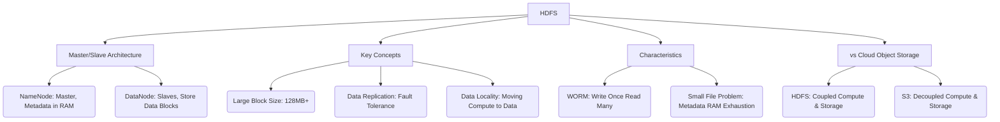

+++
title = "HDFS (Hadoop Distributed File System)"
weight = 680
+++

> **HDFS (Hadoop Distributed File System)의 핵심 통찰**
> 저사양의 범용(Commodity) 서버 수천 대를 묶어 페타바이트급 거대한 분산 파일 시스템을 구성하는 빅데이터의 핵심 인프라이다.
> 데이터 이동보다 '연산(Compute)을 데이터가 있는 곳으로 이동시키는 것'이 더 효율적이라는 철학(Data Locality)을 구현했다.
> 대규모 데이터를 순차적으로 한 번 쓰고 여러 번 읽는(WORM) 배치(Batch) 처리 워크로드에 완벽하게 최적화되어 있다.

### Ⅰ. 개요 및 정의
HDFS(Hadoop Distributed File System)는 아파치 하둡(Apache Hadoop) 생태계의 기반이 되는 분산 파일 시스템으로, 구글의 GFS(Google File System) 논문을 바탕으로 오픈 소스로 구현되었습니다. HDFS는 수많은 저렴한 x86 서버(노드)에 대용량 데이터를 분산 저장하고, 하드웨어 고장이 일상적으로 발생할 수 있다는 가정(Fault Tolerance) 하에 소프트웨어 레벨에서 데이터의 자동 복제(Replication)를 통해 고가용성과 무결성을 보장합니다. 빅데이터를 저장하는 '데이터 레이크(Data Lake)'의 초기 모델이자 가장 널리 쓰인 사실상의 표준(De facto standard)입니다.

📢 **섹션 요약 비유:** 한 명의 거인(초고가 스토리지)에게 무거운 바위를 들게 하는 대신, 만 명의 평범한 사람들(저렴한 범용 서버들)에게 바위를 잘게 쪼개어 나누어 들게 하여 비용은 낮추고 힘은 극대화한 시스템입니다.

### Ⅱ. 아키텍처 및 동작 원리
HDFS는 마스터/슬레이브(Master/Slave) 아키텍처를 가집니다.

```ascii
+-------------------------------------------------------------+
| Hadoop Client (MapReduce, Spark, Hive)                      |
| (Requests file read/write operations)                       |
+--------+-----------------------------------------+----------+
         | (1. Get Block Locations)                |
+--------v--------+                        (2. Direct Read/Write
| NameNode        |                            data to DataNodes)
| (Master Server) |                                |
| - Metadata (RAM)|                                v
|   (File to Block|        +-----------------------+-----------------------+
|    mapping)     |        | DataNode 1            | DataNode 2            |
| - FsImage/EditLg|        | (Slave Server)        | - Block 1 (A) Copy    |
+--------+--------+        | - Block 1 (A)         | - Block 3 (C)         |
         | (Heartbeats)    | - Block 2 (B)         +-----------------------+
+--------v--------+        +-----------------------+-----------------------+
| Secondary       |        | DataNode 3            | DataNode 4            |
| NameNode        |        | - Block 2 (B) Copy    | - Block 3 (C) Copy    |
| (Checkpointing) |        | - Block 4 (D)         | - Block 4 (D) Copy    |
+-----------------+        +-----------------------+-----------------------+
                           [ Default Replication Factor = 3 for fault tolerance ]
```

1. **NameNode (마스터):** 파일 시스템의 네임스페이스(디렉토리 구조)와 어떤 파일이 어떤 블록들로 나뉘어 어느 DataNode에 있는지(메타데이터)를 메모리(RAM)에서 관리합니다.
2. **DataNode (슬레이브):** 실제 데이터 블록이 저장되는 디스크를 가진 워커 노드입니다. 주기적으로 NameNode에 하트비트(Heartbeat)와 블록 리포트를 보내 자신이 살아있음을 알립니다.
3. **큰 블록 크기 (Block Size):** 일반적인 OS 파일 블록(4KB)과 달리, HDFS는 기본적으로 128MB 또는 256MB의 매우 큰 단위로 데이터를 쪼갭니다. 이는 디스크 탐색(Seek) 시간을 최소화하고 연속 읽기(Sequential Read) 속도를 극대화하기 위함입니다.
4. **Data Locality (데이터 지역성):** 맵리듀스(MapReduce)나 스파크(Spark) 작업 시, 연산 프로그램을 네트워크 너머로 가져오는 것이 아니라, 데이터가 저장된 DataNode 자체로 연산 프로그램을 보내어 그 자리에서 처리합니다. (네트워크 병목 방지)

📢 **섹션 요약 비유:** 도서관장(NameNode)은 책의 목차와 책이 꽂힌 위치 정보만 외우고 있고, 실제 수백만 권의 책은 수많은 서고 직원들(DataNode)이 들고 있습니다. 작업을 할 때 책을 중앙으로 가져오는 게 아니라, 작업자가 해당 서고 직원 옆으로 직접 가서(Data Locality) 일을 처리합니다.

### Ⅲ. 주요 기술 요소 및 특징
- **고가용성 확보 (Replication):** 데이터 블록을 기본적으로 3개의 서로 다른 DataNode(다른 랙 장비 포함)에 복제하여 저장합니다. 하나의 서버나 랙 전원이 나가도 데이터 유실이 없습니다.
- **WORM (Write Once, Read Many):** 파일은 한 번 쓰여지면(생성되면) 닫힌 이후에는 임의의 중간 부분을 수정(Update)할 수 없고, 오직 끝에 덧붙이거나(Append) 읽기만 가능합니다. 대규모 로그 데이터나 히스토리 데이터 처리를 위한 단순화된 구조입니다.
- **NameNode 병목과 SPOF:** 과거에는 NameNode 하나가 죽으면 전체 클러스터가 멈추는 SPOF 문제가 있었으나, 현재는 Active/Standby 듀얼 구성을 통해 고가용성(HA)을 해결했습니다. 단, 수억 개의 작은 파일(Small File Problem)을 저장하면 NameNode의 메모리(RAM)가 고갈되는 한계가 있습니다.

📢 **섹션 요약 비유:** 아주 중요한 설계도를 3장씩 복사해서 각기 다른 건물(서버 랙)에 보관해 두기 때문에, 건물 하나에 불이 나도(서버 장애) 업무는 전혀 지장 없이 진행되는 무적의 안전 시스템입니다.

### Ⅳ. 응용 사례 및 비교
- **빅데이터 데이터 레이크:** 웹 로그, 센서 데이터, 통신사 통화 기록(CDR) 등을 수년간 쌓아두고 Hive, Impala를 통해 대규모 SQL 분석을 수행하는 백엔드 저장소입니다.
- **머신러닝 / AI 파이프라인 전처리:** 아파치 스파크(Spark)와 결합하여 페타바이트급 데이터의 정제 및 피처 엔지니어링(Feature Engineering)을 분산 병렬로 처리합니다.
- **비교 (HDFS vs 클라우드 Object Storage S3):**
  - **HDFS:** 연산(Compute)과 저장소(Storage)가 같은 물리적 서버에 결합(Coupled)되어 있어 Data Locality 장점이 큽니다. 구축과 관리가 어렵습니다.
  - **S3 (객체 스토리지):** 연산(EC2 등)과 스토리지가 완벽히 분리(Decoupled)되어 있어 컴퓨팅 파워와 저장 공간을 각각 독립적으로 확장할 수 있습니다. 최근 클라우드 네이티브 환경에서는 HDFS 대신 S3가 데이터 레이크의 주류가 되었습니다.

📢 **섹션 요약 비유:** HDFS가 공장 안에 거대한 자체 물류 창고를 지어놓고 일하는 방식(연산/저장 결합)이라면, 클라우드 S3는 공장은 공장대로 돌리고 물류 창고는 아마존의 초대형 공용 창고를 월세 내고 쓰는 방식(연산/저장 분리)의 차이입니다.

### Ⅴ. 결론 및 향후 전망
HDFS는 지난 10년간 빅데이터 혁명을 이끈 위대한 기술입니다. 일반 기업이 구글 수준의 방대한 데이터를 처리할 수 있도록 민주화했습니다. 그러나 클라우드 컴퓨팅 시대가 도래하면서, 연산과 스토리지 인프라를 독립적으로 유연하게 스케일링할 수 있는 S3 등 클라우드 객체 스토리지 아키텍처(Storage-Compute Decoupling)에 메인스트림 자리를 물려주고 있습니다. 향후 온프레미스(On-premise) 환경에서의 견고한 대규모 일괄 처리 시스템으로서 그 명맥을 이어갈 것입니다.

📢 **섹션 요약 비유:** 빅데이터라는 거친 서부 개척 시대를 열어젖힌 튼튼한 증기 기관차(HDFS)입니다. 지금은 더 세련되고 유연한 전기차(클라우드 스토리지)가 많이 나왔지만, 여전히 거대한 철광석을 나르는 데는 그 위풍당당한 위력을 과시하고 있습니다.

---

### Knowledge Graph & Child Analogy



**Child Analogy:**
엄청나게 큰 레고 성(빅데이터)을 만들어야 할 때, 대장 친구(NameNode)는 조립 설명서만 들고 지시를 내리고, 100명의 친구들(DataNode)이 레고 블록을 나눠 들고 있어요. 그리고 대장 친구가 "블록 가져와!" 하는 게 아니라, 조립할 사람(연산)이 직접 블록을 든 친구 옆으로 다가가서 그 자리에서 바로 끼워 맞추는(데이터 지역성) 똑똑한 팀워크 작전이에요!