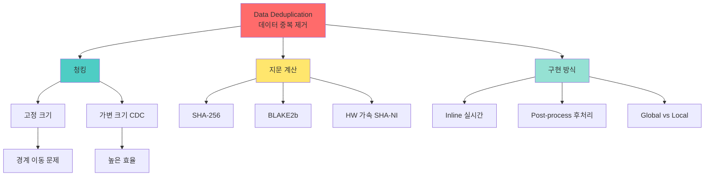

+++
title = "data deduplication"
date = "2026-03-14"
weight = 682
+++

# 데이터 중복 제거 (Data Deduplication)

## 🎯 핵심 인사이트

데이터 중복 제거(Deduplication)는 **동일한 데이터 블록을 한 번만 저장하여 스토리지 효율을 극대화**하는 기술이다. 청크 분할, 지문(Fingerprint) 계산, 중복 검사 과정을 거치며, 하드웨어 가속으로 성능을 확보한다.

---

## Ⅰ. 중복 제거 개념

### 1-1. 정의와 효과

```
┌─────────────────────────────────────────────────────────────────────┐
│                Data Deduplication (데이터 중복 제거)                │
├─────────────────────────────────────────────────────────────────────┤
│                                                                     │
│  "동일한 데이터는 한 번만 저장 - 포인터로 참조"                    │
│                                                                     │
│  ┌─────────────────────────────────────────────────────────────┐    │
│  │  Before Deduplication:                                      │    │
│  │                                                             │    │
│  │  File A: [블록1][블록2][블록3]  →  3 blocks                │    │
│  │  File B: [블록1][블록4][블록2]  →  3 blocks (중복!)        │    │
│  │  File C: [블록2][블록5][블록1]  →  3 blocks (중복!)        │    │
│  │                                                             │    │
│  │  총 9 blocks 저장                                           │    │
│  │                                                             │    │
│  └─────────────────────────────────────────────────────────────┘    │
│                                                                     │
│  ┌─────────────────────────────────────────────────────────────┐    │
│  │  After Deduplication:                                       │    │
│  │                                                             │    │
│  │  File A: [→1][→2][→3]  (포인터)                            │    │
│  │  File B: [→1][→4][→2]                                       │    │
│  │  File C: [→2][→5][→1]                                       │    │
│  │                                                             │    │
│  │  유니크 블록: [블록1][블록2][블록3][블록4][블록5]          │    │
│  │  총 5 blocks 저장 (44% 절약!)                               │    │
│  │                                                             │    │
│  └─────────────────────────────────────────────────────────────┘    │
│                                                                     │
│  Dedup Ratio (중복 제거율):                                        │
│  ┌──────────────────────────────────────────────────────────────┐   │
│  │  Ratio = 원본 크기 / 저장 크기                              │   │
│  │                                                             │   │
│  │  • 일반 파일 시스템: 1.5x ~ 3x                              │   │
│  │  • 백업 데이터: 10x ~ 30x (높은 중복)                       │   │
│  │  • VM 이미지: 5x ~ 20x (유사 OS/앱)                         │   │
│  │  • 이메일: 3x ~ 10x (첨부파일 중복)                         │   │
│  └──────────────────────────────────────────────────────────────┘   │
│                                                                     │
└─────────────────────────────────────────────────────────────────────┘
```

### 1-2. 중복 발생 원인

```
┌─────────────────────────────────────────────────────────────────────┐
│                    중복 발생 시나리오                               │
├─────────────────────────────────────────────────────────────────────┤
│                                                                     │
│  1. 파일 복사                                                       │
│  ┌──────────────────────────────────────────────────────────────┐   │
│  │  document.docx → document_backup.docx → document_final.docx  │   │
│  │  3개 파일, 내용은 거의 동일                                 │   │
│  └──────────────────────────────────────────────────────────────┘   │
│                                                                     │
│  2. VM/컨테이너 이미지                                             │
│  ┌──────────────────────────────────────────────────────────────┐   │
│  │  VM1: Ubuntu + App1                                         │   │
│  │  VM2: Ubuntu + App2  → Ubuntu OS 부분은 100% 중복           │   │
│  │  VM3: Ubuntu + App3                                         │   │
│  └──────────────────────────────────────────────────────────────┘   │
│                                                                     │
│  3. 백업 스냅샷                                                     │
│  ┌──────────────────────────────────────────────────────────────┐   │
│  │  Day 1: [A][B][C][D]                                        │   │
│  │  Day 2: [A][B][C'][D]  → 3/4가 Day 1과 동일                 │   │
│  │  Day 3: [A][B][C'][D'] → 2/4가 Day 2와 동일                 │   │
│  └──────────────────────────────────────────────────────────────┘   │
│                                                                     │
│  4. 이메일 첨부                                                     │
│  ┌──────────────────────────────────────────────────────────────┐   │
│  │  같은 파일을 100명에게 전송 → 100개 복사본                  │   │
│  │  Dedup: 1개만 저장, 100개의 포인터                          │   │
│  └──────────────────────────────────────────────────────────────┘   │
│                                                                     │
└─────────────────────────────────────────────────────────────────────┘
```

> **📢 섹션 요약 비유**: Deduplication은 도서관의 같은 책을 여러 권 사지 않는 것과 같다. 한 권만 사서, 여러 사람이 대출(포인터)해가는 것이다. 필요할 때마다 사면 돈과 공간이 낭비된다.

---

## Ⅱ. 청킹(Chunking) 전략

### 2-1. 고정 크기 청킹

```
┌─────────────────────────────────────────────────────────────────────┐
│                   Fixed-Size Chunking                               │
├─────────────────────────────────────────────────────────────────────┤
│                                                                     │
│  "정해진 크기(4KB, 8KB 등)로 분할"                                 │
│                                                                     │
│  ┌─────────────────────────────────────────────────────────────┐    │
│  │  File: ABCDEFGHIJKLMNOPQRSTUVWXYZ                          │    │
│  │  Chunk Size: 8 characters                                   │    │
│  │                                                             │    │
│  │  [ABCDEFGH][IJKLMNOP][QRSTUVWXYZ]                          │    │
│  │     C1         C2           C3                              │    │
│  │                                                             │    │
│  │  Hash: h1        h2          h3                             │    │
│  └─────────────────────────────────────────────────────────────┘    │
│                                                                     │
│  문제점 - 경계 이동 (Boundary Shift):                              │
│  ┌──────────────────────────────────────────────────────────────┐   │
│  │  원본: [ABCDEFGH][IJKLMNOP][QRSTUVWXYZ]                     │   │
│  │                                                             │   │
│  │  수정: [ABCDEFGH][IJKLM----][NOPQRSTUVWXY]                  │   │
│  │                    삭제          추가                        │   │
│  │                                                             │   │
│  │  → 뒤의 모든 청크가 밀림 → 중복 제거 효과 급감!             │   │
│  │                                                             │   │
│  │  C2' ≠ C2, C3' ≠ C3 → 모두 새 청크로 인식                   │   │
│  └──────────────────────────────────────────────────────────────┘   │
│                                                                     │
│  장점: 구현 단순, 메타데이터 작음                                  │
│  단점: 작은 변경에도 큰 영향                                       │
│                                                                     │
└─────────────────────────────────────────────────────────────────────┘
```

### 2-2. 가변 크기 청킹 (CDC)

```
┌─────────────────────────────────────────────────────────────────────┐
│         Content-Defined Chunking (CDC, 내용 정의 청킹)             │
├─────────────────────────────────────────────────────────────────────┤
│                                                                     │
│  "데이터 내용에 따라 경계 결정 - Rabin Fingerprint 사용"           │
│                                                                     │
│  ┌─────────────────────────────────────────────────────────────┐    │
│  │  Rabin Fingerprint: 윈도우 슬라이딩 해시                    │    │
│  │                                                             │    │
│  │  if (hash(window) mod TARGET) == MASK:                     │    │
│  │      chunk_boundary_here()                                  │    │
│  │                                                             │    │
│  │  File: ABCDEFGHIJKLMNOPQRSTUVWXYZ                          │    │
│  │        │    │      │     │                                  │    │
│  │        [ABCD][EFGHIJ][KLMNO][PQRSTUVWXYZ]                  │    │
│  │          C1     C2      C3        C4                        │    │
│  │         (4)    (6)     (5)       (11)  ← 다양한 크기       │    │
│  │                                                             │    │
│  └─────────────────────────────────────────────────────────────┘    │
│                                                                     │
│  경계 이동 문제 해결:                                              │
│  ┌──────────────────────────────────────────────────────────────┐   │
│  │  원본: [ABCD][EFGHIJ][KLMNO][PQRSTUVWXYZ]                   │   │
│  │                                                             │   │
│  │  수정: [ABCD][EFGHIJ][KLM--][PQRSTUVWXYZ]                   │   │
│  │                      삭제                                    │   │
│  │                                                             │   │
│  │  → 변경된 청크만 영향, 나머지는 그대로!                     │   │
│  │  → C1, C2, C4는 재사용, C3'만 새로 저장                     │   │
│  │                                                             │   │
│  └──────────────────────────────────────────────────────────────┘   │
│                                                                     │
│  알고리즘:                                                          │
│  • Rabin Fingerprint: O(n), 좋은 분포                              │
│  • Gear Hash: 더 단순, 빠름                                        │
│  • FastCDC: 최신, 균등 분포                                        │
│                                                                     │
│  장점: 작은 변경에 강함, 높은 중복 제거율                          │
│  단점: 구현 복잡, 메타데이터 큼                                    │
│                                                                     │
└─────────────────────────────────────────────────────────────────────┘
```

> **📢 섹션 요약 비유**: 고정 청킹은 자르기 틀로 빵을 자르는 것이다. 중간에 빵이 늘어나면 모든 조각이 달라진다. 가변 청킹은 빵의 결(Fingerprint)을 보고 자르는 것이다. 조금 늘어나도 자르는 위치는 비슷하다.

---

## Ⅲ. 지문(Fingerprint) 계산

### 3-1. 해시 함수 선택

```
┌─────────────────────────────────────────────────────────────────────┐
│                   Fingerprint (지문) 계산                           │
├─────────────────────────────────────────────────────────────────────┤
│                                                                     │
│  "청크를 고유하게 식별하는 고정 길이 해시값"                       │
│                                                                     │
│  ┌──────────────────────────────────────────────────────────────┐   │
│  │  Chunk: [D A T A B L O C K ...]                             │   │
│  │                      │                                       │   │
│  │                      ▼                                       │   │
│  │               Hash Function                                  │   │
│  │                      │                                       │   │
│  │                      ▼                                       │   │
│  │  Fingerprint: 0xA3F2B8C1... (128-bit, 256-bit, etc.)        │   │
│  │                                                             │   │
│  └──────────────────────────────────────────────────────────────┘   │
│                                                                     │
│  해시 함수 비교:                                                    │
│  ┌──────────────┬─────────┬─────────┬────────────────────────┐     │
│  │   함수       │ 속도    │ 충돌저항│ 용도                   │     │
│  ├──────────────┼─────────┼─────────┼────────────────────────┤     │
│  │ MD5          │ 매우 빠름│ 낮음   │ 레거시, 비보안        │     │
│  │ SHA-1        │ 빠름    │ 낮음   │ 레거시, 비권장        │     │
│  │ SHA-256      │ 보통    │ 높음   │ 일반적, 보안          │     │
│  │ SHA-512      │ 보통    │ 매우높음│ 높은 보안 필요       │     │
│  │ BLAKE2b      │ 매우 빠름│ 높음   │ Dedup 최적            │     │
│  │ xxHash       │ 초고속  │ 낮음   │ 빠른 검사             │     │
│  │ MurmurHash3  │ 초고속  │ 낮음   │ 해시테이블, 빠른 dedup│     │
│  └──────────────┴─────────┴─────────┴────────────────────────┘     │
│                                                                     │
│  충돌(Collision) 처리:                                              │
│  ┌──────────────────────────────────────────────────────────────┐   │
│  │  1. 충돌 무시: 낮은 확률, 대용량 스토리지에서는 위험         │   │
│  │  2. 2단계 해시: 충돌 시 다른 해시로 검증                     │   │
│  │  3. 바이트 비교: 해시 충돌 시 실제 데이터 비교               │   │
│  └──────────────────────────────────────────────────────────────┘   │
│                                                                     │
└─────────────────────────────────────────────────────────────────────┘
```

### 3-2. 하드웨어 가속

```
┌─────────────────────────────────────────────────────────────────────┐
│               Hash Calculation HW Acceleration                      │
├─────────────────────────────────────────────────────────────────────┤
│                                                                     │
│  Intel SHA Extensions (SHA-NI):                                    │
│  ┌──────────────────────────────────────────────────────────────┐   │
│  │  • SHA1RNDS4: SHA-1 라운드 4개                              │   │
│  │  • SHA1NEXTE, SHA1MSG1, SHA1MSG2: SHA-1 메시지 스케줄       │   │
│  │  • SHA256RNDS2: SHA-256 라운드 2개                          │   │
│  │  • SHA256MSG1, SHA256MSG2: SHA-256 메시지 스케줄            │   │
│  │                                                             │   │
│  │  성능: SHA-256 @ 5-10 GB/s (vs SW ~1 GB/s)                  │   │
│  └──────────────────────────────────────────────────────────────┘   │
│                                                                     │
│  AES-NI 활용 (AES-based Hash):                                     │
│  ┌──────────────────────────────────────────────────────────────┐   │
│  │  // AES-NI를 이용한 빠른 해시                               │   │
│  │  __m128i hash = _mm_aesenc_si128(data, key);               │   │
│  │                                                             │   │
│  │  // PMEM (Intel Optane) 컨트롤러 내장 해시                  │   │
│  │  // NVMe 컨트롤러에서 오프로드 가능                         │   │
│  └──────────────────────────────────────────────────────────────┘   │
│                                                                     │
│  ARM Cryptographic Extensions:                                     │
│  ┌──────────────────────────────────────────────────────────────┐   │
│  │  • SHA1 instructions: SHA1C, SHA1P, SHA1M, SHA1H            │   │
│  │  • SHA256 instructions: SHA256H, SHA256SU0, SHA256SU1       │   │
│  │  • SHA512 instructions (ARMv8.2+)                           │   │
│  └──────────────────────────────────────────────────────────────┘   │
│                                                                     │
│  FPGA/ASIC 오프로드:                                               │
│  • 전용 해시 엔진으로 40+ GB/s 처리                                │
│  • 스토리지 컨트롤러 내장                                          │
│                                                                     │
└─────────────────────────────────────────────────────────────────────┘
```

> **📢 섹션 요약 비유**: 지문 계산은 사람의 지문 채취와 같다. 각 청크마다 고유한 지문(해시)을 만들어서, 이미 본 지문인지 아닌지 판단한다. HW 가속은 자동 지문 채취 기계다!

---

## Ⅳ. 중복 제거 구현 방식

### 4-1. Inline vs Post-process

```
┌─────────────────────────────────────────────────────────────────────┐
│              Inline vs Post-process Deduplication                   │
├─────────────────────────────────────────────────────────────────────┤
│                                                                     │
│  Inline (실시간):                                                   │
│  ┌──────────────────────────────────────────────────────────────┐   │
│  │                                                             │    │
│  │  Write Request                                              │    │
│  │       │                                                     │    │
│  │       ▼                                                     │    │
│  │  ┌─────────┐                                                │    │
│  │  │ Chunking │                                               │    │
│  │  └────┬────┘                                                │    │
│  │       ▼                                                     │    │
│  │  ┌─────────┐                                                │    │
│  │  │ Hashing │                                                │    │
│  │  └────┬────┘                                                │    │
│  │       ▼                                                     │    │
│  │  ┌─────────┐     Unique?    ┌─────────┐                    │    │
│  │  │ Lookup  │────────No─────▶│  Store  │                    │    │
│  │  └────┬────┘                └─────────┘                    │    │
│  │       │Yes                                                  │    │
│  │       ▼                                                     │    │
│  │  ┌─────────┐                                                │    │
│  │  │ Pointer │ (실제 쓰기 없음!)                             │    │
│  │  └─────────┘                                                │    │
│  │                                                             │    │
│  │  장점: 즉시 공간 절약, 쓰기 I/O 감소                        │    │
│  │  단점: 쓰기 지연 증가, CPU 오버헤드                         │    │
│  │                                                             │    │
│  └──────────────────────────────────────────────────────────────┘   │
│                                                                     │
│  Post-process (후처리):                                            │
│  ┌──────────────────────────────────────────────────────────────┐   │
│  │                                                             │    │
│  │  Write Request ──▶ Store (그냥 저장)                        │    │
│  │                          │                                   │    │
│  │                          ▼ (나중에)                         │    │
│  │                    ┌──────────┐                             │    │
│  │                    │ Dedup Job│ (백그라운드)                │    │
│  │                    └────┬─────┘                             │    │
│  │                         ▼                                   │    │
│  │                   공간 회수                                  │    │
│  │                                                             │    │
│  │  장점: 쓰기 지연 없음, 백업에 적합                          │    │
│  │  단점: 일시적 공간 낭비, 복잡한 관리                        │    │
│  │                                                             │    │
│  └──────────────────────────────────────────────────────────────┘   │
│                                                                     │
└─────────────────────────────────────────────────────────────────────┘
```

### 4-2. 글로벌 vs 로컬 중복 제거

```
┌─────────────────────────────────────────────────────────────────────┐
│             Global vs Local Deduplication                           │
├─────────────────────────────────────────────────────────────────────┤
│                                                                     │
│  Global Deduplication:                                              │
│  ┌──────────────────────────────────────────────────────────────┐   │
│  │                                                             │    │
│  │  ┌─────────────────────────────────────────────────────┐    │    │
│  │  │            Global Fingerprint Index                 │    │    │
│  │  │  ┌───────┐ ┌───────┐ ┌───────┐ ┌───────┐          │    │    │
│  │  │  │h1→p1 │ │h2→p2 │ │h3→p3 │ │h4→p4 │ ...        │    │    │
│  │  │  └───────┘ └───────┘ └───────┘ └───────┘          │    │    │
│  │  └─────────────────────────────────────────────────────┘    │    │
│  │       ▲          ▲          ▲                               │    │
│  │       │          │          │                               │    │
│  │  ┌────┴───┐  ┌───┴────┐  ┌──┴─────┐                        │    │
│  │  │Volume 1│  │Volume 2│  │Volume 3│                        │    │
│  │  └────────┘  └────────┘  └────────┘                        │    │
│  │                                                             │    │
│  │  장점: 모든 볼륨 간 중복 제거, 최대 절약                    │    │
│  │  단점: 중앙 인덱스 부하, 확장성 문제                        │    │
│  │                                                             │    │
│  └──────────────────────────────────────────────────────────────┘   │
│                                                                     │
│  Local Deduplication:                                               │
│  ┌──────────────────────────────────────────────────────────────┐   │
│  │                                                             │    │
│  │  ┌──────────┐  ┌──────────┐  ┌──────────┐                   │    │
│  │  │ Volume 1 │  │ Volume 2 │  │ Volume 3 │                   │    │
│  │  │ ┌──────┐ │  │ ┌──────┐ │  │ ┌──────┐ │                   │    │
│  │  │ │Index1│ │  │ │Index2│ │  │ │Index3│ │                   │    │
│  │  │ └──────┘ │  │ └──────┘ │  │ └──────┘ │                   │    │
│  │  └──────────┘  └──────────┘  └──────────┘                   │    │
│  │                                                             │    │
│  │  장점: 독립적, 확장 용이                                    │    │
│  │  단점: 볼륨 간 중복 미제거                                  │    │
│  │                                                             │    │
│  └──────────────────────────────────────────────────────────────┘   │
│                                                                     │
└─────────────────────────────────────────────────────────────────────┘
```

> **📢 섹션 요약 비유**: Global은 회사 전체가 하나의 창고를 쓰는 것, Local은 부서마다 따로 창고를 쓰는 것이다. Global이 더 효율적이지만 관리가 어렵다.

---

## Ⅴ. 시험 핵심 정리

### 5-1. 암기 포인트

```
┌─────────────────────────────────────────────────────────────────────┐
│                     📝 시험 암기 포인트                             │
├─────────────────────────────────────────────────────────────────────┤
│                                                                     │
│  1. 정의                                                            │
│     • 동일 데이터 한 번만 저장, 포인터로 참조                      │
│     • Dedup Ratio = 원본크기 / 저장크기                            │
│                                                                     │
│  2. 처리 과정                                                       │
│     • Chunking → Fingerprinting → Lookup → Store/Reference        │
│                                                                     │
│  3. 청킹 방식                                                       │
│     • Fixed: 구현 단순, 경계 이동 문제                             │
│     • Variable (CDC): 높은 효율, 복잡함                            │
│                                                                     │
│  4. 해시 함수                                                       │
│     • SHA-256: 보안용, 보통 속도                                   │
│     • BLAKE2b: Dedup 최적, 빠름                                    │
│     • xxHash/MurmurHash: 초고속, 낮은 보안                         │
│                                                                     │
│  5. HW 가속                                                         │
│     • Intel SHA-NI: SHA-1/256 가속                                 │
│     • AES-NI: AES-based hash                                       │
│                                                                     │
│  6. 구현 방식                                                       │
│     • Inline: 실시간, 쓰기 지연                                    │
│     • Post-process: 후처리, 백업에 적합                            │
│                                                                     │
│  7. 중복 제거율                                                     │
│     • 일반: 1.5x ~ 3x                                              │
│     • 백업: 10x ~ 30x                                              │
│     • VM: 5x ~ 20x                                                 │
│                                                                     │
└─────────────────────────────────────────────────────────────────────┘
```

> **📢 섹션 요약 비유**: 시험에서 Dedup이 나오면 "도서관 책 대출 시스템"을 떠올려라. 같은 책을 여러 권 사지 않고 한 권만 사서 여러 사람이 대출해간다!

---

## 📊 개념 맵



---

## 👧 Child Analogy

데이터 중복 제거는 **학교 급식실의 음식 재료 관리**와 같아요!

```
┌─────────────────────────────────────────────────────────┐
│              🍱 급식실 재료 관리 🍱                      │
├─────────────────────────────────────────────────────────┤
│                                                         │
│  옛날 방식 (중복 제거 없음):                            │
│  ┌─────────────────────────────────────────┐           │
│  │ 김치찌개: 김치 1kg + 두부 + 돼지고기     │           │
│  │ 김치볶음: 김치 1kg + 돼지고기 + 참기름   │           │
│  │ 김치전:   김치 1kg + 밀가루 + 계란       │           │
│  │                                         │           │
│  │ → 김치를 3kg이나 샀어요! 😱              │           │
│  └─────────────────────────────────────────┘           │
│                                                         │
│  Dedup 방식:                                            │
│  ┌─────────────────────────────────────────┐           │
│  │ 창고에 김치 1kg만 저장! 🥬               │           │
│  │                                         │           │
│  │ 김치찌개 요리: → 김치 (참조)             │           │
│  │ 김치볶음 요리: → 김치 (참조)             │           │
│  │ 김치전 요리:   → 김치 (참조)             │           │
│  │                                         │           │
│  │ → 김치를 1kg만 샀어요! 3배 절약! ✅      │           │
│  └─────────────────────────────────────────┘           │
│                                                         │
│  이게 바로 중복 제거예요!                              │
│  "같은 건 하나만 두고, 필요할 때마다 가져다 써요!"     │
└─────────────────────────────────────────────────────────┘
```

컴퓨터에서도 같은 데이터를 여러 번 저장하지 않고, 하나만 저장하고 여러 곳에서 참조해요!