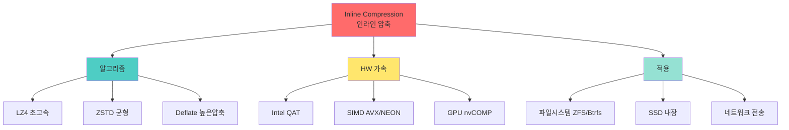

+++
title = "inline compression"
date = "2026-03-14"
weight = 683
+++

# 인라인 압축 (Inline Compression)

## 🎯 핵심 인사이트

인라인 압축은 **데이터를 디스크에 쓰기 전에 실시간으로 압축**하는 기술이다. CPU 오버헤드와 저장 공간 절약의 트레이드오프이며, LZ4, ZSTD, Deflate 등의 알고리즘과 하드웨어 가속을 통해 성능을 최적화한다.

---

## Ⅰ. 인라인 압축 개념

### 1-1. 정의와 동작

```
┌─────────────────────────────────────────────────────────────────────┐
│                 Inline Compression (인라인 압축)                    │
├─────────────────────────────────────────────────────────────────────┤
│                                                                     │
│  "데이터를 쓰기 전에 실시간 압축 - 저장 공간 절약"                │
│                                                                     │
│  ┌─────────────────────────────────────────────────────────────┐    │
│  │                                                             │    │
│  │  Write Request (100KB)                                      │    │
│  │       │                                                     │    │
│  │       ▼                                                     │    │
│  │  ┌─────────────┐                                            │    │
│  │  │  Compress   │                                            │    │
│  │  │  (Real-time)│                                            │    │
│  │  └──────┬──────┘                                            │    │
│  │         │                                                   │    │
│  │         ▼                                                   │    │
│  │  Compressed Data (30KB)  ← 70% 공간 절약                   │    │
│  │         │                                                   │    │
│  │         ▼                                                   │    │
│  │  ┌─────────────┐                                            │    │
│  │  │    Disk     │                                            │    │
│  │  └─────────────┘                                            │    │
│  │                                                             │    │
│  │  압축률 = 원본크기 / 압축크기 = 100/30 ≈ 3.3x              │    │
│  │                                                             │    │
│  └─────────────────────────────────────────────────────────────┘    │
│                                                                     │
│  인라인 vs 후처리 압축:                                            │
│  ┌──────────────────────────────────────────────────────────────┐   │
│  │  Inline:   Write ─▶ Compress ─▶ Store                       │   │
│  │  Post-process: Write ─▶ Store ─▶ (Later) Compress           │   │
│  └──────────────────────────────────────────────────────────────┘   │
│                                                                     │
└─────────────────────────────────────────────────────────────────────┘
```

### 1-2. 장단점

```
┌─────────────────────────────────────────────────────────────────────┐
│                   인라인 압축 장단점                                │
├─────────────────────────────────────────────────────────────────────┤
│                                                                     │
│  ✅ 장점:                                                           │
│  ┌──────────────────────────────────────────────────────────────┐   │
│  │  • 저장 공간 즉시 절약                                       │   │
│  │  • 디스크 I/O 감소 (적은 데이터 쓰기)                        │   │
│  │  • 네트워크 대역폭 절약 (분산 스토리지)                      │   │
│  │  • SSD 수명 연장 (적은 쓰기)                                 │   │
│  │  • 캐시 효율 증가 (더 많은 데이터 적재)                      │   │
│  └──────────────────────────────────────────────────────────────┘   │
│                                                                     │
│  ❌ 단점:                                                           │
│  ┌──────────────────────────────────────────────────────────────┐   │
│  │  • CPU 오버헤드 (압축/해제 연산)                             │   │
│  │  • 쓰기 지연 증가 가능                                       │   │
│  │  • 압축 불가 데이터에 오버헤드만 발생                        │   │
│  │  • 랜덤 읽기 복잡성 (압축 블록 경계)                         │   │
│  │  • 데이터 복구 복잡성                                        │   │
│  └──────────────────────────────────────────────────────────────┘   │
│                                                                     │
│  압축이 효과적인 데이터:                                           │
│  • 텍스트, 로그, JSON, XML                                         │
│  • 데이터베이스 (숫자, 반복 패턴)                                  │
│  • VM 이미지 (대부분 0 또는 반복)                                  │
│                                                                     │
│  압축이 비효과적인 데이터:                                         │
│  • 이미 압축된 파일 (MP3, MP4, ZIP, JPEG)                         │
│  • 암호화된 데이터 (무작위 같음)                                   │
│  • 난수, 노이즈                                                    │
│                                                                     │
└─────────────────────────────────────────────────────────────────────┘
```

> **📢 섹션 요약 비유**: 인라인 압축은 짐 싸기 전에 옷을 말아서 넣는 것이다. 공간은 절약하지만 싸는 데 시간이 더 걸린다. 이미 말린 옷(압축된 파일)은 다시 말아도 줄어들지 않는다.

---

## Ⅱ. 압축 알고리즘 비교

### 2-1. 주요 알고리즘

```
┌─────────────────────────────────────────────────────────────────────┐
│                  Compression Algorithms                             │
├─────────────────────────────────────────────────────────────────────┤
│                                                                     │
│  ┌──────────────┬──────────┬──────────┬─────────┬─────────────┐    │
│  │   알고리즘   │ 압축속도 │ 압축률   │ 해제속도│ 용도        │    │
│  ├──────────────┼──────────┼──────────┼─────────┼─────────────┤    │
│  │ LZ4          │ 초고속   │ 보통     │ 초고속  │ 실시간      │    │
│  │              │ ~500MB/s │ 2-3x     │ ~1GB/s  │ 스토리지    │    │
│  ├──────────────┼──────────┼──────────┼─────────┼─────────────┤    │
│  │ ZSTD         │ 빠름     │ 높음     │ 빠름    │ 범용        │    │
│  │              │ ~400MB/s │ 2.5-4x   │ ~1GB/s  │ 백업/전송   │    │
│  ├──────────────┼──────────┼──────────┼─────────┼─────────────┤    │
│  │ Deflate/GZIP │ 보통     │ 높음     │ 빠름    │ 파일 전송   │    │
│  │              │ ~100MB/s │ 2.5-4x   │ ~300MB/s│ 웹          │    │
│  ├──────────────┼──────────┼──────────┼─────────┼─────────────┤    │
│  │ LZMA/XZ      │ 느림     │ 매우높음 │ 느림    │ 배포        │    │
│  │              │ ~10MB/s  │ 3-5x     │ ~50MB/s │ 아카이브    │    │
│  ├──────────────┼──────────┼──────────┼─────────┼─────────────┤    │
│  │ Brotli       │ 보통     │ 매우높음 │ 빠름    │ 웹 전송     │    │
│  │              │ ~100MB/s │ 3-5x     │ ~300MB/s│ HTTP       │    │
│  ├──────────────┼──────────┼──────────┼─────────┼─────────────┤    │
│  │ Snappy       │ 초고속   │ 낮음     │ 초고속  │ 실시간      │    │
│  │              │ ~500MB/s │ 1.5-2x   │ ~1.5GB/s│ Big Data   │    │
│  └──────────────┴──────────┴──────────┴─────────┴─────────────┘    │
│                                                                     │
│  스토리지용 선택 기준:                                             │
│  • LZ4: 최고 속도, 낮은 지연, 낮은 압축률                          │
│  • ZSTD: 속도와 압축률 균형, 권장                                  │
│  • Deflate: 높은 압축률, 느린 속도                                 │
│                                                                     │
└─────────────────────────────────────────────────────────────────────┘
```

### 2-2. LZ4 구조

```
┌─────────────────────────────────────────────────────────────────────┐
│                      LZ4 Algorithm                                  │
├─────────────────────────────────────────────────────────────────────┤
│                                                                     │
│  "LZ77 변형 - 초고속 압축, 낮은 압축률"                            │
│                                                                     │
│  기본 원리:                                                         │
│  ┌──────────────────────────────────────────────────────────────┐   │
│  │  Token: [Literal][Match]                                     │   │
│  │                                                             │   │
│  │  Input:  ABCDEFGH...ABCDEFGH...ABCDEFGH...                  │   │
│  │          │         │                                        │   │
│  │          │         └── 이전에 나온 패턴!                    │   │
│  │          │                                                   │   │
│  │  Output: ABCDEFGH [offset:8, length:8] [offset:16, length:8]│   │
│  │          literal  ─────── match ────────── match            │   │
│  │                                                             │   │
│  └──────────────────────────────────────────────────────────────┘   │
│                                                                     │
│  블록 구조:                                                         │
│  ┌──────────────────────────────────────────────────────────────┐   │
│  │  ┌─────────────────────────────────────────────────────┐    │   │
│  │  │  Block Header (4 bytes)                              │    │   │
│  │  ├─────────────────────────────────────────────────────┤    │   │
│  │  │  Token 1: Literal Length + Match Length              │    │   │
│  │  │  [Optional: Extended Literal Length]                 │    │   │
│  │  │  Literals (literal bytes)                            │    │   │
│  │  │  Offset (2 bytes, little-endian)                     │    │   │
│  │  │  [Optional: Extended Match Length]                   │    │   │
│  │  ├─────────────────────────────────────────────────────┤    │   │
│  │  │  Token 2: ...                                        │    │   │
│  │  │  ...                                                 │    │   │
│  │  └─────────────────────────────────────────────────────┘    │   │
│  │                                                             │   │
│  │  최소 매치 길이: 4 (MINMATCH)                               │   │
│  │  해시 테이블: 빠른 매치 검색                                │   │
│  │                                                             │   │
│  └──────────────────────────────────────────────────────────────┘   │
│                                                                     │
│  특징:                                                              │
│  • SIMD 최적화 (SSE2, AVX2, NEON)                                  │
│  • 스트리밍 압축 지원                                              │
│  • 독립 블록 (랜덤 접근 가능)                                      │
│                                                                     │
└─────────────────────────────────────────────────────────────────────┘
```

> **📢 섹션 요약 비유**: LZ4는 빠른 요리사다. 음식을 대충 싸지만(낮은 압축률) 엄청 빠르다. LZMA는 꼼꼼한 할머니다. 음식을 완벽하게 싸지만(높은 압축률) 엄청 느리다.

---

## Ⅲ. 하드웨어 가속

### 3-1. CPU 최적화

```
┌─────────────────────────────────────────────────────────────────────┐
│               Compression HW Acceleration                           │
├─────────────────────────────────────────────────────────────────────┤
│                                                                     │
│  Intel QuickAssist Technology (QAT):                               │
│  ┌──────────────────────────────────────────────────────────────┐   │
│  │  • 전용 하드웨어 압축/암호화 엔진                            │   │
│  │  • Deflate, LZ4, ZSTD 가속                                   │   │
│  │  • 성능: ~100Gbps 압축 처리                                  │   │
│  │  • CPU 부하 거의 없음                                        │   │
│  │                                                             │   │
│  │  // Intel QAT API                                           │   │
│  │  CpaStatus status = cpaCySymPerformOp(...);                 │   │
│  │                                                             │   │
│  └──────────────────────────────────────────────────────────────┘   │
│                                                                     │
│  SIMD 최적화 (LZ4 예시):                                           │
│  ┌──────────────────────────────────────────────────────────────┐   │
│  │  // AVX2를 이용한 32바이트 한 번에 비교                     │   │
│  │  __m256i v1 = _mm256_lddqu_si256((__m256i*)ptr1);           │   │
│  │  __m256i v2 = _mm256_lddqu_si256((__m256i*)ptr2);           │   │
│  │  __m256i cmp = _mm256_cmpeq_epi8(v1, v2);                   │   │
│  │  int mask = _mm256_movemask_epi8(cmp);                      │   │
│  │  if (mask != 0xFFFFFFFF) {                                  │   │
│  │      // 다른 위치 찾음                                      │   │
│  │  }                                                          │   │
│  │                                                             │   │
│  │  // 성능 향상: 2-4x vs scalar                               │   │
│  └──────────────────────────────────────────────────────────────┘   │
│                                                                     │
│  ARM NEON 최적화:                                                  │
│  ┌──────────────────────────────────────────────────────────────┐   │
│  │  uint8x16_t v1 = vld1q_u8(ptr1);                            │   │
│  │  uint8x16_t v2 = vld1q_u8(ptr2);                            │   │
│  │  uint8x16_t cmp = vceqq_u8(v1, v2);                         │   │
│  │  // ...                                                     │   │
│  └──────────────────────────────────────────────────────────────┘   │
│                                                                     │
└─────────────────────────────────────────────────────────────────────┘
```

### 3-2. GPU/FPGA 오프로드

```
┌─────────────────────────────────────────────────────────────────────┐
│            GPU/FPGA Compression Acceleration                        │
├─────────────────────────────────────────────────────────────────────┤
│                                                                     │
│  GPU 기반 압축:                                                     │
│  ┌──────────────────────────────────────────────────────────────┐   │
│  │  • NVIDIA nvCOMP 라이브러리                                  │   │
│  │  • LZ4, GDeflate, ZSTD GPU 구현                             │   │
│  │  • 대량 데이터 병렬 압축                                     │   │
│  │  • 성능: 수십 GB/s                                          │   │
│  │                                                             │   │
│  │  nvcompBatchedLZ4CompressGetRequiredChunks(...);           │   │
│  │                                                             │   │
│  └──────────────────────────────────────────────────────────────┘   │
│                                                                     │
│  FPGA 압축:                                                         │
│  ┌──────────────────────────────────────────────────────────────┐   │
│  │  • Xilinx/Intel FPGA                                        │   │
│  │  • 파이프라인 압축 엔진                                      │   │
│  │  • 초저지연, 고속                                            │   │
│  │  • 클라우드 스토리지에서 활용                                │   │
│  │                                                             │   │
│  │  성능: ~40 GB/s (GZIP), ~100 GB/s (LZ4)                     │   │
│  │                                                             │   │
│  └──────────────────────────────────────────────────────────────┘   │
│                                                                     │
│  사용 사례:                                                         │
│  • 클라우드 스토리지 (AWS, Azure)                                  │
│  • 데이터 웨어하우스 (Snowflake)                                   │
│  • 고성능 네트워크 압축                                            │
│                                                                     │
└─────────────────────────────────────────────────────────────────────┘
```

> **📢 섹션 요약 비유**: HW 가속은 전용 압축 기계다. 손으로 옷을 말면 느리지만(CPU), 압축 기계를 쓰면(HW) 빠르다. GPU/FPGA는 산업용 대형 압축 기계다!

---

## Ⅳ. 스토리지 시스템 적용

### 4-1. 파일 시스템 레벨 압축

```
┌─────────────────────────────────────────────────────────────────────┐
│             Filesystem-Level Compression                            │
├─────────────────────────────────────────────────────────────────────┤
│                                                                     │
│  ZFS Compression:                                                   │
│  ┌──────────────────────────────────────────────────────────────┐   │
│  │  zfs set compression=lz4 pool/dataset                       │   │
│  │  zfs set compression=zstd pool/dataset                      │   │
│  │                                                             │   │
│  │  옵션: lz4, lzjb, gzip, gzip-N, zstd, zle, none            │   │
│  │                                                             │   │
│  │  특징:                                                      │   │
│  │  • 블록 레벨 압축 (recordsize 단위)                         │   │
│  │  • 압축률이 낮으면 자동 스킵                                │   │
│  │  • 투명한 압축 (애플리케이션 인식 없음)                     │   │
│  │                                                             │   │
│  │  ┌────────────────────────────────────────────┐             │   │
│  │  │ ZFS ARC (Cache)                            │             │   │
│  │  │ ┌─────────┐ ┌─────────┐                   │             │   │
│  │  │ │Uncompressed│ │Compressed│                │             │   │
│  │  │ │   Data   │ │  Data   │                   │             │   │
│  │  │ └─────────┘ └─────────┘                   │             │   │
│  │  │    ▲            │                         │             │   │
│  │  │    │   Decompress on read                 │             │   │
│  │  │    │            ▼                         │             │   │
│  │  │  Read ◀─── Disk (Compressed)              │             │   │
│  │  └────────────────────────────────────────────┘             │   │
│  │                                                             │   │
│  └──────────────────────────────────────────────────────────────┘   │
│                                                                     │
│  Btrfs Compression:                                                 │
│  ┌──────────────────────────────────────────────────────────────┐   │
│  │  mount -o compress=zstd:3 /dev/sda1 /mnt                    │   │
│  │  mount -o compress=lzo /dev/sda1 /mnt                       │   │
│  │                                                             │   │
│  │  옵션: no, zlib, lzo, zstd, zstd:N                         │   │
│  │  chattr +c file  # 파일별 압축 설정                        │   │
│  └──────────────────────────────────────────────────────────────┘   │
│                                                                     │
│  NTFS Compression:                                                  │
│  ┌──────────────────────────────────────────────────────────────┐   │
│  │  compact /c /s /a filename                                  │   │
│  │  • LZNT1 알고리즘                                           │   │
│  │  • 폴더/파일 단위 설정                                      │   │
│  └──────────────────────────────────────────────────────────────┘   │
│                                                                     │
└─────────────────────────────────────────────────────────────────────┘
```

### 4-2. SSD 내장 압축

```
┌─────────────────────────────────────────────────────────────────────┐
│                  SSD Internal Compression                           │
├─────────────────────────────────────────────────────────────────────┤
│                                                                     │
│  컨트롤러 내장 압축:                                               │
│  ┌──────────────────────────────────────────────────────────────┐   │
│  │                                                             │    │
│  │  Host ──▶ NAND Controller ──▶ [Compress] ──▶ NAND Flash    │    │
│  │                                                             │    │
│  │  장점:                                                      │    │
│  │  • 호스트 CPU 부하 없음                                     │    │
│  │  • 유효 용량 증가 (Over-provisioning 증가)                  │    │
│  │  • 쓰기 증폭 감소                                           │    │
│  │  • 수명 연장                                                │    │
│  │                                                             │    │
│  └──────────────────────────────────────────────────────────────┘    │
│                                                                     │
│  실제 구현:                                                         │
│  ┌──────────────────────────────────────────────────────────────┐   │
│  │  • SandForce 컨트롤러: DuraWrite (실시간 압축)              │   │
│  │  • Samsung: 일부 모델에서 압축 지원                         │   │
│  │  • 일반적으로 투명하게 동작 (호스트 모름)                   │   │
│  │                                                             │    │
│  │  마케팅 용어: "100GB SSD, 최대 200GB 효과"                 │    │
│  │  → 압축률에 따라 가변적                                     │    │
│  │                                                             │    │
│  └──────────────────────────────────────────────────────────────┘   │
│                                                                     │
└─────────────────────────────────────────────────────────────────────┘
```

> **📢 섹션 요약 비유**: 파일 시스템 압축은 냉장고가 알아서 음식을 밀봉하는 것이다. 사용자는 그냥 넣기만 하면 된다. SSD 내장 압축은 냉장고 자체가 더 작은 용기에 담아주는 것이다.

---

## Ⅴ. 시험 핵심 정리

### 5-1. 암기 포인트

```
┌─────────────────────────────────────────────────────────────────────┐
│                     📝 시험 암기 포인트                             │
├─────────────────────────────────────────────────────────────────────┤
│                                                                     │
│  1. 인라인 압축 정의                                                │
│     • 쓰기 전 실시간 압축                                          │
│     • 저장 공간 절약, I/O 감소                                     │
│                                                                     │
│  2. 장단점                                                          │
│     • 장점: 공간 절약, I/O 감소, SSD 수명 연장                     │
│     • 단점: CPU 오버헤드, 쓰기 지연                                │
│                                                                     │
│  3. 알고리즘 비교                                                    │
│     • LZ4: 초고속, 낮은 압축률, 실시간                             │
│     • ZSTD: 균형, 권장                                             │
│     • Deflate: 높은 압축률, 느림                                   │
│                                                                     │
│  4. HW 가속                                                         │
│     • Intel QAT: 전용 압축 엔진                                    │
│     • SIMD: AVX/NEON 최적화                                        │
│     • GPU: nvCOMP 병렬 압축                                        │
│                                                                     │
│  5. 파일 시스템 적용                                                │
│     • ZFS: lz4, zstd, gzip                                         │
│     • Btrfs: lzo, zstd                                             │
│                                                                     │
│  6. 압축 효과 없는 데이터                                          │
│     • 이미 압축된 파일 (MP3, ZIP, JPEG)                           │
│     • 암호화 데이터, 난수                                          │
│                                                                     │
└─────────────────────────────────────────────────────────────────────┘
```

> **📢 섹션 요약 비유**: 시험에서 인라인 압축이 나오면 "짐싸기"를 떠올려라. LZ4는 빨리 대충 싸기, ZSTD는 꼼꼼히 싸기, LZMA는 완벽하게 싸기다!

---

## 📊 개념 맵



---

## 👧 Child Analogy

인라인 압축은 **여행 가방에 옷 넣기**와 같아요!

```
┌─────────────────────────────────────────────────────────┐
│              🧳 여행 가방 싸기 🧳                        │
├─────────────────────────────────────────────────────────┤
│                                                         │
│  압축 없이:                                             │
│  ┌─────────────────────┐                               │
│  │ 👕👕👕👕👕👕👕👕       │                               │
│  │ 👖👖👖👖👖           │                               │
│  │                     │                               │
│  │ 가방 2개 필요! 😱    │                               │
│  └─────────────────────┘                               │
│                                                         │
│  인라인 압축:                                           │
│  ┌─────────────────────┐                               │
│  │ 📦📦📦📦📦📦📦📦     │ ← 돌돌 말아서 넣기!          │
│  │                     │                               │
│  │ 가방 1개로 충분! ✅  │                               │
│  │ 50% 공간 절약!       │                               │
│  └─────────────────────┘                               │
│                                                         │
│  알고리즘 차이:                                         │
│  • LZ4: 대충 말아서 빨리 넣기 (빠름!)                  │
│  • ZSTD: 꼼꼼하게 말아서 넣기 (공간절약!)              │
│  • LZMA: 완벽하게 접어서 넣기 (최대절약, 느림!)        │
│                                                         │
│  이미 압축된 건?                                        │
│  • 수영복: 이미 작아서 더 안 줄어듦 😅                 │
│                                                         │
└─────────────────────────────────────────────────────────┘
```

컴퓨터에서도 데이터를 디스크에 넣기 전에 압축해서 공간을 아껴요!