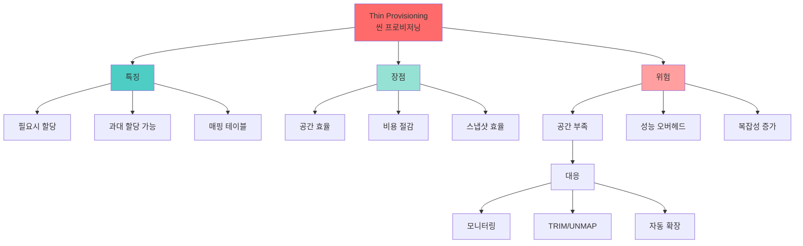

# 씬 프로비저닝 (Thin Provisioning)

## 🎯 핵심 인사이트

씬 프로비저닝은 **실제 사용량만큼만 물리적 공간을 할당**하는 스토리지 기술이다. 과대 할당(Over-provisioning)을 허용하여 저장 공간 효율을 극대화하지만, 공간 부족 시나리오 관리가 핵심 과제다.

---

## Ⅰ. 씬 프로비저닝 개념

### 1-1. 씬 vs 식(Thick) 프로비저닝

```
┌─────────────────────────────────────────────────────────────────────┐
│          Thin vs Thick Provisioning 비교                            │
├─────────────────────────────────────────────────────────────────────┤
│                                                                     │
│  Thick Provisioning (두꺼운/고정 할당):                            │
│  ┌──────────────────────────────────────────────────────────────┐   │
│  │                                                             │    │
│  │  요청: 100GB 볼륨                                           │    │
│  │       │                                                     │    │
│  │       ▼                                                     │    │
│  │  ┌─────────────────────────────────────────────────────┐   │    │
│  │  │██████████████████████████████████████████████████████│   │    │
│  │  │                  100GB 즉시 할당                      │   │    │
│  │  └─────────────────────────────────────────────────────┘   │    │
│  │       │                                                     │    │
│  │       ▼                                                     │    │
│  │  실제 사용: 30GB                                            │    │
│  │  낭비: 70GB (물리적으로 점유됨)                             │    │
│  │                                                             │    │
│  └──────────────────────────────────────────────────────────────┘   │
│                                                                     │
│  Thin Provisioning (씬/얇은 할당):                                 │
│  ┌──────────────────────────────────────────────────────────────┐   │
│  │                                                             │    │
│  │  요청: 100GB 볼륨                                           │    │
│  │       │                                                     │    │
│  │       ▼                                                     │    │
│  │  가상: ┌─────────────────────────────────────────────────┐ │    │
│  │       │  100GB (논리적 크기)                              │ │    │
│  │       └─────────────────────────────────────────────────┘ │    │
│  │       │                                                     │    │
│  │       ▼                                                     │    │
│  │  실제: ┌──────────────────────┐                            │    │
│  │       │████████████ 30GB만 할당│ (나머지는 필요시)        │    │
│  │       └──────────────────────┘                            │    │
│  │       │                                                     │    │
│  │       ▼                                                     │    │
│  │  물리 스토리지 절약: 70GB                                   │    │
│  │                                                             │    │
│  └──────────────────────────────────────────────────────────────┘   │
│                                                                     │
└─────────────────────────────────────────────────────────────────────┘
```

### 1-2. 과대 할당 (Over-provisioning)

```
┌─────────────────────────────────────────────────────────────────────┐
│                Over-provisioning (과대 할당)                        │
├─────────────────────────────────────────────────────────────────────┤
│                                                                     │
│  "물리 용량보다 더 큰 논리 용량을 할당"                            │
│                                                                     │
│  ┌─────────────────────────────────────────────────────────────┐    │
│  │                                                             │    │
│  │  물리 스토리지: 1TB                                         │    │
│  │                                                             │    │
│  │  논리 볼륨 할당:                                            │    │
│  │  ┌────────────────┐  VM1: 500GB                             │    │
│  │  │  500GB (30% 사용)│                                       │    │
│  │  └────────────────┘                                         │    │
│  │  ┌────────────────┐  VM2: 500GB                             │    │
│  │  │  500GB (20% 사용)│                                       │    │
│  │  └────────────────┘                                         │    │
│  │  ┌────────────────┐  VM3: 500GB                             │    │
│  │  │  500GB (10% 사용)│                                       │    │
│  │  └────────────────┘                                         │    │
│  │                                                             │    │
│  │  총 논리 할당: 1500GB (1.5TB)                               │    │
│  │  총 실제 사용: 300GB (30%)                                  │    │
│  │  물리 용량: 1TB                                              │    │
│  │                                                             │    │
│  │  Over-provision Ratio: 1.5x                                 │    │
│  │  ⚠️ 위험: 모든 VM가 동시에 채우면 공간 부족!               │    │
│  │                                                             │    │
│  └─────────────────────────────────────────────────────────────┘    │
│                                                                     │
│  전제 조건:                                                         │
│  • 모든 사용자가 동시에 최대 용량을 사용하지 않음                  │
│  • 통계적 활용률이 100% 미만                                       │
│  • 공간 회수(Reclamation) 메커니즘 필요                            │
│                                                                     │
└─────────────────────────────────────────────────────────────────────┘
```

> **📢 섹션 요약 비유**: 씬 프로비저닝은 은행의 지준율 제도와 같다. 은행이 모든 예금을 현금으로 가지고 있지 않듯이, 스토리지도 모든 할당량을 실제로 가지고 있지 않다. 단, 모두가 동시에 돈을 찾으면(런) 문제가 생긴다!

---

## Ⅱ. 구현 메커니즘

### 2-1. 블록 매핑

```
┌─────────────────────────────────────────────────────────────────────┐
│                    Thin Provisioning Mapping                        │
├─────────────────────────────────────────────────────────────────────┤
│                                                                     │
│  논리 → 물리 매핑 테이블:                                          │
│  ┌──────────────────────────────────────────────────────────────┐   │
│  │                                                             │    │
│  │  Logical Volume (100GB = 100 blocks)                        │    │
│  │  ┌───┬───┬───┬───┬───┬───┬───┬───┬───┬───┐                 │    │
│  │  │ L0│ L1│ L2│ L3│ L4│ L5│ L6│...│L98│L99│                 │    │
│  │  └─┬─┴─┬─┴─┬─┴─┬─┴─┬─┴─┬─┴─┬─┴───┴───┴───┘                 │    │
│  │    │    │    │    │    │    │                                │    │
│  │    │    │    │    │    │    │    Mapping Table              │    │
│  │    ▼    ▼    │    │    ▼    ▼    ┌────────────────┐         │    │
│  │  ┌───┐┌───┐  │    │  ┌───┐┌───┐  │ LBA │ PBA │   │         │    │
│  │  │P10││P23│  │    │  │P45││P67│  │─────┼─────┤   │         │    │
│  │  └───┘└───┘  │    │  └───┘└───┘  │ L0  │ P10 │   │         │    │
│  │    ▲    ▲    │    │    ▲    ▲    │ L1  │ P23 │   │         │    │
│  │    │    │    │    │    │    │    │ L2  │  -  │   │ Unalloc │    │
│  │    │    │    ▼    ▼    │    │    │ L3  │  -  │   │         │    │
│  │    │    │  ┌───────┐  │    │    │ L4  │ P45 │   │         │    │
│  │    │    │  │Unalloc│  │    │    │ L5  │ P67 │   │         │    │
│  │    │    │  └───────┘  │    │    │ ... │ ... │   │         │    │
│  │    │    │    │        │    │    └────────────────┘         │    │
│  │    │    │    │        │    │                                │    │
│  │  Physical Pool                                             │    │
│  │  ┌───┬───┬───┬───┬───┬───┬───┬───┬───┬───┐                 │    │
│  │  │P10│P23│P24│P25│P45│P67│...│   │   │   │                 │    │
│  │  └───┴───┴───┴───┴───┴───┴───┴───┴───┴───┘                 │    │
│  │                                                             │    │
│  └──────────────────────────────────────────────────────────────┘   │
│                                                                     │
│  쓰기 시나리오:                                                     │
│  ┌──────────────────────────────────────────────────────────────┐   │
│  │  1. L2에 쓰기 요청                                           │   │
│  │  2. Mapping Table 확인 → Unallocated                         │   │
│  │  3. Free Pool에서 P24 할당                                   │   │
│  │  4. L2 → P24 매핑 추가                                       │   │
│  │  5. 데이터 P24에 기록                                        │   │
│  └──────────────────────────────────────────────────────────────┘   │
│                                                                     │
└─────────────────────────────────────────────────────────────────────┘
```

### 2-2. 공간 회수 (Space Reclamation)

```
┌─────────────────────────────────────────────────────────────────────┐
│                   Space Reclamation                                 │
├─────────────────────────────────────────────────────────────────────┤
│                                                                     │
│  문제: 파일 삭제 후에도 물리 공간은 그대로                         │
│                                                                     │
│  ┌──────────────────────────────────────────────────────────────┐   │
│  │  1. 파일 삭제 전                                             │   │
│  │     Logical: [D][D][D][D][D]                                 │   │
│  │     Physical: [P1][P2][P3][P4][P5]                           │   │
│  │                                                             │   │
│  │  2. 파일 삭제 후 (OS 레벨)                                   │   │
│  │     Logical: [ ][ ][ ][ ][ ]  ← metadata만 삭제              │   │
│  │     Physical: [P1][P2][P3][P4][P5]  ← 여전히 점유!           │   │
│  │                                                             │   │
│  │  3. Reclamation 후                                           │   │
│  │     Logical: [ ][ ][ ][ ][ ]                                 │   │
│  │     Physical: [ ][ ][ ][ ][ ]  ← 물리 공간 회수              │   │
│  │                                                             │   │
│  └──────────────────────────────────────────────────────────────┘   │
│                                                                     │
│  UNMAP/TRIM 명령:                                                  │
│  ┌──────────────────────────────────────────────────────────────┐   │
│  │  • SCSI: UNMAP                                              │   │
│  │  • ATA: TRIM                                                │   │
│  │  • NVMe: Deallocation (Deallocate)                          │   │
│  │  • NFS: fstrim                                              │   │
│  │                                                             │   │
│  │  # Linux 예시                                               │   │
│  │  fstrim /mnt/thin_volume                                    │   │
│  │                                                             │   │
│  │  # VMware 예시                                              │   │
│  │  esxcli storage vmfs unmap --volume-label=datastore1        │   │
│  │                                                             │   │
│  └──────────────────────────────────────────────────────────────┘   │
│                                                                     │
│  Auto-tiering와 연계:                                              │
│  • 삭제된 블록 식별 → 회수 → Free Pool로 반환                      │
│  • 주기적 또는 실시간 실행                                         │
│                                                                     │
└─────────────────────────────────────────────────────────────────────┘
```

> **📢 섹션 요약 비유**: 공간 회수는 휴지통 비우기와 같다. 파일을 삭제해도(휴지통에 넣어도) 공간이 안 줄어든다. 휴지통을 비워야(TRIM/UNMAP) 실제 공간이 늘어난다.

---

## Ⅲ. 모니터링과 경고

### 3-1. 임계값 관리

```
┌─────────────────────────────────────────────────────────────────────┐
│                Thin Provisioning Thresholds                        │
├─────────────────────────────────────────────────────────────────────┤
│                                                                     │
│  사용량 임계값:                                                     │
│  ┌──────────────────────────────────────────────────────────────┐   │
│  │                                                             │    │
│  │  Physical Capacity Utilization                              │    │
│  │  │                                                          │    │
│  │  │  ┌──────────────────── Warning (80%)                    │    │
│  │  │  │                                                       │    │
│  │ 100%├──┬───────────────── Critical (95%)                   │    │
│  │     │  │                                                    │    │
│  │     │  │  ┌───────────────── Full (100%)                   │    │
│  │     │  │  │                                                 │    │
│  │     ▼  ▼  ▼                                                 │    │
│  │  ┌──┴──┴──┴───────────────────────────────────────────┐    │    │
│  │  │████████████████████████████                         │    │    │
│  │  └─────────────────────────────────────────────────────┘    │    │
│  │                                                             │    │
│  │  Warning (80%): 알림 발송, 자동 확장 고려                   │    │
│  │  Critical (95%): 쓰기 제한, 긴급 확장                       │    │
│  │  Full (100%): 쓰기 실패, 읽기 전용 전환 가능                │    │
│  │                                                             │    │
│  └──────────────────────────────────────────────────────────────┘   │
│                                                                     │
│  모니터링 메트릭:                                                   │
│  ┌──────────────────────────────────────────────────────────────┐   │
│  │  • Provisioned Capacity: 논리 할당 총량                     │   │
│  │  • Used Capacity: 실제 물리 사용량                          │   │
│  │  • Free Capacity: 남은 물리 공간                            │   │
│  │  • Over-provision Ratio: Provisioned / Physical             │   │
│  │  • Thin Efficiency: Used / Provisioned                      │   │
│  └──────────────────────────────────────────────────────────────┘   │
│                                                                     │
└─────────────────────────────────────────────────────────────────────┘
```

### 3-2. 공간 부족 대응

```
┌─────────────────────────────────────────────────────────────────────┐
│                Out-of-Space Handling                                │
├─────────────────────────────────────────────────────────────────────┤
│                                                                     │
│  공간 부족 시나리오:                                                │
│  ┌──────────────────────────────────────────────────────────────┐   │
│  │                                                             │    │
│  │  1. 예방적 조치                                              │    │
│  │     • 자동 확장 (Auto-grow)                                  │    │
│  │     • 공간 회수 강제 실행                                    │    │
│  │     • 압축/중복제거 강화                                     │    │
│  │                                                             │    │
│  │  2. 대응 조치                                                │    │
│  │     • 새 쓰기 차단 (ENOSPC)                                  │    │
│  │     • 낮은 우선순위 쓰기 지연                                │    │
│  │     • 스냅샷 삭제                                            │    │
│  │                                                             │    │
│  │  3. 복구 조치                                                │    │
│  │     • 물리 스토리지 추가                                     │    │
│  │     • 불필요한 볼륨 삭제                                     │    │
│  │     • Thick Provisioning으로 변환                            │    │
│  │                                                             │    │
│  └──────────────────────────────────────────────────────────────┘   │
│                                                                     │
│  벤더별 구현:                                                       │
│  ┌──────────────────────────────────────────────────────────────┐   │
│  │  NetApp: Volume Full Handling Policy                        │   │
│  │  VMware: Storage I/O Control (SIOC)                         │   │
│  │  ZFS: reservation, refreservation                           │   │
│  │                                                             │   │
│  │  # ZFS 예시: 최소 보장 공간 설정                            │   │
│  │  zfs set reservation=100G pool/thinvol                      │   │
│  │  zfs set refreservation=50G pool/thinvol                    │   │
│  └──────────────────────────────────────────────────────────────┘   │
│                                                                     │
└─────────────────────────────────────────────────────────────────────┘
```

> **📢 섹션 요약 비유**: 씬 프로비저닝은 공항의 비행기 예약과 같다. 1000명이 예약해도 실제 타는 건 800명 정도다. 그래서 800석 비행기에 1000명을 예약 받는다. 단, 모두가 오면(오버부킹) 문제가 생긴다!

---

## Ⅳ. 실제 구현 사례

### 4-1. VMware vSphere

```
┌─────────────────────────────────────────────────────────────────────┐
│                VMware Thin Provisioning                             │
├─────────────────────────────────────────────────────────────────────┤
│                                                                     │
│  VM Disk Types:                                                     │
│  ┌──────────────────────────────────────────────────────────────┐   │
│  │  Thick Provision Lazy Zeroed:                               │   │
│  │  • 즉시 모든 공간 할당                                       │   │
│  │  • 초기화는 필요시                                           │   │
│  │                                                             │   │
│  │  Thick Provision Eager Zeroed:                              │   │
│  │  • 즉시 모든 공간 할당 + 초기화                              │   │
│  │  • 보안 삭제 효과                                            │   │
│  │                                                             │   │
│  │  Thin Provision:                                            │   │
│  │  • 필요시 공간 할당                                          │   │
│  │  • 가장 효율적                                               │   │
│  │                                                             │   │
│  └──────────────────────────────────────────────────────────────┘   │
│                                                                     │
│  Storage vMotion:                                                   │
│  ┌──────────────────────────────────────────────────────────────┐   │
│  │  Thick → Thin: 실제 사용량만 마이그레이션                   │   │
│  │  Thin → Thick: 전체 크기로 확장                             │   │
│  │                                                             │   │
│  │  # Thin Provisioning 권장 설정                              │   │
│  │  • Datastore 알림: 75% Warning, 85% Critical                │   │
│  │  • 정기적 Storage vMotion으로 정리                          │   │
│  │                                                             │   │
│  └──────────────────────────────────────────────────────────────┘   │
│                                                                     │
└─────────────────────────────────────────────────────────────────────┘
```

### 4-2. Linux LVM Thin

```
┌─────────────────────────────────────────────────────────────────────┐
│                   LVM Thin Provisioning                             │
├─────────────────────────────────────────────────────────────────────┤
│                                                                     │
│  설정 예시:                                                         │
│  ┌──────────────────────────────────────────────────────────────┐   │
│  │  # Thin Pool 생성                                            │   │
│  │  lvcreate -L 100G -T vg0/thin_pool                           │   │
│  │                                                             │   │
│  │  # Thin Volume 생성 (1TB 할당, 실제는 필요시)               │   │
│  │  lvcreate -V 1T -T vg0/thin_pool -n thin_vol1               │   │
│  │  lvcreate -V 1T -T vg0/thin_pool -n thin_vol2               │   │
│  │                                                             │   │
│  │  # 상태 확인                                                 │   │
│  │  lvs -a -o+seg_monitor                                      │   │
│  │                                                             │   │
│  │  # 결과                                                      │   │
│  │  LV        VG   Attr       LSize Pool       Origin          │   │
│  │  thin_pool vg0  twi-a-tz-- 100G                             │   │
│  │  thin_vol1 vg0  Vwi-a-tz-- 1.00t thin_pool                  │   │
│  │  thin_vol2 vg0  Vwi-a-tz-- 1.00t thin_pool                  │   │
│  │                                                             │   │
│  │  Over-provision: 2TB 할당 / 100GB 물리 = 20x               │   │
│  │                                                             │   │
│  └──────────────────────────────────────────────────────────────┘   │
│                                                                     │
│  Snapshots:                                                         │
│  ┌──────────────────────────────────────────────────────────────┐   │
│  │  # 스냅샷 생성 (매우 빠름)                                   │   │
│  │  lvcreate -s -n snap1 -T vg0/thin_pool vg0/thin_vol1        │   │
│  │                                                             │   │
│  │  # Thin 스냅샷은 COW 공간만 사용                            │   │
│  │  # 스냅샷 여러 개 생성해도 오버헤드 적음                    │   │
│  └──────────────────────────────────────────────────────────────┘   │
│                                                                     │
└─────────────────────────────────────────────────────────────────────┘
```

> **📢 섹션 요약 비유**: LVM Thin은 은행 계좌와 같다. 1억 원짜리 통장을 만들어도(논리), 실제로는 100만 원만 넣어둔다(물리). 필요할 때마다 입금하면 된다.

---

## Ⅴ. 시험 핵심 정리

### 5-1. 암기 포인트

```
┌─────────────────────────────────────────────────────────────────────┐
│                     📝 시험 암기 포인트                             │
├─────────────────────────────────────────────────────────────────────┤
│                                                                     │
│  1. 정의                                                            │
│     • 실제 사용량만큼만 물리 공간 할당                             │
│     • 과대 할당(Over-provisioning) 가능                            │
│                                                                     │
│  2. Thin vs Thick                                                   │
│     • Thick: 즉시 전체 할당, 공간 낭비                              │
│     • Thin: 필요시 할당, 공간 효율                                  │
│                                                                     │
│  3. 장점                                                            │
│     • 저장 공간 효율 극대화                                        │
│     • 초기 비용 절감                                               │
│     • 스냅샷 생성 효율                                             │
│                                                                     │
│  4. 위험                                                            │
│     • 공간 부족(Out-of-Space) 시나리오                             │
│     • 모든 사용자가 동시에 최대 사용 시                            │
│                                                                     │
│  5. 공간 회수                                                       │
│     • TRIM/UNMAP 명령으로 물리 공간 해제                           │
│     • fstrim, esxcli unmap                                         │
│                                                                     │
│  6. 모니터링                                                        │
│     • Warning: 80%, Critical: 95%                                  │
│     • Provisioned vs Used vs Free                                  │
│                                                                     │
│  7. 실제 구현                                                       │
│     • VMware: Thin Provisioning VM Disk                            │
│     • LVM: Thin Pool/Volume                                        │
│     • ZFS: sparse volumes                                          │
│                                                                     │
└─────────────────────────────────────────────────────────────────────┘
```

> **📢 섹션 요약 비유**: 시험에서 씬 프로비저닝이 나오면 "은행 예금 vs 지폐 보관"을 떠올려라. Thick은 모든 돈을 실제로 가지고 있는 것, Thin은 장부상으로만 기록하고 필요할 때 가져오는 것이다.

---

## 📊 개념 맵



---

## 👧 Child Analogy

씬 프로비저닝은 **피자 가게의 좌석 예약**과 같아요!

```
┌─────────────────────────────────────────────────────────┐
│              🍕 피자 가게 좌석 예약 🍕                   │
├─────────────────────────────────────────────────────────┤
│                                                         │
│  가게에 좌석이 20개뿐이에요 🪑                          │
│                                                         │
│  Thick Provisioning:                                    │
│  ┌─────────────────────────────────────────┐           │
│  │ 예약: 5팀 × 4명 = 20명                  │           │
│  │ 실제 오는 사람: 5팀 × 2명 = 10명         │           │
│  │                                         │           │
│  │ 10개 좌석이 비어 있어요! 낭비! 😢        │           │
│  └─────────────────────────────────────────┘           │
│                                                         │
│  Thin Provisioning:                                     │
│  ┌─────────────────────────────────────────┐           │
│  │ 예약: 10팀 × 4명 = 40명 (20석보다 많아요!)│          │
│  │ 실제 오는 사람: 10팀 × 2명 = 20명        │           │
│  │                                         │           │
│  │ 딱 맞아요! 모든 좌석 사용! ✅            │           │
│  │                                         │           │
│  │ ⚠️ 하지만 모두가 4명씩 오면? 문제! 😱    │           │
│  └─────────────────────────────────────────┘           │
│                                                         │
│  이게 바로 Thin Provisioning이에요!                     │
│  "필요한 만큼만 실제로 준비해요!"                       │
└─────────────────────────────────────────────────────────┘
```

컴퓨터에서도 디스크 공간을 필요할 때만 실제로 할당해요!
