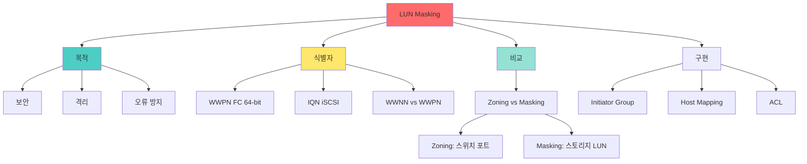

# LUN (Logical Unit Number) 마스킹

## 🎯 핵심 인사이트

LUN 마스킹은 **특정 호스트만 특정 LUN에 접근할 수 있도록 제한**하는 스토리지 보안 기술이다. WWPN(World Wide Port Name), IQN(iSCSI Qualified Name) 등을 기반으로 접근 제어 리스트(ACL)를 구성한다.

---

## Ⅰ. LUN 기본 개념

### 1-1. LUN 정의

```
┌─────────────────────────────────────────────────────────────────────┐
│              LUN (Logical Unit Number)                              │
├─────────────────────────────────────────────────────────────────────┤
│                                                                     │
│  "SCSI 장치 내 논리 단위를 식별하는 번호"                          │
│                                                                     │
│  ┌─────────────────────────────────────────────────────────────┐    │
│  │                                                             │    │
│  │  Storage Array                                              │    │
│  │  ┌───────────────────────────────────────────────────────┐ │    │
│  │  │                    Target (Target ID)                  │ │    │
│  │  │  ┌─────────┐ ┌─────────┐ ┌─────────┐ ┌─────────┐      │ │    │
│  │  │  │  LUN 0  │ │  LUN 1  │ │  LUN 2  │ │  LUN 3  │      │ │    │
│  │  │  │ (Boot)  │ │ (Data)  │ │ (Log)   │ │ (Backup)│      │ │    │
│  │  │  └─────────┘ └─────────┘ └─────────┘ └─────────┘      │ │    │
│  │  │                                                         │ │    │
│  │  └───────────────────────────────────────────────────────┘ │    │
│  │                                                             │    │
│  │  Host ──▶ HBA ──▶ SAN ──▶ Storage Controller ──▶ LUN      │    │
│  │                                                             │    │
│  └─────────────────────────────────────────────────────────────┘    │
│                                                                     │
│  SCSI 주소 체계:                                                    │
│  ┌──────────────────────────────────────────────────────────────┐   │
│  │  /dev/sdX = Bus : Target : LUN                              │   │
│  │                                                             │   │
│  │  예: 0:0:0 = Bus 0, Target 0, LUN 0                         │   │
│  │      0:0:1 = Bus 0, Target 0, LUN 1                         │   │
│  │                                                             │   │
│  │  Linux: /dev/sda, /dev/sdb, ...                             │   │
│  │  Windows: Disk 0, Disk 1, ...                               │   │
│  └──────────────────────────────────────────────────────────────┘   │
│                                                                     │
└─────────────────────────────────────────────────────────────────────┘
```

### 1-2. LUN과 볼륨

```
┌─────────────────────────────────────────────────────────────────────┐
│                    LUN vs Volume                                    │
├─────────────────────────────────────────────────────────────────────┤
│                                                                     │
│  ┌──────────────┬────────────────────────────────────────────────┐ │
│  │    용어      │                 설명                           │ │
│  ├──────────────┼────────────────────────────────────────────────┤ │
│  │ LUN          │ SCSI 프로토콜 레벨 식별자                      │ │
│  │              │ 스토리지에서 호스트로 제공하는 논리 단위       │ │
│  │              │ 번호 (0, 1, 2, ...)                            │ │
│  ├──────────────┼────────────────────────────────────────────────┤ │
│  │ Volume       │ 스토리지 내부의 논리적 공간                    │ │
│  │              │ RAID 그룹에서 생성                             │ │
│  │              │ LUN에 매핑되어 호스트에 노출                   │ │
│  ├──────────────┼────────────────────────────────────────────────┤ │
│  │ Partition    │ 호스트 OS 레벨의 분할                          │ │
│  │              │ LUN/디스크를 파티션으로 나눔                   │ │
│  └──────────────┴────────────────────────────────────────────────┘ │
│                                                                     │
│  관계:                                                              │
│  ┌──────────────────────────────────────────────────────────────┐   │
│  │                                                             │    │
│  │  [RAID Group] ──▶ [Volume] ──▶ [LUN] ──▶ [Host]             │    │
│  │                                                             │    │
│  │  Physical Disks   Logical     SCSI ID   /dev/sdX            │    │
│  │                   Space       Number                         │    │
│  │                                                             │    │
│  └──────────────────────────────────────────────────────────────┘    │
│                                                                     │
│  1:1 매핑이 보통이지만, 1:N (공유), N:1 (Stripe)도 가능            │
│                                                                     │
└─────────────────────────────────────────────────────────────────────┘
```

> **📢 섹션 요약 비유**: LUN은 호텔 방 번호다. 같은 건물(Target)에 여러 방(LUN)이 있고, 각 방에는 고유 번호가 있다. 방 번호만 알면 문을 찾을 수 있다.

---

## Ⅱ. LUN Masking 개념

### 2-1. 정의와 목적

```
┌─────────────────────────────────────────────────────────────────────┐
│                   LUN Masking 정의                                  │
├─────────────────────────────────────────────────────────────────────┤
│                                                                     │
│  "특정 호스트/포트만 특정 LUN에 접근 가능하도록 제한"              │
│                                                                     │
│  ┌─────────────────────────────────────────────────────────────┐    │
│  │                                                             │    │
│  │  Storage Array                                              │    │
│  │  ┌─────────────────────────────────────────────────────┐   │    │
│  │  │                  LUN Masking Table                   │   │    │
│  │  │                                                     │   │    │
│  │  │  ┌─────────┬───────────────────────────────────────┐│   │    │
│  │  │  │  LUN 0  │ Host A (WWPN: 50:01:...) ──▶ ✅ Allow ││   │    │
│  │  │  │         │ Host B (WWPN: 50:02:...) ──▶ ❌ Deny  ││   │    │
│  │  │  ├─────────┼───────────────────────────────────────┤│   │    │
│  │  │  │  LUN 1  │ Host A (WWPN: 50:01:...) ──▶ ❌ Deny  ││   │    │
│  │  │  │         │ Host B (WWPN: 50:02:...) ──▶ ✅ Allow ││   │    │
│  │  │  │         │ Host C (WWPN: 50:03:...) ──▶ ✅ Allow ││   │    │
│  │  │  └─────────┴───────────────────────────────────────┘│   │    │
│  │  │                                                     │   │    │
│  │  └─────────────────────────────────────────────────────┘   │    │
│  │                         │                                   │    │
│  │         ┌───────────────┼───────────────┐                  │    │
│  │         ▼               ▼               ▼                  │    │
│  │     ┌───────┐       ┌───────┐       ┌───────┐              │    │
│  │     │Host A │       │Host B │       │Host C │              │    │
│  │     │LUN 0만│       │LUN 1만│       │LUN 1만│              │    │
│  │     └───────┘       └───────┘       └───────┘              │    │
│  │                                                             │    │
│  └─────────────────────────────────────────────────────────────┘    │
│                                                                     │
│  목적:                                                              │
│  • 보안: 무단 접근 방지                                            │
│  • 격리: 호스트 간 데이터 분리                                     │
│  • 오류 방지: 잘못된 호스트의 쓰기 방지                            │
│  • 성능: 불필요한 I/O 경합 제거                                    │
│                                                                     │
└─────────────────────────────────────────────────────────────────────┘
```

### 2-2. LUN Masking vs Zoning

```
┌─────────────────────────────────────────────────────────────────────┐
│              LUN Masking vs Zoning                                  │
├─────────────────────────────────────────────────────────────────────┤
│                                                                     │
│  Zoning (Fabric 레벨):                                              │
│  ┌──────────────────────────────────────────────────────────────┐   │
│  │  • FC 스위치에서 구현                                         │   │
│  │  • 호스트 포트와 스토리지 포트 간 통신 경로 제어             │   │
│  │  • "누가 누구와 통신할 수 있나?"                              │   │
│  │                                                             │   │
│  │  ┌─────────────┐       ┌─────────────┐                     │   │
│  │  │   Zone 1    │       │   Zone 2    │                     │   │
│  │  │ Host A ──── │       │ Host B ──── │                     │   │
│  │  │ Storage Port│       │ Storage Port│                     │   │
│  │  │     1       │       │     2       │                     │   │
│  │  └─────────────┘       └─────────────┘                     │   │
│  │                                                             │   │
│  └──────────────────────────────────────────────────────────────┘   │
│                                                                     │
│  LUN Masking (Storage 레벨):                                       │
│  ┌──────────────────────────────────────────────────────────────┐   │
│  │  • 스토리지 컨트롤러에서 구현                                 │   │
│  │  • 특정 LUN에 대한 접근 권한 제어                            │   │
│  │  • "누가 어떤 LUN을 볼 수 있나?"                              │   │
│  │                                                             │   │
│  │  Storage Controller                                         │   │
│  │  ┌─────────────────────────────────────────────────────┐   │   │
│  │  │ LUN 0: [Host A만 허용]                               │   │   │
│  │  │ LUN 1: [Host B, Host C 허용]                         │   │   │
│  │  │ LUN 2: [모든 Host 허용]                              │   │   │
│  │  └─────────────────────────────────────────────────────┘   │   │
│  │                                                             │   │
│  └──────────────────────────────────────────────────────────────┘   │
│                                                                     │
│  ┌──────────────┬─────────────────┬─────────────────┐              │
│  │    측면      │     Zoning      │   LUN Masking   │              │
│  ├──────────────┼─────────────────┼─────────────────┤              │
│  │ 구현 위치    │ FC 스위치       │ 스토리지 컨트롤러│              │
│  │ 제어 단위    │ 포트-포트       │ 호스트-LUN      │              │
│  │ 식별자       │ WWPN, Domain ID │ WWPN, IQN, IP   │              │
│  │ 세분성       │ 거침 (Coarse)   │ 세밀 (Fine)     │              │
│  │ 용도         │ 네트워크 격리   │ 데이터 접근 제어│              │
│  └──────────────┴─────────────────┴─────────────────┘              │
│                                                                     │
│  권장: Zoning + LUN Masking 조합 (Defense in Depth)               │
│                                                                     │
└─────────────────────────────────────────────────────────────────────┘
```

> **📢 섹션 요약 비유**: Zoning은 건물 출입증, LUN Masking은 방 열쇠다. 건물에 들어와도(Zoning 통과) 방에 들어갈 수 있으려면 열쇠가 필요하다(LUN Masking).

---

## Ⅲ. 식별자 (Identifiers)

### 3-1. WWPN (World Wide Port Name)

```
┌─────────────────────────────────────────────────────────────────────┐
│             WWPN (World Wide Port Name)                             │
├─────────────────────────────────────────────────────────────────────┤
│                                                                     │
│  "FC/FCoE 포트의 전역 고유 식별자 - MAC과 유사"                    │
│                                                                     │
│  ┌──────────────────────────────────────────────────────────────┐   │
│  │                                                             │   │
│  │  WWPN Format: 16 hex digits (64-bit)                        │   │
│  │                                                             │   │
│  │  50:01:43:80:12:34:56:78                                    │   │
│  │  │    │    │    │    │    │                                 │   │
│  │  │    │    │    │    └──── Port specific                   │   │
│  │  │    │    │    └───────── Vendor specific                  │   │
│  │  │    │    └────────────── OUI (IEEE assigned)              │   │
│  │  │    └─────────────────── Type/NAA indicator               │   │
│  │  └──────────────────────── Company ID                        │   │
│  │                                                             │   │
│  │  WWNN vs WWPN:                                              │   │
│  │  • WWNN (Node Name): 전체 HBA/카드 식별                     │   │
│  │  • WWPN (Port Name): 개별 포트 식별                         │   │
│  │                                                             │   │
│  │  HBA with 2 ports:                                          │   │
│  │  ┌─────────────────────────────────────┐                    │   │
│  │  │            HBA Card                  │                    │   │
│  │  │  WWNN: 50:01:43:80:12:34:56:00      │                    │   │
│  │  │  ┌───────┐           ┌───────┐      │                    │   │
│  │  │  │Port A │           │Port B │      │                    │   │
│  │  │  │WWPN:  │           │WWPN:  │      │                    │   │
│  │  │  │56:01  │           │56:02  │      │                    │   │
│  │  │  └───────┘           └───────┘      │                    │   │
│  │  └─────────────────────────────────────┘                    │   │
│  │                                                             │   │
│  └──────────────────────────────────────────────────────────────┘   │
│                                                                     │
│  Linux에서 WWPN 확인:                                              │
│  ┌──────────────────────────────────────────────────────────────┐   │
│  │  cat /sys/class/fc_host/host*/port_name                     │   │
│  │  # 결과: 0x5001438012345678                                 │   │
│  └──────────────────────────────────────────────────────────────┘   │
│                                                                     │
└─────────────────────────────────────────────────────────────────────┘
```

### 3-2. IQN (iSCSI Qualified Name)

```
┌─────────────────────────────────────────────────────────────────────┐
│                   IQN (iSCSI Qualified Name)                        │
├─────────────────────────────────────────────────────────────────────┤
│                                                                     │
│  "iSCSI 이니시에이터/타겟의 식별자"                                 │
│                                                                     │
│  ┌──────────────────────────────────────────────────────────────┐   │
│  │                                                             │   │
│  │  IQN Format:                                                │   │
│  │  iqn.yyyy-mm.reverse-domain:identifier                     │   │
│  │                                                             │   │
│  │  예시:                                                      │   │
│  │  iqn.2024-03.com.example:storage.target00                  │   │
│  │      │    │    │           │                                │   │
│  │      │    │    │           └── 고유 식별자                   │   │
│  │      │    │    └────────────── 역도메인                      │   │
│  │      │    └─────────────────── 월                            │   │
│  │      └──────────────────────── 년                            │   │
│  │                                                             │   │
│  │  EUI Format (IEEE):                                         │   │
│  │  eui.02004567A425678D                                       │   │
│  │                                                             │   │
│  │  NAA Format (T10):                                          │   │
│  │  naa.5001234567890123                                       │   │
│  │                                                             │   │
│  └──────────────────────────────────────────────────────────────┘   │
│                                                                     │
│  Linux iSCSI 설정:                                                 │
│  ┌──────────────────────────────────────────────────────────────┐   │
│  │  # 이니시에이터 이름 확인                                    │   │
│  │  cat /etc/iscsi/initiatorname.iscsi                         │   │
│  │  InitiatorName=iqn.2024-03.com.example:server1             │   │
│  │                                                             │   │
│  │  # 타겟 검색                                                 │   │
│  │  iscsiadm -m discovery -t st -p 192.168.1.100               │   │
│  │                                                             │   │
│  │  # 타겟 로그인                                               │   │
│  │  iscsiadm -m node -T iqn.example:storage.target0 \         │   │
│  │           -p 192.168.1.100 --login                          │   │
│  └──────────────────────────────────────────────────────────────┘   │
│                                                                     │
└─────────────────────────────────────────────────────────────────────┘
```

> **📢 섹션 요약 비유**: WWPN은 주민등록번호, IQN은 이메일 주소와 같다. 둘 다 사람(포트/이니시에이터)을 식별하지만, 형식과 용도가 다르다.

---

## Ⅳ. 구현 예시

### 4-1. 스토리지 어레이 설정

```
┌─────────────────────────────────────────────────────────────────────┐
│             Storage Array LUN Masking 설정                          │
├─────────────────────────────────────────────────────────────────────┤
│                                                                     │
│  NetApp ONTAP:                                                     │
│  ┌──────────────────────────────────────────────────────────────┐   │
│  │  # LUN 생성                                                   │   │
│  │  lun create -vserver svm1 -vol vol1 -lun lun0 -size 100G    │   │
│  │                                                             │   │
│  │  # IG (Initiator Group) 생성                                 │   │
│  │  igroup create -vserver svm1 -igroup ig_hostA -protocol fcp │   │
│  │      -wwpn 50:01:43:80:12:34:56:78                          │   │
│  │                                                             │   │
│  │  # LUN 마스킹 (IG에 LUN 매핑)                                │   │
│  │  lun map -vserver svm1 -vol vol1 -lun lun0 -igroup ig_hostA │   │
│  │      -lun-id 0                                              │   │
│  │                                                             │   │
│  └──────────────────────────────────────────────────────────────┘   │
│                                                                     │
│  Dell EMC PowerStore:                                              │
│  ┌──────────────────────────────────────────────────────────────┐   │
│  │  # Host 생성                                                  │   │
│  │  powerstore> host create -name HostA                        │   │
│  │      -wwpn 50:01:43:80:12:34:56:78                          │   │
│  │                                                             │   │
│  │  # Volume 생성                                                │   │
│  │  powerstore> volume create -name Vol1 -size 100GB           │   │
│  │                                                             │   │
│  │  # Host에 Volume 매핑                                        │   │
│  │  powerstore> volume map -volume Vol1 -host HostA            │   │
│  │      -lun 0                                                 │   │
│  │                                                             │   │
│  └──────────────────────────────────────────────────────────────┘   │
│                                                                     │
│  Pure Storage:                                                      │
│  ┌──────────────────────────────────────────────────────────────┐   │
│  │  # Host 생성                                                  │   │
│  │  purehost create HostA                                       │   │
│  │  purehost setattr HostA wwpnlist 50:01:43:80:12:34:56:78   │   │
│  │                                                             │   │
│  │  # Volume 생성                                                │   │
│  │  purevol create Vol1 100G                                   │   │
│  │                                                             │   │
│  │  # Host에 Volume 연결                                        │   │
│  │  purehost connect HostA Vol1                                │   │
│  │                                                             │   │
│  └──────────────────────────────────────────────────────────────┘   │
│                                                                     │
└─────────────────────────────────────────────────────────────────────┘
```

### 4-2. 호스트 측 확인

```
┌─────────────────────────────────────────────────────────────────────┐
│                    Host-side LUN Verification                       │
├─────────────────────────────────────────────────────────────────────┤
│                                                                     │
│  Linux FC LUN 확인:                                                 │
│  ┌──────────────────────────────────────────────────────────────┐   │
│  │  # FC 호스트 정보                                             │   │
│  │  cat /sys/class/fc_host/host*/port_name                     │   │
│  │  cat /sys/class/fc_host/host*/node_name                     │   │
│  │                                                             │   │
│  │  # 발견된 LUN                                                 │   │
│  │  ls /sys/class/scsi_device/                                 │   │
│  │                                                             │   │
│  │  # 디스크로 인식된 LUN                                        │   │
│  │  lsblk                                                       │   │
│  │  lsscsi                                                      │   │
│  │                                                             │   │
│  │  # Rescan (새 LUN 인식)                                      │   │
│  │  echo "- - -" > /sys/class/scsi_host/host0/scan            │   │
│  │                                                             │   │
│  └──────────────────────────────────────────────────────────────┘   │
│                                                                     │
│  Linux iSCSI LUN 확인:                                             │
│  ┌──────────────────────────────────────────────────────────────┐   │
│  │  # 세션 정보                                                  │   │
│  │  iscsiadm -m session                                         │   │
│  │                                                             │   │
│  │  # 발견된 타겟                                                │   │
│  │  iscsiadm -m node                                            │   │
│  │                                                             │   │
│  │  # 연결된 디스크                                              │   │
│  │  lsblk                                                       │   │
│  │  lsscsi -g                                                   │   │
│  │                                                             │   │
│  └──────────────────────────────────────────────────────────────┘   │
│                                                                     │
│  Multipath (중요):                                                 │
│  ┌──────────────────────────────────────────────────────────────┐   │
│  │  # Multipath 상태                                             │   │
│  │  multipath -ll                                               │   │
│  │                                                             │   │
│  │  # 동일 LUN이 여러 경로로 보임                               │   │
│  │  mpatha (36001438012345678000000000000001) dm-0             │   │
│  │  ├─ sdxa 65:160  active ready  running                      │   │
│  │  └─ sdxg 65:224  active ready  running                      │   │
│  │                                                             │   │
│  └──────────────────────────────────────────────────────────────┘   │
│                                                                     │
└─────────────────────────────────────────────────────────────────────┘
```

> **📢 섹션 요약 비유**: LUN Masking 설정은 "이 사람만 이 방에 들어갈 수 있어요"라고 명단(ACL)을 만드는 것이다. 명단에 없으면 아무리 문 앞에 와도 들어갈 수 없다.

---

## Ⅴ. 시험 핵심 정리

### 5-1. 암기 포인트

```
┌─────────────────────────────────────────────────────────────────────┐
│                     📝 시험 암기 포인트                             │
├─────────────────────────────────────────────────────────────────────┤
│                                                                     │
│  1. LUN 정의                                                        │
│     • SCSI 논리 단위 번호                                          │
│     • 스토리지에서 호스트로 제공하는 논리 볼륨                     │
│                                                                     │
│  2. LUN Masking 목적                                                │
│     • 보안: 무단 접근 방지                                         │
│     • 격리: 호스트 간 데이터 분리                                  │
│     • 오류 방지: 잘못된 쓰기 방지                                  │
│                                                                     │
│  3. 식별자                                                          │
│     • WWPN: FC 포트 64-bit 식별자                                  │
│     • IQN: iSCSI 이니시에이터/타겟 식별자                          │
│     • WWNN vs WWPN: 노드 vs 포트                                   │
│                                                                     │
│  4. Zoning vs LUN Masking                                           │
│     • Zoning: FC 스위치, 포트-포트 격리                            │
│     • LUN Masking: 스토리지, 호스트-LUN 제어                       │
│                                                                     │
│  5. 구현 위치                                                       │
│     • 스토리지 컨트롤러에서 수행                                   │
│     • Initiator Group (IG) 또는 Host Group 사용                    │
│                                                                     │
│  6. Defense in Depth                                                │
│     • Zoning + LUN Masking 조합 권장                               │
│                                                                     │
└─────────────────────────────────────────────────────────────────────┘
```

> **📢 섹션 요약 비유**: 시험에서 LUN Masking이 나오면 "방 열쇠"를 떠올려라. 건물 출입증(Zoning)이 있어도 방 열쇠(LUN Masking)가 없으면 들어갈 수 없다!

---

## 📊 개념 맵



---

## 👧 Child Analogy

LUN 마스킹은 **학교 사물함 열쇠**와 같아요!

```
┌─────────────────────────────────────────────────────────┐
│              📚 학교 사물함 시스템 📚                    │
├─────────────────────────────────────────────────────────┤
│                                                         │
│  사물함 = LUN (저장 공간)                               │
│  학생 = Host (컴퓨터)                                   │
│  학생증 번호 = WWPN/IQN (식별자)                        │
│                                                         │
│  ┌─────────────────────────────────────────────┐       │
│  │              사물함 (Storage Array)          │       │
│  │                                             │       │
│  │   ┌───┐ ┌───┐ ┌───┐ ┌───┐ ┌───┐           │       │
│  │   │ 1 │ │ 2 │ │ 3 │ │ 4 │ │ 5 │           │       │
│  │   └─┬─┘ └─┬─┘ └─┬─┘ └─┬─┘ └─┬─┘           │       │
│  │     │     │     │     │     │               │       │
│  │     ▼     │     │     ▼     │               │       │
│  │   철수만   │   영희만   │                     │       │
│  │   열쇠 있음 │   열쇠 있음 │                     │       │
│  │                                             │       │
│  │   LUN Masking = "누가 어떤 사물함을         │       │
│  │                 열 수 있나요?"               │       │
│  │                                             │       │
│  └─────────────────────────────────────────────┘       │
│                                                         │
│  철수가 사물함 2를 열려고 하면?                         │
│  → "잘못된 열쇠입니다!" ❌                              │
│  → 이게 바로 LUN Masking!                              │
│                                                         │
└─────────────────────────────────────────────────────────┘
```

컴퓨터에서도 각 서버가 자기 사물함(LUN)만 열 수 있게 해요!
