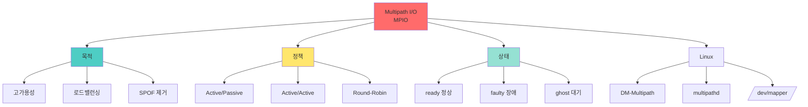

+++
title = "multipath io"
date = "2026-03-14"
weight = 686
+++

# 멀티패스 I/O (Multipath I/O)

## 🎯 핵심 인사이트

멀티패스 I/O(MPIO)는 **호스트와 스토리지 간 여러 경로를 통해 고가용성과 로드 밸런싱을 제공**하는 기술이다. 단일 경로 장애 시 자동으로 다른 경로로 전환(Failover)하며, 경로 정책에 따라 I/O를 분산한다.

---

## Ⅰ. 멀티패스 I/O 개념

### 1-1. 필요성

```
┌─────────────────────────────────────────────────────────────────────┐
│                단일 경로의 문제점                                   │
├─────────────────────────────────────────────────────────────────────┤
│                                                                     │
│  Single Path:                                                       │
│  ┌─────────────────────────────────────────────────────────────┐    │
│  │                                                             │    │
│  │  ┌────────┐      ┌─────────┐      ┌──────────────┐         │    │
│  │  │  Host  │──────│ FC Switch│──────│   Storage    │         │    │
│  │  │        │      │         │      │   Array      │         │    │
│  │  └────────┘      └─────────┘      └──────────────┘         │    │
│  │       │              │                   │                  │    │
│  │       │              │                   │                  │    │
│  │       ▼              ▼                   ▼                  │    │
│  │  ┌──────────────────────────────────────────────────────┐  │    │
│  │  │ SPOF (Single Point of Failure)                       │  │    │
│  │  │                                                      │  │    │
│  │  │ • HBA 고장 → 연결 끊김                                │  │    │
│  │  │ • 케이블 단선 → 연결 끊김                              │  │    │
│  │  │ • 스위치 포트 고장 → 연결 끊김                         │  │    │
│  │  │ • 스토리지 포트 고장 → 연결 끊김                       │  │    │
│  │  │                                                      │  │    │
│  │  │ → 서비스 중단! 😱                                     │  │    │
│  │  └──────────────────────────────────────────────────────┘  │    │
│  │                                                             │    │
│  └─────────────────────────────────────────────────────────────┘    │
│                                                                     │
└─────────────────────────────────────────────────────────────────────┘
```

### 1-2. 멀티패스 솔루션

```
┌─────────────────────────────────────────────────────────────────────┐
│                   Multipath I/O (MPIO)                              │
├─────────────────────────────────────────────────────────────────────┤
│                                                                     │
│  "여러 경로를 통한 고가용성 + 로드 밸런싱"                          │
│                                                                     │
│  ┌─────────────────────────────────────────────────────────────┐    │
│  │                                                             │    │
│  │  ┌────────────┐                                             │    │
│  │  │   Host     │                                             │    │
│  │  │ ┌────┐┌────┐│      ┌───────────┐      ┌──────────────┐  │    │
│  │  │ │HBA1││HBA2││──────│ FC Switch │──────│   Storage    │  │    │
│  │  │ └─┬──┘└─┬──┘│      │   (Redundant)   │   Array      │  │    │
│  │  │   │     │   │      └───────────┘      │ ┌────┐┌────┐ │  │    │
│  │  │   │     │   │                         │ │SP-A││SP-B│ │  │    │
│  │  │   │     │   │      ┌───────────┐      │ └────┘└────┘ │  │    │
│  │  │   │     │   │──────│ FC Switch │──────│   LUN        │  │    │
│  │  │   │     │   │      │  (Redundant)     │              │  │    │
│  │  │   │     │   │      └───────────┘      └──────────────┘  │    │
│  │  │   │     │   │                                         │    │
│  │  └───┼─────┼───┘                                         │    │
│  │      │     │                                              │    │
│  │      ▼     ▼                                              │    │
│  │  Path A   Path B                                          │    │
│  │                                                             │    │
│  │  장점:                                                      │    │
│  │  • 고가용성: 한 경로 장애 시 자동 전환                      │    │
│  │  • 로드 밸런싱: I/O 분산으로 성능 향상                      │    │
│  │  • 유지보수: 경로 하나를 끄고 작업 가능                     │    │
│  │                                                             │    │
│  └─────────────────────────────────────────────────────────────┘    │
│                                                                     │
│  동일 LUN이 여러 경로로 보임:                                      │
│  ┌──────────────────────────────────────────────────────────────┐   │
│  │  /dev/sda ← Path A (HBA1 → Switch1 → SPA)                   │   │
│  │  /dev/sdb ← Path B (HBA2 → Switch1 → SPB)                   │   │
│  │  /dev/sdc ← Path C (HBA1 → Switch2 → SPA)                   │   │
│  │  /dev/sdd ← Path D (HBA2 → Switch2 → SPB)                   │   │
│  │                                                             │   │
│  │  → 같은 LUN! MPIO로 하나의 /dev/mapper/mpatha로 통합        │   │
│  │                                                             │   │
│  └──────────────────────────────────────────────────────────────┘   │
│                                                                     │
└─────────────────────────────────────────────────────────────────────┘
```

> **📢 섹션 요약 비유**: 멀티패스는 2차선 도로와 같다. 한 차선이 공사 중이어도 다른 차선으로 우회할 수 있다. 두 차선 모두 사용하면 교통량도 분산된다!

---

## Ⅱ. 경로 정책 (Path Policies)

### 2-1. Failover 정책

```
┌─────────────────────────────────────────────────────────────────────┐
│                   Failover Policies                                 │
├─────────────────────────────────────────────────────────────────────┤
│                                                                     │
│  1. Active/Passive (Failover Only):                                │
│  ┌──────────────────────────────────────────────────────────────┐   │
│  │                                                             │    │
│  │  Path A (Active): ████████████████ ← 모든 I/O               │    │
│  │  Path B (Standby): ░░░░░░░░░░░░░░░░ ← 대기만               │    │
│  │                                                             │    │
│  │  Path A 장애 시:                                             │    │
│  │  Path A (Failed):  XXXXXXXXXXXXXXXX                         │    │
│  │  Path B (Active):  ████████████████ ← 자동 전환             │    │
│  │                                                             │    │
│  │  장점: 단순, 예측 가능                                       │    │
│  │  단점: 대역폭 낭비 (한 경로만 사용)                          │    │
│  │                                                             │    │
│  └──────────────────────────────────────────────────────────────┘   │
│                                                                     │
│  2. Active/Active (Load Balancing):                                │
│  ┌──────────────────────────────────────────────────────────────┐   │
│  │                                                             │    │
│  │  Path A (Active): ████████░░░░  ← I/O 분산                  │    │
│  │  Path B (Active): ░░░░████████  ← I/O 분산                  │    │
│  │                                                             │    │
│  │  Path A 장애 시:                                             │    │
│  │  Path A (Failed):  XXXXXXXXXXXX                             │    │
│  │  Path B (Active):  ████████████████ ← 모든 I/O 인수          │    │
│  │                                                             │    │
│  │  장점: 대역폭 최대 활용                                      │    │
│  │  단점: 구현 복잡, 경합 가능성                                │    │
│  │                                                             │    │
│  └──────────────────────────────────────────────────────────────┘   │
│                                                                     │
└─────────────────────────────────────────────────────────────────────┘
```

### 2-2. 로드 밸런싱 알고리즘

```
┌─────────────────────────────────────────────────────────────────────┐
│                Load Balancing Algorithms                            │
├─────────────────────────────────────────────────────────────────────┤
│                                                                     │
│  ┌──────────────────────────────────────────────────────────────┐   │
│  │                                                             │    │
│  │  1. Round-Robin (RR)                                         │    │
│  │     • I/O를 순차적으로 각 경로에 분배                        │    │
│  │     • 가장 단순, 균등 분배                                   │    │
│  │                                                             │    │
│  │     I/O: [1]→[2]→[3]→[4]→[5]→[6]                           │    │
│  │          ↓    ↓    ↓    ↓    ↓    ↓                         │    │
│  │     Path A: [1]  [3]  [5]                                   │    │
│  │     Path B: [2]  [4]  [6]                                   │    │
│  │                                                             │    │
│  │  2. Weighted Round-Robin (WRR)                               │    │
│  │     • 경로별 가중치에 따라 분배                              │    │
│  │     • 빠른 경로에 더 많은 I/O                                │    │
│  │                                                             │    │
│  │     Path A (Weight 2): [1] [2] [4] [5]                      │    │
│  │     Path B (Weight 1): [3] [6]                              │    │
│  │                                                             │    │
│  │  3. Least Queue Depth (LQD)                                  │    │
│  │     • 큐가 가장 짧은 경로로 전송                             │    │
│  │     • 동적 부하 분산                                         │    │
│  │                                                             │    │
│  │     Path A Queue: ████░░ (4 pending)                        │    │
│  │     Path B Queue: ██░░░░ (2 pending) ← 선택!                │    │
│  │                                                             │    │
│  │  4. Service Time                                            │    │
│  │     • 응답 시간이 가장 짧은 경로 선택                        │    │
│  │     • 성능 기반 동적 선택                                    │    │
│  │                                                             │    │
│  └──────────────────────────────────────────────────────────────┘   │
│                                                                     │
│  정책 선택 기준:                                                    │
│  ┌──────────────────────────────────────────────────────────────┐   │
│  │  • 대역폭 중시 → Round-Robin, Active/Active                  │   │
│  │  • 안정성 중시 → Failover Only, Active/Passive              │   │
│  │  • 지연시간 최소 → Least Queue Depth                        │   │
│  └──────────────────────────────────────────────────────────────┘   │
│                                                                     │
└─────────────────────────────────────────────────────────────────────┘
```

> **📢 섹션 요약 비유**: 로드 밸런싱은 은행 창구와 같다. Round-Robin은 번갈아 가며 배정, Least Queue Depth는 가장 줄이 짧은 창구로 안내하는 것이다.

---

## Ⅲ. Linux Device Mapper Multipath

### 3-1. 구성 요소

```
┌─────────────────────────────────────────────────────────────────────┐
│              Linux DM-Multipath Architecture                        │
├─────────────────────────────────────────────────────────────────────┤
│                                                                     │
│  ┌─────────────────────────────────────────────────────────────┐    │
│  │                                                             │    │
│  │  Application Layer                                          │    │
│  │  ┌──────────────────────────────────────────────────────┐  │    │
│  │  │  File System (ext4, xfs, etc.)                        │  │    │
│  │  └────────────────────────┬─────────────────────────────┘  │    │
│  │                           │                                 │    │
│  │  ┌────────────────────────▼─────────────────────────────┐  │    │
│  │  │  /dev/mapper/mpatha (Multipath Device)               │  │    │
│  │  │  (Unified Device Node)                                │  │    │
│  │  └────────────────────────┬─────────────────────────────┘  │    │
│  │                           │                                 │    │
│  │  ┌────────────────────────▼─────────────────────────────┐  │    │
│  │  │  Device Mapper (dm-multipath)                        │  │    │
│  │  │  ┌─────────────────────────────────────────────┐     │  │    │
│  │  │  │           Path Selector                     │     │  │    │
│  │  │  │   Round-Robin / Service Time / etc.        │     │  │    │
│  │  │  └─────────────────────────────────────────────┘     │  │    │
│  │  └───────────┬──────────────────────┬──────────────────┘  │    │
│  │              │                      │                      │    │
│  │  ┌───────────▼────────┐ ┌───────────▼────────┐            │    │
│  │  │ /dev/sda (Path A)  │ │ /dev/sdb (Path B)  │            │    │
│  │  │ HBA1→Switch→SPA    │ │ HBA2→Switch→SPB    │            │    │
│  │  └────────────────────┘ └────────────────────┘            │    │
│  │                                                             │    │
│  │  Components:                                                │    │
│  │  • dm-multipath.ko: 커널 모듈                               │    │
│  │  • multipathd: 데몬 (경로 모니터링)                         │    │
│  │  • multipath: CLI 툴                                       │    │
│  │  • kpartx: 파티션 매핑                                      │    │
│  │                                                             │    │
│  └─────────────────────────────────────────────────────────────┘    │
│                                                                     │
└─────────────────────────────────────────────────────────────────────┘
```

### 3-2. 설정 예시

```
┌─────────────────────────────────────────────────────────────────────┐
│                  /etc/multipath.conf 설정                           │
├─────────────────────────────────────────────────────────────────────┤
│                                                                     │
│  # 기본 설정                                                        │
│  defaults {                                                         │
│      user_friendly_names    yes                                    │
│      find_multipaths        yes                                    │
│      path_grouping_policy   multibus    # Active/Active           │
│      path_selector          "round-robin 0"                        │
│      failback               immediate                              │
│      no_path_retry          queue       # 경로 없으면 대기        │
│      rr_min_io              1000                                   │
│  }                                                                  │
│                                                                     │
│  # 벤더별 디바이스 설정                                             │
│  devices {                                                          │
│      device {                                                       │
│          vendor    "NETAPP"                                        │
│          product   "LUN.*"                                         │
│          path_grouping_policy  group_by_prio                       │
│          prio                "ontap"                               │
│          features            "3 queue_if_no_path pg_init_lost"     │
│      }                                                              │
│      device {                                                       │
│          vendor    "PURE"                                          │
│          product   "FlashArray"                                    │
│          path_grouping_policy  multibus                            │
│          path_selector        "service-time 0"                      │
│      }                                                              │
│  }                                                                  │
│                                                                     │
│  # 특정 LUN 블랙리스트                                              │
│  blacklist {                                                        │
│      wwid    "3600508b1001c*"    # 로컬 디스크 제외                │
│      devnode "^sr[0-9]+"         # CD-ROM 제외                     │
│  }                                                                  │
│                                                                     │
│  # 관리 명령                                                        │
│  ┌──────────────────────────────────────────────────────────────┐   │
│  │  # 상태 확인                                                   │   │
│  │  multipath -ll                                                 │   │
│  │                                                             │   │
│  │  # 수동 스캔                                                   │   │
│  │  multipath -v2                                                │   │
│  │                                                             │   │
│  │  # 플러시                                                      │   │
│  │  multipath -F                                                 │   │
│  │                                                             │   │
│  │  # 서비스 관리                                                 │   │
│  │  systemctl status multipathd                                 │   │
│  │  systemctl restart multipathd                                │   │
│  │                                                             │   │
│  └──────────────────────────────────────────────────────────────┘   │
│                                                                     │
└─────────────────────────────────────────────────────────────────────┘
```

> **📢 섹션 요약 비유**: DM-Multipath는 교통 정리 시스템과 같다. 여러 도로(Path)가 있을 때, 교통 정리관(Multipath)이 차량(I/O)을 적절히 분배한다.

---

## Ⅳ. 경로 상태와 페일오버

### 4-1. 경로 상태

```
┌─────────────────────────────────────────────────────────────────────┐
│                     Path States                                     │
├─────────────────────────────────────────────────────────────────────┤
│                                                                     │
│  ┌──────────────┬────────────────────────────────────────────────┐ │
│  │    상태      │                 설명                           │ │
│  ├──────────────┼────────────────────────────────────────────────┤ │
│  │ ready        │ 정상, I/O 처리 가능                            │ │
│  │ (active)     │ 경로 그룹의 활성 멤버                          │ │
│  ├──────────────┼────────────────────────────────────────────────┤ │
│  │ ghost        │ Passive 대기 상태                              │ │
│  │ (standby)    │ Failover 시 활성화 가능                        │ │
│  ├──────────────┼────────────────────────────────────────────────┤ │
│  │ faulty       │ 장애, I/O 불가                                 │ │
│  │ (failed)     │ 복구 필요                                      │ │
│  ├──────────────┼────────────────────────────────────────────────┤ │
│  │ shaky        │ 일시적 불안정                                  │ │
│  │              │ 재시도 중                                      │ │
│  └──────────────┴────────────────────────────────────────────────┘ │
│                                                                     │
│  상태 확인 예시:                                                   │
│  ┌──────────────────────────────────────────────────────────────┐   │
│  │  $ multipath -ll                                              │   │
│  │                                                             │   │
│  │  mpatha (36001438012345678000000000000001) dm-0             │   │
│  │  size=100G features='3 queue_if_no_path' hwhandler='1 alua' │   │
│  │  ├─ sdxa 65:160 active ready running   ← Path A: OK         │   │
│  │  └─ sdxg 65:224 active ready running   ← Path B: OK         │   │
│  │                                                             │   │
│  │  Path A 장애 시:                                             │   │
│  │  mpatha (36001438012345678000000000000001) dm-0             │   │
│  │  ├─ sdxa 65:160 failed faulty running  ← Path A: FAIL      │   │
│  │  └─ sdxg 65:224 active ready running   ← Path B: OK         │   │
│  │                                                             │   │
│  └──────────────────────────────────────────────────────────────┘   │
│                                                                     │
└─────────────────────────────────────────────────────────────────────┘
```

### 4-2. 페일오버 시퀀스

```
┌─────────────────────────────────────────────────────────────────────┐
│                   Failover Sequence                                 │
├─────────────────────────────────────────────────────────────────────┤
│                                                                     │
│  ┌──────────────────────────────────────────────────────────────┐   │
│  │                                                             │    │
│  │  정상 상태:                                                  │    │
│  │  ┌─────────────────────────────────────────────────────────┐│    │
│  │  │ Path A: ████████████ (Active)                          ││    │
│  │  │ Path B: ░░░░░░░░░░░░ (Standby)                         ││    │
│  │  └─────────────────────────────────────────────────────────┘│    │
│  │                           │                                  │    │
│  │                           ▼ Path A 장애 감지                 │    │
│  │                                                             │    │
│  │  1. 장애 감지 (Path Checker)                                │    │
│  │     • TUR (Test Unit Ready) 실패                            │    │
│  │     • I/O timeout                                           │    │
│  │     • Link down                                             │    │
│  │                                                             │    │
│  │  2. 경로 상태 변경                                           │    │
│  │     Path A: ready → faulty                                  │    │
│  │                                                             │    │
│  │  3. I/O 재라우팅                                             │    │
│  │     ├─ Pending I/O: Path B로 이동                           │    │
│  │     └─ New I/O: Path B로 전송                               │    │
│  │                                                             │    │
│  │  페일오버 완료:                                              │    │
│  │  ┌─────────────────────────────────────────────────────────┐│    │
│  │  │ Path A: XXXXXXXXXXXX (Faulty)                          ││    │
│  │  │ Path B: ████████████ (Active)                          ││    │
│  │  └─────────────────────────────────────────────────────────┘│    │
│  │                                                             │    │
│  │  페일오버 시간: 수 ms ~ 수 초 (설정에 따라)                 │    │
│  │                                                             │    │
│  └──────────────────────────────────────────────────────────────┘   │
│                                                                     │
│  Failback (복구):                                                  │
│  ┌──────────────────────────────────────────────────────────────┐   │
│  │  Path A 복구 시:                                             │   │
│  │  • immediate: 즉시 원복                                      │   │
│  │  • manual: 수동 복구                                         │   │
│  │  • followover: 다른 경고 후에만                              │   │
│  └──────────────────────────────────────────────────────────────┘   │
│                                                                     │
└─────────────────────────────────────────────────────────────────────┘
```

> **📢 섹션 요약 비유**: 페일오버는 비상 발전기와 같다. 정상 전원(Path A)이 끊기면 자동으로 비상 발전기(Path B)가 켜진다. 전원이 복구되면 다시 정상 전원으로 돌아간다(Failback).

---

## Ⅴ. 시험 핵심 정리

### 5-1. 암기 포인트

```
┌─────────────────────────────────────────────────────────────────────┐
│                     📝 시험 암기 포인트                             │
├─────────────────────────────────────────────────────────────────────┤
│                                                                     │
│  1. MPIO 목적                                                       │
│     • 고가용성 (High Availability)                                 │
│     • 로드 밸런싱 (Load Balancing)                                 │
│     • SPOF 제거                                                    │
│                                                                     │
│  2. 경로 정책                                                       │
│     • Active/Passive: Failover only, 한 경로만 활성               │
│     • Active/Active: 모든 경로 활성, Load Balancing               │
│                                                                     │
│  3. 로드 밸런싱 알고리즘                                           │
│     • Round-Robin: 순차 분배                                       │
│     • Least Queue Depth: 큐가 짧은 경로                           │
│     • Service Time: 응답 빠른 경로                                 │
│                                                                     │
│  4. 경로 상태                                                       │
│     • ready/active: 정상, I/O 가능                                 │
│     • ghost/standby: 대기                                          │
│     • faulty/failed: 장애                                          │
│                                                                     │
│  5. Linux 구현                                                      │
│     • DM-Multipath (Device Mapper)                                 │
│     • multipathd (데몬)                                            │
│     • /etc/multipath.conf (설정)                                   │
│                                                                     │
│  6. 페일오버 시간                                                   │
│     • 수 ms ~ 수 초                                                │
│     • 설정에 따라 다름                                             │
│                                                                     │
└─────────────────────────────────────────────────────────────────────┘
```

> **📢 섹션 요약 비유**: 시험에서 MPIO가 나오면 "이중화 도로"를 떠올려라. 한 도로가 막히면 다른 도로로 우회(Failover), 두 도로 모두 쓰면 교통 분산(Load Balancing)!

---

## 📊 개념 맵



---

## 👧 Child Analogy

멀티패스 I/O는 **두 개의 다리가 있는 도시**와 같아요!

```
┌─────────────────────────────────────────────────────────┐
│              🌉 두 개의 다리 도시 🌉                      │
├─────────────────────────────────────────────────────────┤
│                                                         │
│           🏠 마을 A                    🏭 공장           │
│              │                            │              │
│              │    ═══ 다리 1 ═══          │              │
│              │ ◀───────────────────────▶ │              │
│              │                            │              │
│              │    ~~~ 강 ~~~              │              │
│              │                            │              │
│              │    ═══ 다리 2 ═══          │              │
│              │ ◀───────────────────────▶ │              │
│                                                         │
│  Active/Passive (하나만 사용):                         │
│  ┌─────────────────────────────────────────┐           │
│  │ 다리 1: 차들이 다니고 있어요 🚗🚗🚗      │           │
│  │ 다리 2: 비워둬요 (비상용!)              │           │
│  │                                         │           │
│  │ 다리 1이 무너지면?                       │           │
│  │ → 다리 2로 바로 우회! ✅                │           │
│  └─────────────────────────────────────────┘           │
│                                                         │
│  Active/Active (둘 다 사용):                           │
│  ┌─────────────────────────────────────────┐           │
│  │ 다리 1: 차들이 다니고 있어요 🚗🚗        │           │
│  │ 다리 2: 차들이 다니고 있어요 🚙🚙        │           │
│  │                                         │           │
│  │ → 교통량이 반으로 줄어요! ✅            │           │
│  │ → 하나가 막혀도 다른 걸로! ✅           │           │
│  └─────────────────────────────────────────┘           │
│                                                         │
│  이게 바로 멀티패스 I/O예요!                           │
│  "여러 길로 가면 더 안전하고 빨라요!"                   │
└─────────────────────────────────────────────────────────┘
```

컴퓨터에서도 데이터가 여러 경로로 다니면 더 안전해요!