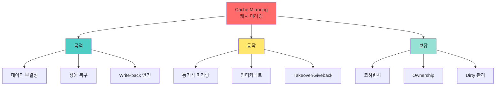

+++
title = "storage controller cache mirroring"
date = "2026-03-14"
weight = 687
+++

# 스토리지 컨트롤러 캐시 미러링

## 🎯 핵심 인사이트

컨트롤러 캐시 미러링은 **두 컨트롤러가 서로의 캐시를 복제하여 장애 시 데이터 무결성을 보장**하는 기술이다. 쓰기 작업이 로컬 캐시와 원격 캐시에 모두 기록된 후에야 완료(ACK)되므로, 한 컨트롤러 장애에도 데이터 손실이 없다.

---

## Ⅰ. 캐시 미러링 필요성

### 1-1. 컨트롤러 캐시의 역할

```
┌─────────────────────────────────────────────────────────────────────┐
│                 Storage Controller Cache                            │
├─────────────────────────────────────────────────────────────────────┤
│                                                                     │
│  "쓰기 성능 향상을 위한 Write-back Cache"                          │
│                                                                     │
│  ┌─────────────────────────────────────────────────────────────┐    │
│  │                                                             │    │
│  │  Host                   Controller                   Disk   │    │
│  │  ┌────┐                 ┌────────┐                ┌─────┐  │    │
│  │  │    │ Write Request   │  Cache │ Slow Write     │     │  │    │
│  │  │    │ ──────────────▶ │ (Fast) │ ────────────▶  │ HDD │  │    │
│  │  │    │                 │  DRAM  │                │     │  │    │
│  │  │    │                 └────────┘                └─────┘  │    │
│  │  │    │                     │                               │    │
│  │  │    │ ◀─── ACK (Fast!) ───┘                               │    │
│  │  └────┘                                                     │    │
│  │                                                             │    │
│  │  Write-back Cache:                                          │    │
│  │  • 캐시에 기록 후 즉시 ACK                                   │    │
│  │  • 나중에 디스크에 플러시                                    │    │
│  │  • 성능: 10x ~ 100x 향상                                    │    │
│  │                                                             │    │
│  └─────────────────────────────────────────────────────────────┘    │
│                                                                     │
│  문제점:                                                            │
│  ┌──────────────────────────────────────────────────────────────┐   │
│  │  Controller 장애 시:                                         │   │
│  │  ┌────────────┐                                             │   │
│  │  │   Cache    │ ← 💀 데이터 손실!                           │   │
│  │  │   [D1 D2  │     (아직 디스크에 안 씀)                    │   │
│  │  │    D3 D4] │                                             │   │
│  │  └────────────┘                                             │   │
│  │                                                             │   │
│  │  • 정전, 하드웨어 고장, 소프트웨어 패닉                      │   │
│  │  → 캐시에만 있는 데이터 = 유실                              │   │
│  │                                                             │   │
│  └──────────────────────────────────────────────────────────────┘   │
│                                                                     │
└─────────────────────────────────────────────────────────────────────┘
```

### 1-2. 캐시 미러링 개념

```
┌─────────────────────────────────────────────────────────────────────┐
│              Cache Mirroring Architecture                           │
├─────────────────────────────────────────────────────────────────────┤
│                                                                     │
│  "두 컨트롤러가 캐시를 서로 복제"                                   │
│                                                                     │
│  ┌─────────────────────────────────────────────────────────────┐    │
│  │                                                             │    │
│  │  ┌─────────────────┐        ┌─────────────────┐            │    │
│  │  │  Controller A   │        │  Controller B   │            │    │
│  │  │  ┌───────────┐  │        │  ┌───────────┐  │            │    │
│  │  │  │   Cache   │◀─┼────────┼─▶│   Cache   │  │            │    │
│  │  │  │   Mirror  │  │        │  │   Mirror  │  │            │    │
│  │  │  └───────────┘  │        │  └───────────┘  │            │    │
│  │  │                 │        │                 │            │    │
│  │  │  Local: D1 D2   │        │  Local: D5 D6   │            │    │
│  │  │  Mirror: D5 D6  │        │  Mirror: D1 D2  │            │    │
│  │  └────────┬────────┘        └────────┬────────┘            │    │
│  │           │                          │                      │    │
│  │           ▼                          ▼                      │    │
│  │  ┌──────────────────────────────────────────────────────┐  │    │
│  │  │                    Shared Storage                    │  │    │
│  │  │                 [Disk Array / LUNs]                  │  │    │
│  │  └──────────────────────────────────────────────────────┘  │    │
│  │                                                             │    │
│  └─────────────────────────────────────────────────────────────┘    │
│                                                                     │
│  동작:                                                              │
│  ┌──────────────────────────────────────────────────────────────┐   │
│  │  1. Host → Controller A: Write(D1)                          │   │
│  │  2. Controller A: 캐시에 D1 기록                             │   │
│  │  3. Controller A → Controller B: D1 미러링 전송              │   │
│  │  4. Controller B: 캐시에 D1 기록 (미러)                      │   │
│  │  5. Controller B → Controller A: ACK                        │   │
│  │  6. Controller A → Host: ACK (이제 완료!)                   │   │
│  │                                                             │   │
│  │  컨트롤러 A 장애 시:                                         │   │
│  │  → Controller B가 D1을 가지고 있음! 복구 가능! ✅            │   │
│  │                                                             │   │
│  └──────────────────────────────────────────────────────────────┘   │
│                                                                     │
└─────────────────────────────────────────────────────────────────────┘
```

> **📢 섹션 요약 비유**: 캐시 미러링은 중요 서류를 본사와 지사에 각각 보관하는 것이다. 본사가 불타도 지사에 사본이 있다!

---

## Ⅱ. 미러링 메커니즘

### 2-1. 동기식 vs 비동기식 미러링

```
┌─────────────────────────────────────────────────────────────────────┐
│               Synchronous vs Asynchronous Mirroring                 │
├─────────────────────────────────────────────────────────────────────┤
│                                                                     │
│  동기식 미러링 (Synchronous):                                      │
│  ┌──────────────────────────────────────────────────────────────┐   │
│  │                                                             │    │
│  │  Host ──▶ [Write] ──▶ Ctrl A Cache ──▶ Ctrl B Cache         │    │
│  │                             │               │                 │    │
│  │                             │               │                 │    │
│  │                             │◀──── ACK ─────┘                 │    │
│  │                             │                                 │    │
│  │                    ◀─── ACK to Host                           │    │
│  │                                                             │    │
│  │  특징:                                                      │    │
│  │  • 양쪽에 기록 후 ACK                                        │    │
│  │  • 데이터 무결성 100% 보장                                   │    │
│  │  • 지연 증가 (왕복 시간)                                     │    │
│  │                                                             │    │
│  └──────────────────────────────────────────────────────────────┘   │
│                                                                     │
│  비동기식 미러링 (Asynchronous):                                   │
│  ┌──────────────────────────────────────────────────────────────┐   │
│  │                                                             │    │
│  │  Host ──▶ [Write] ──▶ Ctrl A Cache ──▶ ACK to Host         │    │
│  │                             │                                 │    │
│  │                             │ (나중에)                        │    │
│  │                             ▼                                 │    │
│  │                        Ctrl B Cache                          │    │
│  │                                                             │    │
│  │  특징:                                                      │    │
│  │  • 로컬 기록 후 즉시 ACK                                     │    │
│  │  • 지연 최소                                                 │    │
│  │  • 미러링 완료 전 장애 시 데이터 손실 가능                   │    │
│  │                                                             │    │
│  └──────────────────────────────────────────────────────────────┘   │
│                                                                     │
│  일반적 선택:                                                       │
│  • 엔터프라이즈 스토리지: 동기식 미러링 (필수)                      │
│  • 성능 중시: 비동기식 (위험 감수)                                  │
│                                                                     │
└─────────────────────────────────────────────────────────────────────┘
```

### 2-2. 인터커넥트 (Interconnect)

```
┌─────────────────────────────────────────────────────────────────────┐
│                Controller Interconnect Options                      │
├─────────────────────────────────────────────────────────────────────┤
│                                                                     │
│  ┌──────────────────────────────────────────────────────────────┐   │
│  │                                                             │    │
│  │  1. PCIe (Internal)                                          │    │
│  │     • 단일 섀시 내 컨트롤러                                   │    │
│  │     • 초저지연, 고속                                          │    │
│  │     • 대역폭: 100+ GB/s                                      │    │
│  │                                                             │    │
│  │  2. Ethernet (External)                                      │    │
│  │     • 10GbE, 25GbE, 100GbE                                   │    │
│  │     • 분산 시스템 가능                                        │    │
│  │     • RoCE, iWARP 사용                                       │    │
│  │                                                             │    │
│  │  3. InfiniBand                                               │    │
│  │     • 초고속, 초저지연                                        │    │
│  │     • 고가, 복잡                                              │    │
│  │                                                             │    │
│  │  4. Fibre Channel                                            │    │
│  │     • FC-IP (FC over IP)                                     │    │
│  │     • 기존 SAN 인프라 활용                                    │    │
│  │                                                             │    │
│  └──────────────────────────────────────────────────────────────┘   │
│                                                                     │
│  대역폭 요구사항:                                                   │
│  ┌──────────────────────────────────────────────────────────────┐   │
│  │  • 캐시 크기: 64GB ~ 1TB+                                   │   │
│  │  • 미러링 대역폭 ≥ 프론트엔드 대역폭                         │   │
│  │  • 일반적: 50-100 GB/s                                      │   │
│  └──────────────────────────────────────────────────────────────┘   │
│                                                                     │
└─────────────────────────────────────────────────────────────────────┘
```

> **📢 섹션 요약 비유**: 인터커넥트는 두 본사 간 전용선이다. 빠를수록 좋고, 끊기면 비상사태다.

---

## Ⅲ. 페일오버 시나리오

### 3-1. 컨트롤러 장애 처리

```
┌─────────────────────────────────────────────────────────────────────┐
│               Controller Failover with Cache Mirroring              │
├─────────────────────────────────────────────────────────────────────┤
│                                                                     │
│  정상 상태:                                                         │
│  ┌──────────────────────────────────────────────────────────────┐   │
│  │                                                             │    │
│  │  Ctrl A (Active)           Ctrl B (Standby)                 │    │
│  │  ┌────────────┐            ┌────────────┐                   │    │
│  │  │ Cache:     │◀──Mirroring▶│ Cache:     │                   │    │
│  │  │ D1 D2 D3   │            │ D1 D2 D3   │                   │    │
│  │  │ D4 D5      │            │ D4 D5      │                   │    │
│  │  └────────────┘            └────────────┘                   │    │
│  │       │                           │                          │    │
│  │       ▼                           ▼                          │    │
│  │  ┌──────────────────────────────────────────────────────┐  │    │
│  │  │                 Shared Storage LUNs                  │  │    │
│  │  └──────────────────────────────────────────────────────┘  │    │
│  │                                                             │    │
│  └──────────────────────────────────────────────────────────────┘   │
│                                                                     │
│  Ctrl A 장애 발생:                                                 │
│  ┌──────────────────────────────────────────────────────────────┐   │
│  │                                                             │    │
│  │  Ctrl A (FAILED!)           Ctrl B (Takeover)               │    │
│  │  ┌────────────┐            ┌────────────┐                   │    │
│  │  │ Cache:     │   💀       │ Cache:     │                   │    │
│  │  │ XXXXXXXX   │            │ D1 D2 D3   │ ← Mirrored Data!  │    │
│  │  │            │            │ D4 D5      │   Safe! ✅         │    │
│  │  └────────────┘            └────────────┘                   │    │
│  │       │                           │                          │    │
│  │       ▼ (끊김)                     ▼                          │    │
│  │                               ┌────────────────────────────┐│    │
│  │                               │ Ctrl B가 모든 I/O 인수     ││    │
│  │                               │ 캐시 데이터 손실 없음      ││    │
│  │                               └────────────────────────────┘│    │
│  │                                                             │    │
│  │  페일오버 시간: 수 초 ~ 수 분                               │    │
│  │                                                             │    │
│  └──────────────────────────────────────────────────────────────┘   │
│                                                                     │
│  Takeover 후:                                                      │
│  • Ctrl B가 Ctrl A의 LUN 소유권 이전                               │
│  • 미러된 캐시 데이터로 복구                                       │
│  • 정상 I/O 재개                                                   │
│                                                                     │
└─────────────────────────────────────────────────────────────────────┘
```

### 3-2. Giveback (복귀)

```
┌─────────────────────────────────────────────────────────────────────┐
│                      Giveback Process                               │
├─────────────────────────────────────────────────────────────────────┤
│                                                                     │
│  Ctrl A 복구 후:                                                    │
│  ┌──────────────────────────────────────────────────────────────┐   │
│  │                                                             │    │
│  │  1. Ctrl A 부팅 및 초기화                                    │    │
│  │  2. Ctrl B → Ctrl A: 캐시 동기화                            │    │
│  │  3. 양쪽 캐시 일치 확인                                      │    │
│  │  4. Ctrl B → Ctrl A: LUN 소유권 반환                        │    │
│  │  5. Ctrl A: 정상 Active 복귀                                 │    │
│  │  6. 미러링 재개                                              │    │
│  │                                                             │    │
│  └──────────────────────────────────────────────────────────────┘   │
│                                                                     │
│  ┌──────────────────────────────────────────────────────────────┐   │
│  │  Ctrl A (Active)            Ctrl B (Standby)                 │   │
│  │  ┌────────────┐            ┌────────────┐                   │   │
│  │  │ Cache:     │◀──Mirroring▶│ Cache:     │                   │   │
│  │  │ D1 D2 D3   │            │ D1 D2 D3   │                   │   │
│  │  │ D4 D5      │            │ D4 D5      │                   │   │
│  │  └────────────┘            └────────────┘                   │   │
│  │                                                             │   │
│  │  ✅ 정상 상태 복귀!                                          │   │
│  │                                                             │   │
│  └──────────────────────────────────────────────────────────────┘   │
│                                                                     │
│  Giveback 정책:                                                     │
│  • Automatic: 자동 복귀                                            │
│  • Manual: 관리자 승인 필요                                        │
│  • Scheduled: 지정 시간에만                                        │
│                                                                     │
└─────────────────────────────────────────────────────────────────────┘
```

> **📢 섹션 요약 비유**: Giveback은 대리 근무자가 정규직원에게 업무를 인계하는 것이다. 인계가 완료되면 다시 정상 근무 체제로 돌아간다.

---

## Ⅳ. 캐시 일관성 보장

### 4-1. 캐시 코히런시 프로토콜

```
┌─────────────────────────────────────────────────────────────────────┐
│                Cache Coherency Protocol                             │
├─────────────────────────────────────────────────────────────────────┤
│                                                                     │
│  문제: 양쪽 컨트롤러가 같은 블록을 캐시                             │
│  ┌──────────────────────────────────────────────────────────────┐   │
│  │                                                             │    │
│  │  Ctrl A Cache: Block 100 = 0xAAAA                          │    │
│  │  Ctrl B Cache: Block 100 = 0xAAAA (Mirror)                 │    │
│  │                                                             │    │
│  │  Host 1 → Ctrl A: Write Block 100 = 0xBBBB                 │    │
│  │  Host 2 → Ctrl B: Write Block 100 = 0xCCCC                 │    │
│  │                                                             │    │
│  │  충돌! 어떤 값이 맞나?                                       │    │
│  │                                                             │    │
│  └──────────────────────────────────────────────────────────────┘   │
│                                                                     │
│  해결책:                                                            │
│  ┌──────────────────────────────────────────────────────────────┐   │
│  │                                                             │    │
│  │  1. Ownership Model                                          │    │
│  │     • 각 LUN에 단일 Owner 지정                               │    │
│  │     • Owner만 쓰기 가능                                      │    │
│  │     • 비-Owner는 읽기만 (쓰기는 Owner에게 전달)              │    │
│  │                                                             │    │
│  │  2. Distributed Lock                                        │    │
│  │     • 쓰기 전 락 획득                                        │    │
│  │     • 락 보유 중 다른 쪽 수정 금지                           │    │
│  │                                                             │    │
│  │  3. MESI-like Protocol                                      │    │
│  │     • Modified, Exclusive, Shared, Invalid                  │    │
│  │     • 캐시 라인 상태 관리                                    │    │
│  │                                                             │    │
│  └──────────────────────────────────────────────────────────────┘   │
│                                                                     │
│  일반적 접근: LUN Ownership (Active/Passive per LUN)               │
│                                                                     │
└─────────────────────────────────────────────────────────────────────┘
```

### 4-2. 더티 데이터 관리

```
┌─────────────────────────────────────────────────────────────────────┐
│                  Dirty Data Tracking                                │
├─────────────────────────────────────────────────────────────────────┤
│                                                                     │
│  Dirty Page: 캐시에만 있고 아직 디스크에 안 씀                     │
│                                                                     │
│  ┌──────────────────────────────────────────────────────────────┐   │
│  │                                                             │    │
│  │  Cache Directory:                                           │    │
│  │  ┌───────┬────────┬───────────┬───────────┐                │    │
│  │  │ Block │  State │   Ctrl A  │   Ctrl B  │                │    │
│  │  ├───────┼────────┼───────────┼───────────┤                │    │
│  │  │  100  │ Dirty  │ 0xBBBB ✓  │ 0xBBBB ✓  │ Mirrored      │    │
│  │  │  101  │ Clean  │ 0xCCCC ✓  │ 0xCCCC ✓  │ On Disk       │    │
│  │  │  102  │ Dirty  │ 0xDDDD ✓  │ 0xDDDD ✓  │ Mirrored      │    │
│  │  │  103  │ Dirty  │ 0xEEEE ✓  │ Pending   │ Not mirrored! │    │
│  │  └───────┴────────┴───────────┴───────────┘                │    │
│  │                                                             │    │
│  │  Block 103: 미러링 완료 전 Ctrl A 장애 = 데이터 손실 가능!  │    │
│  │                                                             │    │
│  └──────────────────────────────────────────────────────────────┘   │
│                                                                     │
│  플러시 정책:                                                       │
│  ┌──────────────────────────────────────────────────────────────┐   │
│  │  • Watermark 기반: 80% 찬 경우 강제 플러시                  │   │
│  │  • Time-based: 5초마다 더티 페이지 플러시                   │   │
│  │  • Force-flush: 미러링 ACK 전 로컬 플러시 금지              │   │
│  └──────────────────────────────────────────────────────────────┘   │
│                                                                     │
└─────────────────────────────────────────────────────────────────────┘
```

> **📢 섹션 요약 비유**: 더티 데이터 관리는 "작성 중인 편지"와 같다. 우편함(디스크)에 넣기 전까지는 집(캐시)에만 있다. 사본을 친구에게 보내면(미러링) 안전하다!

---

## Ⅴ. 시험 핵심 정리

### 5-1. 암기 포인트

```
┌─────────────────────────────────────────────────────────────────────┐
│                     📝 시험 암기 포인트                             │
├─────────────────────────────────────────────────────────────────────┤
│                                                                     │
│  1. 목적                                                            │
│     • 컨트롤러 장애 시 데이터 무결성 보장                          │
│     • Write-back 캐시의 안전성 확보                                │
│                                                                     │
│  2. 동작 원리                                                       │
│     • 양쪽 컨트롤러에 캐시 복제                                    │
│     • 미러링 완료 후 Host에 ACK                                    │
│     • 장애 시 미러된 데이터로 복구                                 │
│                                                                     │
│  3. 동기식 vs 비동기식                                              │
│     • 동기식: 안전하지만 지연 증가                                  │
│     • 비동기식: 빠르지만 손실 가능                                  │
│                                                                     │
│  4. 인터커넥트                                                       │
│     • PCIe, Ethernet, InfiniBand                                   │
│     • 충분한 대역폭 필수                                           │
│                                                                     │
│  5. 페일오버/기브백                                                 │
│     • Takeover: 다른 컨트롤러가 인수                               │
│     • Giveback: 복구 후 소유권 반환                                │
│                                                                     │
│  6. 일관성 보장                                                     │
│     • Ownership Model                                              │
│     • Distributed Lock                                             │
│                                                                     │
└─────────────────────────────────────────────────────────────────────┘
```

> **📢 섹션 요약 비유**: 시험에서 캐시 미러링이 나오면 "이중 장부"를 떠올려라. 중요한 장부는 본사와 지사에 같이 보관한다. 한쪽이 불타도 다른 쪽에 있다!

---

## 📊 개념 맵



---

## 👧 Child Analogy

캐시 미러링은 **양복점의 주문서 사본 보관**과 같아요!

```
┌─────────────────────────────────────────────────────────┐
│              👔 양복점 주문서 관리 👔                    │
├─────────────────────────────────────────────────────────┤
│                                                         │
│  ┌─────────────┐            ┌─────────────┐            │
│  │  본점 사장님  │            │  지점 사장님  │            │
│  │  ┌───────┐  │            │  ┌───────┐  │            │
│  │  │ 주문서 │  │◀───복사본──▶│  │ 주문서 │  │            │
│  │  │ 원본  │  │            │  │ 사본  │  │            │
│  │  └───────┘  │            │  └───────┘  │            │
│  │  철수 양복   │            │  철수 양복   │            │
│  │  영희 코트   │            │  영희 코트   │            │
│  └─────────────┘            └─────────────┘            │
│                                                         │
│  손님이 주문하면:                                       │
│  1. 본점에 주문서 작성                                  │
│  2. 본점 → 지점으로 복사본 전송                        │
│  3. 지점에서 확인 후 OK 신호                           │
│  4. 본점에서 손님에게 "완료!" 알림                      │
│                                                         │
│  본점이 불타면?                                         │
│  → 지점에 사본이 있어요! 복구 가능! ✅                  │
│                                                         │
│  이게 바로 캐시 미러링이에요!                           │
│  "중요한 건 두 곳에 보관해요!"                          │
└─────────────────────────────────────────────────────────┘
```

스토리지에서도 중요한 데이터를 두 컨트롤러에 나눠 보관해요!