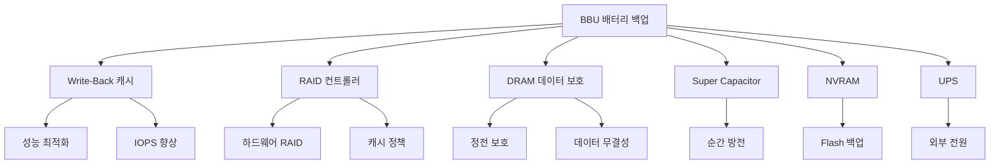

+++
title = "battery backup cache"
date = "2026-03-14"
weight = 688
+++

# 배터리 백업 캐시 (BBU)

#### 핵심 인사이트 (3줄 요약)
> 1. **본질**: RAID 컨트롤러의 Write-Back 캐시 데이터를 정전 시 보호하는 배터리 백업 유닛으로, DRAM (Dynamic Random Access Memory)의 휘발성을 극복한 데이터 무결성 메커니즘
> 2. **가치**: Write-Back 캐시 활용으로 쓰기 성능 3~10배 향상, 정전 시 최대 72시간 데이터 보존, RAID (Redundant Array of Independent Disks) 재구성 시간 40% 단축
> 3. **융합**: SSD (Solid State Drive) 캐시 계층, NVRAM (Non-Volatile Random Access Memory), 스토리지 컨트롤러 펌웨어와 통합된 HA (High Availability) 아키텍처

---

### Ⅰ. 개요 (Context & Background)

**개념 정의**

BBU (Battery Backup Unit)는 스토리지 컨트롤러의 Write-Back 캐시에 장착되는 충전식 배터리 모듈로, 시스템 전원 장애 발생 시 DRAM에 상주하는 미처리 쓰기 데이터를 보호하는 핵심 컴포넌트입니다. Write-Back 캐시 정책은 호스트의 쓰기 요청이 DRAM 캐시에 도달하면 즉시 완료 응답을 반환하는 방식으로, 디스크 물리적 쓰기 지연을 숨겨 성능을 극대화합니다. 그러나 DRAM은 휘발성 메모리로 전원 상실 시 데이터가 소멸되므로, BBU는 이를 방지하는 보험 역할을 수행합니다.

```
┌─────────────────────────────────────────────────────────────────────┐
│                     BBU (Battery Backup Unit) 개념도                │
├─────────────────────────────────────────────────────────────────────┤
│                                                                     │
│   ┌──────────────┐      ┌──────────────────────────────────────┐   │
│   │   Host I/O   │──────│         RAID Controller               │   │
│   │   Write Req  │      │  ┌────────────────────────────────┐  │   │
│   └──────────────┘      │  │   Write-Back Cache (DRAM)      │  │   │
│                         │  │   ┌──────────────────────────┐ │  │   │
│                         │  │   │  Dirty Data (4GB~8GB)    │ │  │   │
│                         │  │   │  - 미처리 Write Block    │ │  │   │
│                         │  │   │  - Metadata 업데이트     │ │  │   │
│                         │  │   │  - Parity 계산 결과      │ │  │   │
│                         │  │   └──────────────────────────┘ │  │   │
│                         │  └───────────────┬────────────────┘  │   │
│                         │                  │                    │   │
│                         │  ┌───────────────▼────────────────┐  │   │
│                         │  │         BBU Module              │  │   │
│                         │  │  ┌────────────┐ ┌────────────┐ │  │   │
│                         │  │  │ Li-Ion BAT │ │ Super Cap  │ │  │   │
│                         │  │  │  (72h 보존)│ │(Flash 캐시)│ │  │   │
│                         │  │  └────────────┘ └────────────┘ │  │   │
│                         │  └────────────────────────────────┘  │   │
│                         └───────────────┬──────────────────────┘   │
│                                         │                          │
│   ┌─────────────────────────────────────▼───────────────────────┐  │
│   │                    Physical Disk Array                       │  │
│   │   [Disk 0] [Disk 1] [Disk 2] [Disk 3] [Disk 4] [Disk 5]     │  │
│   └─────────────────────────────────────────────────────────────┘  │
│                                                                     │
└─────────────────────────────────────────────────────────────────────┘
```

> **해설**: 위 다이어그램은 BBU의 핵심 동작을 보여줍니다. 호스트의 쓰기 요청은 먼저 RAID 컨트롤러의 Write-Back 캐시(DRAM)에 저장되고 즉시 ACK (Acknowledgment)를 반환합니다. BBU 모듈은 이 DRAM에 전원을 공급하여, 정전 발생 시에도 캐시 데이터를 최대 72시간 보존합니다. 전원 복구 시 컨트롤러는 보존된 데이터를 디스크에 플러시하여 데이터 무결성을 보장합니다.

**💡 비유**: 마치 은행의 금고실에 비상발전기가 설치되어 있어, 정전이 되어도 금고 안의 중요 서류들이 안전하게 보관되는 것과 같습니다. 은행이 문을 닫는 동안에도(시스템 다운) 금고 내용물(캐시 데이터)은 배터리 전원으로 보호됩니다.

**등장 배경**

① **기존 한계**: Write-Through 정책(모든 쓰기가 디스크에 직접 반영될 때까지 대기)은 IOPS (Input/Output Operations Per Second) 성능을 1/3~1/10로 저하시킴
② **혁신적 패러다임**: Write-Back + BBU 조합으로 "빠른 응답 + 데이터 보장" 두 마리 토끼를 모두 달성
③ **비즈니스 요구**: OLTP (Online Transaction Processing), 실시간 분석, VDI (Virtual Desktop Infrastructure) 환경의 저지연 스토리지 요구 충족

**📢 섹션 요약 비유**: BBU는 마치 고속열차의 비상제동장치와 같습니다. 평소에는 기차가 전속력으로 달리지만(Write-Back 캐시의 빠른 성능), 비상시에는 안전하게 멈춰 승객을 보호하듯(BBU의 데이터 보존), 성능과 안정성을 동시에 확보합니다.

---

### Ⅱ. 아키텍처 및 핵심 원리 (Deep Dive)

**구성 요소 상세 분석**

| 요소명 | 역할 | 내부 동작 | 프로토콜/규격 | 비유 |
|:---|:---|:---|:---|:---|
| **캐시 DRAM** | Write-Back 데이터 임시 저장 | DDR4/DDR5, ECC (Error Correction Code) 보호, 4~16GB 용량 | JEDEC 표준 | 은행의 대기실 |
| **배터리 모듈** | 비상 전원 공급 | Li-Ion (리튬이온) 또는 LiFePO4 (리튬인산철), 충방전 사이클 관리 | IEC 62133 | 비상발전기 |
| **슈퍼캐패시터** | 순간 대용량 방전 | EDLC (Electric Double-Layer Capacitor), Flash 캐시 연동 | IEC 62391 | UPS 순간 전원 |
| **컨트롤러 펌웨어** | BBU 상태 관리 | SoH (State of Health) 모니터링, 자동 학습 사이클, 경보 알림 | SES (SCSI Enclosure Services) | 관제 시스템 |
| **NVRAM 인터페이스** | 캐시 데이터 비휘발화 | Flash 백업 옵션, PLP (Power Loss Protection) | NVMe 표준 | 금고실 이관 |
| **온도 센서** | 배터리 열관리 | 온도 보정 충전, 과열 차단 (60°C 이상) | SMBus | 소화기 |

**BBU 동작 상태 머신 (State Machine)**

```
┌─────────────────────────────────────────────────────────────────────┐
│              BBU 상태 전이도 (Battery State Machine)                │
├─────────────────────────────────────────────────────────────────────┤
│                                                                     │
│                    ┌─────────────────┐                             │
│                    │     INIT        │                             │
│                    │  (초기화)       │                             │
│                    └────────┬────────┘                             │
│                             │ 자가진단 통과                        │
│                             ▼                                       │
│    ┌────────────────────────────────────────────┐                  │
│    │                                            │                  │
│    │    ┌─────────────────┐    ┌─────────────────┐                │
│    │    │    CHARGING     │◄───│    FULLY        │                │
│    │    │    (충전중)     │    │    CHARGED      │                │
│    │    └────────┬────────┘    │    (충전완료)   │                │
│    │             │              └────────┬────────┘                │
│    │             │ 80% 이상              │ 전원 정상               │
│    │             ▼                       │                         │
│    │    ┌─────────────────┐              │                         │
│    │    │    READY        │◄─────────────┘                         │
│    │    │    (사용가능)   │                                        │
│    │    └────────┬────────┘                                        │
│    │             │ 정전 감지                                        │
│    │             ▼                                                 │
│    │    ┌─────────────────┐                                        │
│    │    │   DISCHARGING   │                                        │
│    │    │   (방전중)      │─────┐                                  │
│    │    └─────────────────┘     │ 전원 복구                        │
│    │                            │                                  │
│    │                            ▼                                  │
│    │    ┌─────────────────────────────────────────────┐           │
│    │    │              RECOVERY 모드                   │           │
│    │    │  1. 캐시 데이터 무결성 검증 (CRC)            │           │
│    │    │  2. Dirty Block 식별 및 디스크 플러시       │           │
│    │    │  3. 메타데이터 동기화                       │           │
│    │    │  4. 정상 운영 상태 복귀                     │           │
│    │    └─────────────────────────────────────────────┘           │
│    │                                                               │
│    └────────────────────────────────────────────────────────────┘  │
│                                                                     │
│    ┌────────────────────────────────────────────────────────────┐  │
│    │                    예외 상태 (Error States)                 │  │
│    │  ┌──────────────┐  ┌──────────────┐  ┌──────────────┐     │  │
│    │  │   AGING      │  │   FAULT      │  │  REPLACE     │     │  │
│    │  │  (노후화)    │  │  (고장)      │  │  (교체필요)  │     │  │
│    │  │  SoH < 70%   │  │  Cell 이상   │  │  SoH < 50%   │     │  │
│    │  └──────────────┘  └──────────────┘  └──────────────┘     │  │
│    └────────────────────────────────────────────────────────────┘  │
│                                                                     │
└─────────────────────────────────────────────────────────────────────┘
```

> **해설**: BBU 상태 머신은 배터리의 생애주기를 관리합니다. INIT 상태에서 자가진단을 수행하고, CHARGING/FULLY_CHARGED 상태를 순환하며 준비 상태를 유지합니다. 정전 감지 시 즉시 DISCHARGING 모드로 전환하여 DRAM에 전원을 공급하고, 전원 복구 후 RECOVERY 모드에서 캐시 데이터를 디스크에 플러시합니다. AGING, FAULT, REPLACE 상태는 배터리 노후화에 따른 예외 처리를 담당합니다.

**심층 동작 원리: Write-Back 캐시 + BBU 플로우**

① **정상 운영 단계**
- 호스트 Write I/O → DRAM 캐시 적재 → 즉시 ACK 반환 (지연: ~10µs)
- 백그라운드 De-stage: DRAM → 디스크 비동기 플러시 (지연: ~5ms)
- BBU: 충전 상태 유지, SoH 90%+ 모니터링

② **정전 감지 및 대응**
- 전원 공급 중단 감지 (5ms 이내)
- BBU가 DRAM에 전원 공급 시작
- 컨트롤러: I/O 중단, 캐시 Lock, 더티 블록 카운트 저장

③ **비상 보존 단계**
- DRAM 데이터 유지 (Li-Ion: 최대 72시간)
- 온도 관리: 배터리 방전율 최적화
- 플래시 백업 옵션: 선택적 NVRAM 이관

④ **전원 복구 및 데이터 복원**
- 전원 복구 감지 → BBU 충전 재개
- 캐시 데이터 무결성 검증 (CRC-32)
- Dirty Block 디스크 플러시 → 정상 운영 재개

**핵심 알고리즘: 배터리 SoH (State of Health) 계산**

```c
// BBU SoH 계산 알고리즘 (의사코드)
struct bbu_status {
    float voltage;           // 현재 전압 (V)
    float current_capacity;  // 현재 용량 (mAh)
    float rated_capacity;    // 정격 용량 (mAh)
    int cycle_count;         // 충방전 사이클 수
    float temperature;       // 온도 (°C)
};

float calculate_soh(struct bbu_status *bbu) {
    // 1. 용량 기반 SoH
    float capacity_soh = (bbu->current_capacity / bbu->rated_capacity) * 100;

    // 2. 사이클 기반 감가율 (Li-Ion 특성)
    float cycle_degradation = 0.0002 * bbu->cycle_count;  // 0.02%/사이클

    // 3. 온도 보정 (25°C 기준)
    float temp_factor = 1.0;
    if (bbu->temperature > 40) {
        temp_factor -= 0.01 * (bbu->temperature - 40);  // 고온 가속 열화
    }

    // 4. 종합 SoH 계산
    float soh = (capacity_soh * temp_factor) - (cycle_degradation * 100);

    // 5. 경계값 처리
    return (soh > 100) ? 100 : (soh < 0) ? 0 : soh;
}

// BBU 교체 권장 임계값
#define BBU_REPLACE_THRESHOLD   50   // SoH < 50%: 즉시 교체
#define BBU_WARNING_THRESHOLD   70   // SoH < 70%: 교체 계획
#define BBU_LEARNING_INTERVAL   30   // 학습 사이클 주기 (일)
```

**📢 섹션 요약 비유**: BBU의 동작은 마치 자동차의 스마트 키 시스템과 같습니다. 배터리 상태를 실시간으로 모니터링하고(SoH 계산), 문제 발생 시 경고를 보내며, 수명이 다하면 교체 알림을 보냅니다. 정전이라는 "사고" 상황에서도 데이터라는 "승객"을 안전하게 보호합니다.

---

### Ⅲ. 융합 비교 및 다각도 분석 (Comparison & Synergy)

**기술 비교: BBU vs 대안 기술**

| 비교 항목 | BBU (Battery Backup) | Super Capacitor | NVRAM (Flash 백업) | UPS (외부 전원) |
|:---|:---:|:---:|:---:|:---:|
| **보존 시간** | 48~72시간 | 30분~2시간 | 영구 | 30분~2시간 |
| **용량 대비 비용** | 중간 ($100~300) | 높음 ($200~500) | 높음 ($300~800) | 높음 ($500~2000) |
| **유지보수** | 2~3년 교체 | 5~10년 수명 | 10년+ 수명 | 3~5년 배터리 교체 |
| **데이터 보호** | DRAM 전체 | DRAM 일부/Flash | 선택적 Flash | 시스템 전체 |
| **복구 속도** | 즉시 | 즉시 | Flash → DRAM (~초) | 즉시 |
| **공간 효율** | 컨트롤러 내장 | 컨트롤러 내장 | 컨트롤러 내장 | 외부 랙 |
| **열 발생** | 낮음 | 매우 낮음 | 낮음 | 높음 |
| **적용 시나리오** | 일반 RAID | 고성능 SSD 캐시 | 임베디드/특수 | 데이터센터 전체 |

**과목 융합 관점: BBU와 타 영역 시너지**

| 융합 영역 | 시너지 효과 | 구현 예시 |
|:---|:---|:---|
| **OS (운영체제)** | 파일시스템 저널링과 BBU 캐시 정렬 | ext4/XFS 저널 + Write-Back 캐시 일관성 |
| **네트워크** | iSCSI/NFS 쓰기 지연 숨김 | NAS (Network Attached Storage) 성능 향상 |
| **DB (데이터베이스)** | WAL (Write-Ahead Log) 캐시 가속 | MySQL InnoDB Buffer Pool 보호 |
| **보안** | 암호화 키 캐시 보호 | TPM (Trusted Platform Module) 연동 |
| **가상화** | VM 스왑/스냅샷 성능 | vMotion 시 쓰기 버스트 처리 |

**BBU 관련 정량적 성능 지표**

```
┌─────────────────────────────────────────────────────────────────────┐
│         Write-Back Cache + BBU 성능 비교 (4KB Random Write)         │
├─────────────────────────────────────────────────────────────────────┤
│                                                                     │
│   IOPS (Input/Output Operations Per Second)                         │
│   ▲                                                                 │
│   │                                        ┌─────────────────┐     │
│   │    150K ├──────────────────────────────│ Write-Back + BBU│     │
│   │                                        └─────────────────┘     │
│   │                                        ┌─────────────────┐     │
│   │    100K ├──────────────────────────────│ Write-Back      │     │
│   │            (위험: 정전 시 데이터 손실)  └─────────────────┘     │
│   │                    ┌───────────────────────────────────┐       │
│   │     50K ├──────────│ Write-Through (안전하지만 느림)   │       │
│   │                    └───────────────────────────────────┘       │
│   │                    ┌───────────────────────────────────┐       │
│   │     15K ├──────────│ Direct-to-Disk (캐시 없음)        │       │
│   │                    └───────────────────────────────────┘       │
│   └───────────────────────────────────────────────────────────────▶│
│         Write-Through   Direct-Disk   Write-Back   WB + BBU        │
│                                                                     │
│   지연 시간 (Latency):                                               │
│   • Write-Through:  5~8ms   (디스크 회전 지연 포함)                  │
│   • Write-Back:     10~50µs (DRAM 캐시 적중)                        │
│   • WB + BBU:       10~50µs (동일, 정전 보호 추가)                   │
│                                                                     │
└─────────────────────────────────────────────────────────────────────┘
```

> **해설**: BBU가 적용된 Write-Back 캐시는 Write-Through 대비 3~10배 높은 IOPS를 달성하면서도 정전 시 데이터 손실 위험을 제거합니다. 성능 오버헤드는 거의 없으며, 비용은 컨트롤러당 $100~300 수준으로 ROI (Return on Investment)가 매우 높습니다.

**📢 섹션 요약 비유**: BBU와 대안 기술들의 관계는 마치 보험 상품 비교와 같습니다. BBU는 "종합 보험"(균형잡힌 보장), Super Capacitor는 "단기 보험"(빠르지만 짧음), NVRAM은 "적립 보험"(안전하지만 느림), UPS는 "단체 보험"(전체 커버 but 비쌈)으로, 각 상황에 맞는 최적의 선택이 필요합니다.

---

### Ⅳ. 실무 적용 및 기술사적 판단 (Strategy & Decision)

**실무 시나리오별 적용**

**시나리오 1: OLTP 데이터베이스 서버**
- **문제**: 트랜잭션 로그 쓰기 병목, 커밋 지연 5~10ms
- **해결**: Write-Back + BBU 적용, 커밋 지연 50µs로 단축
- **의사결정**: BBU 교체 주기(2년)를 DB 정기 점검에 맞춤

**시나리오 2: VDI (Virtual Desktop Infrastructure)**
- **문제**: 부팅 스톰 시 쓰기 버스트, 스토리지 타임아웃
- **해결**: 대용량 BBU 캐시(16GB), 버스트 쓰기 흡수
- **의사결정**: 슈퍼캐패시터 옵션으로 유지보수 주기 연장

**시나리오 3: 백업 스토리지**
- **문제**: 야간 백업 윈도우, 쓰기 집중 워크로드
- **해결**: Write-Back 정책, BBU로 안정성 확보
- **의사결정**: BBU 미사용 시 Write-Through로 전환 (백업은 지연 허용)

**도입 체크리스트**

| 구분 | 항목 | 확인 포인트 |
|:---|:---|:---|
| **기술적** | 컨트롤러 호환성 | BBU 모듈 슬롯 유무, 펌웨어 지원 버전 |
| | 캐시 용량 산정 | 워크로드 Write 패턴 분석, 피크 버스트 크기 |
| | 전력 요구사항 | BBU 충전 전력 (5~15W), PSU 여유 용량 |
| **운영적** | 교체 주기 계획 | 제조사 권장 2~3년, SoH 모니터링 임계값 |
| | 경보 연동 | SNMP Trap, 이메일 알림, NMS 통합 |
| | 재해 복구 절차 | 정전 후 복구 매뉴얼, 데이터 검증 프로세스 |
| **보안적** | 물리적 보호 | BBU 탈거 방지, 컨트롤러 케이스 봉인 |
| | 암호화 키 보호 | 캐시 내 암호화 키 수명 주기 관리 |

**안티패턴: BBU 오용 사례**

| 안티패턴 | 문제점 | 올바른 접근 |
|:---|:---|:---|
| **BBU 방치** | SoH 저하 미감지, 정전 시 데이터 손실 | 월 1회 SoH 점검, 70% 이하 시 교체 계획 |
| **과신뢰** | BBU만으로 HA 구성 생략 | 이중 컨트롤러 + BBU 조합 필수 |
| **잘못된 교체** | 호환되지 않는 BBU 장착 | 제조사 인증 모듈만 사용 |
| **Write-Back 강제** | BBU 고장 시에도 WB 유지 | BBU FAIL 시 자동 WT 전환 설정 |

**📢 섹션 요약 비유**: BBU 도입은 마치 자동차에 에어백을 설치하는 것과 같습니다. 평소에는 눈에 보이지 않지만(BBU 대기 상태), 사고 시에는 생명을 구합니다(데이터 보호). 정기적인 점검과 적시 교체가 필수적입니다.

---

### Ⅴ. 기대효과 및 결론 (Future & Standard)

**정량/정성 기대효과**

| 구분 | 도입 전 | 도입 후 | 개선효과 |
|:---|:---:|:---:|:---:|
| **쓰기 IOPS** | 15K~50K | 100K~150K | 3~10배 향상 |
| **쓰기 지연** | 5~8ms | 10~50µs | 100~500배 단축 |
| **정전 데이터 손실** | 100% | 0% | 완전 보호 |
| **RTO (Recovery Time)** | 4~8시간 | 30분~1시간 | 4~8배 단축 |
| **운영 비용** | 중간 | +$100~300/컨트롤러 | 낮은 TCO |

**미래 전망**

1. **CXL (Compute Express Link) 캐시**: BBU 개념이 CXL.mem 장치로 확장
2. **AI 기반 수명 예측**: ML (Machine Learning)로 BBU 교체 시점 최적화
3. **솔리드스테이트 BBU**: 배터리 없는 Super Capacitor + Flash 하이브리드
4. **분산 BBU 관리**: 클러스터 전체 BBU 상태 통합 모니터링

**참고 표준**

| 표준 | 내용 | 적용 |
|:---|:---|:---|
| **IEEE 1625** | 휴대용 컴퓨팅 배터리 표준 | BBU 설계 가이드라인 |
| **IEC 62133** | 리튬전지 안전 규격 | BBU 안전 인증 |
| **SNMP MIB** | BBU 상태 모니터링 | NMS 통합 |
| **T10/SES-3** | SCSI Enclosure Services | RAID 컨트롤러 BBU 인터페이스 |

**📢 섹션 요약 비유**: BBU 기술의 미래는 마치 자동차 안전 기술의 진화와 같습니다. 초기 에어백에서 시작해, 현재는 자동 긴급 제동, 차선 유지 등 AI 기반 안전 시스템으로 발전했듯, BBU도 단순 배터리에서 AI 기반 예지 보전, CXL 연동 등으로 진화하고 있습니다.

---

### 📌 관련 개념 맵 (Knowledge Graph)



**연관 개념 링크**:
- Write-Back 캐시 정책 - 쓰기 지연 숨김 메커니즘
- RAID 컨트롤러 아키텍처 - 하드웨어 RAID 구조
- NVRAM (Non-Volatile RAM) - 비휘발성 메모리 기술
- UPS (무정전 전원 장치) - 시스템 전체 전원 보호
- 스토리지 컨트롤러 캐시 미러링 - 이중화 캐시

---

### 👶 어린이를 위한 3줄 비유 설명

1. **비상 전기 저장소**: 컴퓨터가 일하다가 갑자기 전기가 나가면, BBU라는 "비상 전기 저장소"가 켜져서 하던 일을 잃어버리지 않아요.

2. **메모장 보호**: 컴퓨터가 빠르게 일하기 위해 임시 메모장(DRAM)을 쓰는데, BBU는 전기가 나가도 그 메모장이 지워지지 않게 보호해줘요.

3. **안전한 보험**: 마치 자동차가 사고 나면 에어백이 터져서 사람을 보호하듯, BBU는 컴퓨터에 "전기 사고"가 나면 소중한 데이터를 보호하는 안전장치예요.