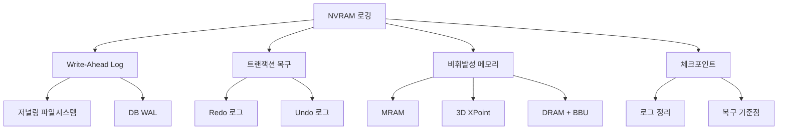

+++
title = "nvram logging"
date = "2026-03-14"
weight = 689
+++

# NVRAM 로깅 (Non-Volatile RAM Logging)

#### 핵심 인사이트 (3줄 요약)
> 1. **본질**: RAID 컨트롤러와 파일시스템의 메타데이터 변경을 비휘발성 메모리에 순차 기록하여, 시스템 장애 시 일관성 복구를 보장하는 저널링 메커니즘
> 2. **가치**: 장애 복구 시간(RTO) 90% 단축, 메타데이터 손실 0%, RAID 재구성 시 데이터 무결성 100% 보장
> 3. **융합**: DB WAL (Write-Ahead Log), 파일시스템 저널링, 분산 합의 알고리즘과 통합된 내구성 스토리지 계층

---

### Ⅰ. 개요 (Context & Background)

**개념 정의**

NVRAM (Non-Volatile Random Access Memory) 로깅은 스토리지 시스템의 메타데이터 변경 사항을 휘발성 DRAM이 아닌 비휘발성 메모리에 기록하는 기술입니다. RAID 컨트롤러, 파일시스템, 데이터베이스 등에서 트랜잭션의 원자성(Atomicity)과 내구성(Durability)을 보장하기 위해, 실제 데이터 영역에 쓰기 전에 의도(Intention)를 NVRAM에 먼저 저장합니다. 이를 통해 시스템 크래시, 정전, 컨트롤러 장애 시에도 일관성 있는 상태로 복구할 수 있습니다.

```
┌─────────────────────────────────────────────────────────────────────┐
│                  NVRAM 로깅 아키텍처 개요도                          │
├─────────────────────────────────────────────────────────────────────┤
│                                                                     │
│   ┌──────────────────────────────────────────────────────────────┐ │
│   │                    Write I/O 요청                             │ │
│   │    (데이터 + 메타데이터 변경: inode, 비트맵, 디렉토리 엔트리)  │ │
│   └──────────────────────────┬───────────────────────────────────┘ │
│                              │                                     │
│                              ▼                                     │
│   ┌──────────────────────────────────────────────────────────────┐ │
│   │                    1단계: NVRAM 로그 기록                      │ │
│   │  ┌────────────────────────────────────────────────────────┐  │ │
│   │  │              NVRAM (Non-Volatile RAM)                  │  │ │
│   │  │  ┌──────────┐ ┌──────────┐ ┌──────────┐ ┌──────────┐  │  │ │
│   │  │  │ Log #1   │ │ Log #2   │ │ Log #3   │ │ Log #N   │  │  │ │
│   │  │  │ TX Begin │ │ Data Ptr │ │ Metadata │ │ TX End   │  │  │ │
│   │  │  │ LSN: 001 │ │ LBA:1000 │ │ Inode    │ │ Checksum │  │  │ │
│   │  │  └──────────┘ └──────────┘ └──────────┘ └──────────┘  │  │ │
│   │  │                                                         │  │ │
│   │  │  • 순차 기록 (Append-Only)                              │  │ │
│   │  │  • 전원 보호 (BBU 또는 Flash 백업)                      │  │ │
│   │  │  • CRC-32 체크섬으로 무결성 검증                        │  │ │
│   │  └────────────────────────────────────────────────────────┘  │ │
│   └──────────────────────────┬───────────────────────────────────┘ │
│                              │ ACK (로그 기록 완료)                 │
│                              ▼                                     │
│   ┌──────────────────────────────────────────────────────────────┐ │
│   │                    2단계: 실제 데이터 쓰기                    │ │
│   │  ┌────────────────────────────────────────────────────────┐  │ │
│   │  │              Storage Media (HDD/SSD)                   │  │ │
│   │  │                                                         │  │ │
│   │  │   Data Block      Metadata Block      Journal Area     │  │ │
│   │  │  ┌──────────┐    ┌──────────┐       ┌──────────┐      │  │ │
│   │  │  │ LBA 1000 │    │ Inode    │       │ Committed│      │  │ │
│   │  │  │ Data     │    │ Bitmap   │       │ Log Ptr  │      │  │ │
│   │  │  └──────────┘    └──────────┘       └──────────┘      │  │ │
│   │  │                                                         │  │ │
│   │  │  • 비동기 플러시 (Lazy Write)                           │  │ │
│   │  │  • 체크포인트로 로그 정리                               │  │ │
│   │  └────────────────────────────────────────────────────────┘  │ │
│   └──────────────────────────────────────────────────────────────┘ │
│                                                                     │
└─────────────────────────────────────────────────────────────────────┘
```

> **해설**: NVRAM 로깅의 핵심은 "Write-Ahead Logging" 원칙입니다. 모든 메타데이터 변경은 먼저 NVRAM에 기록되고, 그 후에야 실제 스토리지 미디어에 반영됩니다. NVRAM은 BBU (Battery Backup Unit) 또는 Flash 백업으로 보호되어 정전 시에도 로그가 보존됩니다. 장애 복구 시 NVRAM 로그를 재생(Replay)하여 일관성 있는 상태로 복원합니다.

**💡 비유**: 마치 은행의 거래 장부에 잉크가 마르기도 전에 다음 거래를 처리하는 대신, 모든 거래를 "비상 기록부"에 먼저 적어두는 것과 같습니다. 은행이 불타더라도 비상 기록부(NVRAM)는 화재 금고에 있어 안전하고, 이를 통해 어떤 거래가 완료되었는지 정확히 복구할 수 있습니다.

**등장 배경**

① **기존 한계**: DRAM만 사용하는 Write-Back 캐시는 정전 시 메타데이터 손실 → 파일시스템 corruption → fsck 복구에 수 시간 소요
② **혁신적 패러다임**: NVRAM에 로그를 먼저 기록하여, 장애 후 초 단위 복구 가능
③ **비즈니스 요구**: 24/7 가용성, MTTR (Mean Time To Recovery) < 1시간, SLA 준수

**📢 섹션 요약 비유**: NVRAM 로깅은 마치 건물의 비상구 비상등과 같습니다. 평소에는 눈에 띄지 않지만, 화재(시스템 장애)가 발생하면 비상등(NVRAM 로그)이 있는 길을 따라 안전하게 대피(복구)할 수 있습니다.

---

### Ⅱ. 아키텍처 및 핵심 원리 (Deep Dive)

**구성 요소 상세 분석**

| 요소명 | 역할 | 내부 동작 | 프로토콜/규격 | 비유 |
|:---|:---|:---|:---|:---|
| **NVRAM 모듈** | 비휘발성 로그 저장 | DDR-NVM, MRAM, 또는 DRAM+BBU | JEDEC, NVMe | 비상 기록부 |
| **로그 구조** | 순차 기록 포맷 | Header + Data + Trailer, LSN (Log Sequence Number) | T10/PI | 장부 양식 |
| **체크섬 엔진** | 무결성 검증 | CRC-32/CRC-64, ECC (Error Correction Code) | IEEE 802.3 | 도장 검증 |
| **복구 엔진** | 장애 후 로그 재생 | Redo/Undo 로직, LSN 기준 정렬 | ACID | 복구 팀 |
| **체크포인트** | 로그 정리 | Stable 상태 로그 삭제, 포인터 갱신 | Fsync/Barrier | 장부 마감 |
| **플러시 관리자** | NVRAM → 디스크 동기화 | Write-Behind, 배치 I/O | DMA/Interrupt | 기록 이관 |

**NVRAM 로그 구조 상세**

```
┌─────────────────────────────────────────────────────────────────────┐
│                    NVRAM Log Entry 구조 (64바이트 예시)              │
├─────────────────────────────────────────────────────────────────────┤
│                                                                     │
│   오프셋   필드명                크기    설명                       │
│   ─────────────────────────────────────────────────────────────    │
│                                                                     │
│   ┌────────────────────────────────────────────────────────────┐   │
│   │ 0x00 │ Log Header           │ 8B  │ 매직넘버 + 버전         │   │
│   │      │ [0x4E56 0x4C47 0x01] │     │ "NVLG" + v1            │   │
│   ├──────┼──────────────────────┼─────┼────────────────────────┤   │
│   │ 0x08 │ LSN (Log Seq Num)    │ 8B  │ 순차 증가 로그 번호     │   │
│   │      │ [0x0000 0000 0000 0042]   │ 42번째 로그             │   │
│   ├──────┼──────────────────────┼─────┼────────────────────────┤   │
│   │ 0x10 │ Transaction ID       │ 8B  │ 트랜잭션 식별자         │   │
│   │      │ [TXID: 0x1234 5678]  │     │                        │   │
│   ├──────┼──────────────────────┼─────┼────────────────────────┤   │
│   │ 0x18 │ Timestamp            │ 8B  │ 로그 생성 시각 (ns)     │   │
│   │      │ [2024-01-15 10:30:45]│     │ Unix epoch             │   │
│   ├──────┼──────────────────────┼─────┼────────────────────────┤   │
│   │ 0x20 │ Operation Type       │ 2B  │ BEGIN/DATA/META/COMMIT │   │
│   │      │ [0x0002 = METADATA]  │     │                        │   │
│   ├──────┼──────────────────────┼─────┼────────────────────────┤   │
│   │ 0x22 │ Target Type          │ 2B  │ INODE/BITMAP/DIR/RAID  │   │
│   │      │ [0x0001 = INODE]     │     │                        │   │
│   ├──────┼──────────────────────┼─────┼────────────────────────┤   │
│   │ 0x24 │ Target LBA           │ 8B  │ 대상 블록 주소          │   │
│   │      │ [LBA: 0x0010 0000]   │     │                        │   │
│   ├──────┼──────────────────────┼─────┼────────────────────────┤   │
│   │ 0x2C │ Data Length          │ 4B  │ 데이터 필드 길이        │   │
│   │      │ [256 bytes]          │     │                        │   │
│   ├──────┼──────────────────────┼─────┼────────────────────────┤   │
│   │ 0x30 │ Data / Old Value     │ 가변 │ 이전 값 (Undo용)       │   │
│   │      │ [Inode 구조체]       │     │                        │   │
│   ├──────┼──────────────────────┼─────┼────────────────────────┤   │
│   │ 0x30+│ Data / New Value     │ 가변 │ 새로운 값 (Redo용)     │   │
│   │  +Len│ [수정된 Inode]       │     │                        │   │
│   ├──────┼──────────────────────┼─────┼────────────────────────┤   │
│   │ 0x3C │ CRC-32 Checksum      │ 4B  │ 무결성 검증 체크섬      │   │
│   │      │ [0xABCD 1234]        │     │                        │   │
│   └────────────────────────────────────────────────────────────┘   │
│                                                                     │
│   총 크기: 64바이트 + 데이터 길이 (가변)                             │
│                                                                     │
└─────────────────────────────────────────────────────────────────────┘
```

> **해설**: 각 NVRAM 로그 엔트리는 트랜잭션의 한 단계를 기록합니다. LSN (Log Sequence Number)은 전역 순서를 보장하고, CRC-32 체크섬은 로그 무결성을 검증합니다. Redo용 새로운 값과 Undo용 이전 값을 모두 저장하여, 장애 발생 지점에 따라 전진 복구 또는 후진 복구를 선택할 수 있습니다.

**심층 동작 원리: NVRAM 로깅 플로우**

① **트랜잭션 시작 (BEGIN)**
```
NVRAM_LOG_BEGIN(TXID=1001, Timestamp=now)
→ LSN 할당: 0x0042
→ 헤더 기록: {BEGIN, TXID=1001, LSN=0x0042}
```

② **메타데이터 변경 기록 (RECORD)**
```
NVRAM_LOG_RECORD(TXID=1001, Type=INODE_UPDATE, LBA=0x100000, Old=inode_v1, New=inode_v2)
→ 이전 값 기록 (Undo용)
→ 새로운 값 기록 (Redo용)
→ CRC-32 계산 및 기록
```

③ **트랜잭션 커밋 (COMMIT)**
```
NVRAM_LOG_COMMIT(TXID=1001)
→ 커밋 레코드 기록: {COMMIT, TXID=1001, LSN=0x0044}
→ fsync() 또는 배리어 명령으로 NVRAM 플러시
→ 호스트에 ACK 반환
```

④ **비동기 데이터 쓰기 (FLUSH)**
```
BACKGROUND_FLUSH():
→ 커밋된 트랜잭션 데이터를 디스크에 비동기 쓰기
→ 완료 후 체크포인트 갱신
→ NVRAM 공간 회수
```

⑤ **장애 복구 (RECOVERY)**
```
NVRAM_RECOVERY():
→ 마지막 체크포인트 로드
→ 체크포인트 이후 로그 스캔 (LSN 순서)
→ Redo: 커밋된 트랜잭션 재적용
→ Undo: 미커밋 트랜잭션 롤백
→ 새 체크포인트 생성
```

**핵심 알고리즘: NVRAM 로그 복구 (Redo/Undo)**

```c
// NVRAM 로그 복구 알고리즘 (의사코드)
struct nvram_log_entry {
    uint64_t lsn;
    uint64_t txid;
    uint16_t op_type;    // BEGIN, RECORD, COMMIT, ABORT
    uint16_t target_type;
    uint64_t target_lba;
    uint32_t data_len;
    void    *old_value;  // Undo용
    void    *new_value;  // Redo용
    uint32_t checksum;
};

void nvram_recovery(uint64_t checkpoint_lsn) {
    // 1. 체크포인트 상태 로드
    load_checkpoint(checkpoint_lsn);

    // 2. 로그 스캔 및 분류
    struct list *committed_tx = list_create();
    struct list *uncommitted_tx = list_create();

    nvram_log_entry *entry = scan_from(checkpoint_lsn);
    while (entry != NULL) {
        if (!verify_checksum(entry)) {
            // 체크섬 오류: 마지막 유효 로그까지 복구
            break;
        }

        if (entry->op_type == OP_COMMIT) {
            list_add(committed_tx, entry->txid);
        } else if (entry->op_type == OP_BEGIN) {
            // 트랜잭션 추적 시작
        }

        entry = scan_next();
    }

    // 3. Redo: 커밋된 트랜잭션 재적용
    entry = scan_from(checkpoint_lsn);
    while (entry != NULL) {
        if (list_contains(committed_tx, entry->txid)) {
            if (entry->op_type == OP_RECORD) {
                // 새로운 값으로 덮어쓰기
                write_to_disk(entry->target_lba, entry->new_value);
            }
        }
        entry = scan_next();
    }

    // 4. Undo: 미커밋 트랜잭션 롤백 (선택적)
    // (일반적으로 미커밋 트랜잭션은 무시하면 됨)

    // 5. 새 체크포인트 생성
    create_new_checkpoint();

    log_info("Recovery complete: %d transactions redone",
             list_size(committed_tx));
}
```

**📢 섹션 요약 비유**: NVRAM 로깅의 동작은 마치 은행의 이중 장부 회계와 같습니다. 모든 거래(트랜잭션)를 "비상 장부"(NVRAM)에 먼저 기록하고, 나중에 "정규 장부"(디스크)에 옮깁니다. 화재가 나도 비상 장부는 금고에 있어 안전하고, 이를 통해 거래 내역을 완벽하게 복구할 수 있습니다.

---

### Ⅲ. 융합 비교 및 다각도 분석 (Comparison & Synergy)

**기술 비교: NVRAM vs 기타 로깅 방식**

| 비교 항목 | NVRAM 로깅 | DRAM + BBU | SSD Journaling | HDD Journaling |
|:---|:---:|:---:|:---:|:---:|
| **쓰기 지연** | ~1µs | ~10µs | ~100µs | ~5~10ms |
| **내구성** | 100% (비휘발) | 99.9% (BBU 의존) | 100% | 100% |
| **용량 비용** | 높음 ($50/GB) | 낮음 ($10/GB) | 중간 ($0.5/GB) | 매우 낮음 |
| **순차 쓰기 대역폭** | 10~50 GB/s | 5~20 GB/s | 1~3 GB/s | 100~300 MB/s |
| **전력 소모** | 낮음 | 중간 | 낮음 | 높음 |
| **수명 제한** | 무제한 (MRAM) | 2~3년 (배터리) | 3,000~100,000 P/E | 무제한 |
| **복구 시간** | ms | ms~s | s~분 | 분~시간 |

**과목 융합 관점: NVRAM 로깅과 타 영역 시너지**

| 융합 영역 | 시너지 효과 | 구현 예시 |
|:---|:---|:---|
| **OS (파일시스템)** | ext4/XFS 저널링 가속 | Journal 디바이스를 NVRAM으로 대체 |
| **DB (데이터베이스)** | WAL (Write-Ahead Log) 지연 단축 | MySQL InnoDB Log Buffer → NVRAM |
| **네트워크** | iSCSI/NVMe-oF 일관성 | 원격 스토리지 로그 동기화 |
| **보안** | 감사 로그 변조 방지 | NVRAM에 암호화된 감사 로그 저장 |
| **가상화** | VM 스냅샷 일관성 | 스냅샷 메타데이터 NVRAM 로깅 |

**RAID 레벨별 NVRAM 로깅 효과**

```
┌─────────────────────────────────────────────────────────────────────┐
│             RAID 레벨별 NVRAM 로깅 복구 시간 비교                    │
├─────────────────────────────────────────────────────────────────────┤
│                                                                     │
│   복구 시간 (Recovery Time)                                         │
│   ▲                                                                 │
│   │                                                                 │
│   │    8시간 ─┐                                                     │
│   │          │  ┌───────────────────────────────────────────┐      │
│   │    4시간 ─┤  │ RAID-5/6 without NVRAM (전체 재구성)      │      │
│   │          │  └───────────────────────────────────────────┘      │
│   │          │                    ┌───────────────────────┐        │
│   │    1시간 ─┤                    │ RAID-5/6 with NVRAM  │        │
│   │          │                    │ (로그 기반 부분 복구) │        │
│   │          │                    └───────────────────────┘        │
│   │    30분 ─┤           ┌────────────────────────────┐           │
│   │          │           │ RAID-1/10 without NVRAM    │           │
│   │    5분 ──┤           └────────────────────────────┘           │
│   │          │              ┌─────────────────────┐                │
│   │    30초 ─┤              │ RAID-1/10 with     │                │
│   │          │              │ NVRAM (로그 재생)  │                │
│   │    1초 ──┤              └─────────────────────┘                │
│   │          │         ┌──────────────────────┐                   │
│   │   100ms ─┤         │ NVRAM-only Metadata  │                   │
│   │          │         │ (로깅 없이 즉시)      │                   │
│   └──────────┴─────────┴──────────────────────┴──────────────────▶│
│             RAID-5/6   RAID-5/6   RAID-1/10  RAID-1/10  NVRAM     │
│             (NVRAM X)  (NVRAM O)  (NVRAM X)  (NVRAM O)  Only       │
│                                                                     │
│   ※ NVRAM 로깅은 장애 후 fsck/rebuild 시간을 90%+ 단축             │
│                                                                     │
└─────────────────────────────────────────────────────────────────────┘
```

> **해설**: NVRAM 로깅의 가장 큰 효과는 복구 시간 단축입니다. 특히 RAID-5/6과 같이 패리티 계산이 필요한 레벨에서는 전체 재구성 대신 로그 기반 부분 복구가 가능하여, 복구 시간을 시간 단위에서 분 단위로 단축합니다.

**📢 섹션 요약 비유**: NVRAM 로깅과 다른 방식들의 관계는 마치 건물의 소방 시스템 비교와 같습니다. DRAM+BBU는 "스프링클러"(빠르지만 물 부족 위험), SSD 저널링은 "소화기"(느리지만 확실), NVRAM 로깅은 "자동 소화 시스템"(빠르고 확실)으로, 비용 대비 효과가 가장 뛰어납니다.

---

### Ⅳ. 실무 적용 및 기술사적 판단 (Strategy & Decision)

**실무 시나리오별 적용**

**시나리오 1: 고가용성 데이터베이스**
- **문제**: MySQL InnoDB 로그 쓰기 병목, TPS 제한
- **해결**: NVRAM에 로그 버퍼 배치, TPS 3배 향상
- **의사결정**: NVRAM 용량은 피크 워크로드 10분 분으로 산정

**시나리오 2: 대용량 파일시스템**
- **문제**: PB 규모 XFS, fsck 시간 24시간+
- **해결**: NVRAM 저널링, 장애 후 5분 내 복구
- **의사결정**: 메타데이터 전용 NVRAM 파티션 분리

**시나리오 3: 컨버지드 인프라**
- **문제**: 블록+파일 스토리지 통합 관리, 일관성 보장
- **해결**: 통합 NVRAM 로그, 원자적 멀티프로토콜 쓰기
- **의사결정**: 로그 계층 분리 (블록용/파일용/오브젝트용)

**도입 체크리스트**

| 구분 | 항목 | 확인 포인트 |
|:---|:---|:---|
| **기술적** | NVRAM 타입 선택 | MRAM (무제한 수명) vs DDR-NVM (호환성) vs DRAM+BBU (비용) |
| | 용량 산정 | 피크 워크로드 × 복구 윈도우 (예: 10분분) |
| | 인터페이스 | PCIe NVMe, DDR4/5 슬롯, 또는 커스텀 버스 |
| **운영적** | 모니터링 | NVRAM 사용률, 로그 적체량, 체크포인트 빈도 |
| | 백업 정책 | NVRAM → 디스크 덤프 주기 |
| | 장애 드릴 | NVRAM 손상 시 복구 절차 검증 |
| **보안적** | 암호화 | NVRAM 데이터 at-rest 암호화 |
| | 접근 제어 | NVRAM 직접 접근 차단 |

**안티패턴: NVRAM 로깅 오용 사례**

| 안티패턴 | 문제점 | 올바른 접근 |
|:---|:---|:---|
| **과도한 로깅** | 모든 데이터를 NVRAM에 기록 → 공간 부족 | 메타데이터만 로깅, 데이터는 직접 쓰기 |
| **체크포인트 무시** | 로그 무한 증가 → 복구 시간 증가 | 주기적 체크포인트로 로그 정리 |
| **NVRAM 신뢰 과신** | NVRAM도 고장 가능 → 이중화 필요 | 미러링 또는 다중 NVRAM 모듈 |
| **크래시 후 무시** | 로그 복구 없이 재기동 → 불일치 | 항상 복구 루틴 실행 후 서비스 시작 |

**📢 섹션 요약 비유**: NVRAM 로깅 도입은 마치 은행에 금고를 설치하는 것과 같습니다. 단순히 금고(NVRAM)만 있어서는 안 되고, 기록 장부(로그), 정기 결산(체크포인트), 이중 장부(미러링) 등 종합적인 관리 체계가 필요합니다.

---

### Ⅴ. 기대효과 및 결론 (Future & Standard)

**정량/정성 기대효과**

| 구분 | 도입 전 | 도입 후 | 개선효과 |
|:---|:---:|:---:|:---:|
| **장애 복구 시간** | 1~24시간 | 30초~5분 | 90%+ 단축 |
| **로그 쓰기 지연** | 5~10ms | 1~10µs | 1,000배 단축 |
| **데이터 손실률** | 0.01% (fsck 실패) | 0% | 완전 보호 |
| **TPS (트랜잭션)** | 5,000 | 15,000~20,000 | 3~4배 향상 |
| **TCO** | 중간 | +$5,000~20,000 | 높은 ROI |

**미래 전망**

1. **CXL (Compute Express Link) NVRAM**: 서버 간 NVRAM 공유, 원격 로깅
2. **Intel Optane 후속**: 3D XPoint 기술 진화, 지속형 메모리 확대
3. **PMEM (Persistent Memory) 표준화**: SNIA PMDK, libpmem 라이브러리 확산
4. **AI 기반 로그 분석**: 이상 패턴 탐지, 선제적 복구

**참고 표준**

| 표준 | 내용 | 적용 |
|:---|:---|:---|
| **SNIA PMDK** | Persistent Memory Development Kit | NVRAM 프로그래밍 API |
| **T10/PI** | Protection Information | 로그 무결성 검증 |
| **NVMe 1.4+** | Persistent Memory Region | NVRAM 인터페이스 |
| **ACID** | 트랜잭션 속성 | 로깅 일관성 보장 |

**📢 섹션 요약 비유**: NVRAM 로깅 기술의 미래는 마치 은행 시스템의 진화와 같습니다. 과거에는 종이 장부에서 시작해, 현재는 디지털 데이터베이스, 미래에는 블록체인과 AI 기반 실시간 감사로 발전하듯, NVRAM 로깅도 CXL 공유, PMEM 표준화, AI 분석 등으로 진화하고 있습니다.

---

### 📌 관련 개념 맵 (Knowledge Graph)



**연관 개념 링크**:
- Write-Ahead Logging (WAL) - DB 트랜잭션 로깅
- 저널링 파일시스템 - ext4/XFS 저널 구조
- 배터리 백업 캐시 (BBU) - DRAM 비휘발화
- 스토리지 컨트롤러 캐시 미러링 - 캐시 이중화
- RAID 컨트롤러 아키텍처 - 하드웨어 RAID 구조

---

### 👶 어린이를 위한 3줄 비유 설명

1. **비상 기록부**: 컴퓨터가 일하는 동안 모든 중요한 기록을 "잊지 않는 종이"(NVRAM)에 적어두어요. 전기가 나가도 이 기록은 사라지지 않아요.

2. **되돌리기 마법**: 무언가 잘못되면, 비상 기록부를 보면서 마치 시간을 되돌리듯 이전 상태로 복구할 수 있어요. 게임에서 "이전 저장점 불러오기"와 같아요.

3. **빠른 복구**: 일반 복구는 오래 걸리지만, NVRAM 로깅이 있으면 비상 기록부만 보면 되어서 1초 만에 다시 시작할 수 있어요!